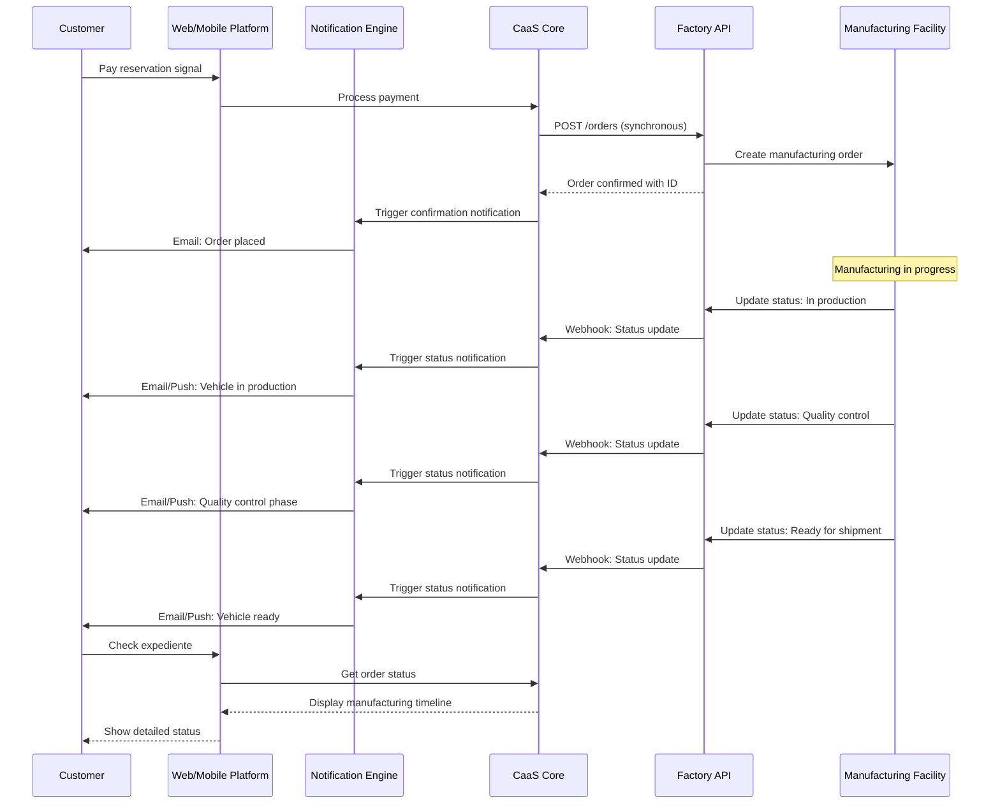
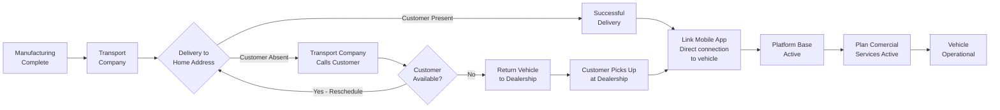
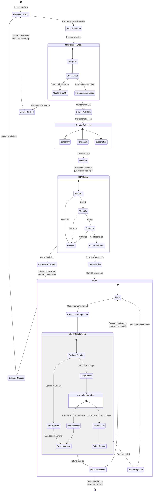
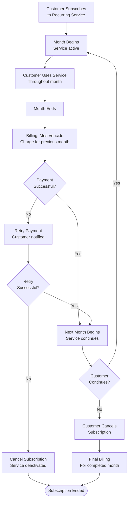
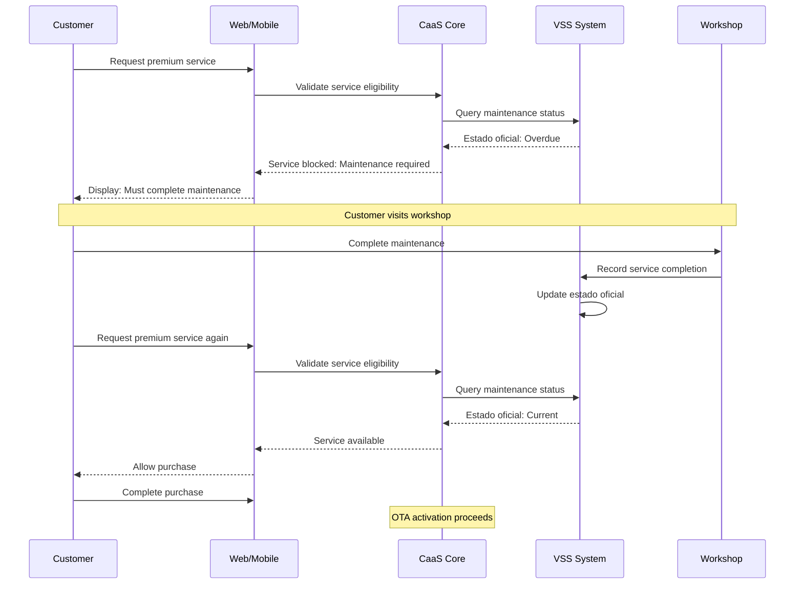
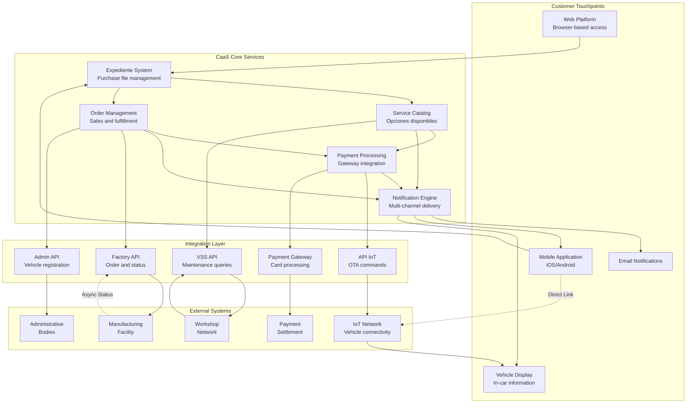

# Customer Journey

Relevant source files

The following files were used as context for generating this wiki page:

- [enunciado.md](enunciado.md)
- [pasame las preguntas y sus respuestas a markdown.md](pasame las preguntas y sus respuestas a markdown.md)

## Purpose and Scope

This document describes the complete customer experience in the Car as a Service (CaaS) system, from initial vehicle purchase through ongoing service usage. It provides an end-to-end view of customer interactions with the platform, covering all major touchpoints, decision points, and system responses throughout the customer lifecycle.

This page focuses on the **customer perspective** and **experience flow**. For detailed technical information about specific phases, see:
- [Vehicle Purchase and Delivery Process](#4.1) - technical details of manufacturing, payment, and delivery
- [Service Acquisition and Management](#4.2) - detailed service purchasing and activation flows  
- [Customer-Facing Platforms](#4.3) - web and mobile platform features

For business model context, see [Business Model and Concept](#2). For technical architecture, see [System Architecture](#3).

**Sources:** [enunciado.md:1-23](), [pasame las preguntas y sus respuestas a markdown.md:1-104]()

---

## Customer Journey Phases

The CaaS customer journey consists of five primary phases, each with distinct interactions and system touchpoints:

| Phase | Duration | Primary Channel | Key Milestone |
|-------|----------|----------------|---------------|
| **Sales and Registration** | 1 day | In-person (Dealership) + Intranet | Customer data captured, credentials issued |
| **Manufacturing and Tracking** | Weeks to months | Email + Web/Mobile notifications | Customer stays informed of vehicle status |
| **Payment and Registration** | 1-3 days | Web/Mobile platform + Administrative systems | Vehicle legally registered to customer |
| **Delivery and Activation** | 1 day | Physical delivery + Mobile app | Vehicle operational, app linked |
| **Operational Use** | Vehicle lifetime | Web + Mobile platforms | Ongoing service acquisition and management |

**Sources:** [enunciado.md:8-23](), [pasame las preguntas y sus respuestas a markdown.md:18-29]()

---

## Complete Customer Journey Flow

The following diagram illustrates the end-to-end customer journey with all major decision points and system interactions:

```mermaid
flowchart TD
    Start([Customer Visits Dealership])
    
    Start --> Sales["Sales Consultation<br/>Employee demonstrates platform base<br/>and opciones disponibles"]
    
    Sales --> Configure["Select Configuration<br/>Base model + optional<br/>plan comercial"]
    
    Configure --> Register["Dealership Registration<br/>Employee enters data in<br/>corporate intranet"]
    
    Register --> Credentials["Credential Generation<br/>System sends email with<br/>web/mobile access credentials"]
    
    Credentials --> Reserve{"Customer Pays<br/>Reservation Signal?"}
    
    Reserve -->|"No"| Abandon([Sale Abandoned])
    
    Reserve -->|"Yes"| FactoryOrder["Automatic Factory Order<br/>API call to factory<br/>manufacturing system"]
    
    FactoryOrder --> Manufacturing["Manufacturing Phase<br/>Customer receives<br/>status notifications"]
    
    Manufacturing --> Ready["Vehicle Ready<br/>Notification sent<br/>to customer"]
    
    Ready --> FinalPayment{"Customer Pays<br/>Final Amount?"}
    
    FinalPayment -->|"No"| LoseReservation["Vehicle Becomes Stock<br/>Marked 'sin asignar'<br/>Customer loses reservation"]
    
    LoseReservation --> Abandon
    
    FinalPayment -->|"Yes"| AdminReg["Administrative Registration<br/>Vehicle registered with<br/>government bodies"]
    
    AdminReg --> Transport["Transport to Address<br/>Subcontractor delivers<br/>to customer home"]
    
    Transport --> DeliveryAttempt{"Customer Present<br/>at Delivery?"}
    
    DeliveryAttempt -->|"No"| ReturnDealer["Return to Dealership<br/>Customer must pick up<br/>vehicle in person"]
    
    ReturnDealer --> Pickup["Customer Pickup<br/>At dealership"]
    
    DeliveryAttempt -->|"Yes"| LinkApp["Link Mobile App<br/>App connects to vehicle<br/>via direct link"]
    
    Pickup --> LinkApp
    
    LinkApp --> Operational["Vehicle Operational<br/>Platform base active<br/>Optional services from plan<br/>comercial active"]
    
    Operational --> UseVehicle["Customer Uses Vehicle<br/>Access to expediente de compra<br/>Manuals, history, invoices"]
    
    UseVehicle --> ServiceDecision{"Want Additional<br/>Service?"}
    
    ServiceDecision -->|"No"| ContinueUse["Continue Using Vehicle"]
    
    ServiceDecision -->|"Yes"| AccessPlatform["Access Web/Mobile Platform<br/>Browse opciones disponibles<br/>in service catalog"]
    
    AccessPlatform --> CheckMaint["System Checks Maintenance<br/>Query VSS system for<br/>estado oficial"]
    
    CheckMaint --> MaintOK{"Maintenance<br/>Status OK?"}
    
    MaintOK -->|"No - Overdue"| ServiceBlocked["Service Blocked<br/>Customer must complete<br/>maintenance first"]
    
    ServiceBlocked --> UseVehicle
    
    MaintOK -->|"Yes - Current"| SelectService["Select Service<br/>Choose duration:<br/>Temporary, Permanent,<br/>or Subscription"]
    
    SelectService --> PayService["Pay for Service<br/>Payment via gateway<br/>Risk assumed by CaaS"]
    
    PayService --> OTAActivation["OTA Activation Process<br/>Configuration sent via<br/>API IoT"]
    
    OTAActivation --> OTAResult{"Activation<br/>Successful?"}
    
    OTAResult -->|"Yes"| NotifySuccess["Notification Sent<br/>Mobile app + vehicle display<br/>Email confirmation"]
    
    OTAResult -->|"No"| RetryLogic{"Retries<br/>Remaining?"}
    
    RetryLogic -->|"Yes"| OTAActivation
    
    RetryLogic -->|"No"| TechSupport["Escalate to Tech Support<br/>DO NOT CHARGE customer<br/>Manual investigation"]
    
    NotifySuccess --> ServiceActive["Service Active<br/>Feature available in vehicle<br/>Logged in expediente"]
    
    ServiceActive --> UseVehicle
    TechSupport --> UseVehicle
    
    ContinueUse --> CancelDecision{"Cancel<br/>Service?"}
    
    CancelDecision -->|"No"| ContinueUse
    
    CancelDecision -->|"Yes"| CheckCancelRights["Check Desistimiento Rights<br/>Service duration and<br/>time since purchase"]
    
    CheckCancelRights --> RefundEligible{"Refund<br/>Eligible?"}
    
    RefundEligible -->|"Yes - Within Window"| ProcessRefund["Process Refund<br/>Service deactivated<br/>Payment returned"]
    
    RefundEligible -->|"No - Past Window"| NoRefund["Service Remains<br/>No refund available<br/>Customer informed"]
    
    ProcessRefund --> UseVehicle
    NoRefund --> UseVehicle
    
    UseVehicle --> MaintenanceDue{"Maintenance<br/>Due?"}
    
    MaintenanceDue -->|"Yes"| Workshop["Visit Workshop<br/>Official or approved<br/>taller multimarca"]
    
    MaintenanceDue -->|"No"| UseVehicle
    
    Workshop --> VSSRecord["Maintenance Recorded<br/>Logged in VSS system<br/>Estado oficial updated"]
    
    VSSRecord --> UseVehicle
    
    UseVehicle --> EndLife([End of Vehicle Life])
```

**Sources:** [enunciado.md:8-23](), [pasame las preguntas y suas respuestas a markdown.md:18-97]()

---

## Customer Touchpoints by Phase

### Phase 1: Sales and Registration

**Customer Experience:**
- Physical interaction with dealership employee
- System is transparent to customer at this stage
- Customer selects base platform and optional plan comercial
- Receives email with access credentials to web and mobile platforms

**System Actions:**
- Employee captures customer data in corporate intranet
- Customer profile created with authentication credentials
- Credentials sent via email notification system
- Customer expediente de compra initialized

**Customer State:** Registered but no vehicle yet

| Touchpoint | Channel | System Component | Customer Action |
|------------|---------|------------------|-----------------|
| Sales consultation | In-person | Dealership staff | Select configuration |
| Data entry | Intranet | Corporate registration system | Provide personal data |
| Credential delivery | Email | Notification engine | Receive and store credentials |
| Platform access | Web/Mobile | Authentication system | First login to expediente |

**Sources:** [enunciado.md:8-12](), [pasame las preguntas y respuestas a markdown.md:10-16]()

---

### Phase 2: Manufacturing and Tracking

**Customer Experience:**
- Pays reservation deposit (señal)
- Receives automatic notifications throughout manufacturing
- Can access expediente to view current status
- Passive phase - customer waits but stays informed

**System Actions:**
- Automatic factory order via synchronous API on reservation payment
- Factory sends asynchronous status updates via webhooks
- Notification engine distributes updates to customer (email, mobile push)
- Manufacturing state tracked and displayed in expediente

**Customer State:** Reserved vehicle, waiting for completion

**Sources:** [enunciado.md:13-14](), [pasame las preguntas y respuestas a markdown.md:18-29](), [pasame las preguntas y respuestas a markdown.md:40-44]()

---

### Phase 3: Payment and Registration

**Customer Experience:**
- Receives notification that vehicle is ready
- Must complete final payment before delivery
- If payment fails, loses reservation (critical decision point)
- Passive waiting during administrative registration

**System Actions:**
- Final payment processed through payment gateway
- Payment failure triggers vehicle state change to "sin asignar" (unassigned)
- Successful payment triggers administrative registration process
- Integration with government bodies for vehicle matriculation

**Customer State:** Transition from reserved to owner (legal transfer)

**Critical Business Rules:**
- Payment failure = immediate loss of reservation
- Vehicle becomes available stock at dealership
- No second chances for final payment
- Administrative registration only proceeds after confirmed payment

| Scenario | Customer Action | System Response | Outcome |
|----------|----------------|-----------------|---------|
| Payment successful | Complete final payment | Register vehicle with administrative bodies | Proceed to delivery |
| Payment failed | Payment rejected by bank | Vehicle marked "sin asignar" | Customer loses reservation, vehicle becomes stock |
| Payment pending | Waiting for settlement | CaaS assumes risk, proceeds with registration | Normal flow continues |

**Sources:** [enunciado.md:14-16](), [pasame las preguntas y respuestas a markdown.md:26-27](), [pasame las preguntas y respuestas a markdown.md:77-82]()

---

### Phase 4: Delivery and Activation

**Customer Experience:**
- Vehicle transported to customer address
- Must be present to receive delivery
- If absent, must pick up from dealership
- Mobile app directly linked to specific vehicle
- Vehicle becomes operational upon successful delivery

**System Actions:**
- Transport company subcontracted for delivery
- Delivery status tracked in system
- Mobile app performs direct link to vehicle (not through CaaS core)
- Platform base automatically activated
- Optional services from plan comercial activated
- Expediente updated with vehicle details and manuals

**Customer State:** Owner with operational vehicle

**Delivery Fallback Logic:**
- Vehicle NEVER left unattended (security risk)
- Customer contacted immediately if not present
- Return to dealership as safe fallback
- Customer must pick up in person (no re-delivery attempts)

**Sources:** [enunciado.md:17](), [pasame las preguntas y respuestas a markdown.md:24-25]()

---

### Phase 5: Operational Use and Service Lifecycle

**Customer Experience:**
- Ongoing vehicle usage with active platform base
- Can access expediente anytime (web or mobile)
- Browse and purchase additional opciones disponibles
- Receive services via OTA (no workshop visit needed)
- Manage subscriptions and cancellations
- Track maintenance requirements

**System Actions:**
- Continuous availability of web and mobile platforms
- Service catalog browsing and purchasing
- Maintenance status validation via VSS integration
- OTA service activation via API IoT
- Retry logic for failed activations
- Billing and refund processing
- Subscription management (mes vencido model)

**Customer State:** Active user with evolving service portfolio

#### Service Acquisition Subflow

**Key Customer Protections:**
- **No charge for failed OTA activations** - customer only pays for delivered services
- **Maintenance-gated access** - prevents unsafe service usage
- **Desistimiento (withdrawal) rights** - legal compliance with distance selling laws
- **Transparent notifications** - customer informed at every step

**Sources:** [enunciado.md:18-23](), [pasame las preguntas y respuestas a markdown.md:46-96]()

---

## Customer Information Access: Expediente de Compra

Throughout the entire journey, customers have continuous access to their **expediente de compra** (purchase file) via web and mobile platforms. This serves as the single source of truth for customer-facing information.

**Expediente Contents:**

| Information Category | Details Available | Update Frequency |
|---------------------|-------------------|------------------|
| Vehicle Information | Model, platform base, VIN, registration | Static after delivery |
| Manufacturing Status | Current phase, estimated completion | Real-time during manufacturing |
| Service Catalog | Available opciones, pricing, restrictions | Dynamic based on vehicle and maintenance |
| Active Services | Currently enabled services, expiration dates | Real-time |
| Service History | Past activations, deactivations, refunds | Historical log |
| Maintenance Records | Service dates, workshop, maintenance plan status | Updated by workshops via VSS |
| Payment History | Invoices, receipts, pending charges | Real-time |
| Vehicle Manuals | User guides, technical documentation | Static |
| Subscription Management | Active subscriptions, renewal dates, cancellation | Real-time |

**Access Channels:**
- **Web platform**: Full-featured interface for all expediente functions
- **Mobile application**: Optimized interface with additional vehicle control features
- **Mobile app has direct link to vehicle**: Some operational controls bypass CaaS core

**Sources:** [enunciado.md:11-12](), [pasame las preguntas y respuestas a markdown.md:10-16]()

---

## Alternative Journey Paths

### Journey Variant: Subscription Services

For customers using subscription-based services (plan comercial or additional recurring services):

**Subscription-Specific Rules:**
- **Mes vencido (post-paid)**: Charge AFTER service consumed, not before
- **Payment failure**: Multiple retries before cancellation
- **Customer cancellation**: Effective at end of current billing period
- **No pro-rata refunds**: Customer pays for full month if service used

**Sources:** [pasame las preguntas y respuestas a markdown.md:82-96]()

---

### Journey Variant: Maintenance-Required Services

Some services require current maintenance status. Customer journey includes additional validation:

**Maintenance-Gating Rules:**
- **Selective blocking**: Only maintenance-dependent services blocked, not all services
- **Safety rationale**: Prevents unsafe usage (e.g., high-performance modes without proper maintenance)
- **No retroactive deactivation**: Services already active remain active even if maintenance lapses
- **Warranty impact**: Missing maintenance voids warranty but doesn't block vehicle operation

**Sources:** [pasame las preguntas y respuestas a markdown.md:58-73]()

---

### Journey Variant: Vehicle Theft

Special scenario when vehicle is stolen:

**Customer Actions Available:**
- Cancel pending scheduled services (not yet delivered)
- Cancel active subscriptions (prevent future charges)
- Cannot refund services already delivered (unless within desistimiento period)

**System Behavior:**
- No automatic refunds triggered by theft
- Desistimiento rules still apply normally
- Future scheduled activations can be cancelled without penalty
- Subscription billing stops upon customer cancellation

**Business Logic:**
- Theft is insurance matter, not CaaS service matter
- Services already delivered and consumed are not refundable due to theft alone
- Customer retains normal cancellation rights for future services

**Sources:** [pasame las preguntas y respuestas a markdown.md:91-96]()

---

## Customer Journey Success Metrics

The customer journey is designed to optimize for:

| Metric | Target | Measurement Point |
|--------|--------|------------------|
| **Credential delivery time** | < 5 minutes after registration | Phase 1: Sales |
| **Manufacturing visibility** | 100% of status updates delivered | Phase 2: Manufacturing |
| **Delivery success rate** | > 90% on first attempt | Phase 4: Delivery |
| **OTA activation success** | > 99% within retry window | Phase 5: Service activation |
| **Payment settlement transparency** | Real-time status in expediente | All payment touchpoints |
| **Customer notification delivery** | Multi-channel redundancy (email + push + SMS) | All phases |

**Customer-Favorable Policies:**
- Assume payment risk for better experience (no waiting for settlement)
- Never charge for undelivered services (OTA failures)
- Liberal refund policy (desistimiento compliance)
- Proactive notifications (keep customer informed)

**Sources:** [pasame las preguntas y respuestas a markdown.md:28-29](), [pasame las preguntas y respuestas a markdown.md:48-53](), [pasame las preguntas y respuestas a markdown.md:77-82]()

---

## Related Customer-Facing Systems

The customer journey relies on integration with multiple systems:

**Key Integration Points for Customer Journey:**
- **Factory API**: Enables automatic ordering and status tracking
- **VSS API**: Validates maintenance status before service purchases  
- **API IoT**: Delivers services via OTA to vehicle
- **Payment Gateway**: Processes all financial transactions
- **Admin API**: Registers vehicle to customer legally

For detailed information on each integration, see [External System Integrations](#5).

**Sources:** [enunciado.md:1-23](), [pasame las preguntas y respuestas a markdown.md:31-56]()

---

## Summary

The CaaS customer journey is designed as a **continuous, evolving relationship** rather than a one-time purchase. Key characteristics:

1. **Dealership-initiated**: Customer enters system through employee registration, not self-service
2. **Transparent manufacturing**: Real-time visibility into vehicle production status
3. **Strict payment enforcement**: Final payment failure = immediate loss of reservation
4. **Flexible delivery**: Home delivery with dealership fallback for safety
5. **Self-service operations**: Post-delivery, customer manages all service changes independently
6. **Maintenance-aware**: System enforces safety rules by gating certain services on maintenance status
7. **Customer-favorable failures**: OTA failures result in no charge, not delayed delivery
8. **Legal compliance**: Desistimiento (withdrawal) rights built into service cancellation flows
9. **Continuous access**: Expediente de compra provides persistent visibility into all customer data

The journey emphasizes **customer trust** through transparent processes, favorable failure handling, and legal compliance, while maintaining operational efficiency through automation and integration with external systems.

**Sources:** [enunciado.md:1-23](), [pasame las preguntas y respuestas a markdown.md:1-104]()