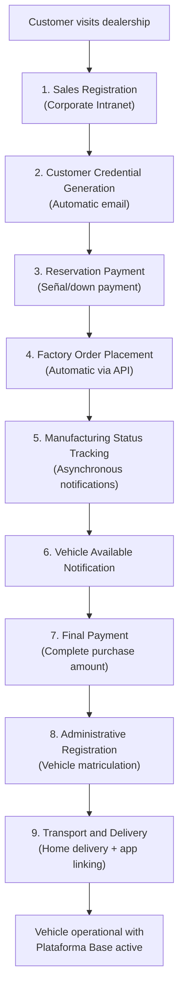
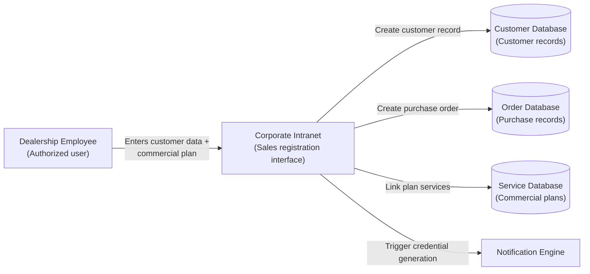
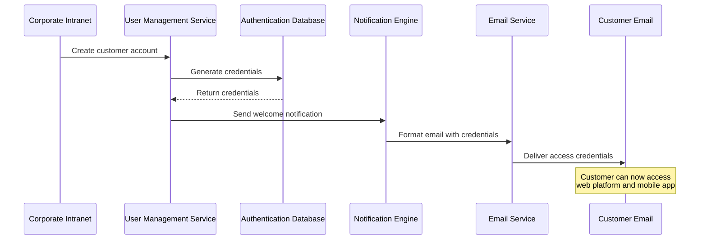
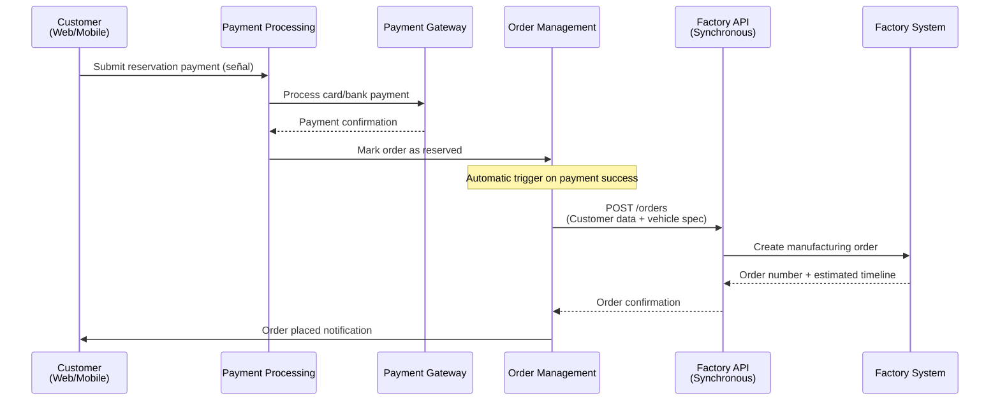
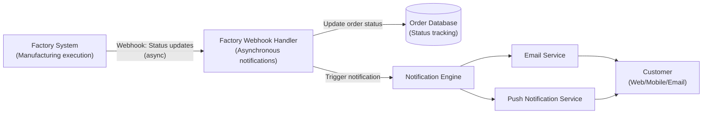
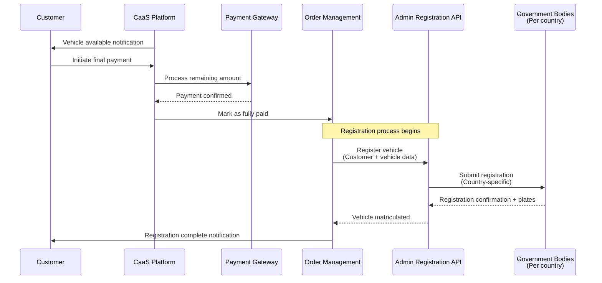
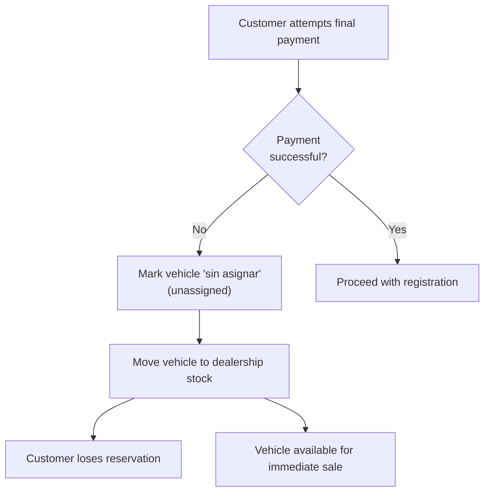
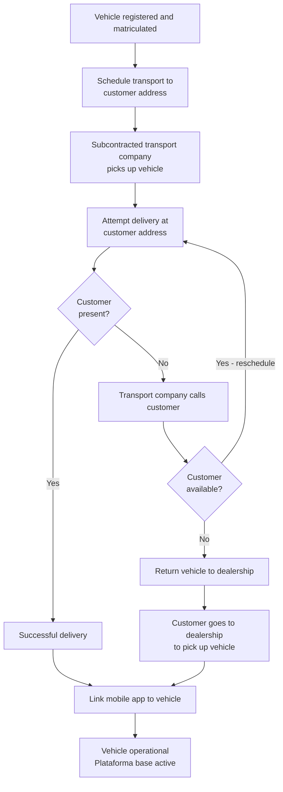
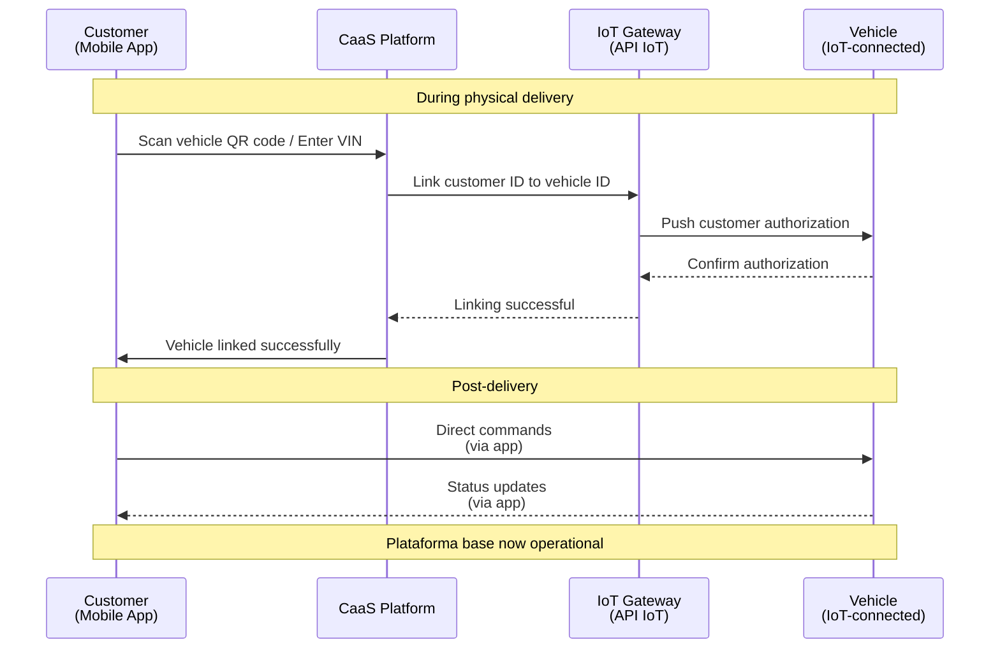
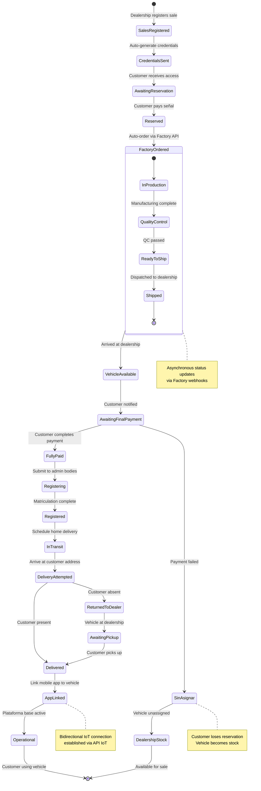

# Vehicle Purchase and Delivery Process

Relevant source files

The following files were used as context for generating this wiki page:

- [enunciado.md](enunciado.md)
- [pasame las preguntas y sus respuestas a markdown.md](pasame las preguntas y sus respuestas a markdown.md)

## Purpose and Scope

This document details the end-to-end process of purchasing a vehicle through the CaaS platform, from initial sale registration at the dealership through final delivery to the customer. It covers the coordination between dealerships, the CaaS platform, the manufacturing facility, transport providers, and administrative registration bodies.

For operational details about sales workflow management, see [Sales and Order Management](#8.1). For manufacturing and delivery operational procedures, see [Manufacturing and Delivery Workflow](#8.2). For payment processing details, see [Payment Types and Flows](#7.1). For factory API integration specifics, see [Factory Integration](#5.1). For failure handling, see [Payment Failure Scenarios](#9.2) and [Delivery and Transport Issues](#9.3).

**Sources:** [enunciado.md:8-17](), [pasame las preguntas y sus respuestas a markdown.md:18-29]()

## Process Overview

The vehicle purchase and delivery process consists of nine major stages that span from initial sale to final delivery. The process is initiated by dealership employees using the corporate intranet and involves automatic coordination between multiple systems and external actors.

### High-Level Process Flow

**Sources:** [enunciado.md:8-17](), [pasame las preguntas y sus respuestas a markdown.md:18-29]()

### Process Stages Summary

| Stage | Actor | System Component | Critical Output |
|-------|-------|------------------|-----------------|
| 1. Sales Registration | Dealership employee | Corporate Intranet | Customer record + Commercial plan |
| 2. Credential Generation | CaaS System | Notification Engine | Email with access credentials |
| 3. Reservation Payment | Customer | Payment Gateway | Payment confirmation + Reservation |
| 4. Factory Order | CaaS System | Factory API Integration | Factory order number |
| 5. Manufacturing Tracking | Factory | Factory API (async) | Status notifications |
| 6. Vehicle Available | CaaS System | Notification Engine | Customer notification |
| 7. Final Payment | Customer | Payment Gateway | Full payment confirmation |
| 8. Administrative Registration | Dealership/CaaS | Admin Registration API | Vehicle matriculation |
| 9. Transport & Delivery | Transport Company | Logistics coordination | Physical vehicle delivery |

**Sources:** [enunciado.md:8-17]()

## Sales Registration at Dealership

The purchase process begins when a dealership employee (commercial) closes a sale and registers it in the corporate intranet system. This is the authoritative entry point for all customer and vehicle purchase data into the CaaS platform.

### Data Captured During Sales Registration

The sales registration process captures the following information:

| Data Category | Fields Captured | Purpose |
|---------------|----------------|---------|
| Customer Identification | Name, email, address, contact details | Customer account creation and communication |
| Commercial Plan | Selected plataforma base (vehicle model) | Defines base vehicle configuration |
| Optional Services | Included opciones disponibles | Services active throughout vehicle lifetime |
| Payment Terms | Down payment amount, financing details | Financial tracking and invoicing |
| Delivery Address | Customer home address | Transport coordination |

**Critical Business Rule:** All customers must be registered by dealership employees. There is no self-service registration. This ensures all users are "known and controlled" within the system.

**Sources:** [enunciado.md:8-10](), [pasame las preguntas y sus respuestas a markdown.md:16]()

### Systems and Components Involved

**Sources:** [enunciado.md:8-10]()

## Customer Credential Generation

Upon successful sales registration, the CaaS system automatically generates access credentials for the customer and sends them via email. This enables customer access to both the web platform and mobile application.

### Credential Generation Flow

**Sources:** [enunciado.md:10-12]()

### Customer Access Capabilities

Once credentials are received, customers can access:

1. **Web Platform** - Full-featured browser-based access to expediente de compra
2. **Mobile Application** - On-the-go access with direct vehicle linking capabilities

The **expediente de compra** (purchase dossier) provides access to:
- Vehicle manuals and documentation
- Maintenance history (historial de mantenimiento)
- Invoice records (facturas)
- Manufacturing status during production
- Service activation history (after delivery)

For details on customer-facing platform features, see [Customer-Facing Platforms](#4.3).

**Sources:** [enunciado.md:10-12]()

## Reservation Payment and Factory Order

Once the customer receives credentials and reviews their purchase details, they must pay a reservation signal (señal) to confirm the order. This triggers automatic factory order placement.

### Payment and Order Sequence

**Sources:** [enunciado.md:13-14](), [pasame las preguntas y sus respuestas a markdown.md:41-44]()

### Factory API Integration Pattern

The factory order placement uses a **synchronous API call**:

- **Direction:** CaaS → Factory
- **Protocol:** REST API (synchronous request-response)
- **Endpoint:** Factory Order API
- **Initiative:** CaaS initiates the order placement
- **Response:** Factory provides order confirmation with order number

This is distinct from manufacturing status updates, which use an asynchronous pattern. For complete factory integration details, see [Factory Integration](#5.1).

**Critical Business Rule:** Factory order placement is **automatic** upon reservation payment confirmation. No manual intervention is required.

**Sources:** [pasame las preguntas y sus respuestas a markdown.md:41-44]()

## Manufacturing Status Tracking

After the factory order is placed, the customer receives ongoing notifications about the manufacturing status throughout the production process. This provides transparency and is a "differentiating value" of the CaaS platform.

### Status Notification Architecture

**Sources:** [pasame las preguntas y sus respuestas a markdown.md:28-29, 41-44](), [enunciado.md:13-14]()

### Manufacturing Status Notifications

The system provides automatic notifications for key manufacturing milestones:

| Manufacturing Stage | Notification Content | Delivery Channels |
|-------------------|---------------------|------------------|
| Order Confirmed | Factory has received order, production scheduled | Email + Push |
| Production Started | Vehicle manufacturing has begun | Email + Push |
| Quality Control | Vehicle undergoing final quality checks | Email + Push |
| Ready for Shipment | Vehicle completed and ready to ship | Email + Push |
| Shipped to Dealership | Vehicle en route to local dealership | Email + Push |
| Available at Location | Vehicle arrived and ready for final payment | Email + Push + SMS |

**Integration Pattern:** The factory uses **asynchronous webhooks** to push status updates to CaaS, eliminating the need for CaaS to poll for status changes.

**Critical Business Rule:** The factory determines the delivery date based on their production planning. CaaS does not control or override these dates.

**Sources:** [pasame las preguntas y sus respuestas a markdown.md:22-23, 28-29](), [enunciado.md:13-14]()

## Final Payment and Vehicle Registration

When the vehicle is manufactured and available at the dealership location, the customer must complete the final payment for the vehicle. Only after full payment is confirmed does the administrative registration (matriculation) process begin.

### Final Payment Flow

**Sources:** [enunciado.md:14-16](), [pasame las preguntas y sus respuestas a markdown.md:80]()

### Payment Failure Scenario

If the customer cannot complete the final payment, the following actions occur:

**Critical Business Rules:**
1. **Vehicle becomes dealership stock** - The vehicle remains at the dealership and is marked as available inventory
2. **Customer loses reservation** - The customer forfeits their reservation and down payment
3. **Vehicle marked "sin asignar"** - In the system, the vehicle exists but is not assigned to any customer
4. **Immediate availability** - The vehicle can be sold immediately to another customer

This is a hard business boundary: **no full payment = no vehicle**.

**Sources:** [pasame las preguntas y sus respuestas a markdown.md:26-27]()

### Administrative Registration Process

The administrative registration process varies by country, as each country has different governmental bodies and requirements. The CaaS system integrates with country-specific administrative APIs to handle vehicle matriculation.

| Process Step | Responsibility | System Component |
|--------------|---------------|------------------|
| Payment verification | CaaS Platform | Order Management |
| Registration submission | CaaS Platform / Dealership | Admin Registration API |
| Document processing | Government bodies | External (per country) |
| Plate assignment | Government bodies | External (per country) |
| Registration confirmation | CaaS Platform | Admin Registration Integration |

For complete details on administrative integration, see [Administrative Registration Integration](#5.5).

**Sources:** [enunciado.md:15-16]()

## Vehicle Delivery

Once the vehicle is registered and matriculated, it is transported to the customer's home address for delivery. The delivery process includes physical vehicle handoff and mobile application linking to enable vehicle operation.

### Transport and Delivery Flow

**Sources:** [enunciado.md:16-17](), [pasame las preguntas y sus respuestas a markdown.md:24-25]()

### Transport Coordination

The physical transport of the vehicle involves a subcontracted transport company:

| Actor | Responsibility | System Interaction |
|-------|---------------|-------------------|
| Factory | Prepares vehicle for shipment | Notifies CaaS of shipment |
| Transport Company | Picks up from factory, delivers to dealership | Records pickup/delivery timestamps |
| Dealership | Receives vehicle at location | Confirms vehicle receipt in CaaS |
| Transport Company (final) | Delivers to customer home | GPS tracking, delivery confirmation |
| CaaS Platform | Coordinates and tracks entire process | Logistics coordination system |

**Critical Logistics Points:**
- **Pickup timestamp:** When vehicle leaves factory/dealership
- **Delivery timestamp:** When vehicle arrives at destination
- **GPS tracking:** Real-time location during transport (if available)

**Sources:** [pasame las preguntas y sus respuestas a markdown.md:20-21]()

### Delivery Failure Handling

If the customer is not present during the home delivery attempt:

**Step 1: Contact Customer**
- Transport company (grúa/tow truck) calls the customer
- Attempts to reschedule delivery for same day or next available time

**Step 2: Return to Dealership (if customer unavailable)**
- Vehicle is **never left on the street** due to security risks
- Vehicle is returned to the dealership
- Customer is notified that vehicle is waiting for pickup at dealership

**Step 3: Customer Dealership Pickup**
- Customer goes to dealership to collect vehicle
- Mobile app linking occurs at dealership instead of home

This fallback ensures vehicle security while still completing the delivery process.

For complete delivery failure procedures, see [Delivery and Transport Issues](#9.3).

**Sources:** [pasame las preguntas y sus respuestas a markdown.md:24-25]()

### Mobile Application Linking

The final step of delivery is linking the customer's mobile application directly to the physical vehicle. This establishes the bidirectional communication channel between customer and vehicle.

**Sources:** [enunciado.md:16-17]()

### Post-Delivery Vehicle State

Once delivery and app linking are complete:

| Component | State | Capabilities |
|-----------|-------|--------------|
| Vehicle | Operational | Plataforma base features active |
| Mobile App | Linked | Direct vehicle control, status monitoring |
| Customer Account | Active | Can purchase additional opciones disponibles |
| Expediente de Compra | Accessible | Full purchase history and documentation |
| IoT Connection | Established | Bidirectional communication active |

The customer can now use the vehicle with its base platform features and begin purchasing additional optional services as needed. For service acquisition process, see [Service Acquisition and Management](#4.2).

**Sources:** [enunciado.md:16-17]()

## Failure Scenarios

Several failure scenarios can occur during the purchase and delivery process. The system includes specific handling procedures for each scenario to protect both customer and business interests.

### Payment Failure During Final Payment

As detailed in [Final Payment and Vehicle Registration](#final-payment-and-vehicle-registration), if the customer cannot complete the final payment:

- Vehicle is marked **"sin asignar"** (unassigned) in the system
- Vehicle becomes dealership stock for immediate sale
- Customer **loses reservation** and down payment
- No further customer obligations or rights to the vehicle

This is a permanent state change with no recovery path for the customer.

**Sources:** [pasame las preguntas y sus respuestas a markdown.md:26-27]()

### Delivery Failure - Customer Absent

As detailed in [Delivery Failure Handling](#delivery-failure-handling), if the customer is not present during home delivery:

1. Transport company attempts phone contact
2. If contact successful: Reschedule delivery
3. If contact unsuccessful: Return vehicle to dealership
4. Customer must pick up at dealership
5. Mobile app linking occurs at dealership

**Critical Security Rule:** Vehicle is **never left unattended** on the street, even temporarily.

**Sources:** [pasame las preguntas y sus respuestas a markdown.md:24-25]()

### Manufacturing Delays

If the factory experiences delays in manufacturing:

- Factory pushes updated status via asynchronous webhooks
- CaaS automatically notifies customer of revised timeline
- Customer retains reservation throughout delay
- No penalty or cancellation option for reasonable delays

The factory controls the manufacturing timeline and CaaS adapts to factory schedules.

**Sources:** [pasame las preguntas y sus respuestas a markdown.md:22-23]()

### Integration Failure Scenarios

| Failure Type | System Impact | Recovery Action |
|-------------|---------------|-----------------|
| Factory API timeout during order | Order not placed | Retry with exponential backoff, manual escalation if persistent |
| Admin registration API failure | Vehicle registered but CaaS not updated | Query registration status periodically, manual reconciliation |
| Payment gateway timeout | Payment status unknown | Query payment status, do not deliver until confirmed |
| IoT linking failure at delivery | Vehicle delivered but app not linked | Link can be completed later via app, does not block delivery |

For complete failure handling procedures across all system areas, see [Failure Handling and Edge Cases](#9).

**Sources:** Multiple sources across [pasame las preguntas y sus respuestas a markdown.md]()

## Process State Diagram

The following state diagram shows the complete lifecycle of a vehicle purchase order from initial registration through operational delivery:

**Sources:** [enunciado.md:8-17](), [pasame las preguntas y sus respuestas a markdown.md:18-29]()

## Summary

The vehicle purchase and delivery process is a complex, multi-stage workflow that requires coordination between multiple systems, external services, and human actors. Key characteristics of this process include:

**Automation:** Credential generation, factory ordering, and status notifications are fully automated with no manual intervention required.

**Synchronous and Asynchronous Patterns:** Factory order placement is synchronous (request-response), while manufacturing status updates are asynchronous (webhooks).

**Customer Protection:** Payment failures result in clear outcomes (vehicle returned to stock) with no ambiguity. Delivery failures have fallback procedures (dealership pickup).

**Integration Complexity:** The process touches Factory API, Payment Gateway, Admin Registration API, IoT Gateway, and Notification Engine, requiring robust failure handling.

**State Management:** Vehicle orders progress through well-defined states with specific entry and exit criteria for each stage.

The successful completion of this process results in an operational vehicle with the plataforma base active, ready for the customer to begin using and purchasing optional services as needed.

**Sources:** [enunciado.md:1-23](), [pasame las preguntas y sus respuestas a markdown.md:1-104]()