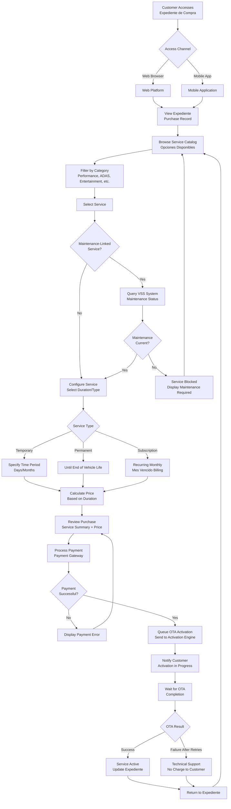
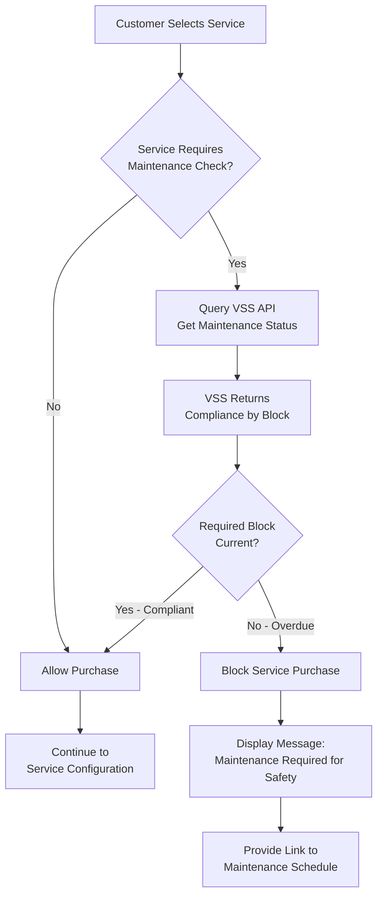
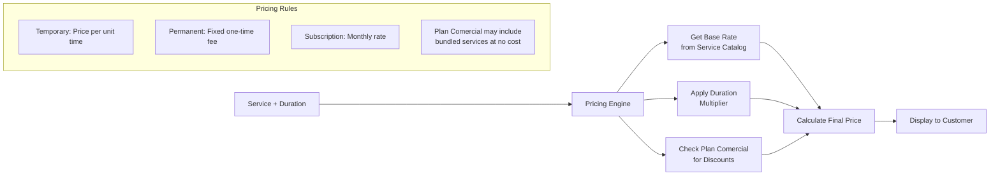
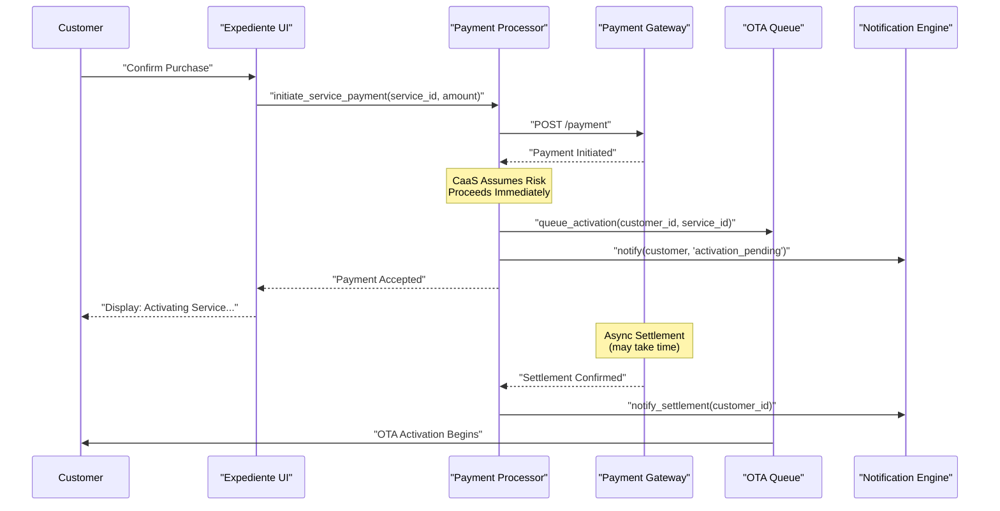
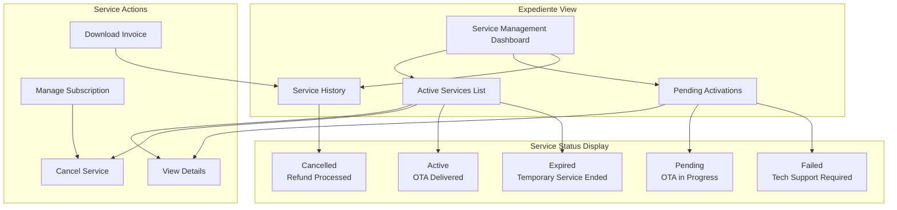
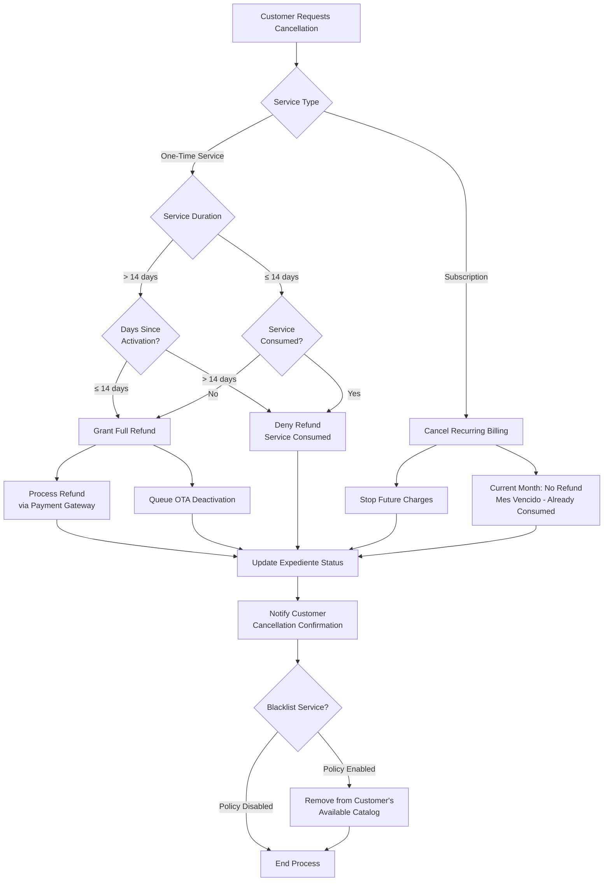
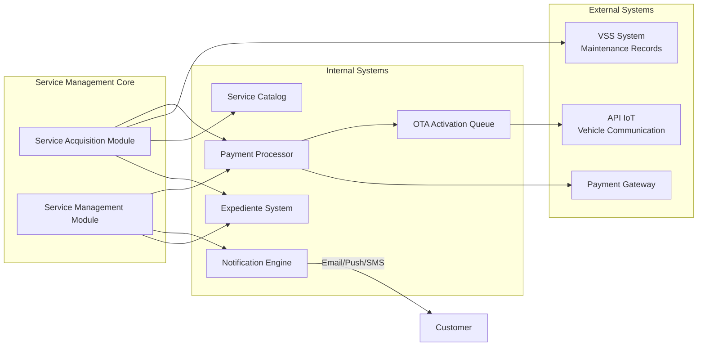

# Service Acquisition and Management

<details>
<summary>Relevant source files</summary>

The following files were used as context for generating this wiki page:

- [enunciado.md](enunciado.md)
- [pasame las preguntas y sus respuestas a markdown.md](pasame las preguntas y sus respuestas a markdown.md)

</details>


## Purpose and Scope

This page documents the customer journey for acquiring and managing optional vehicle services (opciones disponibles) after vehicle delivery. It covers the complete workflow from service discovery through purchase, activation, and ongoing management including cancellations and refunds.

For the initial vehicle purchase and delivery process, see [Vehicle Purchase and Delivery Process](#4.1). For technical details of customer-facing web and mobile platforms, see [Customer-Facing Platforms](#4.3). For technical implementation details of OTA activation, see [OTA Service Activation](#6.2). For payment gateway integration specifics, see [Payment Gateway Integration](#5.4).

**Sources:** [enunciado.md:18-22](), [pasame las preguntas y sus respuestas a markdown.md:84-96]()

---

## Service Acquisition Workflow Overview

The service acquisition process begins when a customer accesses their expediente de compra through either the web platform or mobile application. Customers can browse the catalog of opciones disponibles specific to their vehicle's plataforma base, select services with desired durations, complete payment, and receive automatic OTA activation.

### Customer Service Acquisition Flow



**Sources:** [enunciado.md:18-20](), [pasame las preguntas y sus respuestas a markdown.md:46-53](), [pasame las preguntas y sus respuestas a markdown.md:66-73]()

---

## Service Catalog and Discovery

### Accessing Available Services

Customers access the service catalog through their expediente de compra, which is accessible via both web and mobile channels. The catalog displays only the opciones disponibles that are compatible with the customer's specific vehicle plataforma base.

The service catalog is organized by functional categories:

| Category | Examples |
|----------|----------|
| **Performance** | 50% power increase, enhanced acceleration modes |
| **Driver Assistance (ADAS)** | Autonomous driving on highways, advanced parking assist |
| **Traction & Handling** | Specialized modes for different terrain and weather conditions |
| **Climate Control** | Enhanced HVAC options, seat heating/cooling |
| **Entertainment** | Premium audio, in-vehicle streaming services |

### Service Catalog Architecture

```mermaid
graph TB
    subgraph "Customer Access Layer"
        WEB_CLIENT["Web Platform Client"]
        MOBILE_CLIENT["Mobile App Client"]
    end
    
    subgraph "Expediente System"
        EXPEDIENTE_SVC["Expediente Service"]
        CUSTOMER_CTX["Customer Context<br/>Vehicle ID + Plan Comercial"]
    end
    
    subgraph "Service Catalog Core"
        CATALOG_API["Service Catalog API"]
        FILTER_ENGINE["Compatibility Filter<br/>by Plataforma Base"]
        PRICING_ENGINE["Pricing Calculator"]
    end
    
    subgraph "Data Sources"
        SERVICE_DB["Service Definitions DB<br/>Opciones Disponibles"]
        CUSTOMER_DB["Customer Database<br/>Purchase History"]
        VEHICLE_DB["Vehicle Configuration DB<br/>Plataforma Base"]
    end
    
    subgraph "External Integration"
        VSS_CLIENT["VSS Integration Client"]
        VSS_SYSTEM["VSS System<br/>Maintenance Records"]
    end
    
    WEB_CLIENT --> EXPEDIENTE_SVC
    MOBILE_CLIENT --> EXPEDIENTE_SVC
    
    EXPEDIENTE_SVC --> CUSTOMER_CTX
    CUSTOMER_CTX --> CATALOG_API
    
    CATALOG_API --> FILTER_ENGINE
    CATALOG_API --> PRICING_ENGINE
    
    FILTER_ENGINE --> SERVICE_DB
    FILTER_ENGINE --> VEHICLE_DB
    
    PRICING_ENGINE --> SERVICE_DB
    PRICING_ENGINE --> CUSTOMER_DB
    
    CATALOG_API --> VSS_CLIENT
    VSS_CLIENT --> VSS_SYSTEM
    
    FILTER_ENGINE -.."Filters out<br/>incompatible services"..-> CATALOG_API
    VSS_CLIENT -.."Checks maintenance<br/>for gated services"..-> CATALOG_API
```

**Sources:** [enunciado.md:3-5](), [enunciado.md:18-19](), [pasame las preguntas y sus respuestas a markdown.md:60-73]()

---

## Maintenance-Linked Service Access

Certain services have dependencies on the vehicle's official maintenance status. Before allowing purchase of these services, the system queries the VSS (Vehicle Service System) to verify current maintenance compliance.

### Maintenance Validation Logic



**Key Business Rules:**

1. **Never block the plataforma base** - Only new service purchases can be blocked, never existing functionality
2. **Never immobilize the vehicle** - Lack of maintenance results in warranty loss, not vehicle lockout
3. **Safety-based blocking** - Only services with safety dependencies (e.g., autonomous driving, enhanced performance) check maintenance
4. **Block-specific validation** - VSS tracks maintenance by functional blocks; only relevant blocks are checked per service

**Sources:** [pasame las preguntas y sus respuestas a markdown.md:60-73]()

---

## Service Configuration and Pricing

### Service Duration Models

The system supports three distinct service duration models:

| Model | Description | Payment | Use Case |
|-------|-------------|---------|----------|
| **Temporary (Temporal)** | Service active for a specified time period | One-time upfront payment | Weekend trip, seasonal needs |
| **Permanent (Permanente)** | Service active until end of vehicle life | One-time upfront payment | Features customer wants always available |
| **Subscription (Planificada/Recurrente)** | Recurring monthly service | Monthly billing (mes vencido) | Ongoing entertainment, regular performance boost |

### Pricing Calculation



**Sources:** [enunciado.md:5-6](), [enunciado.md:21](), [pasame las preguntas y sus respuestas a markdown.md:82]()

---

## Payment Processing for Services

### Service Payment Flow

Payment for services occurs before OTA activation. The system integrates with the payment gateway to process card payments, with CaaS assuming settlement risk by delivering services immediately upon payment initiation.



**Critical Rules:**

1. **Immediate Service Delivery** - Service activation begins immediately after payment initiation, before settlement confirmation
2. **No Charge on Failure** - If OTA activation fails after all retries, customer is NOT charged (refund or void transaction)
3. **Async Settlement Risk** - CaaS accepts the risk of payment reversal/chargeback for improved customer experience

**Sources:** [pasame las preguntas y sus respuestas a markdown.md:77-82](), [pasame las preguntas y sus respuestas a markdown.md:46-53]()

---

## Post-Purchase Service Management

### Viewing Active Services

After successful activation, services appear in the customer's expediente with the following information:

- Service name and description
- Activation date and time
- Expiration date (for temporary services)
- Current status (active, pending, failed, cancelled)
- Cancellation eligibility (based on desistimiento rules)
- Payment history

### Service Management Dashboard



**Sources:** [enunciado.md:11]()

---

## Service Cancellation and Refunds

### Desistimiento (Right of Withdrawal) Rules

Spanish and EU law requires distance selling to provide withdrawal rights. The system implements the following cancellation policies:

| Service Duration | Cancellation Window | Refund Policy |
|------------------|---------------------|---------------|
| **> 14 days** | First 14 days only | Full refund if cancelled within 14 days |
| **≤ 14 days** | Anytime before expiration | Full refund at any time |
| **After window** | No refund | Service considered consumed |
| **Subscriptions** | Anytime | Cancel before next billing cycle |

### Cancellation Workflow



**Implementation Notes:**

1. **Configurable Blacklisting** - System can optionally remove cancelled services from future catalog for that customer (reduce returns)
2. **Partial Consumption** - No pro-rated refunds; refund is all-or-nothing based on time windows
3. **Subscription Mes Vencido** - Current month never refunded because it's post-paid (service already consumed)
4. **OTA Deactivation** - If service is refunded, it must be deactivated via OTA

**Sources:** [pasame las preguntas y sus respuestas a markdown.md:84-96]()

---

## Special Scenarios

### Vehicle Theft

When a vehicle is stolen, service management rules are:

1. **Delivered Services** - No automatic refund; normal desistimiento rules apply
2. **Pending Services** - Customer can cancel and receive refund
3. **Active Subscriptions** - Customer can cancel to stop future billing
4. **Within 14-Day Window** - Can still request desistimiento refund if eligible

The system does NOT automatically process refunds on theft notification.

### Warranty Loss Due to Maintenance

If a customer loses warranty by not following the maintenance plan:

1. **Existing Services** - Remain active; customer paid for them
2. **New Service Purchases** - Maintenance-linked services become unavailable
3. **No Forced Deactivation** - Already active services are never revoked due to maintenance lapse
4. **Restoration** - Once maintenance is current, gated services become available again

**Sources:** [pasame las preguntas y sus respuestas a markdown.md:91-96](), [pasame las preguntas y sus respuestas a markdown.md:66-73]()

---

## Service Activation Notifications

Customers receive notifications through multiple channels throughout the service acquisition and activation process:

| Event | Channels | Content |
|-------|----------|---------|
| **Payment Confirmed** | Email, Mobile Push | Payment receipt, activation queued |
| **OTA Activation Started** | Mobile Push, Vehicle Display | Activation in progress |
| **OTA Success** | Email, Mobile Push, Vehicle Display | Service now active |
| **OTA Failure (Retrying)** | Mobile Push | Temporary activation issue, retrying |
| **OTA Failed (Final)** | Email, Mobile Push | Technical support contacted, no charge |
| **Service Expiring** | Email, Mobile Push | Reminder before temporary service expires |
| **Service Expired** | Email, Mobile Push | Service has ended |
| **Cancellation Confirmed** | Email | Cancellation processed, refund details |
| **Subscription Billing** | Email | Monthly invoice for mes vencido billing |

**Sources:** [enunciado.md:19-20](), [pasame las preguntas y sus respuestas a markdown.md:46-53]()

---

## Integration Points

The service acquisition and management system integrates with multiple external and internal systems:



**Key Integration Patterns:**

- **VSS Integration** - Pull-based query for maintenance status (not push)
- **Payment Gateway** - Async settlement with immediate service delivery
- **OTA Queue** - Decoupled activation with retry logic (detailed in [OTA Service Activation](#6.2))
- **Notification Engine** - Multi-channel redundant delivery

**Sources:** [enunciado.md:18-20](), [pasame las preguntas y sus respuestas a markdown.md:60-73](), [pasame las preguntas and sus respuestas a markdown.md:77-82]()