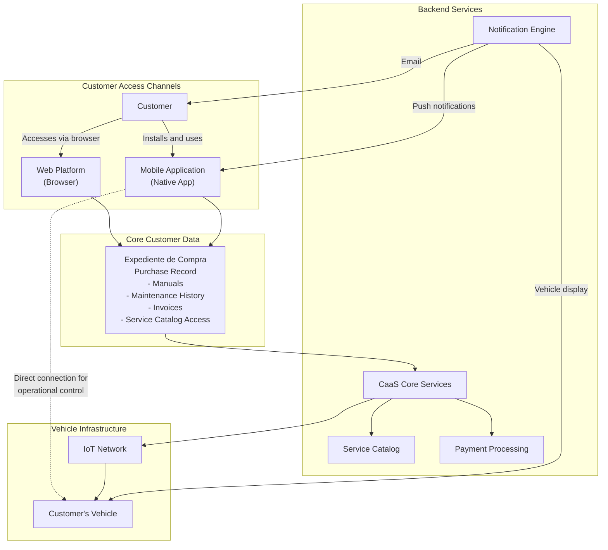
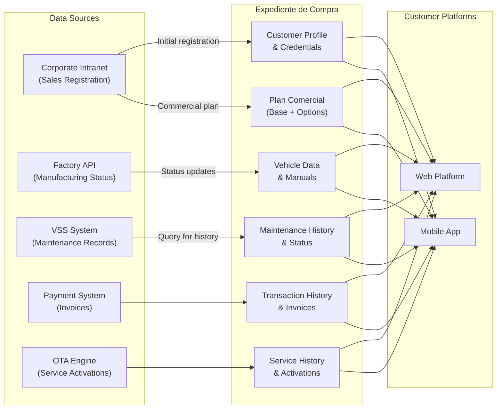
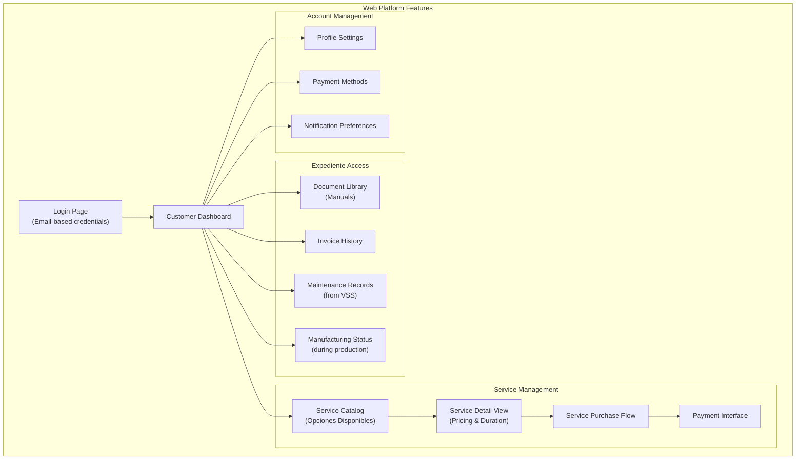
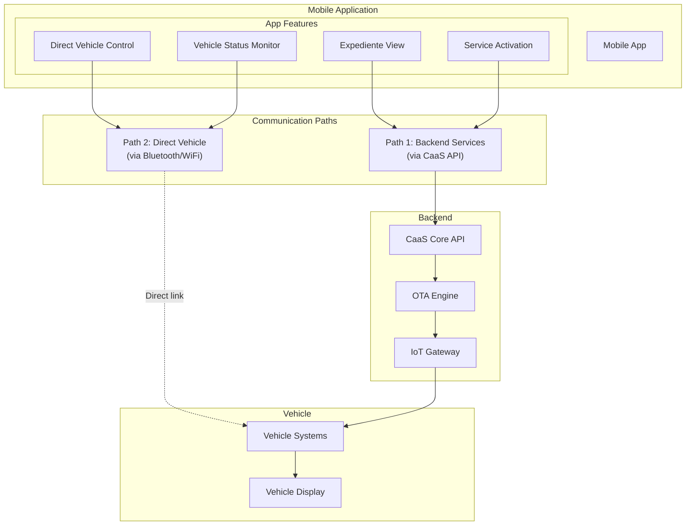
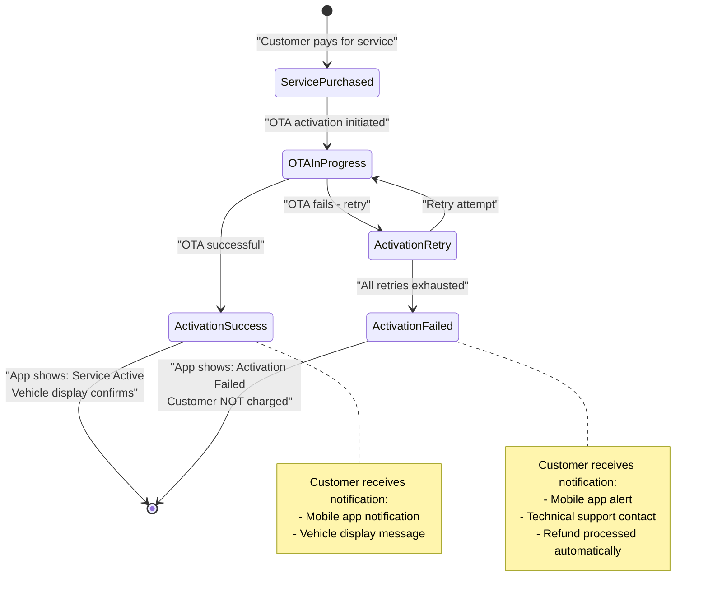
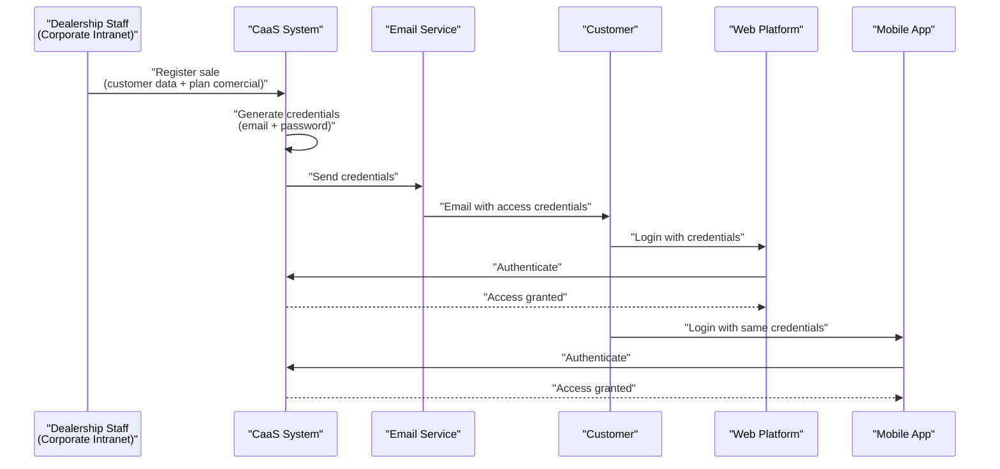
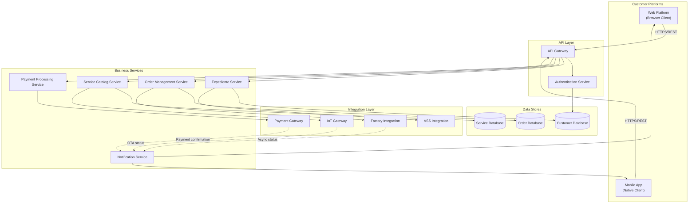
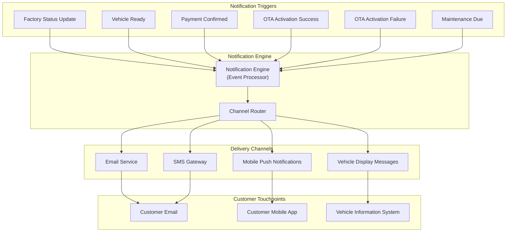

# Customer-Facing Platforms

Relevant source files

The following files were used as context for generating this wiki page:

- [enunciado.md](enunciado.md)
- [pasame las preguntas y sus respuestas a markdown.md](pasame las preguntas y sus respuestas a markdown.md)

## Purpose and Scope

This page documents the customer-facing digital platforms that enable customers to interact with the CaaS system. It covers the web platform, mobile application, and the expediente de compra (purchase record) system that forms the core of the customer experience.

For information about the business processes customers perform through these platforms (purchasing vehicles, acquiring services), see [Vehicle Purchase and Delivery Process](#4.1) and [Service Acquisition and Management](#4.2). For technical details on backend integrations, see [Integration Architecture](#3.3).

**Sources:** [enunciado.md:1-23](), [pasame las preguntas y sus respuestas a markdown.md:1-104]()

---

## Platform Overview

The CaaS system provides two primary customer-facing platforms:

| Platform | Access Method | Primary Use Cases |
|----------|---------------|-------------------|
| **Web Platform** | Browser-based via corporate website | Initial registration review, document access, service browsing from desktop |
| **Mobile Application** | Native smartphone app | Service activation, vehicle status monitoring, direct vehicle control |

Both platforms provide access to the **expediente de compra** (purchase record), which serves as the single source of truth for all customer-related data, documents, and transaction history.

**Diagram: Customer-Facing Platform Architecture**

**Key Architectural Characteristics:**

- **Unified Data Model**: Both platforms access the same expediente de compra
- **Dual Mobile Paths**: Mobile app communicates with CaaS backend for services AND directly with vehicle for operational control
- **Multi-Channel Notifications**: Customers receive updates via email, mobile push, and vehicle display

**Sources:** [enunciado.md:10-12](), [enunciado.md:17-20]()

---

## Expediente de Compra (Purchase Record)

The expediente de compra is the central data structure containing all customer-related information. It is accessible through both the web platform and mobile application.

### Contents

The expediente de compra includes:

| Component | Description | Update Frequency |
|-----------|-------------|------------------|
| **Vehicle Manuals** | Digital copies of vehicle documentation | Static (updated on vehicle delivery) |
| **Maintenance History** | Complete service record from VSS system | Updated after each workshop visit |
| **Invoice Archive** | All purchase and service invoices | Updated on each transaction |
| **Service History** | Record of activated optional services | Real-time (updated on activation/cancellation) |
| **Manufacturing Status** | Current state during vehicle production | Real-time during manufacturing phase |
| **Plan Comercial** | Contracted commercial plan details | Static (defined at purchase) |

### Data Flow

**Diagram: Expediente de Compra Data Flow**

**Sources:** [enunciado.md:11-12](), [pasame las preguntas y sus respuestas a markdown.md:28-29]()

---

## Web Platform

The web platform provides browser-based access to the CaaS system. Customers access it via the corporate website using credentials provided by email after vehicle purchase registration.

### Features and Capabilities

**Diagram: Web Platform Feature Map**

### User Access Flow

1. **Credential Delivery**: After sales registration at dealership, customer receives email with access credentials [enunciado.md:11]()
2. **Authentication**: Customer logs in using email address and provided password
3. **Dashboard Access**: Upon login, customer sees personalized dashboard with expediente data
4. **Service Browsing**: Customer can browse opciones disponibles (optional services)
5. **Transaction Execution**: Purchase flow includes service selection, payment, and confirmation

### Technical Characteristics

- **No Self-Registration**: System does not allow public registration. All users must be pre-registered through dealership sales process [pasame las preguntas y sus respuestas a markdown.md:15-16]()
- **No External SSO**: No integration with Google, Microsoft, or other external identity providers [pasame las preguntas y sus respuestas a markdown.md:15-16]()
- **Controlled User Base**: All customers are known entities who have purchased vehicles

**Sources:** [enunciado.md:10-12](), [enunciado.md:18-19](), [pasame las preguntas y sus respuestas a markdown.md:15-16]()

---

## Mobile Application

The mobile application provides smartphone-based access to CaaS services with enhanced capabilities for vehicle interaction and real-time notifications.

### Dual Communication Paths

The mobile application has two distinct communication paths:

**Diagram: Mobile App Communication Architecture**

**Path 1 - Backend Services:**
- Expediente de compra access
- Service catalog browsing
- Payment processing
- Service activation requests
- Notification reception

**Path 2 - Direct Vehicle Connection:**
- Real-time vehicle status monitoring
- Operational control (lock/unlock, climate control, etc.)
- Local configuration without internet dependency

**Sources:** [enunciado.md:17](), High-Level Architecture Diagram 1

### Vehicle Linking Process

The mobile application is linked to the customer's vehicle upon delivery:

1. **Vehicle Delivery**: Vehicle is transported to customer address [enunciado.md:17]()
2. **App Binding**: Mobile application is directly linked to the acquired vehicle [enunciado.md:17]()
3. **Operational Enablement**: Vehicle functionality is enabled through the app [enunciado.md:17]()

### Service Activation Display

When customers purchase optional services, the mobile app provides real-time activation status:

**Diagram: Service Activation Status Flow in Mobile App**

The mobile application displays activation status received from both:
- **CaaS backend**: Overall service status and OTA progress
- **Vehicle information system**: Confirmation of feature activation on vehicle [enunciado.md:19-20]()

**Sources:** [enunciado.md:19-20](), [pasame las preguntas y sus respuestas a markdown.md:48-53]()

---

## Platform Access and Security

### User Provisioning

**Diagram: User Provisioning and Authentication Flow**

### Security Characteristics

| Security Feature | Implementation |
|------------------|----------------|
| **User Origin** | All users created through dealership sales registration |
| **Authentication** | Email + password (no external SSO) |
| **Authorization** | Role-based: customers see only their own expediente |
| **Self-Registration** | **Disabled** - no public registration allowed |
| **External Identity Providers** | **Not supported** - no Google/Microsoft SSO |
| **User Verification** | Users are known entities who have purchased vehicles |

### Rationale for Closed System

The CaaS platform is intentionally **not a public system**. All users must be:
- Known to the organization (customers, employees)
- Created through controlled processes (sales registration)
- Associated with specific vehicles or roles

This design ensures:
- Customer data privacy
- Vehicle security
- Controlled access to premium services
- Clear audit trails for transactions

**Sources:** [enunciado.md:8-11](), [pasame las preguntas y sus respuestas a markdown.md:15-16]()

---

## Technical Architecture

### Platform Integration with Backend Services

**Diagram: Technical Integration Architecture**

### API Communication Patterns

The customer-facing platforms interact with backend services using the following patterns:

| Operation | Platform | Pattern | Example |
|-----------|----------|---------|---------|
| **View Expediente** | Web/Mobile | Synchronous GET | Retrieve customer data, documents, history |
| **Browse Services** | Web/Mobile | Synchronous GET | Query service catalog with filters |
| **Purchase Service** | Web/Mobile | Synchronous POST | Submit payment and service request |
| **Receive Notifications** | Mobile | Push (Async) | Manufacturing status updates |
| **Query Maintenance** | Web/Mobile | Synchronous GET | Check VSS maintenance status |
| **Monitor OTA Status** | Mobile | Polling/WebSocket | Real-time activation progress |

**Sources:** High-Level Architecture Diagrams 2 and 4

---

## Notification System

The CaaS platform employs a multi-channel notification strategy to ensure customers stay informed throughout their journey.

### Notification Channels

**Diagram: Multi-Channel Notification System**

### Notification Types and Delivery

| Notification Type | Email | Mobile Push | Vehicle Display | SMS |
|-------------------|-------|-------------|-----------------|-----|
| **Credentials Sent** | ✓ | - | - | - |
| **Manufacturing Status** | ✓ | ✓ | - | Optional |
| **Vehicle Ready** | ✓ | ✓ | - | ✓ |
| **Payment Confirmation** | ✓ | ✓ | - | - |
| **Service Activated** | ✓ | ✓ | ✓ | - |
| **OTA Failure** | ✓ | ✓ | - | ✓ |
| **Maintenance Due** | ✓ | ✓ | ✓ | Optional |

### Critical Notification Rules

**Manufacturing Status Notifications:**
- Automatic notifications during vehicle production are part of the value proposition [pasame las preguntas y sus respuestas a markdown.md:28-29]()
- Status updates sent at key manufacturing milestones
- Enables customer to plan for vehicle receipt

**OTA Activation Notifications:**
- **Success Case**: Confirmation sent via app notification and vehicle display [enunciado.md:19-20]()
- **Failure Case**: Customer notified immediately with technical support escalation [pasame las preguntas y sus respuestas a markdown.md:48-53]()
- **Critical Rule**: If OTA fails after all retries, customer is notified AND NOT CHARGED [pasame las preguntas y sus respuestas a markdown.md:48-53]()

**Sources:** [enunciado.md:11](), [enunciado.md:13](), [enunciado.md:19-20](), [pasame las preguntas y sus respuestas a markdown.md:28-29](), [pasame las preguntas y sus respuestas a markdown.md:48-53]()

---

## Platform Responsibilities Summary

### Web Platform Responsibilities

- Initial customer onboarding and credential reception
- Desktop-friendly expediente browsing
- Document access (manuals, invoices)
- Service catalog exploration with detailed information
- Service purchase and payment processing
- Account and payment method management

### Mobile Application Responsibilities

- On-the-go expediente access
- Real-time service activation monitoring
- Direct vehicle status monitoring and control
- Push notification reception
- Vehicle linking and operational enablement
- Immediate updates on OTA activation status

### Shared Responsibilities

Both platforms provide:
- Access to the complete expediente de compra
- Service catalog browsing and purchasing
- Payment processing capabilities
- Transaction history viewing
- Maintenance record access (queried from VSS)
- Manufacturing status tracking (during production phase)

**Sources:** [enunciado.md:10-23](), High-Level Architecture Diagrams