# External System Integrations

<details>
<summary>Relevant source files</summary>

The following files were used as context for generating this wiki page:

- [enunciado.md](enunciado.md)
- [pasame las preguntas y sus respuestas a markdown.md](pasame las preguntas y sus respuestas a markdown.md)

</details>


## Purpose and Scope

This document provides comprehensive technical documentation for all external system integrations within the Car as a Service (CaaS) platform. It details the communication patterns, protocols, constraints, and integration requirements for each external system that CaaS depends on to deliver its business functionality.

CaaS operates as a central orchestration platform that integrates with multiple external systems to enable the complete vehicle sales and service lifecycle. This page documents the technical aspects of these integrations, including synchronous and asynchronous communication patterns, error handling strategies, and architectural constraints imposed by existing systems.

**Related Documentation:**
- For internal CaaS components and subsystems, see [Core Technical Components](#3.2)
- For overall integration patterns and architecture, see [Integration Architecture](#3.3)
- For specific business process flows that utilize these integrations, see [Customer Journey](#4)

**Sources:** [enunciado.md:1-23](), [pasame las preguntas y sus respuestas a markdown.md:1-104]()

---

## Integration Architecture Overview

The CaaS platform integrates with five primary external systems, each serving a distinct business function. The integration architecture follows a hub-and-spoke pattern with CaaS Core serving as the central integration hub.

### External Systems Integration Map

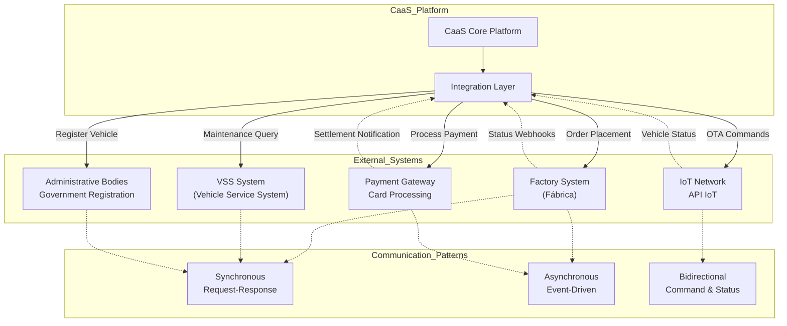

**Sources:** [pasame las preguntas y sus respuestas a markdown.md:31-56](), [enunciado.md:13-19]()

---

### Integration Characteristics Summary

| External System | Communication Pattern | Initiator | Existing or New | Critical Constraint |
|----------------|----------------------|-----------|-----------------|---------------------|
| **Factory API** | Hybrid: Sync orders, Async status | CaaS (orders), Factory (status) | New - to be developed | Must support both sync and async patterns |
| **VSS System** | Synchronous query | CaaS | Existing - external | Read-only access, no writes |
| **API IoT** | Bidirectional | CaaS (commands), Vehicles (status) | Existing - documented, tested | Cannot be modified, must use as-is |
| **Payment Gateway** | Asynchronous | CaaS | Third-party service | Settlement delay requires risk assumption |
| **Administrative Bodies** | Synchronous | CaaS | Varies by country | Country-specific implementations |

**Sources:** [pasame las preguntas y sus respuestas a markdown.md:40-56](), [pasame las preguntas y sus respuestas a markdown.md:100-104]()

---

## Factory Integration

### Purpose

The Factory Integration enables CaaS to place vehicle orders with the manufacturing facility and receive real-time status updates throughout the production lifecycle. The factory and CaaS are part of the same company, but the factory operates as an independent system with its own APIs.

**Sources:** [pasame las preguntas y sus respuestas a markdown.md:33-44](), [enunciado.md:13-14]()

---

### Communication Pattern: Hybrid Synchronous/Asynchronous

The Factory API implements a hybrid integration pattern that combines both synchronous and asynchronous communication:

1. **Synchronous (CaaS → Factory):** Order placement with immediate confirmation
2. **Asynchronous (Factory → CaaS):** Manufacturing status notifications via webhooks

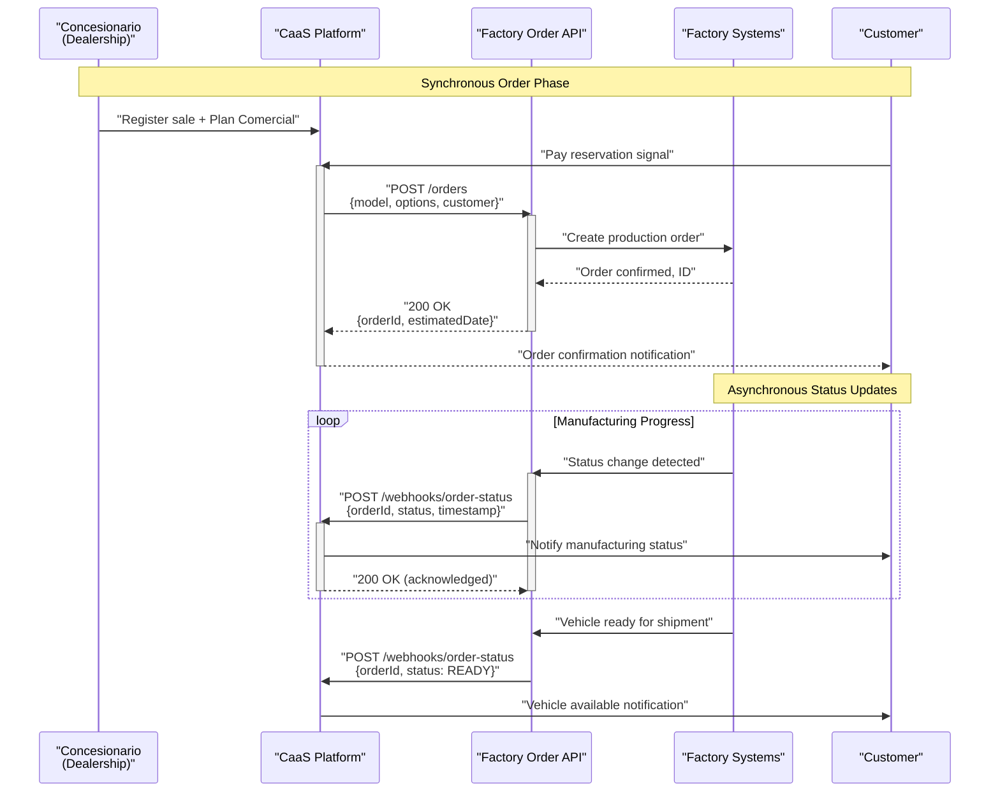

**Sources:** [pasame las preguntas y sus respuestas a markdown.md:40-44](), [enunciado.md:13-14]()

---

### Factory API Specifications

#### Outbound API: Order Placement (CaaS → Factory)

**Endpoint Pattern:** `POST /orders`

**Request Characteristics:**
- **Synchronous:** Blocking call, waits for confirmation
- **Initiated by:** CaaS Platform after reservation payment
- **Automatic trigger:** Occurs automatically upon reservation signal payment

**Response Data:**
- Order confirmation ID
- Estimated delivery date
- Initial manufacturing status

**Error Handling:**
- If factory API unavailable: Queue order for retry
- If order rejected: Notify customer and refund reservation
- Timeout handling: 30-second timeout with exponential backoff retry

**Sources:** [enunciado.md:13-14](), [pasame las preguntas y sus respuestas a markdown.md:28-29]()

---

#### Inbound API: Status Notifications (Factory → CaaS)

**Endpoint Pattern:** `POST /webhooks/order-status` (CaaS must implement)

**Notification Characteristics:**
- **Asynchronous:** Event-driven, factory-initiated
- **Delivery guarantee:** At-least-once delivery (must handle idempotency)
- **Notification triggers:**
  - Production started
  - Component assembly milestones
  - Quality control checkpoints
  - Vehicle ready for shipment
  - Shipment initiated
  - Vehicle arrived at dealership

**Payload Structure:**
- Order ID
- Status code and description
- Timestamp
- Optional: Estimated completion date updates
- Optional: Shipment tracking information

**Sources:** [enunciado.md:13-14](), [pasame las preguntas y sus respuestas a markdown.md:28-29]()

---

### Manufacturing Status Flow

```mermaid
stateDiagram-v2
    [*] --> ORDER_PLACED: "Reservation paid,<br/>API call successful"
    
    ORDER_PLACED --> PRODUCTION_SCHEDULED: "Factory accepts order"
    PRODUCTION_SCHEDULED --> PRODUCTION_IN_PROGRESS: "Manufacturing begins"
    
    PRODUCTION_IN_PROGRESS --> QUALITY_CONTROL: "Assembly complete"
    QUALITY_CONTROL --> READY_FOR_SHIPMENT: "QC passed"
    QUALITY_CONTROL --> PRODUCTION_IN_PROGRESS: "QC failed, rework"
    
    READY_FOR_SHIPMENT --> IN_TRANSIT: "Shipped to dealership"
    IN_TRANSIT --> ARRIVED_AT_DEALERSHIP: "Delivered"
    
    ARRIVED_AT_DEALERSHIP --> AWAITING_FINAL_PAYMENT: "Notify customer"
    AWAITING_FINAL_PAYMENT --> REGISTRATION: "Final payment received"
    AWAITING_FINAL_PAYMENT --> RETURNED_TO_STOCK: "Payment failed"
    
    REGISTRATION --> [*]: "Vehicle registered,<br/>ready for delivery"
    RETURNED_TO_STOCK --> [*]: "Vehicle unassigned"
    
    note right of ORDER_PLACED: "Async notification:<br/>Order confirmed"
    note right of PRODUCTION_IN_PROGRESS: "Async notifications:<br/>Progress updates"
    note right of READY_FOR_SHIPMENT: "Async notification:<br/>Ready for pickup"
    note right of ARRIVED_AT_DEALERSHIP: "Async notification:<br/>Vehicle available"
```

**Sources:** [enunciado.md:13-17](), [pasame las preguntas y sus respuestas a markdown.md:18-29]()

---

### Transport Coordination

**Transport Provider:** Subcontracted external company

**Key Integration Points:**
1. **Factory embarkation:** Factory records shipment timestamp
2. **Dealership receipt:** Concesionario confirms vehicle arrival
3. **Home delivery:** Transport company coordinates with customer

**Important Business Rule:** If customer is unavailable for home delivery, the transport company returns the vehicle to the dealership. The customer must then collect the vehicle in person.

| Event | Notification Recipient | Notification Content |
|-------|----------------------|---------------------|
| Vehicle shipped from factory | Customer | Expected arrival date at dealership |
| Vehicle arrived at dealership | Customer | Vehicle available, request final payment |
| Final payment received | Transport company | Schedule home delivery |
| Delivery attempted, customer absent | Customer | Vehicle returned to dealership, pickup required |
| Delivery successful | Customer | Mobile app linking instructions |

**Sources:** [pasame las preguntas y sus respuestas a markdown.md:20-25](), [enunciado.md:17]()

---

## VSS (Vehicle Service System) Integration

### Purpose

The VSS (Vehicle Service System) is an external, independent system maintained by the network of official and approved workshops. It stores comprehensive maintenance history for all vehicles, including service dates, types of maintenance performed, and compliance status with official maintenance plans.

CaaS integrates with VSS to query maintenance status when customers attempt to purchase certain optional services that are maintenance-dependent.

**Sources:** [pasame las preguntas y sus respuestas a markdown.md:60-73]()

---

### System Ownership and Boundaries

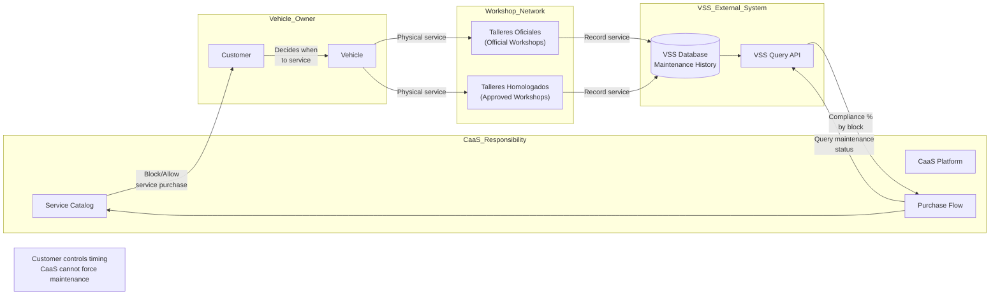

**Critical Constraint:** CaaS has **read-only access** to VSS. CaaS cannot write maintenance records or modify data. All maintenance records originate from workshops.

**Sources:** [pasame las preguntas y sus respuestas a markdown.md:60-65]()

---

### Communication Pattern: Synchronous Query

VSS integration uses a pull-based, synchronous query pattern:

1. Customer attempts to purchase a maintenance-dependent service
2. CaaS queries VSS API for current maintenance status
3. VSS returns compliance percentage by functional blocks
4. CaaS applies business rules to allow/deny purchase

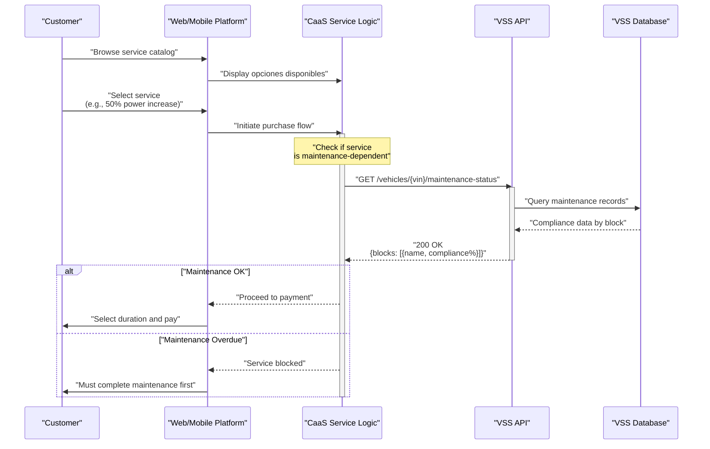

**Sources:** [pasame las preguntas y sus respuestas a markdown.md:60-73](), [enunciado.md:22-23]()

---

### Maintenance Compliance Structure

VSS organizes maintenance by **functional blocks** corresponding to vehicle systems:

| Functional Block | Examples | Typical Services Dependent On This Block |
|-----------------|----------|----------------------------------------|
| Powertrain | Engine, transmission service | Power increase, performance modes |
| Suspension & Steering | Alignment, shock absorbers | Off-road modes, sport handling |
| Brakes | Brake pad replacement, fluid | Performance braking modes |
| Electronics | Software updates, diagnostics | ADAS features, autonomous driving |
| Climate Control | A/C service, refrigerant | Advanced climatization |
| Drivetrain | Differential, 4WD components | All-wheel drive modes |

**Compliance Calculation:**
- Each block has a compliance percentage (0-100%)
- Based on whether scheduled maintenance was completed on time
- CaaS defines threshold (e.g., >80% compliance required) per service

**Sources:** [pasame las preguntas y sus respuestas a markdown.md:62-64]()

---

### Maintenance-Linked Service Rules

**Business Rules Enforced by CaaS:**

1. **Service Gating:** Some services require maintenance compliance to be purchased
2. **Warranty Protection:** Insufficient maintenance voids warranty, but CaaS blocks risky service activations
3. **Safety Priority:** Maintenance requirements ensure vehicle safety before enabling performance features
4. **No Retroactive Blocking:** Services already paid for and activated cannot be disabled due to missed maintenance

**Important Constraint:** CaaS **cannot force the customer** to complete maintenance. The customer decides when to service the vehicle. CaaS can only:
- Deny purchase of new maintenance-dependent services
- Display warnings about warranty status
- Preserve existing active services

**What CaaS Cannot Do:**
- Disable the plataforma base
- Remotely disable the vehicle
- Deactivate already-purchased services
- Force the vehicle to a workshop

**Sources:** [pasame las preguntas y sus respuestas a markdown.md:66-71]()

---

### VSS API Query Pattern

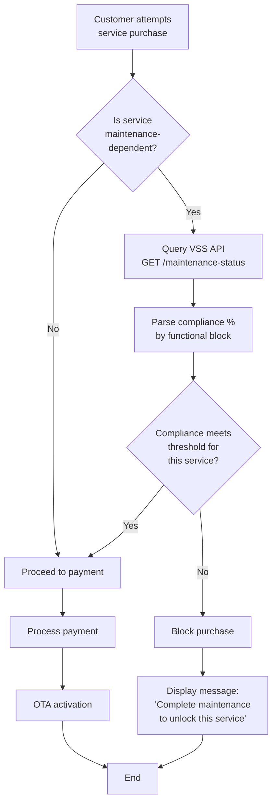

**Sources:** [enunciado.md:22-23](), [pasame las preguntas y sus respuestas a markdown.md:66-73]()

---

## Vehicle Communication (IoT and OTA)

### Purpose

The vehicle communication system enables CaaS to remotely configure and activate optional services on customer vehicles via Over-The-Air (OTA) updates. This integration is fundamental to the Car as a Service business model, allowing instant service delivery without requiring physical workshop visits.

**Sources:** [enunciado.md:7-8](), [pasame las preguntas y sus respuestas a markdown.md:31-56]()

---

### API IoT: Existing System Constraint

**Critical Constraint:** The **API IoT** is a pre-existing, documented, and tested system that CaaS **must use as-is**. This is a hard architectural constraint.

**API IoT Characteristics:**
- **Pre-existing:** Already deployed and operational
- **Documented:** Complete technical documentation available
- **Tested:** Proven in production environment
- **Restriction:** Cannot be modified for this project
- **Integration issues:** Charged to the previous project (not CaaS responsibility)
- **Prepared for CaaS:** Designed with CaaS use cases in mind but not yet in active use

**Sources:** [pasame las preguntas y sus respuestas a markdown.md:33-38]()

---

### Vehicle Communication Architecture

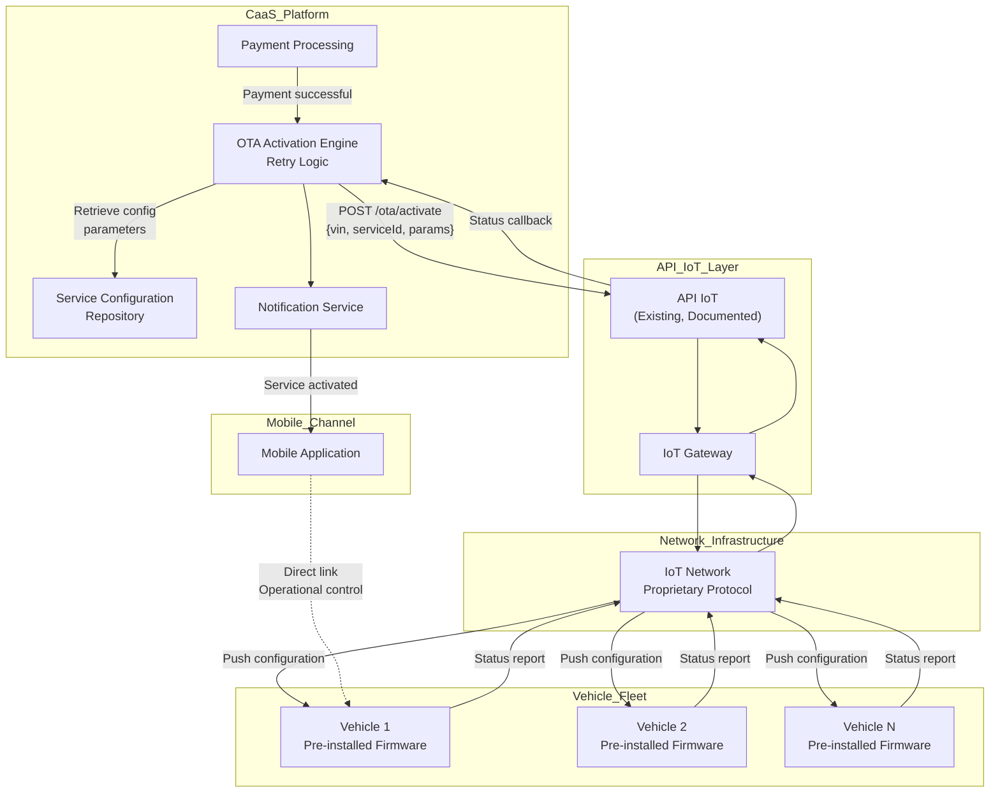

**Sources:** [enunciado.md:7-8](), [pasame las preguntas y sus respuestas a markdown.md:33-38]()

---

### Pre-installed Firmware Model

**Architecture:** All optional services are **pre-installed** in vehicle firmware at manufacturing time. CaaS only activates or deactivates existing functionality.

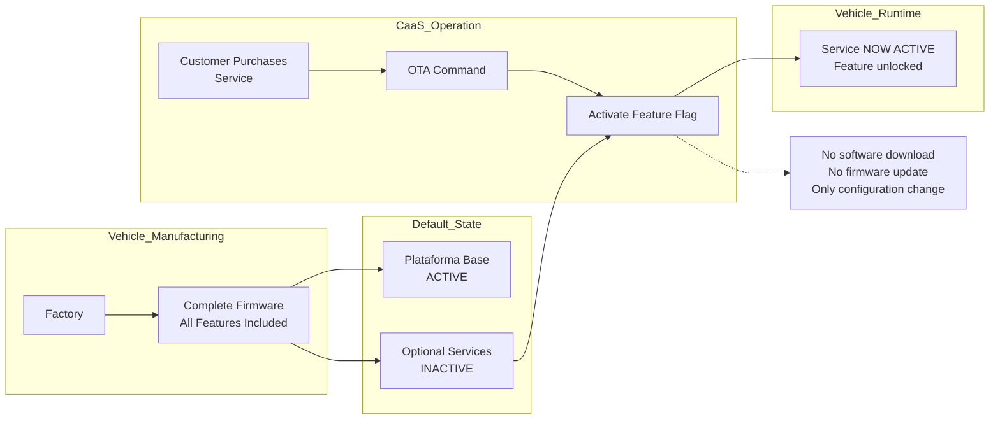

**Key Implications:**
- **No software downloads:** Service activation is instantaneous configuration change
- **No firmware updates:** All code already exists in vehicle
- **Feature flags:** Services are controlled by configuration parameters/flags
- **Reversible:** Services can be deactivated by reversing the configuration
- **Independent updates:** Vehicle software updates (firmware) are separate from CaaS service sales

**Sources:** [pasame las preguntas y sus respuestas a markdown.md:55-56]()

---

### OTA Activation Flow

```mermaid
sequenceDiagram
    participant CUSTOMER as "Customer"
    participant PLATFORM as "Web/Mobile"
    participant PAYMENT as "Payment Service"
    participant OTA as "OTA Engine"
    participant CONFIG as "Config Repo"
    participant API_IOT as "API IoT"
    participant VEHICLE as "Vehicle"
    participant NOTIF as "Notification Service"

    CUSTOMER->>PLATFORM: "Purchase service + duration"
    PLATFORM->>PAYMENT: "Process payment"
    activate PAYMENT
    PAYMENT->>PAYMENT: "Initiate payment"
    PAYMENT-->>PLATFORM: "Payment initiated (async)"
    deactivate PAYMENT
    
    Note over PAYMENT,OTA: "CaaS assumes risk,<br/>delivers immediately"
    
    activate OTA
    PLATFORM->>OTA: "Trigger activation"
    OTA->>CONFIG: "GET /services/{serviceId}/config"
    CONFIG-->>OTA: "Configuration parameters"
    
    OTA->>API_IOT: "POST /ota/activate<br/>{vin, serviceId, config, duration}"
    activate API_IOT
    API_IOT->>VEHICLE: "Push configuration via IoT"
    activate VEHICLE
    VEHICLE->>VEHICLE: "Apply configuration"
    
    alt "Activation Successful"
        VEHICLE-->>API_IOT: "Status: ACTIVATED"
        API_IOT-->>OTA: "Callback: Success"
        deactivate VEHICLE
        deactivate API_IOT
        OTA->>NOTIF: "Send success notification"
        NOTIF->>CUSTOMER: "Email + Push:<br/>Service active"
        NOTIF->>VEHICLE: "Display in vehicle UI"
    else "Activation Failed"
        VEHICLE-->>API_IOT: "Status: FAILED"
        API_IOT-->>OTA: "Callback: Failure"
        deactivate VEHICLE
        deactivate API_IOT
        OTA->>OTA: "Retry logic (see section below)"
    end
    deactivate OTA
```

**Sources:** [enunciado.md:18-19](), [pasame las preguntas y sus respuestas a markdown.md:46-56]()

---

### OTA Retry Logic and Failure Handling

**Critical Business Rule:** If OTA activation fails after all retries, the customer **must not be charged** for the undelivered service.

```mermaid
stateDiagram-v2
    [*] --> PAYMENT_SUCCESSFUL: "Payment initiated"
    
    PAYMENT_SUCCESSFUL --> OTA_QUEUE: "Queue activation request"
    OTA_QUEUE --> OTA_ATTEMPT_1: "First attempt"
    
    OTA_ATTEMPT_1 --> ACTIVATED: "Success"
    OTA_ATTEMPT_1 --> WAIT_RETRY_1: "Failure"
    
    WAIT_RETRY_1 --> OTA_ATTEMPT_2: "Retry delay<br/>(exponential backoff)"
    OTA_ATTEMPT_2 --> ACTIVATED: "Success"
    OTA_ATTEMPT_2 --> WAIT_RETRY_2: "Failure"
    
    WAIT_RETRY_2 --> OTA_ATTEMPT_3: "Retry delay"
    OTA_ATTEMPT_3 --> ACTIVATED: "Success"
    OTA_ATTEMPT_3 --> WAIT_RETRY_3: "Failure"
    
    WAIT_RETRY_3 --> OTA_ATTEMPT_N: "Final retry"
    OTA_ATTEMPT_N --> ACTIVATED: "Success"
    OTA_ATTEMPT_N --> ALL_RETRIES_FAILED: "Final failure"
    
    ALL_RETRIES_FAILED --> GET_VEHICLE_STATUS: "Query vehicle state<br/>proactively"
    GET_VEHICLE_STATUS --> SEND_TO_TECH_SUPPORT: "Create support ticket"
    
    SEND_TO_TECH_SUPPORT --> REFUND_CUSTOMER: "Process refund"
    SEND_TO_TECH_SUPPORT --> NOTIFY_CUSTOMER: "Email + push notification"
    
    REFUND_CUSTOMER --> [*]: "DO NOT CHARGE"
    NOTIFY_CUSTOMER --> [*]: "Customer informed"
    
    ACTIVATED --> NOTIFY_SUCCESS: "Send notifications"
    NOTIFY_SUCCESS --> [*]: "Process complete"
    
    note right of REFUND_CUSTOMER: "Critical: Customer never<br/>pays for undelivered service"
```

**Retry Strategy Parameters:**
- **Number of retries:** Configurable (e.g., 3-5 attempts)
- **Backoff strategy:** Exponential (e.g., 1min, 5min, 15min, 30min)
- **Timeout per attempt:** 60 seconds
- **Vehicle status query:** After final failure, proactively query vehicle state
- **Technical support escalation:** Create automatic support ticket with vehicle diagnostics

**Sources:** [pasame las preguntas y sus respuestas a markdown.md:48-53]()

---

### API IoT Interface Specification

#### Activation Command

**Endpoint:** `POST /ota/activate`

**Request Parameters:**
```
{
  "vin": "Vehicle Identification Number",
  "serviceId": "Unique service identifier",
  "configuration": {
    "featureFlags": ["flag1", "flag2"],
    "parameters": {
      "param1": "value1",
      "param2": "value2"
    }
  },
  "duration": {
    "type": "TEMPORARY | PERMANENT | SUBSCRIPTION",
    "expiryDate": "ISO-8601 timestamp (if temporary)",
    "autoRenewal": "boolean (if subscription)"
  }
}
```

**Response:**
```
{
  "requestId": "Unique activation request ID",
  "status": "QUEUED | IN_PROGRESS | COMPLETED | FAILED",
  "timestamp": "ISO-8601"
}
```

**Callback Notification (Async):**
```
POST /caas/webhooks/ota-status
{
  "requestId": "Original request ID",
  "vin": "Vehicle ID",
  "status": "ACTIVATED | FAILED",
  "errorCode": "Error code if failed",
  "timestamp": "Completion timestamp"
}
```

**Sources:** [enunciado.md:18-19](), [pasame las preguntas y sus respuestas a markdown.md:46-56]()

---

#### Vehicle Status Query

**Endpoint:** `GET /vehicles/{vin}/status`

**Purpose:** Proactive status query when OTA activation fails

**Response:**
```
{
  "vin": "Vehicle ID",
  "connectivity": "ONLINE | OFFLINE | LIMITED",
  "lastSeen": "ISO-8601 timestamp",
  "activeServices": [
    {
      "serviceId": "Service identifier",
      "activationDate": "ISO-8601",
      "status": "ACTIVE | PENDING | ERROR"
    }
  ],
  "diagnostics": {
    "errorCodes": ["code1", "code2"],
    "firmwareVersion": "Version string",
    "networkSignalStrength": "0-100"
  }
}
```

**Sources:** [pasame las preguntas y sus respuestas a markdown.md:48-53]()

---

### IoT Network Characteristics

**Connectivity Model:**
- **Unidirectional initially:** Vehicles report position
- **Bidirectional for CaaS:** API IoT enables command and status
- **Always-on connectivity:** Vehicles maintain persistent connection to IoT network
- **Proprietary protocol:** Uses manufacturer's proprietary IoT protocol

**Network Infrastructure:**
- Owned and operated by manufacturer (same company as CaaS)
- Global coverage required for international vehicle operations
- Redundancy and failover for high availability
- Security: Encrypted communication, authenticated commands

**Sources:** [enunciado.md:7](), [pasame las preguntas y sus respuestas a markdown.md:33-38]()

---

### Mobile Application Direct Vehicle Link

**Dual Communication Paths:**

1. **Through CaaS Platform:** Service purchases, account management, expediente access
2. **Direct to Vehicle:** Operational control (lock/unlock, climate pre-conditioning, location tracking)

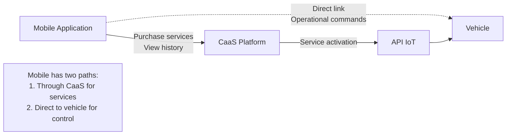

**Direct Link Functions:**
- Vehicle lock/unlock
- Climate control pre-conditioning
- Real-time location tracking
- Battery status (if electric)
- Remote horn/lights activation
- Security alerts

These functions are **not routed through CaaS** as they require low-latency, real-time interaction.

**Sources:** [enunciado.md:17]()

---

## Payment Gateway Integration

### Purpose

The Payment Gateway integration enables CaaS to process all financial transactions including vehicle purchase payments (reservation and final) and service payments (one-time and subscription). The integration follows an asynchronous settlement pattern where CaaS assumes financial risk to optimize customer experience.

**Sources:** [pasame las preguntas y sus respuestas a markdown.md:75-83]()

---

### Payment Types

| Payment Type | Timing | Amount | Purpose | Settlement Pattern |
|-------------|--------|--------|---------|-------------------|
| **Reservation Signal** | At vehicle purchase | Partial (señal) | Reserve production slot | Synchronous confirmation |
| **Final Payment** | Vehicle ready | Remaining balance | Complete purchase, enable registration | Synchronous, blocking |
| **Service Payment (One-time)** | At service purchase | Full service price | Activate temporary/permanent service | Async, deliver immediately |
| **Subscription Billing** | Month end | Usage-based | Charge for consumed month | Async, post-paid (mes vencido) |

**Sources:** [pasame las preguntas y sus respuestas a markdown.md:77-82](), [enunciado.md:13-19]()

---

### Asynchronous Settlement and Risk Assumption

**Business Decision:** CaaS delivers services **immediately** upon payment initiation, before bank settlement confirmation, to optimize customer experience.

```mermaid
sequenceDiagram
    participant CUSTOMER as "Customer"
    participant CAAS as "CaaS Platform"
    participant PAYMENT_GW as "Payment Gateway"
    participant BANK as "Bank"
    participant OTA as "OTA Engine"

    CUSTOMER->>CAAS: "Purchase service"
    CAAS->>PAYMENT_GW: "Initiate payment"
    activate PAYMENT_GW
    PAYMENT_GW->>BANK: "Authorize transaction"
    BANK-->>PAYMENT_GW: "Authorization OK"
    PAYMENT_GW-->>CAAS: "Payment initiated"
    deactivate PAYMENT_GW
    
    Note over CAAS,OTA: "CaaS assumes risk,<br/>delivers immediately"
    
    CAAS->>OTA: "Activate service NOW"
    OTA->>CUSTOMER: "Service delivered"
    
    Note over PAYMENT_GW,BANK: "Settlement delay<br/>(hours to days)"
    
    PAYMENT_GW->>BANK: "Settlement request"
    activate BANK
    BANK->>BANK: "Process settlement"
    
    alt "Settlement Successful"
        BANK-->>PAYMENT_GW: "Funds transferred"
        deactivate BANK
        PAYMENT_GW->>CAAS: "Webhook: Settlement confirmed"
        CAAS->>CAAS: "Mark payment complete"
    else "Settlement Failed"
        BANK-->>PAYMENT_GW: "Settlement failed"
        deactivate BANK
        PAYMENT_GW->>CAAS: "Webhook: Settlement failed"
        CAAS->>CAAS: "Handle failed settlement"
        Note over CAAS: "Service already delivered<br/>Collection process required"
    end
```

**Risk Implications:**
- **Chargebacks:** Customer may dispute transaction after service delivered
- **Insufficient funds:** Payment authorization may succeed but settlement fails
- **Card expiry:** Subscription renewals may fail if card expired
- **Collection required:** Need processes for recovering failed settlements

**Sources:** [pasame las preguntas y sus respuestas a markdown.md:77-82]()

---

### Final Payment: Synchronous and Blocking

**Exception to Async Pattern:** The final vehicle payment is synchronous and blocks vehicle registration.

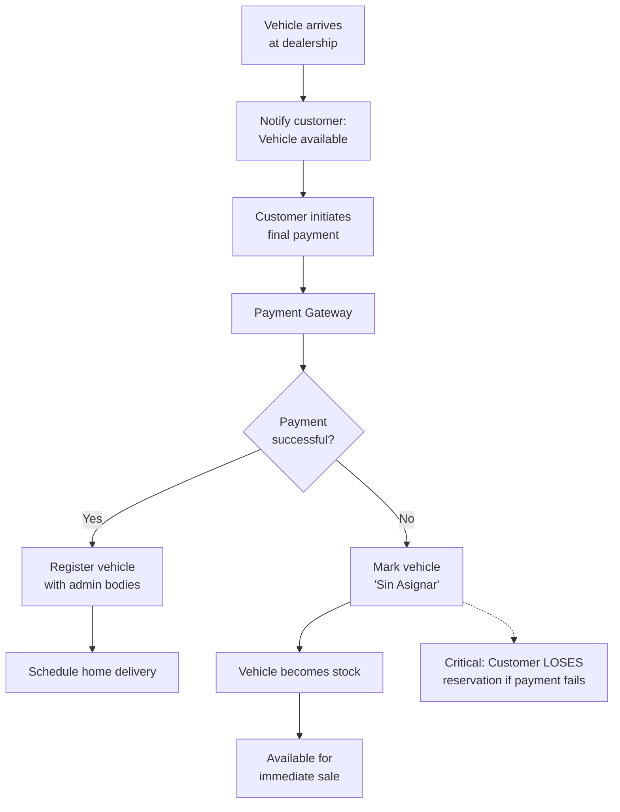

**Business Rule:** If final payment fails, the customer **loses the vehicle reservation entirely**. The vehicle is immediately marked as unassigned and becomes available stock for sale.

**Sources:** [pasame las preguntas y sus respuestas a markdown.md:26-27]()

---

### Subscription Billing: Mes Vencido (Post-Paid)

**Billing Model:** Subscriptions are charged at **month end** for services consumed during that month (post-paid).

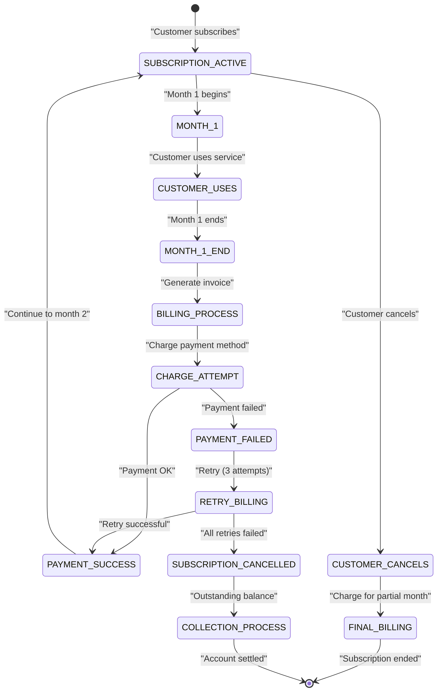

**Billing Cycle:**
1. **Activation:** Subscription starts immediately upon purchase
2. **Usage period:** Customer uses service throughout the month
3. **Month end:** System generates invoice for consumed services
4. **Charging:** Attempt to charge stored payment method
5. **Retry logic:** Up to 3 attempts with exponential backoff
6. **Cancellation:** If payment fails after retries, cancel subscription

**Sources:** [pasame las preguntas y sus respuestas a markdown.md:82]()

---

### Payment Gateway API Patterns

#### Payment Initiation

**Endpoint:** `POST /payments/initiate`

**Request:**
```
{
  "paymentType": "RESERVATION | FINAL | SERVICE | SUBSCRIPTION",
  "amount": {
    "value": "Decimal amount",
    "currency": "EUR | USD | GBP"
  },
  "paymentMethod": {
    "type": "CARD | BANK_TRANSFER",
    "token": "Stored payment method token"
  },
  "metadata": {
    "customerId": "Customer identifier",
    "orderId": "Associated order/service ID",
    "description": "Human-readable description"
  }
}
```

**Response:**
```
{
  "paymentId": "Unique payment ID",
  "status": "INITIATED | AUTHORIZED | PROCESSING",
  "timestamp": "ISO-8601"
}
```

---

#### Settlement Notification (Webhook)

**Endpoint:** `POST /caas/webhooks/payment-settlement` (CaaS implements)

**Payload:**
```
{
  "paymentId": "Original payment ID",
  "status": "SETTLED | FAILED",
  "settlementAmount": "Actual settled amount",
  "settlementDate": "ISO-8601 timestamp",
  "failureReason": "Reason if failed",
  "metadata": {
    "bankTransactionId": "Bank reference",
    "fees": "Processing fees deducted"
  }
}
```

**CaaS Response:** `200 OK` (acknowledged)

**Sources:** [pasame las preguntas y sus respuestas a markdown.md:77-82]()

---

### Refund Processing

**Refund Scenarios:**
1. **Desistimiento (Right of Withdrawal):** Customer cancels within legal window
2. **OTA Activation Failure:** Service could not be delivered
3. **Final Payment Failure Reversal:** Edge case for reservation signal refund

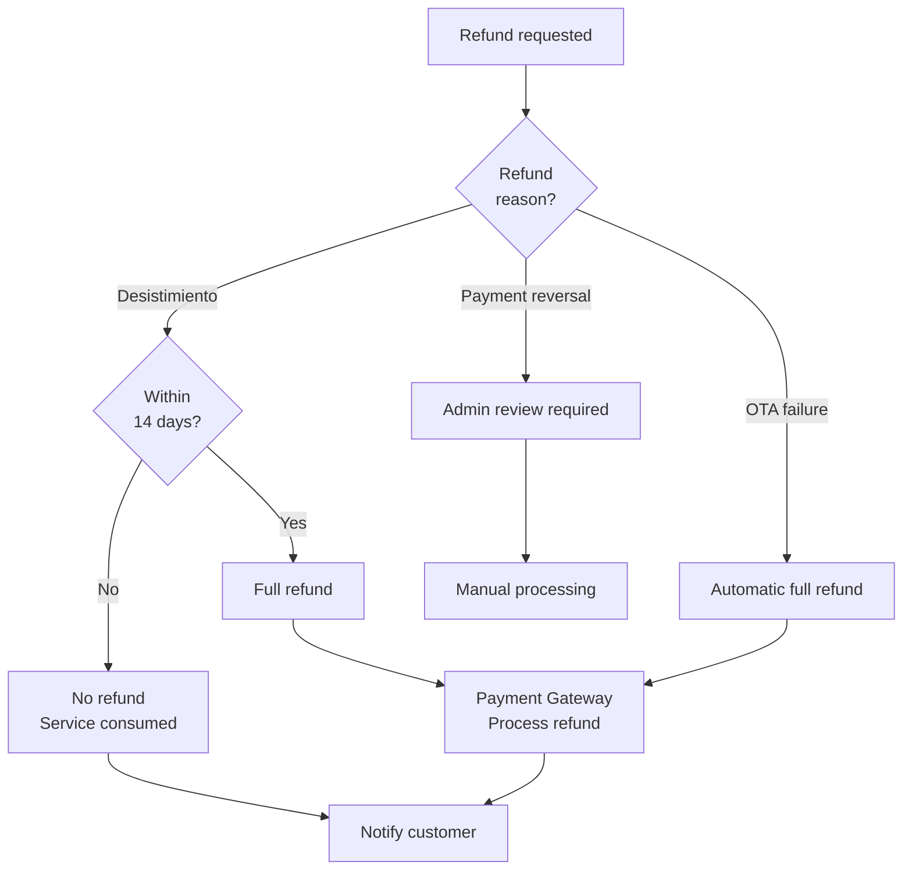

**Refund API:** `POST /payments/{paymentId}/refund`

**Sources:** [pasame las preguntas y sus respuestas a markdown.md:84-96]()

---

## Administrative Registration Integration

### Purpose

The Administrative Registration Integration enables CaaS to register vehicles with government administrative bodies in each country where CaaS operates. This is a legally required step before vehicle delivery and occurs after the final payment is completed.

**Sources:** [enunciado.md:15-16]()

---

### Country-Specific Implementations

**Key Characteristic:** Registration requirements vary significantly by country, requiring country-specific integration implementations.

| Country | Administrative Body | Integration Method | Required Documents | Processing Time |
|---------|-------------------|-------------------|-------------------|-----------------|
| **Spain** | Dirección General de Tráfico (DGT) | API synchronous | Purchase contract, technical specs | 2-5 business days |
| **France** | Agence Nationale des Titres Sécurisés (ANTS) | API synchronous | Certificat de conformité, proof of purchase | 3-7 business days |
| **Germany** | Kraftfahrt-Bundesamt (KBA) | Semi-automated | Fahrzeugbrief, insurance proof | 1-3 business days |
| **UK** | Driver and Vehicle Licensing Agency (DVLA) | API asynchronous | V5C application, insurance | 5-10 business days |
| **Other EU** | Various national authorities | Mixed (API or manual) | Country-specific | Varies |

**Note:** The table above is illustrative. Actual country implementations require detailed analysis of each jurisdiction's requirements.

**Sources:** [enunciado.md:15-16]()

---

### Registration Workflow

```mermaid
sequenceDiagram
    participant CUSTOMER as "Customer"
    participant CAAS as "CaaS Platform"
    participant PAYMENT as "Payment Service"
    participant REGISTRATION as "Registration Module"
    participant ADMIN_API as "Admin Body API"
    participant GOVT as "Government System"

    Note over CUSTOMER,GOVT: Vehicle arrives at dealership
    
    CUSTOMER->>CAAS: "Complete final payment"
    CAAS->>PAYMENT: "Process payment"
    activate PAYMENT
    PAYMENT-->>CAAS: "Payment successful"
    deactivate PAYMENT
    
    CAAS->>REGISTRATION: "Initiate registration"
    activate REGISTRATION
    
    REGISTRATION->>REGISTRATION: "Prepare documents<br/>per country"
    REGISTRATION->>REGISTRATION: "Validate customer data"
    
    REGISTRATION->>ADMIN_API: "Submit registration<br/>{vin, owner, address}"
    activate ADMIN_API
    ADMIN_API->>GOVT: "Process registration"
    activate GOVT
    
    alt "Registration Successful"
        GOVT-->>ADMIN_API: "Registration confirmed<br/>License plate assigned"
        deactivate GOVT
        ADMIN_API-->>REGISTRATION: "200 OK<br/>{plateNumber, registrationDate}"
        deactivate ADMIN_API
        REGISTRATION->>CAAS: "Registration complete"
        deactivate REGISTRATION
        CAAS->>CUSTOMER: "Vehicle registered<br/>Ready for delivery"
    else "Registration Failed"
        GOVT-->>ADMIN_API: "Registration rejected<br/>Reason"
        deactivate GOVT
        ADMIN_API-->>REGISTRATION: "400/500 Error"
        deactivate ADMIN_API
        REGISTRATION->>CAAS: "Registration failed"
        deactivate REGISTRATION
        CAAS->>CUSTOMER: "Issue with registration<br/>Dealership will contact"
    end
```

**Sources:** [enunciado.md:15-16]()

---

### Registration Data Requirements

**Common Data Elements Across Countries:**

```
{
  "vehicle": {
    "vin": "17-character VIN",
    "make": "Manufacturer name",
    "model": "Model designation",
    "year": "Manufacturing year",
    "engineType": "PETROL | DIESEL | ELECTRIC | HYBRID",
    "emissions": "CO2 g/km",
    "power": "kW and HP",
    "weight": "kg",
    "color": "Exterior color"
  },
  "owner": {
    "type": "INDIVIDUAL | COMPANY",
    "name": "Full legal name",
    "taxId": "Tax identification number",
    "address": {
      "street": "Street address",
      "city": "City",
      "postalCode": "Postal/ZIP code",
      "country": "Country code"
    },
    "dateOfBirth": "If individual",
    "driverLicense": "License number (if required)"
  },
  "purchase": {
    "date": "Purchase date",
    "price": "Purchase price",
    "dealership": "Dealership identifier",
    "invoice": "Invoice reference"
  },
  "insurance": {
    "provider": "Insurance company",
    "policyNumber": "Policy reference",
    "validFrom": "Coverage start date"
  }
}
```

**Sources:** [enunciado.md:15-16]()

---

### Registration Status Tracking

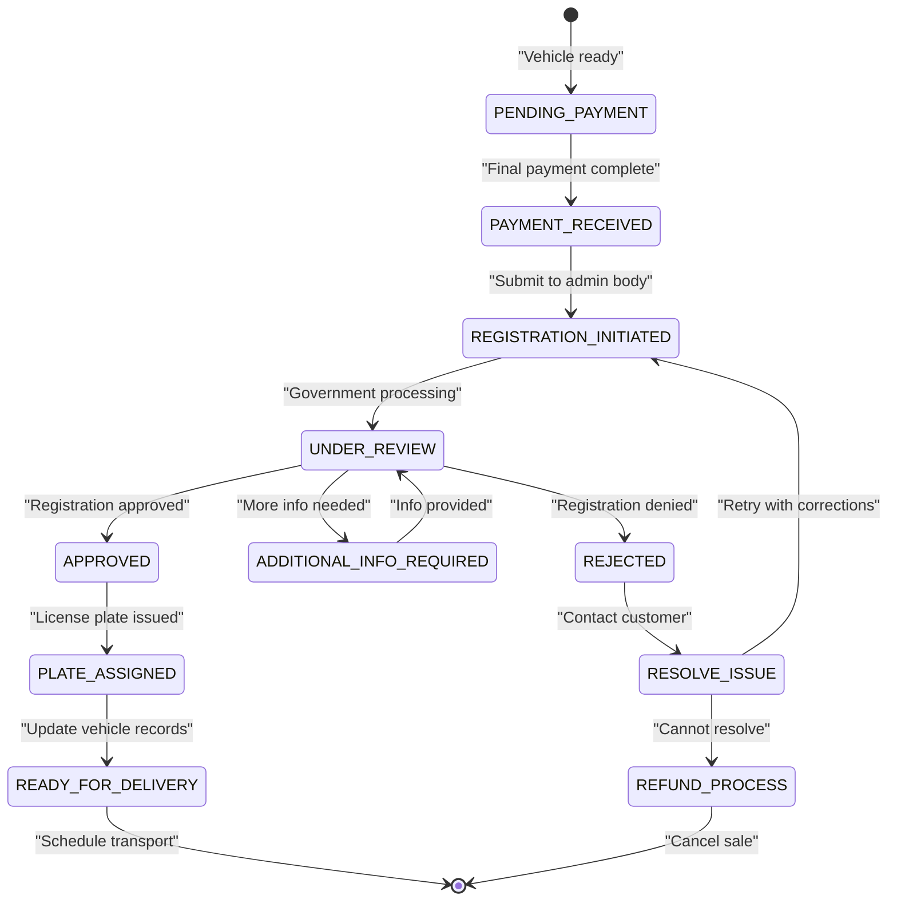

**Sources:** [enunciado.md:15-16]()

---

### Error Handling and Fallback

**Common Registration Issues:**

1. **Missing Documents:** Customer hasn't provided required documentation
2. **Invalid Data:** Data validation failure (e.g., incorrect tax ID format)
3. **System Unavailability:** Government API temporarily down
4. **Policy Changes:** New regulations require additional information

**Fallback Strategy:**
- **Automated retry:** For transient system errors, retry up to 3 times
- **Manual intervention:** For validation errors, escalate to dealership staff
- **Alternative process:** If API unavailable, prepare documents for manual submission
- **Customer notification:** Keep customer informed of status and requirements

**Sources:** [enunciado.md:15-16]()

---

## Integration Summary and Cross-System Dependencies

### Integration Dependency Matrix

| CaaS Function | Factory | VSS | API IoT | Payment Gateway | Admin Bodies |
|--------------|---------|-----|---------|----------------|--------------|
| **Order Vehicle** | Required (sync) | - | - | Required (reservation) | - |
| **Track Manufacturing** | Required (async) | - | - | - | - |
| **Complete Purchase** | - | - | - | Required (final pay) | Required |
| **Purchase Service** | - | Optional (if maint-dependent) | - | Required | - |
| **Activate Service** | - | - | Required | - | - |
| **Subscription Billing** | - | - | - | Required (mes vencido) | - |
| **Maintenance Check** | - | Required | - | - | - |
| **Delivery Tracking** | Partial (shipment) | - | - | - | - |

**Sources:** [enunciado.md:1-23](), [pasame las preguntas y sus respuestas a markdown.md:1-104]()

---

### Integration Failure Impact Analysis

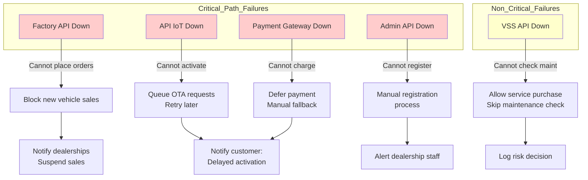

**Sources:** [pasame las preguntas y sus respuestas a markdown.md:1-104]()

---

### System Availability Requirements

| External System | Required Uptime | Acceptable Downtime | Fallback Strategy |
|----------------|----------------|-------------------|------------------|
| **Factory API** | 99.5% | Max 4 hours/month | Queue orders, manual phone orders |
| **API IoT** | 99.9% | Max 43 minutes/month | Queue OTA, retry automatically |
| **Payment Gateway** | 99.95% | Max 22 minutes/month | Manual payment processing |
| **VSS API** | 95% | Flexible | Allow purchases without check, log exception |
| **Admin Bodies** | Varies by country | Dependent on govt systems | Manual submission process |

**Sources:** [pasame las preguntas y sus respuestas a markdown.md:1-104]()

---

This completes the External System Integrations documentation. Each integration has been detailed with its communication patterns, constraints, error handling, and business impact, providing a comprehensive technical reference for developers and architects working with the CaaS platform.