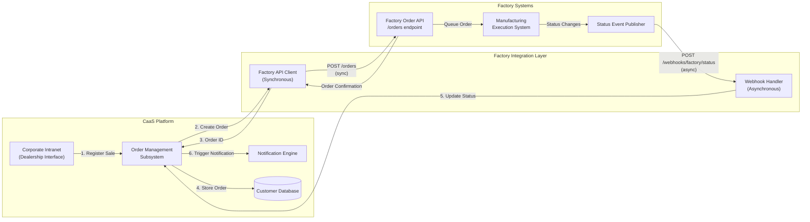
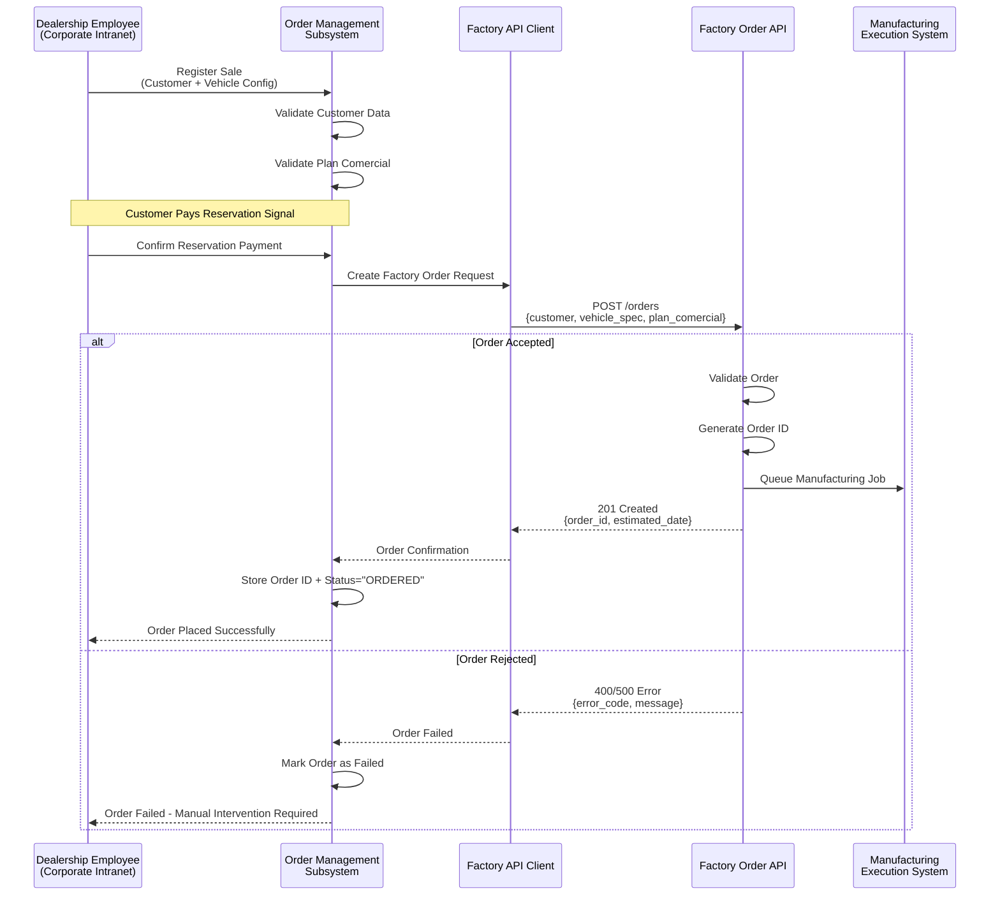
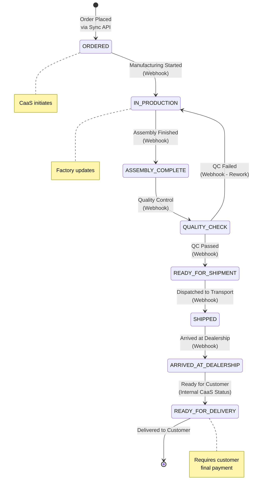
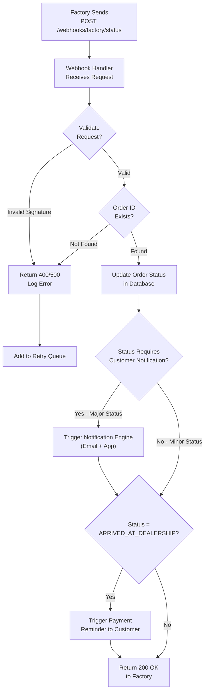
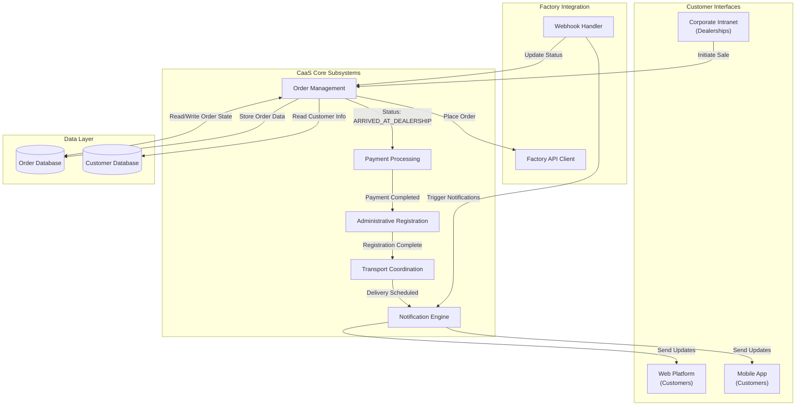
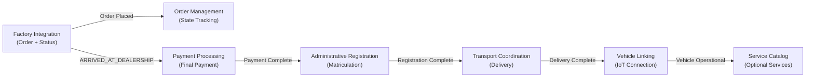

# Factory Integration

<details>
<summary>Relevant source files</summary>

The following files were used as context for generating this wiki page:

- [enunciado.md](enunciado.md)
- [pasame las preguntas y sus respuestas a markdown.md](pasame las preguntas y sus respuestas a markdown.md)

</details>


## Purpose and Scope

This document describes the integration between the CaaS platform and the Factory (manufacturing facility) systems. The Factory Integration enables order placement, manufacturing tracking, and delivery coordination for vehicles purchased through the CaaS platform.

This integration implements a **hybrid communication pattern**: synchronous order placement initiated by CaaS, and asynchronous status notifications sent by the Factory. This page covers the technical architecture, API contracts, data flows, and error handling specific to factory communication.

For information about vehicle delivery after manufacturing, see [Manufacturing and Delivery Workflow](#8.2). For administrative registration of manufactured vehicles, see [Administrative Registration Integration](#5.5). For the overall sales process that triggers factory orders, see [Sales and Order Management](#8.1).

**Sources:** [enunciado.md:13](), [pasame las preguntas y sus respuestas a markdown.md:40-44]()

---

## Integration Architecture

The Factory Integration uses a **hybrid synchronous-asynchronous pattern** that separates concerns between order control and manufacturing progress tracking:

- **Order Placement (CaaS → Factory):** Synchronous, request-response API. CaaS initiates order creation with immediate confirmation.
- **Status Notifications (Factory → CaaS):** Asynchronous, event-driven webhooks. Factory pushes manufacturing status updates as they occur.

This architectural pattern provides CaaS with transactional control over order placement while allowing the Factory to manage its manufacturing timeline independently. The asynchronous status updates enable non-blocking progress tracking without requiring CaaS to poll the Factory systems.



**Diagram: Factory Integration Architecture and Data Flow**

**Key Architectural Characteristics:**

| Aspect | Order Placement | Status Notifications |
|--------|----------------|---------------------|
| **Initiator** | CaaS Platform | Factory Systems |
| **Pattern** | Synchronous (Request-Response) | Asynchronous (Event-Driven) |
| **Transport** | HTTP REST API | Webhooks (HTTP POST) |
| **Timing** | Immediate (blocking) | Variable (as events occur) |
| **Error Handling** | Retry with backoff | Webhook retry + reconciliation |
| **Data Direction** | CaaS → Factory | Factory → CaaS |

**Sources:** [pasame las preguntas y sus respuestas a markdown.md:40-44](), [enunciado.md:13]()

---

## Order Placement (Synchronous)

### Order Creation Workflow

When a dealership employee registers a vehicle sale and the customer pays the reservation deposit, CaaS automatically initiates an order with the Factory through a synchronous API call. This occurs without manual intervention to ensure immediate manufacturing queue placement.



**Diagram: Order Placement Sequence (Synchronous)**

### Order Request Payload

The order request sent from CaaS to the Factory includes:

| Field | Description | Source |
|-------|-------------|--------|
| `customer_id` | CaaS customer identifier | Customer registration in Corporate Intranet |
| `vehicle_specification` | Base platform + initial opciones disponibles | Plan comercial selected during sale |
| `dealership_id` | Originating dealership | Logged-in employee's dealership |
| `delivery_address` | Customer's delivery address | Customer profile |
| `plan_comercial_details` | Commercial plan specifics (warranty, maintenance) | Sales package configuration |

The Factory API returns:

| Field | Description |
|-------|-------------|
| `order_id` | Unique factory order identifier |
| `estimated_delivery_date` | Factory's manufacturing timeline estimate |
| `manufacturing_location` | Factory facility assigned to this order |
| `order_status` | Initial status (typically `ORDERED` or `QUEUED`) |

**Important Business Rule:** The Factory determines the delivery date based on its own production scheduling. CaaS cannot specify or negotiate delivery dates; it must accept the Factory's timeline.

**Sources:** [enunciado.md:13](), [pasame las preguntas y sus respuestas a markdown.md:22-23]()

### Error Handling and Retries

Since order placement is a critical operation, the Factory API Client implements retry logic with exponential backoff for transient failures:

| Error Type | HTTP Status | Retry Strategy | Fallback |
|------------|-------------|----------------|----------|
| Network timeout | N/A | Retry 3 times, exponential backoff | Manual order placement by technical support |
| Server error | 500, 502, 503 | Retry 5 times, exponential backoff | Queue for manual review |
| Validation error | 400 | No retry - log and alert | Fix data and resubmit manually |
| Authorization error | 401, 403 | No retry - critical alert | Escalate to integration team |

Orders that fail all automatic retries are flagged in the Order Management Subsystem for manual intervention. The dealership employee receives notification of the failure, and the customer's reservation remains valid pending resolution.

**Sources:** [pasame las preguntas y sus respuestas a markdown.md:40-44]()

---

## Manufacturing Status Notifications (Asynchronous)

### Status Update Events

Once the Factory accepts an order, it begins manufacturing and sends status update notifications to CaaS as the vehicle progresses through various manufacturing stages. These notifications are sent asynchronously via webhooks to a dedicated endpoint in the CaaS platform.



**Diagram: Manufacturing Status State Machine**

### Webhook Notification Format

The Factory sends webhook notifications to CaaS using HTTP POST to the endpoint `/webhooks/factory/status`. Each notification includes:

| Field | Description | Example Values |
|-------|-------------|----------------|
| `order_id` | Factory order identifier | `"FAC-2024-001234"` |
| `status` | Current manufacturing status | `"IN_PRODUCTION"`, `"SHIPPED"`, etc. |
| `timestamp` | Event occurrence time (ISO 8601) | `"2024-01-15T10:30:00Z"` |
| `estimated_completion_date` | Updated delivery estimate (optional) | `"2024-02-01"` |
| `notes` | Human-readable status details | `"Vehicle passed quality control"` |
| `location` | Current physical location (optional) | `"Factory Barcelona"`, `"In Transit"` |

### Webhook Handler Implementation

The CaaS Webhook Handler receives Factory status notifications and processes them:



**Diagram: Webhook Processing Flow**

**Key Processing Rules:**

1. **Authentication:** Webhook requests must include a signature in the `X-Factory-Signature` header using HMAC-SHA256 with a shared secret.

2. **Idempotency:** The handler checks for duplicate notifications based on `order_id` and `timestamp`. Duplicate notifications are acknowledged with 200 OK but do not update the database.

3. **Customer Notifications:** Major status changes trigger automatic customer notifications:
   - `IN_PRODUCTION` → "Your vehicle manufacturing has started"
   - `READY_FOR_SHIPMENT` → "Your vehicle is ready and will ship soon"
   - `ARRIVED_AT_DEALERSHIP` → "Your vehicle has arrived - please complete payment"

4. **Payment Triggering:** When status reaches `ARRIVED_AT_DEALERSHIP`, the system triggers a payment reminder to the customer. The vehicle cannot be registered until final payment is completed.

**Sources:** [enunciado.md:13-16](), [pasame las preguntas y sus respuestas a markdown.md:28-29]()

### Webhook Reliability and Reconciliation

To ensure reliability of asynchronous status updates:

| Mechanism | Description | Purpose |
|-----------|-------------|---------|
| **Webhook Retries (Factory)** | Factory retries failed webhooks with exponential backoff (5 attempts over 24 hours) | Handle temporary CaaS downtime |
| **Retry Queue (CaaS)** | Failed webhook processing is queued for retry within CaaS | Handle transient database/logic errors |
| **Status Polling (Fallback)** | CaaS polls Factory API for status if no webhook received for >48 hours | Detect missed webhooks |
| **Manual Reconciliation** | Automated daily job compares CaaS order statuses with Factory state | Catch and fix discrepancies |

If webhook delivery fails after all retries, the Factory system alerts its operations team to investigate. CaaS similarly alerts its integration monitoring team if status updates are missing for orders in active manufacturing.

**Sources:** [pasame las preguntas y sus respuestas a markdown.md:40-44]()

---

## Integration Points with CaaS Subsystems

The Factory Integration component interacts with multiple CaaS subsystems to complete the vehicle ordering and delivery workflow:



**Diagram: Factory Integration Dependencies**

### Subsystem Interactions

| Subsystem | Interaction Type | Description |
|-----------|-----------------|-------------|
| **Order Management** | Bidirectional | Factory Integration reads order data and writes status updates |
| **Notification Engine** | Outbound | Triggers customer notifications for manufacturing milestones |
| **Payment Processing** | Sequential | Hands off to payment system when vehicle arrives at dealership |
| **Administrative Registration** | Sequential | Triggers registration after final payment is completed |
| **Transport Coordination** | Sequential | Initiates customer delivery after registration |
| **Corporate Intranet** | Inbound | Receives order creation requests from dealership employees |
| **Customer Databases** | Read | Retrieves customer and vehicle data for order placement |

**Critical Workflow Dependencies:**

1. **Order Placement:** Requires validated customer data from Customer Database and plan comercial details from Order Management.

2. **Status Updates:** Webhook Handler must update Order Management before triggering Notification Engine to maintain data consistency.

3. **Payment Triggering:** Status `ARRIVED_AT_DEALERSHIP` must be reached before Payment Processing can request final payment from customer.

4. **Registration Blocking:** Administrative Registration cannot proceed until Payment Processing confirms completed payment.

**Sources:** [enunciado.md:13-17](), [pasame las preguntas y sus respuestas a markdown.md:18-29]()

---

## API Contract Reference

### Factory Order API Specification

The Factory provides a REST API for order management. CaaS implements a client for this **existing, documented, and tested API**.

**Important Constraint:** The Factory Order API is a pre-existing system that CaaS must integrate with. CaaS cannot modify the API specification; it can only consume it. Any integration issues or requirements must be addressed within the CaaS implementation.

#### Order Placement Endpoint

```
POST /api/v1/orders
Content-Type: application/json
Authorization: Bearer {api_token}

Request Body:
{
  "customer_id": "CAAS-CUST-123456",
  "vehicle_specification": {
    "platform_base": "SUV_ELECTRIC_2024",
    "initial_options": ["POWER_BOOST_50", "ADAS_LEVEL_2"],
    "color": "MIDNIGHT_BLUE",
    "interior": "PREMIUM_LEATHER"
  },
  "dealership_id": "DEALER-ES-001",
  "delivery_address": {
    "street": "Calle Principal 123",
    "city": "Madrid",
    "postal_code": "28001",
    "country": "ES"
  },
  "plan_comercial": {
    "maintenance_included": true,
    "warranty_years": 5,
    "opciones_permanentes": ["POWER_BOOST_50"]
  }
}

Response (201 Created):
{
  "order_id": "FAC-2024-001234",
  "status": "ORDERED",
  "estimated_delivery_date": "2024-02-15",
  "manufacturing_location": "Barcelona Factory",
  "created_at": "2024-01-10T14:30:00Z"
}

Response (400 Bad Request):
{
  "error_code": "INVALID_SPECIFICATION",
  "message": "Unknown option code: INVALID_OPTION",
  "field": "vehicle_specification.initial_options[1]"
}
```

#### Status Query Endpoint (Polling Fallback)

```
GET /api/v1/orders/{order_id}/status
Authorization: Bearer {api_token}

Response (200 OK):
{
  "order_id": "FAC-2024-001234",
  "status": "IN_PRODUCTION",
  "status_history": [
    {
      "status": "ORDERED",
      "timestamp": "2024-01-10T14:30:00Z"
    },
    {
      "status": "IN_PRODUCTION",
      "timestamp": "2024-01-12T08:00:00Z"
    }
  ],
  "estimated_delivery_date": "2024-02-15",
  "current_location": "Barcelona Factory - Assembly Line 3"
}
```

**Sources:** [pasame las preguntas y sus respuestas a markdown.md:40-44, 100-104]()

### CaaS Webhook Endpoint Specification

CaaS exposes a webhook endpoint for Factory status notifications. This endpoint is **developed by CaaS** as part of the project.

```
POST /api/v1/webhooks/factory/status
Content-Type: application/json
X-Factory-Signature: {HMAC-SHA256 signature}

Request Body:
{
  "order_id": "FAC-2024-001234",
  "status": "SHIPPED",
  "timestamp": "2024-02-01T10:00:00Z",
  "estimated_completion_date": "2024-02-03",
  "notes": "Dispatched via transport contractor ABC-TRANS-001",
  "location": "In Transit - Madrid Route"
}

Response (200 OK):
{
  "received": true,
  "order_id": "FAC-2024-001234",
  "processed_at": "2024-02-01T10:00:15Z"
}

Response (400 Bad Request):
{
  "error": "Invalid signature",
  "received": false
}

Response (404 Not Found):
{
  "error": "Order not found",
  "order_id": "FAC-2024-001234",
  "received": false
}
```

**Authentication:** The `X-Factory-Signature` header contains an HMAC-SHA256 signature of the request body using a shared secret known to both Factory and CaaS. CaaS validates this signature before processing the webhook.

**Sources:** [pasame las preguntas y sus respuestas a markdown.md:40-44]()

---

## Business Rules and Constraints

The Factory Integration implements several critical business rules:

### Factory Autonomy

| Rule | Rationale | Implementation |
|------|-----------|----------------|
| Factory determines delivery dates | Manufacturing capacity and scheduling are factory-controlled | CaaS accepts `estimated_delivery_date` from Factory without negotiation |
| Factory determines manufacturing location | Geographic optimization and resource availability | CaaS stores but does not influence `manufacturing_location` |
| Factory sets production priorities | Internal factory operations management | CaaS cannot expedite or deprioritize orders |

**Sources:** [pasame las preguntas y sus respuestas a markdown.md:22-23]()

### Order State Constraints

1. **Order Immutability:** Once an order is placed with the Factory, vehicle specifications cannot be changed. Any customer changes to opciones disponibles after order placement only affect the service catalog, not the physical vehicle being manufactured.

2. **Final Payment Requirement:** The vehicle cannot proceed to administrative registration until the customer completes final payment. This occurs when status reaches `ARRIVED_AT_DEALERSHIP`.

3. **Payment Failure Consequences:** If the customer fails to complete final payment, the vehicle is marked as "sin asignar" (unassigned) in the CaaS Order Management system and becomes stock for immediate sale. The customer loses their reservation entirely.

**Sources:** [pasame las preguntas y sus respuestas a markdown.md:26-27](), [enunciado.md:14-16]()

### Status Notification Requirements

The system must provide automatic notifications to customers for manufacturing milestones. This is a core value proposition of the CaaS platform, differentiating it from traditional vehicle purchasing where customers have no visibility into manufacturing progress.

**Notification Triggers:**

- Order placement confirmed
- Manufacturing started
- Manufacturing milestones reached
- Quality control completed
- Vehicle shipped
- Vehicle arrived at dealership (with payment reminder)
- Registration completed
- Delivery scheduled

**Sources:** [pasame las preguntas y sus respuestas a markdown.md:28-29](), [enunciado.md:13]()

---

## Error Handling and Edge Cases

### Factory System Unavailability

If the Factory Order API is unavailable when CaaS attempts to place an order:

1. **Immediate Retry:** 3 attempts with exponential backoff (1s, 2s, 4s)
2. **Persistent Failure:** Queue order for manual placement by technical support team
3. **Customer Communication:** Notify customer of delay via email with expected resolution timeline
4. **Reservation Status:** Keep customer's reservation active; do not cancel or penalize

The Order Management Subsystem maintains order status `PENDING_FACTORY_SUBMISSION` until Factory confirms the order.

### Missed Webhook Notifications

If CaaS does not receive expected webhook notifications:

1. **Detection:** Automated monitoring alerts if no status update received for >48 hours on orders in `ORDERED` or `IN_PRODUCTION` status
2. **Fallback Polling:** CaaS polls Factory status API every 4 hours for affected orders
3. **Reconciliation:** Daily automated job compares all active order statuses between CaaS and Factory
4. **Manual Intervention:** Integration team investigates discrepancies and manually updates order status if needed

### Duplicate Webhook Notifications

The webhook handler implements idempotency checking:

- **Duplicate Detection:** Check database for existing status update with same `order_id`, `status`, and `timestamp`
- **Response:** Return 200 OK without updating database
- **Logging:** Log duplicate detection for monitoring (high duplicate rate indicates Factory retry issues)

### Invalid or Malformed Webhook Data

If webhook payload fails validation:

1. **Response:** Return 400 Bad Request with error details
2. **Logging:** Log full request body and validation errors for investigation
3. **Alerting:** Critical alert to integration team (Factory may have changed webhook format)
4. **Retry Expectation:** Factory should retry; if persistent, manual coordination required

**Sources:** [pasame las preguntas y sus respuestas a markdown.md:40-44]()

---

## Monitoring and Observability

The Factory Integration component provides monitoring metrics and logging for operational visibility:

### Key Metrics

| Metric | Description | Alert Threshold |
|--------|-------------|-----------------|
| `factory_order_success_rate` | Percentage of successful order placements | < 95% |
| `factory_order_latency_p95` | 95th percentile order placement response time | > 5 seconds |
| `webhook_processing_success_rate` | Percentage of successfully processed webhooks | < 99% |
| `webhook_processing_latency_p95` | 95th percentile webhook processing time | > 2 seconds |
| `missed_webhook_count` | Orders missing expected status updates (24h window) | > 0 |
| `order_status_discrepancy_count` | Orders with status mismatch between CaaS and Factory | > 5 |

### Logging Standards

All Factory Integration operations log structured events including:

- `correlation_id`: Unique identifier linking related operations
- `order_id`: Factory order identifier
- `customer_id`: CaaS customer identifier
- `operation`: `order_placement`, `webhook_received`, `status_poll`, etc.
- `status`: `success`, `failure`, `retry`
- `error_details`: Error codes and messages for failures
- `latency_ms`: Operation duration

### Integration Health Dashboard

Operations teams monitor Factory Integration health through dashboards displaying:

- Real-time order placement success rate (last 1 hour, 24 hours, 7 days)
- Webhook delivery success rate and latency distribution
- Active orders by manufacturing status
- Orders with outdated status (no update in >24 hours)
- Failed order placements requiring manual intervention
- Recent error patterns and trends

**Sources:** [pasame las preguntas y sus respuestas a markdown.md:40-44]()

---

## Relationship to Other CaaS Subsystems

The Factory Integration sits at the beginning of the vehicle lifecycle within CaaS, initiating a workflow that spans multiple subsystems:



**Diagram: Factory Integration in Vehicle Lifecycle**

**Workflow Handoffs:**

1. **Factory Integration → Order Management:** Order placement and status tracking
2. **Factory Integration → Payment Processing:** Vehicle arrival triggers final payment request
3. **Payment Processing → Administrative Registration:** Payment completion enables registration
4. **Administrative Registration → Transport Coordination:** Registration enables delivery scheduling
5. **Transport Coordination → Vehicle Linking (IoT):** Delivery enables mobile app pairing
6. **Vehicle Linking → Service Catalog:** Operational vehicle enables optional service purchases

The Factory Integration is responsible for the **first two stages** of this lifecycle: initiating manufacturing and tracking progress until the vehicle arrives at the dealership. Subsequent stages are handled by other subsystems documented in their respective wiki pages.

**Sources:** [enunciado.md:8-19]()

---

## Summary

The Factory Integration component enables CaaS to orchestrate vehicle manufacturing through a hybrid synchronous-asynchronous communication pattern. Key characteristics:

- **Order Placement:** Synchronous API initiated by CaaS when customer pays reservation
- **Status Tracking:** Asynchronous webhooks from Factory to CaaS throughout manufacturing
- **Factory Autonomy:** Factory determines delivery dates and manufacturing priorities
- **Reliability:** Retry logic, fallback polling, and reconciliation ensure data consistency
- **Customer Visibility:** Status updates automatically trigger customer notifications
- **Workflow Integration:** Seamlessly hands off to Payment, Registration, and Delivery subsystems

The integration treats the Factory Order API as a pre-existing, unchangeable constraint that CaaS must adapt to, implementing robust error handling and monitoring to ensure reliable order placement and status tracking.

For the subsequent stages of vehicle delivery and customer activation, see [Manufacturing and Delivery Workflow](#8.2) and [Vehicle Communication (IoT and OTA)](#5.3).

**Sources:** [enunciado.md:8-19](), [pasame las preguntas y sus respuestas a markdown.md:18-44]()