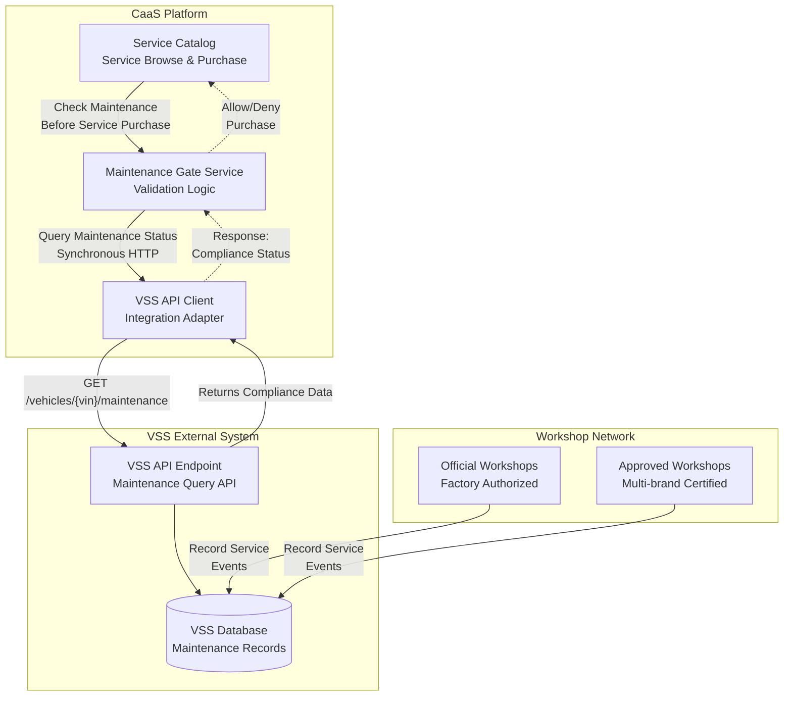
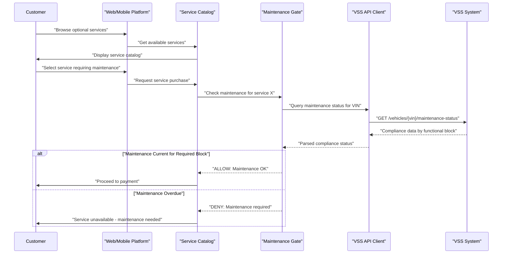
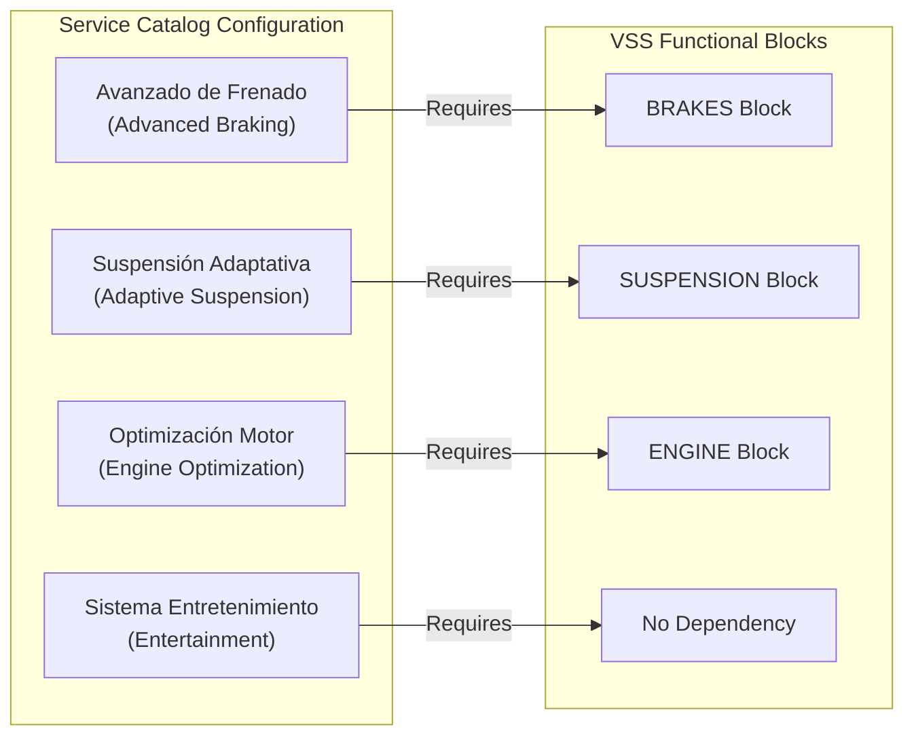
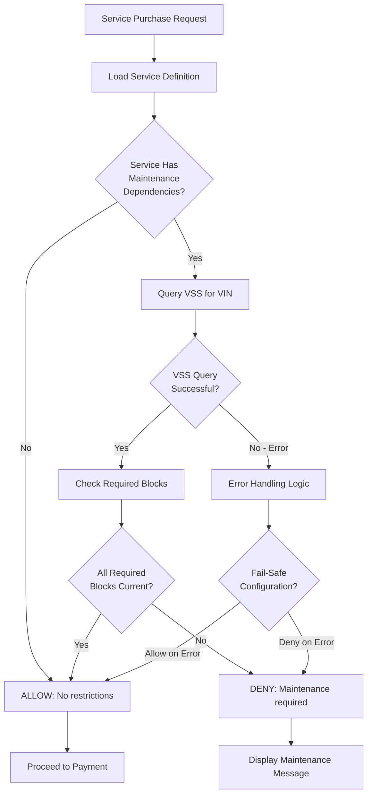
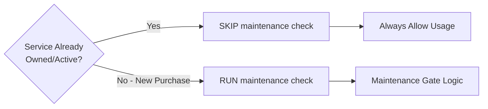
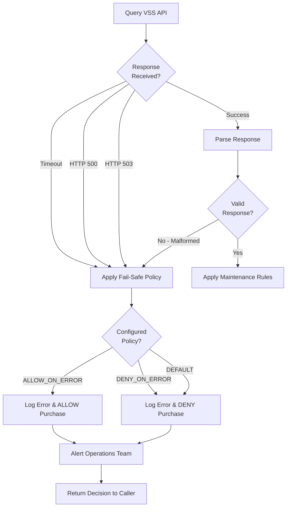
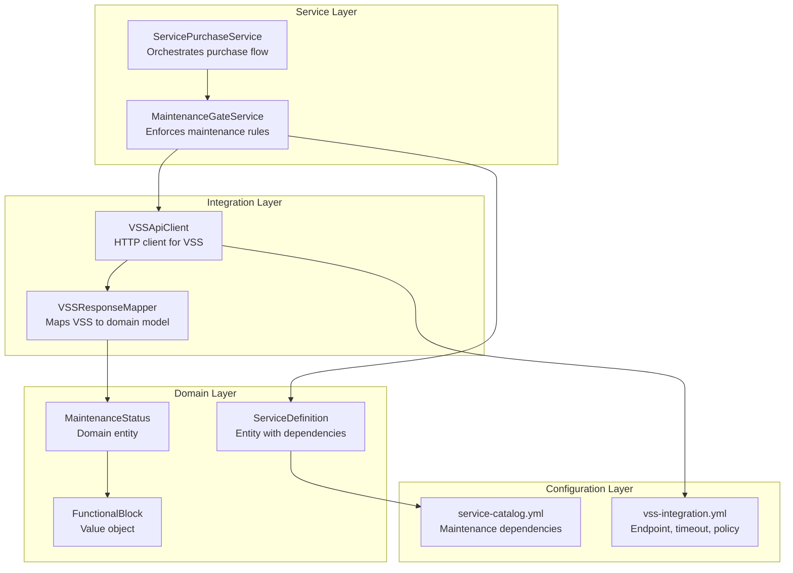

# VSS (Vehicle Service System) Integration

<details>
<summary>Relevant source files</summary>

The following files were used as context for generating this wiki page:

- [pasame las preguntas y sus respuestas a markdown.md](pasame las preguntas y sus respuestas a markdown.md)

</details>


## Purpose and Scope

This document details the technical integration between the CaaS platform and the **VSS (Vehicle Service System)**, an external system maintained by authorized workshops. VSS stores comprehensive vehicle maintenance records including service history, compliance status, and warranty information. CaaS queries VSS to enforce maintenance-dependent service availability rules and ensure customer safety.

This page focuses on the **technical integration architecture and API communication patterns**. For business rules about how maintenance status affects service purchases, see [Maintenance-Linked Service Access](#6.3). For operational maintenance management workflows, see [Maintenance Management](#8.3).

**Sources:** [pasame las preguntas y sus respuestas a markdown.md:60-73]()

---

## VSS System Overview

### System Ownership and Scope

VSS is an **external system** not owned or operated by CaaS. Key characteristics:

| Aspect | Details |
|--------|---------|
| **Owner** | Network of official workshops and approved multi-brand workshops |
| **Data Authority** | Workshops are authoritative source for all maintenance records |
| **CaaS Relationship** | Read-only query access; CaaS cannot write to VSS |
| **Data Residence** | Maintained independently; not replicated to CaaS databases |
| **Integration Pattern** | Pull-based queries initiated by CaaS |

VSS maintains the complete service history for all vehicles serviced by authorized workshops, including:

- Scheduled maintenance completion records
- Repair history by functional block (engine, brakes, suspension, etc.)
- Compliance percentage per functional block
- Warranty status and conditions
- Service dates and mileage readings

**Sources:** [pasame las preguntas y sus respuestas a markdown.md:60-65]()

---

## Integration Architecture

### Communication Pattern

The VSS integration follows a **synchronous query pattern** where CaaS initiates requests to VSS when maintenance status information is required.

#### VSS Integration Pattern Diagram



**Sources:** [pasame las preguntas y sus respuestas a markdown.md:60-73](), High-Level Diagram 4

### Key Architectural Constraints

1. **Vehicles Do NOT Self-Report Maintenance**
   - Vehicles do not communicate their maintenance status via the IoT network
   - All maintenance data must be queried from VSS
   - This is an explicit architectural constraint stated in [pasame las preguntas y sus respuestas a markdown.md:72-73]()

2. **Query-Only Access**
   - CaaS has read-only access to VSS
   - No write operations are permitted
   - Workshops own all data entry

3. **No Data Replication**
   - Maintenance records are not cached or replicated in CaaS databases
   - Every service purchase requires a fresh VSS query for current compliance status

**Sources:** [pasame las preguntas y sus respuestas a markdown.md:72-73]()

---

## Query Trigger Points

### When CaaS Queries VSS

CaaS queries VSS at specific points in the customer journey where maintenance compliance must be verified:



### Query Timing Rules

| Trigger Event | Query Timing | Rationale |
|---------------|--------------|-----------|
| **Service Browse** | No query | Display all services; don't pre-filter |
| **Service Selection** | Query before payment | Prevent purchase of unsafe services |
| **Payment Completion** | No additional query | Use result from selection step |
| **Already-Owned Service** | No query | Never block paid services |

The critical rule: **Query only when customer attempts to purchase a new service that requires maintenance compliance**. Do not query for:
- Base platform features (always available)
- Services already purchased and activated
- Services that don't have maintenance dependencies

**Sources:** [pasame las preguntas y sus respuestas a markdown.md:66-71]()

---

## VSS API Request/Response Model

### Request Structure

While the exact VSS API specification exists in external documentation, the expected request pattern follows:

**Endpoint Pattern:**
```
GET /api/v1/vehicles/{vin}/maintenance-status
```

**Query Parameters:**
- `vin` (required): Vehicle Identification Number
- `functional-blocks` (optional): Comma-separated list to filter specific blocks
- `include-history` (optional): Boolean to include detailed history

**Headers:**
- `Authorization: Bearer {token}` - Authentication credential for CaaS
- `X-Request-ID: {uuid}` - Correlation ID for tracing

### Response Data Model

VSS returns maintenance compliance information structured by vehicle functional blocks:

```json
{
  "vin": "WVWZZZ1KZBW123456",
  "last_service_date": "2024-01-15",
  "last_service_mileage_km": 45230,
  "current_mileage_km": 48750,
  "warranty_active": true,
  "functional_blocks": [
    {
      "block_id": "ENGINE",
      "block_name": "Motor y Sistema de Propulsión",
      "maintenance_current": true,
      "compliance_percentage": 100,
      "next_service_due_km": 60000,
      "next_service_due_date": "2024-08-15",
      "overdue": false
    },
    {
      "block_id": "BRAKES",
      "block_name": "Sistema de Frenos",
      "maintenance_current": false,
      "compliance_percentage": 75,
      "next_service_due_km": 47000,
      "next_service_due_date": "2023-12-01",
      "overdue": true,
      "overdue_km": 1750,
      "overdue_days": 45
    },
    {
      "block_id": "SUSPENSION",
      "block_name": "Suspensión y Dirección",
      "maintenance_current": true,
      "compliance_percentage": 100,
      "next_service_due_km": 55000,
      "next_service_due_date": "2024-06-01",
      "overdue": false
    }
  ]
}
```

**Key Response Fields:**

| Field | Type | Purpose |
|-------|------|---------|
| `warranty_active` | boolean | Overall warranty status for vehicle |
| `functional_blocks[].maintenance_current` | boolean | Whether this block's maintenance is up-to-date |
| `functional_blocks[].compliance_percentage` | integer | Historical compliance score (0-100) |
| `functional_blocks[].overdue` | boolean | Whether maintenance is past due |
| `functional_blocks[].overdue_km` | integer | How many km past service interval |

**Sources:** [pasame las preguntas y sus respuestas a markdown.md:60-65]()

---

## Service-to-Maintenance Mapping

### Functional Block Dependencies

Each optional service in the CaaS catalog must declare which VSS functional blocks it depends on for safe operation:

#### Service Dependency Configuration Example



### Maintenance Gate Decision Logic



**Sources:** [pasame las preguntas y sus respuestas a markdown.md:66-71]()

---

## Critical Business Rules

### Rule 1: Never Block Already-Purchased Services

**Enforcement:** The maintenance gate check occurs **before payment processing**, not after service activation.



**Rationale:** Customer has already paid for the service. Even if they've neglected maintenance since purchase, the service remains active. Only NEW purchases are gated.

**Sources:** [pasame las preguntas y sus respuestas a markdown.md:66-71]()

### Rule 2: Never Block Vehicle Circulation

VSS integration checks **cannot prevent the vehicle from operating**. Key constraints:

| Action | Allowed | Rationale |
|--------|---------|-----------|
| Block new service purchase | ✅ Yes | Safety and warranty protection |
| Deactivate already-paid service | ❌ No | Customer has paid; service delivered |
| Prevent vehicle startup | ❌ No | Only police can restrict vehicle operation |
| Display maintenance warnings | ✅ Yes | Informational only |

**Sources:** [pasame las preguntas y sus respuestas a markdown.md:66-68]()

### Rule 3: Warranty Loss on Non-Compliance

If VSS returns `warranty_active: false` due to maintenance non-compliance:

- Customer is **informed** but not blocked from operating vehicle
- New service purchases for maintenance-dependent services are **denied**
- Customer must complete overdue maintenance to restore warranty
- Base platform features remain **fully operational**

**Sources:** [pasame las preguntas y sus respuestas a markdown.md:68-70]()

---

## Error Handling and Resilience

### VSS Unavailability Scenarios



### Fail-Safe Policy Configuration

CaaS must implement configurable fail-safe behavior for VSS unavailability:

**Option 1: ALLOW_ON_ERROR (Customer-Favorable)**
- Allows service purchase when VSS is unreachable
- Assumes customer is compliant by default
- Higher safety risk but better customer experience
- Recommended for non-critical services

**Option 2: DENY_ON_ERROR (Safety-First)**
- Denies service purchase when VSS is unreachable
- Assumes non-compliance by default
- Lower safety risk but worse customer experience
- Recommended for safety-critical services (braking, steering)

This policy should be configurable **per service** based on its safety criticality.

**Sources:** General error handling best practices

---

## Integration Implementation Components

### Code Structure for VSS Integration

The VSS integration should be implemented with clear separation of concerns:

#### Component Architecture Diagram



### Expected File Structure

While no actual code exists in the repository, the implementation should follow this structure:

```
src/
├── services/
│   ├── maintenance/
│   │   ├── MaintenanceGateService       # Business logic for gating
│   │   └── MaintenanceRuleEngine        # Evaluates maintenance rules
│   └── catalog/
│       └── ServicePurchaseService       # Orchestrates purchase flow
├── integration/
│   ├── vss/
│   │   ├── VSSApiClient                 # HTTP client
│   │   ├── VSSResponseMapper            # Response transformation
│   │   └── VSSErrorHandler              # Error handling logic
│   └── factories/
│       └── IntegrationClientFactory     # Creates configured clients
├── domain/
│   ├── entities/
│   │   ├── MaintenanceStatus            # Domain model
│   │   └── ServiceDefinition            # Service entity
│   └── valueobjects/
│       └── FunctionalBlock              # Functional block VO
└── config/
    ├── service-catalog.yml              # Service definitions
    └── vss-integration.yml              # VSS endpoint config
```

**Sources:** Standard layered architecture patterns

---

## Customer Communication

### Maintenance Denial Messages

When VSS indicates maintenance is overdue and a service is denied, CaaS must provide clear, actionable messaging:

**Minimum Required Information:**
- Which functional block(s) require maintenance
- Approximate overdue amount (km or days)
- Links to find authorized workshops
- Warranty implications if maintenance continues to be neglected

**Example Message Template:**
```
Service Unavailable - Maintenance Required

The "Advanced Braking System" service requires current maintenance 
on the following systems:

• Brake System: 1,750 km overdue
  Next service was due: 01-Dec-2023

To purchase this service, please complete the required maintenance 
at an authorized workshop. 

Find workshops: [Link to workshop locator]

Note: Continued delay may affect your vehicle warranty.
```

**Sources:** [pasame las preguntas y sus respuestas a markdown.md:66-71]()

---

## Testing and Validation

### Integration Test Scenarios

| Test Case | VSS Response | Expected CaaS Behavior |
|-----------|--------------|------------------------|
| **All maintenance current** | `maintenance_current: true` for all blocks | Allow service purchase |
| **Single block overdue** | `maintenance_current: false` for BRAKES | Deny brake-dependent services only |
| **Warranty expired** | `warranty_active: false` | Deny all maintenance-dependent services |
| **VSS timeout** | No response within 5s | Apply fail-safe policy |
| **VSS 500 error** | Internal server error | Apply fail-safe policy |
| **Malformed response** | Invalid JSON | Apply fail-safe policy |
| **Service has no dependencies** | Any VSS state | Always allow (skip VSS query) |

### Mock VSS for Development

Development and testing should use a mock VSS service that can simulate:
- Various maintenance states (current, overdue, expired warranty)
- Network failures and timeouts
- Malformed responses
- High latency scenarios

**Sources:** Standard integration testing practices

---

## Monitoring and Observability

### Key Metrics to Track

| Metric | Purpose | Alert Threshold |
|--------|---------|----------------|
| **VSS Query Success Rate** | Overall integration health | < 95% success |
| **VSS Response Time (p95)** | Performance monitoring | > 2 seconds |
| **Maintenance Denials** | Business metric | N/A (informational) |
| **Fail-Safe Activations** | Error handling frequency | > 10/hour |
| **VIN Not Found Errors** | Data synchronization issues | > 1% of queries |

### Logging Requirements

Every VSS query should log:
- Request timestamp and correlation ID
- VIN queried
- Response status (success/failure)
- Response time
- Maintenance gate decision (allow/deny)
- Fail-safe policy applied (if applicable)

**Sources:** Operational best practices

---

## Summary

The VSS integration is a **critical safety mechanism** that gates service purchases based on maintenance compliance. Key takeaways:

1. **Query Pattern**: Synchronous, pull-based queries initiated by CaaS when customer attempts to purchase maintenance-dependent services
2. **No Self-Reporting**: Vehicles do NOT report maintenance status; all data comes from VSS
3. **Selective Gating**: Only NEW service purchases are checked; already-owned services always remain active
4. **Fail-Safe Design**: Configurable behavior when VSS is unavailable, balancing safety and customer experience
5. **Workshop Ownership**: VSS is external and authoritative; CaaS has read-only access

The integration enforces safety rules while respecting customer rights: never block paid services, never prevent vehicle operation, and always provide clear communication about maintenance requirements.

**Sources:** [pasame las preguntas y sus respuestas a markdown.md:60-73](), High-Level System Diagrams