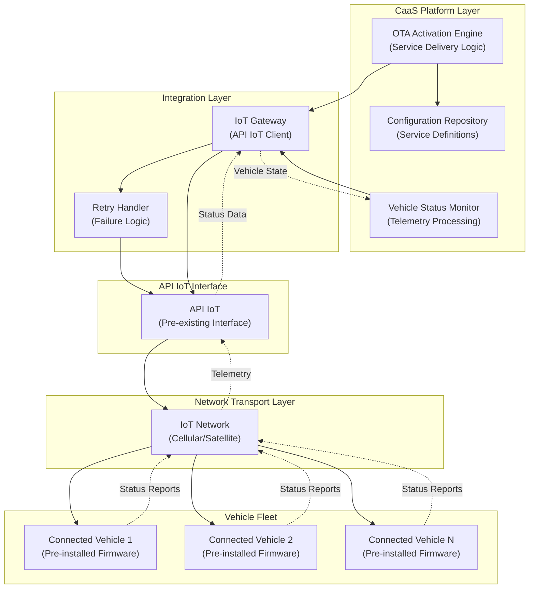
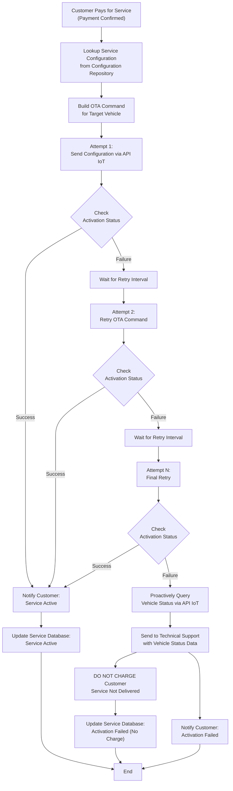
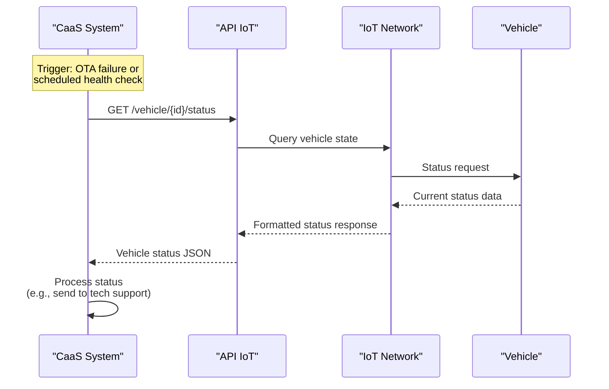
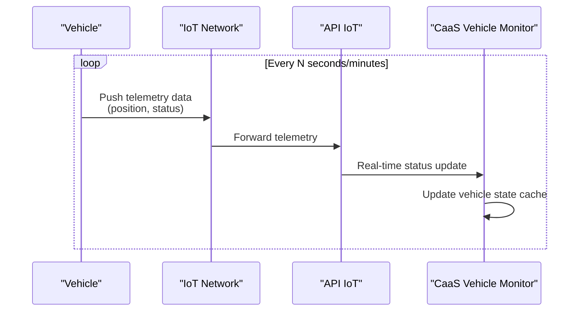
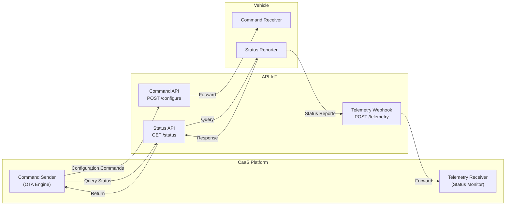
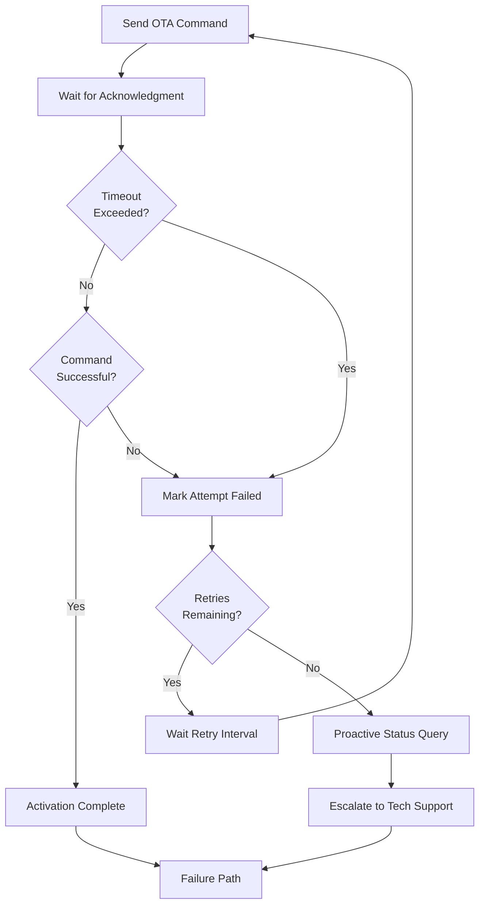
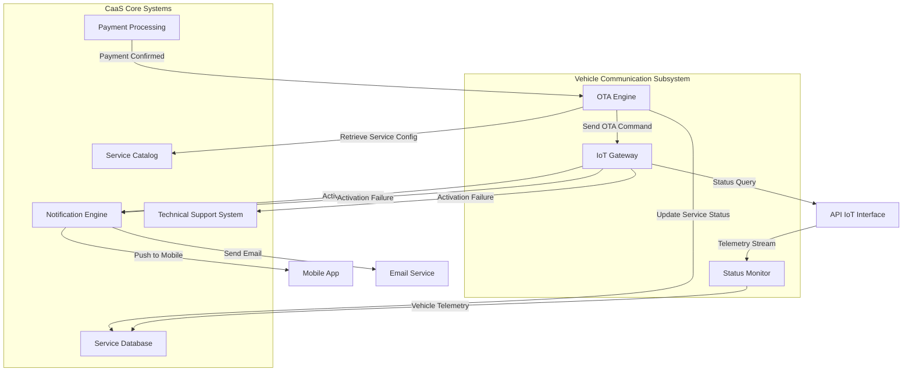

# Vehicle Communication (IoT and OTA)

Relevant source files

The following files were used as context for generating this wiki page:

- [enunciado.md](enunciado.md)
- [pasame las preguntas y sus respuestas a markdown.md](pasame las preguntas y sus respuestas a markdown.md)

## Purpose and Scope

This document describes the vehicle communication infrastructure for the CaaS platform, focusing on the IoT network and OTA (Over-The-Air) service activation system. It covers:

- The **API IoT** interface for remote vehicle configuration
- IoT network infrastructure and connectivity architecture
- OTA activation process for remote service delivery
- Pre-installed functionality model and firmware activation
- Vehicle status reporting and telemetry
- Retry logic and failure handling mechanisms

For information about how maintenance status is tracked via workshops, see [VSS (Vehicle Service System) Integration](#5.2). For details on the OTA activation workflow and service lifecycle, see [OTA Service Activation](#6.2). For failure handling policies, see [OTA Activation Failures](#9.1).

## Overview

The CaaS system relies on a pre-existing, tested IoT infrastructure to enable remote configuration and monitoring of the entire vehicle fleet. All vehicles sold through CaaS are equipped with connectivity hardware and pre-installed firmware containing all optional features. The system does not install new software via OTA; it only **activates or deactivates** pre-existing functionality through configuration changes.

**Key Architectural Principles:**
- **Pre-installed Functionality Model**: All optional services (opciones disponibles) are already present in vehicle firmware at manufacture time
- **Configuration-Based Activation**: OTA operations send configuration commands, not software updates
- **Existing API Constraint**: The API IoT is a pre-existing, documented interface that CaaS must use as-is
- **Bidirectional Communication**: Vehicles both receive configuration commands and report operational status
- **No Workshop Requirement**: Service activation never requires physical workshop visits

Sources: [enunciado.md:7-8](), [pasame las preguntas y sus respuestas a markdown.md:34-38](), [pasame las preguntas y sus respuestas a markdown.md:55-56]()

## API IoT Interface

### Characteristics

The **API IoT** is a pre-existing, fully documented, and tested interface developed prior to the CaaS project. This API was designed to support remote vehicle configuration but was not operational until CaaS deployment.

**Integration Constraints:**
- **Cannot be modified**: The API is a fixed external interface
- **Fully documented**: Complete technical specifications exist
- **Already tested**: Integration testing was performed in a previous project
- **Pre-CaaS origin**: Developed before the CaaS business model
- **Problem attribution**: Any integration issues are attributed to the prior project, not CaaS

**Primary Capabilities:**
- Remote configuration delivery to vehicles
- Vehicle status querying and telemetry retrieval
- Command acknowledgment and execution status reporting

The API serves as the **single integration point** between CaaS business logic and the physical vehicle fleet. All service activation, deactivation, and status monitoring flows through this interface.

Sources: [pasame las preguntas y sus respuestas a markdown.md:34-38](), [pasame las preguntas y sus respuestas a markdown.md:100-104]()

### API Classification

According to system documentation standards, the API IoT is classified as a **Restriction** rather than a **Requirement**:

| API Type | Description | Documentation Approach |
|----------|-------------|------------------------|
| **Restriction** | Pre-existing API that must be used as-is | Brief summary of functionality + reference to existing technical documentation |
| **Requirement** | New API to be developed as part of CaaS | Full requirements specification as part of project deliverables |

The API IoT falls into the first category. CaaS must integrate with it but cannot define or modify its interface.

Sources: [pasame las preguntas y sus respuestas a markdown.md:100-104]()

## IoT Network Architecture

### Infrastructure Layers

The vehicle communication infrastructure is organized in distinct layers, separating concerns between business logic, integration, network transport, and physical devices.

**IoT Network Architecture Diagram**

**Layer Responsibilities:**

| Layer | Components | Responsibility |
|-------|-----------|----------------|
| **CaaS Platform** | OTA Engine, Status Monitor, Config Repository | Business logic for service activation and vehicle monitoring |
| **Integration** | IoT Gateway, Retry Handler | Adapter for API IoT with failure handling |
| **API Interface** | API IoT | Documented external interface (immutable) |
| **Network Transport** | IoT Network | Physical connectivity infrastructure (cellular, satellite) |
| **Vehicle Fleet** | Connected Vehicles | Firmware execution and status reporting |

Sources: [enunciado.md:7-8](), [pasame las preguntas y sus respuestas a markdown.md:34-38]()

### Connectivity Characteristics

**Unidirectional vs Bidirectional:**
- **Initial State**: Vehicles initially had unidirectional communication for position reporting only
- **CaaS Enhancement**: API IoT enables bidirectional communication for configuration and status
- **Network Protocol**: Cellular and/or satellite connectivity (specific protocols abstracted by API IoT)

**Vehicle Identification:**
- Each vehicle is uniquely identifiable in the IoT network
- Vehicle-to-customer association is managed by CaaS core systems
- Mobile application can establish direct connection to assigned vehicle (separate from CaaS API path)

Sources: [pasame las preguntas y sus respuestas a markdown.md:34-38]()

## OTA Service Activation Process

### Activation Workflow

When a customer purchases an optional service (opción disponible), the activation process executes entirely through remote OTA configuration. No workshop visit is required.

**Complete OTA Activation Flow**

**Critical Business Rules:**
1. **Multiple Retry Attempts**: System retries OTA activation a configurable number of times
2. **Proactive Status Query**: After final failure, system actively queries vehicle state (not passive waiting)
3. **Technical Support Escalation**: Failed activations are routed to support with full diagnostic data
4. **Customer Protection**: **Never charge** for services that fail to activate (critical requirement)
5. **Customer Communication**: System notifies customer of both success and failure outcomes

Sources: [pasame las preguntas y sus respuestas a markdown.md:48-53](), [enunciado.md:19-20]()

### Activation Components

**OTA Activation Engine Responsibilities:**
- Retrieve service configuration definitions from repository
- Translate service definitions into API IoT command format
- Execute retry logic with exponential backoff or fixed intervals
- Track activation state for each service instance
- Coordinate with notification engine for customer updates
- Integrate with payment system for charge/no-charge decisions

**Configuration Repository:**
- Stores service-to-firmware mapping (which firmware features map to which CaaS services)
- Maintains activation parameters (command structure, timeout values)
- Defines retry policies per service type
- May contain different configurations for different vehicle models/platforms

**Notification Channels:**
- **Mobile Application**: Real-time push notification of activation status
- **Vehicle Display**: Confirmation message shown in vehicle's information system
- **Email**: Confirmation or failure notification sent to customer

Sources: [enunciado.md:19-20](), [pasame las preguntas y sus respuestas a markdown.md:48-53]()

## Pre-installed Functionality Model

### Firmware Architecture

All vehicles manufactured for CaaS sale contain **complete firmware** with all optional features already installed. OTA operations do not transfer new software to vehicles; they only modify **configuration flags** to enable or disable existing functionality.

**Firmware Composition:**
- **Plataforma Base**: Core features enabled by default (always active)
- **Opciones Disponibles**: Optional features present but disabled by default
- **Configuration State**: Binary flags or parameters controlling feature activation

**Activation vs Software Update:**

| Operation | Description | CaaS Involvement | Workshop Required |
|-----------|-------------|------------------|-------------------|
| **OTA Activation** | Enable pre-installed optional feature | CaaS sends configuration command | No |
| **OTA Deactivation** | Disable previously enabled feature | CaaS sends configuration command | No |
| **Firmware Update** | Install new software version | Independent process, not CaaS responsibility | Varies |

**Key Distinction**: CaaS **never installs software** on vehicles. Software updates (patching, new firmware versions) are handled by a separate vehicle lifecycle management process outside CaaS scope.

Sources: [pasame las preguntas y sus respuestas a markdown.md:55-56]()

### Service-to-Firmware Mapping

The Configuration Repository maintains the mapping between CaaS service catalog entries and the corresponding firmware configuration parameters.

**Example Mapping Table:**

| CaaS Service Name | Firmware Module | Configuration Parameter | Activation Value |
|-------------------|-----------------|------------------------|------------------|
| "Aumento Potencia 50%" | Engine Control Unit | `power_mode` | `HIGH` |
| "Conducción Autónoma" | ADAS System | `autonomous_highway_enabled` | `true` |
| "Modo Nieve" | Traction Control | `snow_mode_available` | `1` |
| "Climatización Premium" | HVAC System | `climate_zones` | `4` |

This mapping is critical for translating business-level service purchases into technical configuration commands sent via API IoT.

Sources: [enunciado.md:3-5](), [pasame las preguntas y sus respuestas a markdown.md:55-56]()

## Vehicle Status Reporting

### Status Data Types

Vehicles continuously report operational status to the IoT network, which is then accessible via API IoT. CaaS queries this data for monitoring and decision-making.

**Status Categories:**
- **Operational State**: Vehicle running, parked, charging (if electric), etc.
- **Configuration State**: Which optional features are currently active
- **Diagnostic State**: Error codes, system health indicators
- **Connectivity State**: Signal strength, last communication timestamp
- **Geolocation**: Current vehicle position (original IoT network functionality)

**Important Constraint**: Vehicles do **not** report maintenance status via IoT. Maintenance information must be queried from the external VSS (Vehicle Service System) maintained by workshops. See [VSS Integration](#5.2).

Sources: [pasame las preguntas y sus respuestas a markdown.md:72-73](), [enunciado.md:7-8]()

### Status Query Patterns

**Pull-Based Status Retrieval:**

**Push-Based Telemetry (Continuous):**

CaaS implements both patterns:
- **Push**: For real-time monitoring and dashboard updates
- **Pull**: For on-demand queries (especially during OTA failure diagnostics)

Sources: [pasame las preguntas y sus respuestas a markdown.md:48-53](), [enunciado.md:7-8]()

## Communication Patterns

### Bidirectional Communication

The API IoT enables bidirectional communication between CaaS and vehicles:

**CaaS → Vehicle (Command Flow):**
- OTA configuration commands for service activation/deactivation
- Query commands for status retrieval
- Diagnostic commands for troubleshooting

**Vehicle → CaaS (Telemetry Flow):**
- Periodic status reports (operational state, position)
- Command acknowledgment and execution results
- Diagnostic data and error conditions
- Configuration state confirmation

**Communication Pattern Diagram**

Sources: [pasame las preguntas y sus respuestas a markdown.md:34-38](), [enunciado.md:7-8]()

### Mobile Application Direct Link

The mobile application has a **dual-path architecture** for vehicle interaction:

**Path 1: Via CaaS Platform**
- Service purchases and management
- Expediente de compra access
- Payment processing
- Historical data and invoices

**Path 2: Direct to Vehicle**
- Real-time vehicle control (lock/unlock, climate pre-conditioning)
- Direct status queries (faster response)
- Emergency commands

This direct link operates independently of the CaaS business logic layer, providing lower latency for operational commands while the CaaS platform handles transactional operations.

Sources: High-level architecture diagram context (Diagram 1 from context)

## Retry Logic and Failure Handling

### Retry Strategy

The OTA activation system implements sophisticated retry logic to maximize activation success while avoiding infinite retry loops.

**Retry Configuration:**

| Parameter | Typical Value | Configurable |
|-----------|--------------|--------------|
| Maximum Attempts | 3-5 | Yes |
| Retry Interval | 30-60 seconds | Yes |
| Backoff Strategy | Fixed or Exponential | Yes |
| Timeout per Attempt | 10-30 seconds | Yes |

**Retry Decision Logic:**

Sources: [pasame las preguntas y sus respuestas a markdown.md:48-53]()

### Failure Escalation

When all retry attempts are exhausted, the system executes a **proactive diagnostic protocol**:

**Escalation Steps:**
1. **Proactive Status Query**: System actively queries vehicle via API IoT to retrieve current state, diagnostic codes, and connectivity metrics
2. **Data Package Creation**: Assemble complete diagnostic package including:
   - Service definition that failed to activate
   - All retry attempt logs with timestamps and error codes
   - Current vehicle status snapshot
   - Customer and vehicle identification data
3. **Technical Support Notification**: Send diagnostic package to technical support queue or ticketing system
4. **Customer Communication**: Notify customer of activation failure with apology and resolution timeline
5. **Financial Protection**: **Do NOT charge customer** for the undelivered service (critical business rule)
6. **Service Record Update**: Mark service activation as failed in service database

**No Charge Rule**: This is the most critical failure handling policy. Customers are never charged for services that fail to activate, regardless of the reason. This protects customer trust and ensures legal compliance (no charging for undelivered services).

Sources: [pasame las preguntas y sus respuestas a markdown.md:48-53]()

### Failure Scenarios and Handling

| Failure Type | Detection Method | Handling Strategy |
|--------------|------------------|-------------------|
| **Vehicle Offline** | Timeout on command acknowledgment | Retry with longer intervals; may succeed when vehicle comes online |
| **Configuration Rejected** | Error response from vehicle | Query vehicle logs; may indicate firmware incompatibility |
| **Partial Activation** | Status query shows inconsistent state | Attempt deactivation + reactivation; escalate if persists |
| **Network Interruption** | Timeout during command transmission | Retry immediately; network issue likely temporary |
| **Firmware Error** | Vehicle reports internal error code | Escalate immediately; may require firmware update outside CaaS |

Sources: [pasame las preguntas y sus respuestas a markdown.md:48-53]()

## Integration Points

### Connection to CaaS Core Systems

The vehicle communication subsystem integrates with multiple CaaS platform components:

**Integration Map**

**Integration Responsibilities:**

| Source System | Target System | Data Flow | Trigger |
|---------------|---------------|-----------|---------|
| Payment Processing | OTA Engine | Service purchase + customer ID | Successful payment |
| OTA Engine | Service Catalog | Service configuration query | Pre-activation lookup |
| OTA Engine | IoT Gateway | OTA command | Service activation request |
| IoT Gateway | API IoT | Configuration command | OTA command forwarding |
| API IoT | Status Monitor | Telemetry stream | Continuous vehicle reporting |
| Status Monitor | Service Database | Vehicle state updates | Real-time telemetry |
| OTA Engine | Notification Engine | Activation result | Post-activation (success/failure) |
| OTA Engine | Technical Support | Diagnostic package | Activation failure after retries |
| OTA Engine | Service Database | Service status | Activation completion (any outcome) |

Sources: [enunciado.md:19-20](), [pasame las preguntas y seus respuestas a markdown.md:48-53]()

### Mobile Application Integration

The mobile application has dual integration paths for vehicle interaction:

**Indirect Path (via CaaS):**
- User browses opciones disponibles in service catalog
- User initiates service purchase
- Payment flows through CaaS payment processing
- OTA activation occurs via CaaS → API IoT → Vehicle
- Status updates pushed back to mobile app via notification engine

**Direct Path (app to vehicle):**
- User sends operational commands (lock, unlock, climate control)
- Mobile app connects directly to vehicle (likely via API IoT but bypassing CaaS business logic)
- Commands executed in real-time without CaaS mediation
- Status updates received directly by mobile app

This architecture separates **transactional operations** (purchases, requiring CaaS validation) from **operational commands** (vehicle control, requiring low latency).

Sources: High-level architecture context (Diagram 1), [enunciado.md:17]()

## Security and Authorization

### Vehicle-Customer Association

The system must securely associate vehicles with authorized customers to prevent unauthorized configuration changes:

**Authorization Model:**
- Each vehicle has a unique identifier in the IoT network
- Customer accounts are linked to specific vehicle IDs during delivery process
- OTA commands include both vehicle ID and customer authorization token
- API IoT validates authorization before executing configuration changes
- Mobile app must authenticate and prove vehicle ownership before direct commands

**Multi-Customer Scenarios:**
- Vehicle ownership transfer requires updating vehicle-customer association
- Used vehicle sales must revoke previous customer access
- Temporary sharing (e.g., family members) may require role-based access control

Sources: [enunciado.md:17]()

### API Security

While the API IoT is pre-existing and cannot be modified, CaaS must implement security controls at the integration layer:

**Security Layers:**
- **Authentication**: API keys or tokens for CaaS-to-API IoT communication
- **Authorization**: Vehicle ownership validation before command execution
- **Encryption**: TLS/SSL for all API communication (assumed standard practice)
- **Rate Limiting**: Prevent abuse or DoS attacks on vehicle fleet
- **Audit Logging**: Record all configuration commands for compliance and debugging

Sources: General best practices implied by system architecture

## Monitoring and Observability

### Operational Metrics

The vehicle communication subsystem should expose metrics for monitoring and operational insight:

**Key Metrics:**

| Metric | Description | Alert Threshold |
|--------|-------------|-----------------|
| **OTA Success Rate** | Percentage of activations successful on first attempt | < 90% |
| **Average Retry Count** | Average retries needed for successful activation | > 2.0 |
| **Activation Latency** | Time from payment to activation confirmation | > 5 minutes |
| **Vehicle Connectivity Rate** | Percentage of fleet currently online | < 95% |
| **Failed Activation Count** | Services escalated to technical support | > 10 per day |
| **API IoT Availability** | Uptime of API IoT interface | < 99.9% |

**Monitoring Integration:**
- Metrics exposed via monitoring API or dashboard
- Alerts sent to operations team for threshold violations
- Historical trends tracked for capacity planning
- Per-vehicle tracking for identifying problematic units

Sources: Implied by system requirements for operational excellence

### Diagnostic Capabilities

For troubleshooting OTA failures and vehicle communication issues:

**Diagnostic Tools:**
- **Command History**: Full log of all OTA commands sent to each vehicle
- **Status Timeline**: Historical vehicle status reports over time
- **Connectivity Log**: Record of when vehicles were online/offline
- **Error Code Repository**: Database of vehicle error codes and resolutions
- **Test Mode**: Ability to send test commands to verify communication path

These tools support technical support staff in diagnosing and resolving activation failures, ensuring rapid customer issue resolution.

Sources: [pasame las preguntas y sus respuestas a markdown.md:48-53]()

---

**Document Summary:**

This page documented the vehicle communication infrastructure that enables the CaaS business model. The key architectural constraints are the pre-existing API IoT interface and the pre-installed functionality model where vehicles contain all optional features at manufacture time. The OTA activation system is the critical technical differentiator, delivering purchased services remotely with sophisticated retry logic and customer-protective failure handling (no charge for failed activations). The bidirectional communication pattern enables both command delivery and continuous vehicle monitoring, while the mobile application's dual-path architecture separates transactional operations from real-time vehicle control.