# Payment Gateway Integration

Relevant source files

The following files were used as context for generating this wiki page:

- [enunciado.md](enunciado.md)
- [pasame las preguntas y sus respuestas a markdown.md](pasame las preguntas y sus respuestas a markdown.md)

## Purpose and Scope

This document details how the CaaS platform integrates with external payment gateways to process financial transactions for vehicle purchases and service activations. It covers payment processing workflows, asynchronous settlement handling, risk management strategies, and failure scenarios.

For broader context on payment types and billing models, see [Payment Types and Flows](#7.1). For risk management strategy details, see [Risk Management and Settlement](#7.2). For payment failure scenarios, see [Payment Failure Scenarios](#9.2).

**Sources:** [enunciado.md:1-23](), [pasame las preguntas y sus respuestas a markdown.md:75-104]()

---

## Payment Gateway as External System

The payment gateway is an **external third-party system** that CaaS integrates with to process credit card and bank payments. CaaS does not implement its own payment processing logic; instead, it delegates all financial transaction handling to certified payment service providers.

### Integration Characteristics

| Characteristic | Description |
|---|---|
| **System Type** | External third-party payment processor |
| **Communication Model** | Asynchronous (fire-and-forget with delayed settlement) |
| **Risk Ownership** | CaaS assumes settlement risk |
| **Integration Pattern** | API-based request-response with webhook callbacks |
| **Scope** | Card processing, bank transfers, settlement notifications |

The payment gateway handles PCI-DSS compliance, fraud detection, and banking network communication. CaaS receives payment confirmation asynchronously after initiating transactions.

**Sources:** [pasame las preguntas y sus respuestas a markdown.md:77-82]()

---

## Payment Architecture Overview

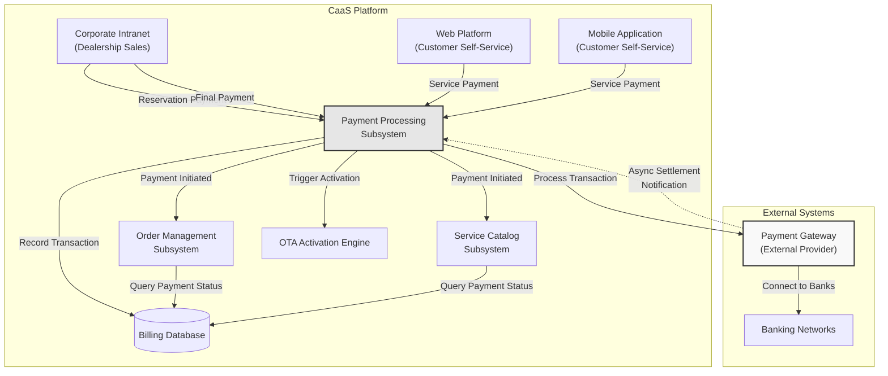

**Diagram 1: Payment Gateway Integration Architecture**

The architecture demonstrates **immediate service delivery despite asynchronous settlement**. CaaS initiates payment processing through the gateway and proceeds with service activation before receiving final settlement confirmation from banking networks.

**Sources:** [pasame las preguntas y sus respuestas a markdown.md:77-82]()

---

## Payment Types and Transaction Flows

CaaS processes four distinct payment types, each with different characteristics and risk profiles:

### Payment Type Matrix

| Payment Type | Timing | Settlement Model | Risk Level | Business Impact |
|---|---|---|---|---|
| **Reservation Payment** | At vehicle reservation | Synchronous verification | Low | Blocks inventory |
| **Final Payment** | Before vehicle registration | Synchronous verification | High | Releases vehicle |
| **One-Time Service Payment** | At service purchase | **Asynchronous** | Medium | Immediate OTA activation |
| **Subscription Payment** | Month-end (mes vencido) | **Asynchronous** | High | Post-paid model |

**Sources:** [pasame las preguntas y sus respuestas a markdown.md:77-82](), [enunciado.md:13-19]()

---

## Reservation Payment Flow

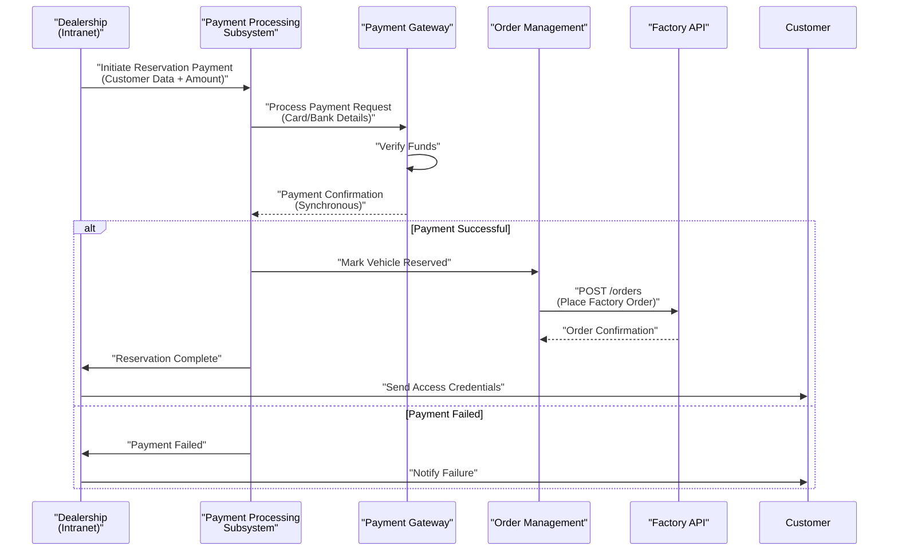

**Diagram 2: Reservation Payment Sequence**

Reservation payments are processed **synchronously** because they determine whether the vehicle manufacturing process begins. The dealership waits for payment confirmation before proceeding with factory order placement.

**Sources:** [pasame las preguntas y sus respuestas a markdown.md:77-82](), [enunciado.md:13-14]()

---

## Final Payment Flow and Critical Failure Handling

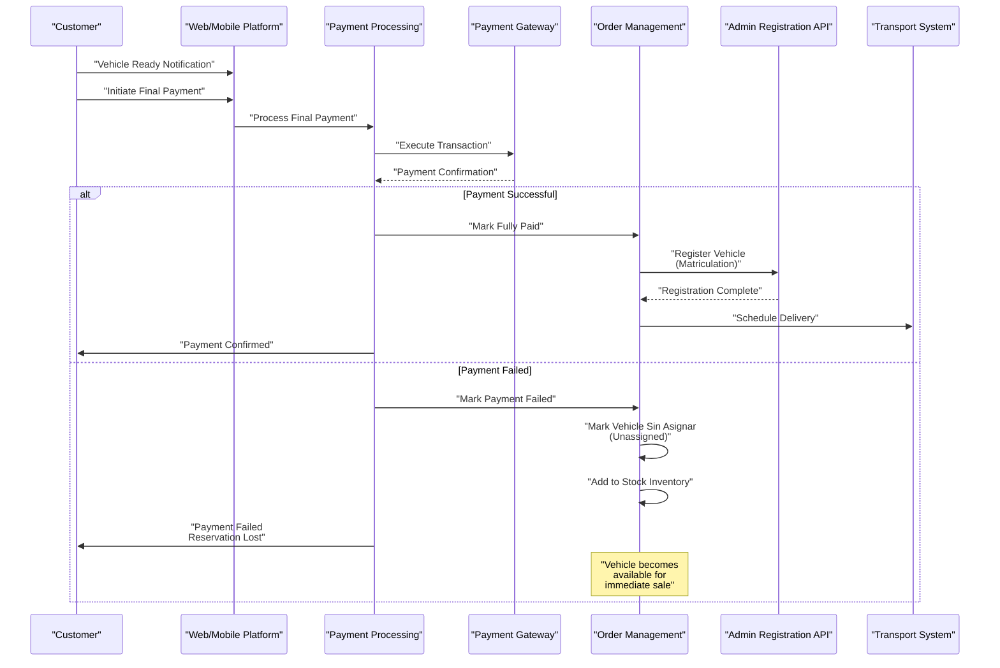

**Diagram 3: Final Payment Flow with Failure Scenario**

**Critical Business Rule:** If the final payment fails, the customer **loses the reservation entirely**. The vehicle is immediately marked as "sin asignar" (unassigned) and returned to stock for immediate sale to other customers.

**Sources:** [pasame las preguntas y sus respuestas a markdown.md:26-28](), [enunciado.md:14-17]()

---

## Service Payment Flow with Asynchronous Settlement

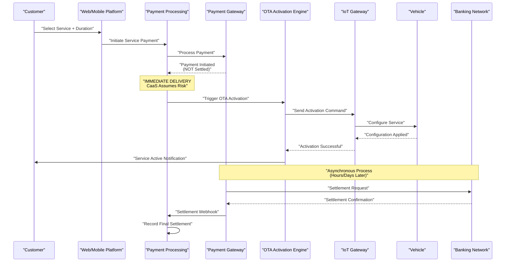

**Diagram 4: Service Payment with Asynchronous Settlement**

**Key Architectural Decision:** CaaS delivers services **immediately upon payment initiation**, without waiting for final bank settlement. This optimizes customer experience but means CaaS assumes the risk of chargebacks and settlement failures.

**Sources:** [pasame las preguntas y sus respuestas a markdown.md:77-82]()

---

## Risk Management Strategy

### Immediate Delivery vs. Settlement Delay

CaaS implements an **aggressive risk assumption strategy** to optimize customer experience:

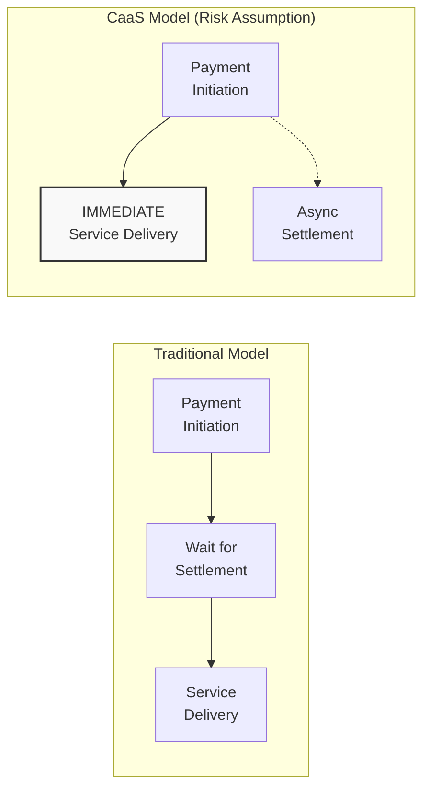

**Diagram 5: Risk Assumption Model Comparison**

### Risk Mitigation Mechanisms

| Risk Type | Mitigation Strategy | Business Rule |
|---|---|---|
| **OTA Activation Failure** | Do NOT charge customer | Critical protection rule |
| **Settlement Failure** | Reconciliation process | Track discrepancies |
| **Chargeback Risk** | Accept losses | Cost of better UX |
| **Fraud Detection** | Gateway provider handles | Delegate to payment gateway |

**Critical Customer Protection Rule:** If OTA activation fails after payment initiation, CaaS **must NOT charge the customer** for the undelivered service. This rule is enforced at the payment processing layer.

**Sources:** [pasame las preguntas y sus respuestas a markdown.md:48-53, 77-82]()

---

## Subscription Payment Flow (Mes Vencido)

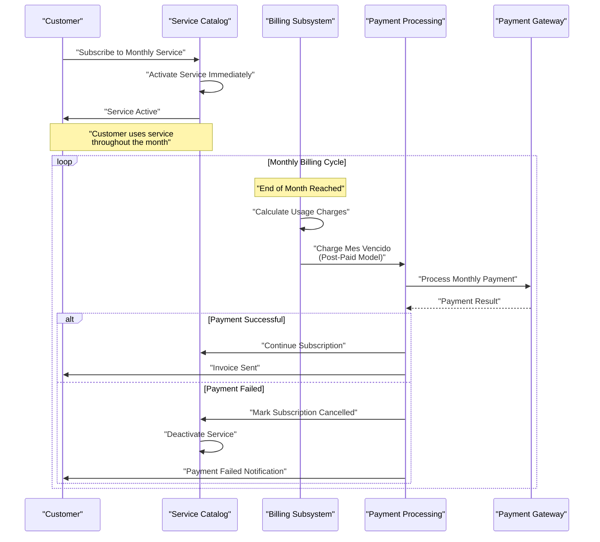

**Diagram 6: Subscription Payment Flow (Mes Vencido Model)**

**Mes Vencido** means "expired month" in Spanish, referring to the **post-paid billing model** where customers are charged at the end of the month for services consumed during that month. This increases collection risk but reduces upfront friction.

**Sources:** [pasame las preguntas y sus respuestas a markdown.md:77-82]()

---

## Payment Failure Handling Matrix

Different payment types have different failure handling strategies:

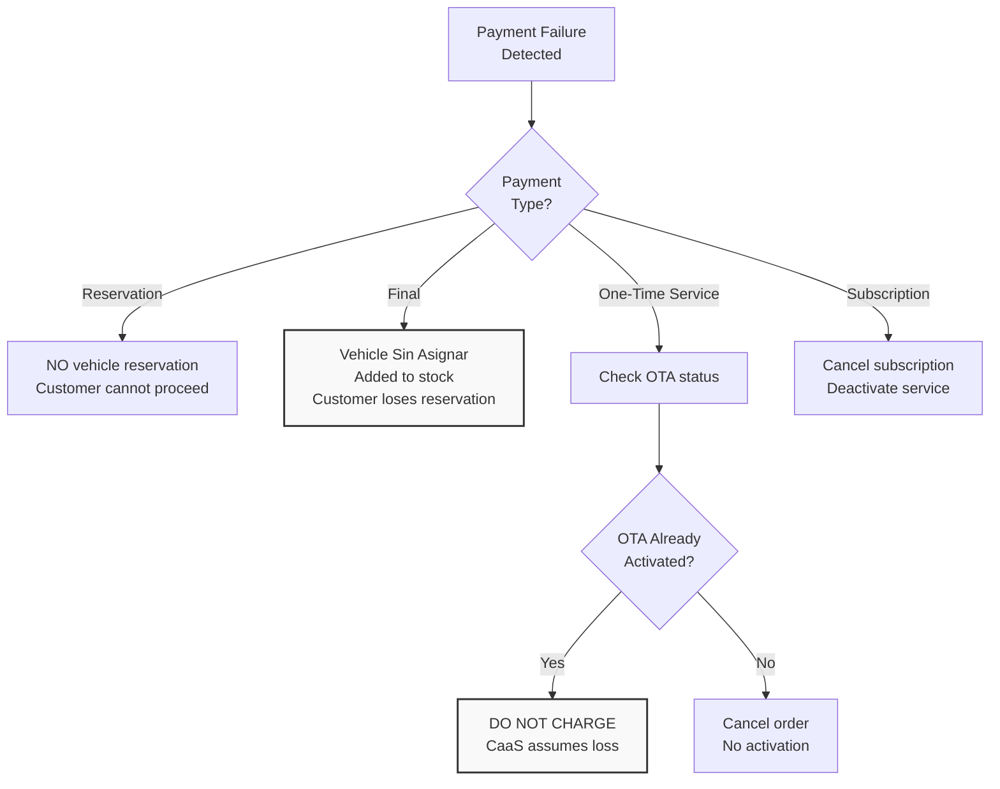

**Diagram 7: Payment Failure Decision Tree**

### Failure Handling Rules

1. **Reservation Payment Failure:**
   - No vehicle reservation is created
   - Customer cannot proceed with purchase
   - No factory order is placed

2. **Final Payment Failure:**
   - Customer **loses reservation completely**
   - Vehicle marked "sin asignar" (unassigned)
   - Vehicle immediately added to stock for sale
   - **No grace period or retry**

3. **One-Time Service Payment Failure:**
   - If OTA already activated: **DO NOT CHARGE** (customer protection)
   - If OTA not yet activated: Cancel order, no service delivery
   - Customer must re-initiate purchase

4. **Subscription Payment Failure:**
   - Subscription marked as cancelled
   - Service deactivated via OTA
   - No retroactive charges for current month

**Sources:** [pasame las preguntas y sus respuestas a markdown.md:26-28, 48-53, 77-82]()

---

## Integration Pattern with OTA Engine

The payment processing subsystem has a **critical integration** with the OTA Activation Engine to ensure the "do not charge" protection rule:

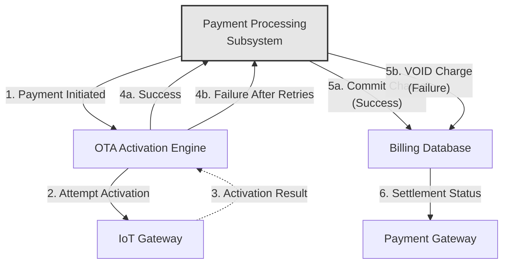

**Diagram 8: Payment-OTA Integration for Charge Protection**

**Critical Integration Points:**

1. Payment processing initiates transaction but **does NOT commit charge** until OTA confirms activation
2. OTA engine attempts activation with retry logic (see [OTA Activation Failures](#9.1))
3. OTA reports final status (success or exhausted retries) back to payment processing
4. Payment processing either:
   - **Commits the charge** if activation succeeded
   - **Voids the charge** if activation failed (customer protection)

This ensures customers are never charged for services they did not receive.

**Sources:** [pasame las preguntas y sus respuestas a markdown.md:48-53]()

---

## Payment Data Model

The payment processing subsystem maintains transaction records in the Billing Database:

### Payment Transaction States

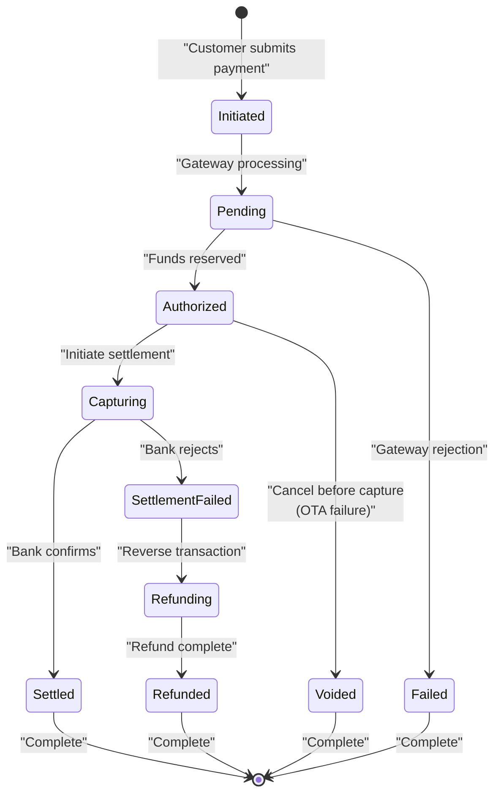

**Diagram 9: Payment Transaction State Machine**

### Key States

| State | Description | Business Impact |
|---|---|---|
| **Initiated** | Payment request submitted | No funds movement |
| **Pending** | Gateway processing | Awaiting gateway response |
| **Authorized** | Funds reserved, not captured | Can be voided if OTA fails |
| **Capturing** | Settlement in progress | Async process |
| **Settled** | Funds transferred to CaaS | Payment complete |
| **Voided** | Cancelled before capture | Used for OTA failures |
| **Failed** | Gateway or bank rejection | Customer must retry |
| **Refunded** | Reversed after settlement | For desistimiento cases |

**Sources:** [pasame las preguntas y sus respuestas a markdown.md:77-104]()

---

## Reconciliation Process

CaaS must reconcile payment gateway reports with internal transaction records due to asynchronous settlement:

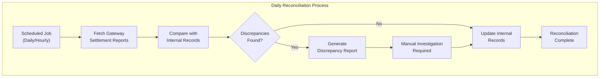

**Diagram 10: Payment Reconciliation Workflow**

### Common Discrepancy Scenarios

1. **Delayed Settlement:** Gateway reports settlement later than expected
2. **Chargebacks:** Customer disputes transaction after service delivery
3. **Partial Settlements:** Only part of transaction amount settled
4. **Failed Settlements:** Authorization succeeded but settlement failed

**Sources:** [pasame las preguntas y sus respuestas a markdown.md:77-82]()

---

## Security and Compliance Considerations

### PCI-DSS Compliance

CaaS **does NOT handle card data directly**. All sensitive payment information is processed by the certified payment gateway provider:

| Responsibility | Owner |
|---|---|
| **Card data handling** | Payment Gateway |
| **PCI-DSS compliance** | Payment Gateway |
| **Fraud detection** | Payment Gateway |
| **Payment form security** | Payment Gateway (hosted forms) |
| **Transaction logging** | CaaS (non-sensitive data only) |
| **Settlement reconciliation** | CaaS |

### Data Retention

CaaS stores only:
- Transaction IDs (gateway-provided)
- Transaction amounts
- Transaction timestamps
- Transaction states
- Customer references
- **NO card numbers or CVV codes**

**Sources:** [pasame las preguntas y sus respuestas a markdown.md:77-82]()

---

## Integration API Design

The payment processing subsystem exposes internal APIs to other CaaS subsystems:

### Internal Payment API Endpoints

| Endpoint | Purpose | Caller | Synchronous? |
|---|---|---|---|
| `initiateReservationPayment()` | Process reservation signal | Order Management | Yes |
| `initiateFinalPayment()` | Process final vehicle payment | Order Management | Yes |
| `initiateServicePayment()` | Process one-time service payment | Service Catalog | Yes (initiation only) |
| `initiateSubscriptionPayment()` | Process monthly subscription charge | Billing Subsystem | Yes (initiation only) |
| `voidPayment()` | Cancel payment before capture | OTA Engine | Yes |
| `queryPaymentStatus()` | Check transaction state | Multiple | Yes |
| `recordSettlement()` | Update settlement status | Webhook Handler | Yes |

### External Payment Gateway API

CaaS makes calls to the payment gateway provider's API:

| Gateway API | Purpose | CaaS Usage |
|---|---|---|
| `POST /transactions` | Initiate payment | All payment flows |
| `GET /transactions/{id}` | Query transaction status | Reconciliation |
| `POST /transactions/{id}/void` | Cancel before capture | OTA failure handling |
| `POST /transactions/{id}/refund` | Reverse settled payment | Desistimiento refunds |
| `GET /settlements` | Fetch settlement reports | Daily reconciliation |

**Sources:** [pasame las preguntas y sus respuestas a markdown.md:100-104]()

---

## Error Handling and Retry Logic

### Payment Gateway Error Scenarios

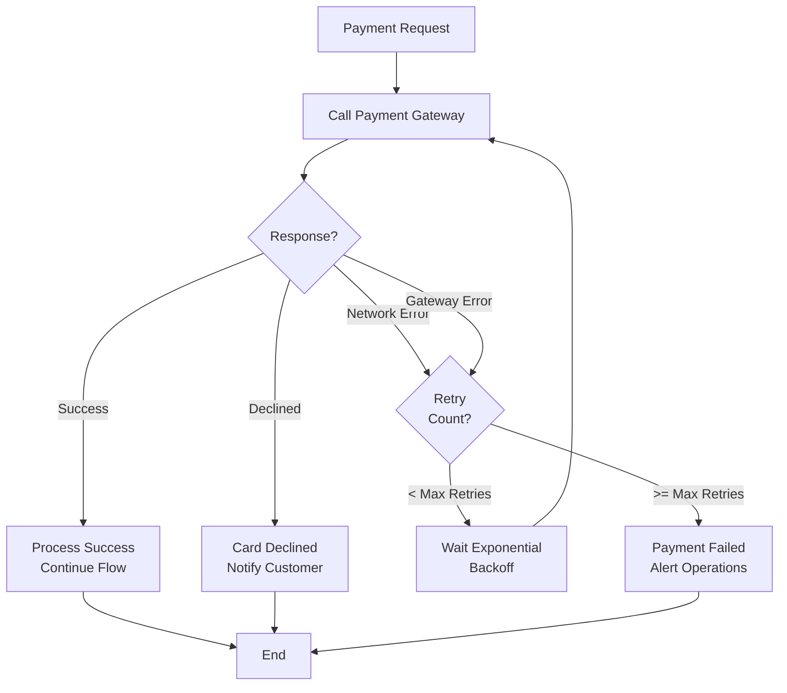

**Diagram 11: Payment Gateway Error Handling**

### Retry Strategy

| Error Type | Retry? | Max Retries | Backoff | Customer Impact |
|---|---|---|---|---|
| **Network timeout** | Yes | 3 | Exponential (2s, 4s, 8s) | Delayed response |
| **Gateway 5xx error** | Yes | 3 | Exponential | Delayed response |
| **Card declined** | No | 0 | N/A | Immediate failure |
| **Insufficient funds** | No | 0 | N/A | Immediate failure |
| **Invalid card data** | No | 0 | N/A | Immediate failure |

**Sources:** [pasame las preguntas y sus respuestas a markdown.md:48-53]()

---

## Summary

The Payment Gateway Integration is designed around several key principles:

1. **External Delegation:** All payment processing handled by certified third-party gateway
2. **Asynchronous Settlement:** Service delivery before final bank confirmation
3. **Risk Assumption:** CaaS optimizes customer experience by assuming settlement risk
4. **Customer Protection:** Critical "do not charge" rule for failed OTA activations
5. **Multiple Payment Types:** Different flows for reservation, final, service, and subscription payments
6. **Strict Final Payment Rule:** Failed final payment results in immediate loss of vehicle reservation

The integration pattern balances customer experience optimization with financial risk management, ensuring that technical failures never result in customers being charged for undelivered services.

**Sources:** [pasame las preguntas y sus respuestas a markdown.md:1-104](), [enunciado.md:1-23]()