# Administrative Registration Integration

Relevant source files

The following files were used as context for generating this wiki page:

- [enunciado.md](enunciado.md)
- [pasame las preguntas y sus respuestas a markdown.md](pasame las preguntas y sus respuestas a markdown.md)

## Purpose and Scope

This document describes the integration between the CaaS platform and external administrative/government bodies for vehicle registration (matriculation). This integration is a critical blocking operation in the vehicle delivery workflow that occurs after final payment completion and before physical vehicle delivery to the customer.

For information about the overall vehicle delivery process, see [Vehicle Purchase and Delivery Process](#4.1). For details on payment processing that precedes registration, see [Payment Gateway Integration](#5.4).

**Sources:** [enunciado.md:15]()

---

## Business Context

### When Registration Occurs

Vehicle registration is triggered automatically by the CaaS system immediately after the customer completes the final payment for their vehicle purchase. This is a legally required step in all countries where CaaS operates, and the vehicle cannot be delivered to the customer until registration is successfully completed.

The registration process is managed by the dealership (concesionario) but is initiated and orchestrated by the CaaS platform. The workflow ensures that:

1. The customer has completed full payment before any registration attempt
2. Registration is completed before vehicle transport to customer address
3. The vehicle is legally authorized to operate on public roads in the customer's jurisdiction

**Sources:** [enunciado.md:14-16](), [pasame las preguntas y sus respuestas a markdown.md:26-27]()

### Registration Workflow Position

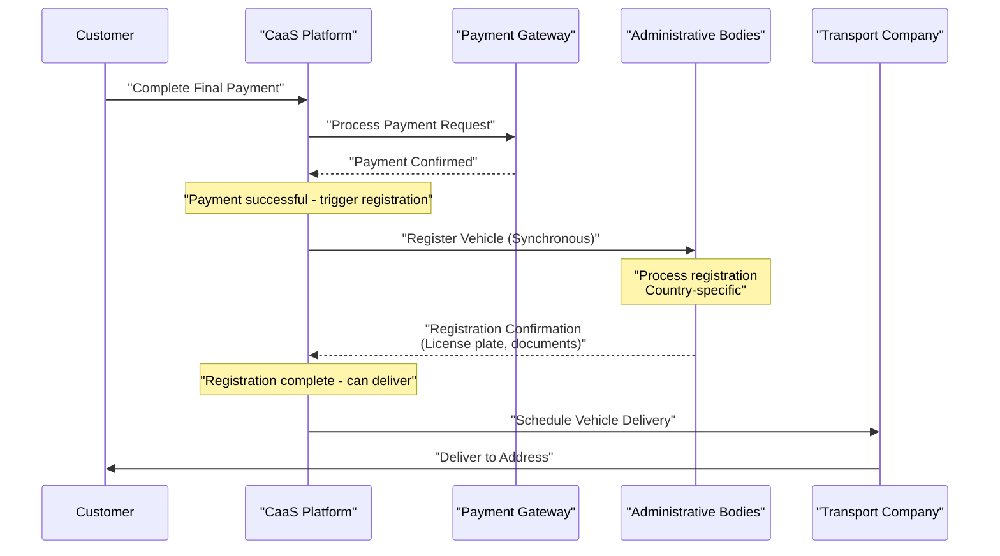

**Sources:** [enunciado.md:14-17](), [pasame las preguntas y sus respuestas a markdown.md:26-27]()

---

## Integration Pattern

### Synchronous Blocking Operation

Unlike other CaaS integrations (such as factory notifications or payment settlement), administrative registration follows a **synchronous request-response pattern**. This design choice reflects the critical nature of registration:

- **Blocking**: The vehicle delivery process cannot proceed until registration completes successfully
- **Synchronous**: CaaS waits for the registration response before continuing the workflow
- **Country-specific**: Each country has different administrative bodies and registration requirements

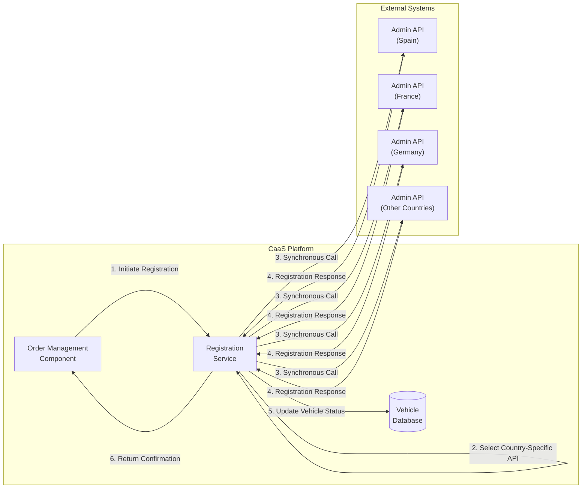

**Sources:** [enunciado.md:15]()

---

## Registration Data Flow

### Required Information

The CaaS system must provide comprehensive vehicle and customer information to the administrative bodies for successful registration:

| Data Category | Information Required | Source |
|--------------|---------------------|---------|
| **Vehicle Identification** | VIN (Vehicle Identification Number), Manufacturer, Model, Platform Base | Factory API, Order Database |
| **Customer Information** | Full Name, Address, National ID/Tax Number, Contact Details | Customer Database |
| **Vehicle Specifications** | Engine Type, Power, Emissions Class, Weight, Technical Specifications | Service Catalog, Factory Data |
| **Dealership Information** | Dealership ID, Location, Authorization Number | Corporate Intranet |
| **Purchase Details** | Purchase Date, Final Payment Confirmation, Invoice Number | Billing Database |

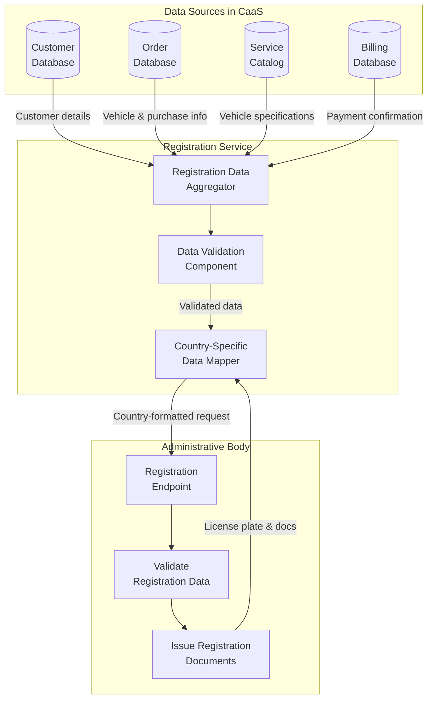

**Sources:** [enunciado.md:9](), [enunciado.md:15]()

---

## Country-Specific Implementation

### Multi-Country Registration Strategy

CaaS operates in multiple countries, each with different administrative requirements, document formats, and registration processes. The system implements a **country-adapter pattern** to handle this complexity:

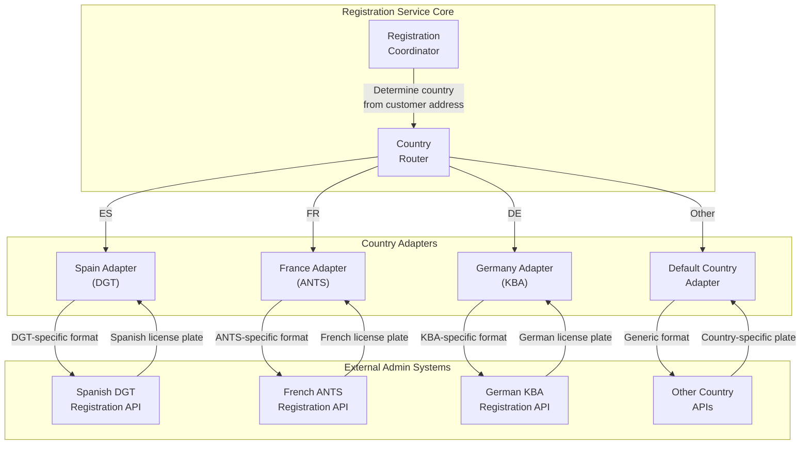

### Country-Specific Considerations

| Country | Administrative Body | Specific Requirements | Response Format |
|---------|--------------------|-----------------------|-----------------|
| **Spain** | DGT (Dirección General de Tráfico) | NIE/DNI validation, Environmental badge class | Spanish license plate format (1234-ABC) |
| **France** | ANTS (Agence Nationale des Titres Sécurisés) | Carte Grise issuance, French tax number | French license plate format (AB-123-CD) |
| **Germany** | KBA (Kraftfahrt-Bundesamt) | TÜV certification reference, Regional authority | German license plate format (XX-AB-1234) |
| **Other** | Country-specific | Varies by jurisdiction | Country-specific formats |

**Sources:** [enunciado.md:15](), [pasame las preguntas y sus respuestas a markdown.md:15]()

---

## Registration Workflow States

### Vehicle State Transitions

The vehicle entity in the CaaS system transitions through several states during the registration process. Understanding these states is critical for tracking vehicles and managing the delivery workflow.

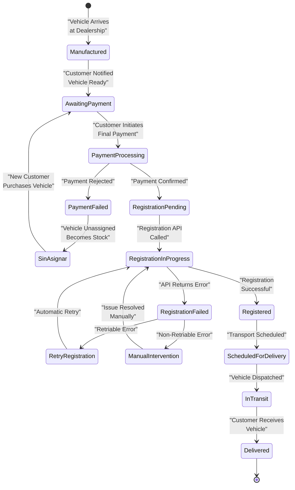

**Sources:** [pasame las preguntas y sus respuestas a markdown.md:26-27]()

### State Definitions

| State | Description | System Actions |
|-------|-------------|----------------|
| `Manufactured` | Vehicle has arrived at dealership from factory | Store dealership location |
| `AwaitingPayment` | Vehicle ready for customer, awaiting final payment | Send notification to customer |
| `PaymentProcessing` | Final payment is being processed | Wait for payment gateway confirmation |
| `PaymentFailed` | Payment was rejected or failed | Trigger vehicle unassignment |
| `SinAsignar` | Vehicle unassigned, becomes stock for immediate sale | Make available to other customers |
| `RegistrationPending` | Payment confirmed, registration will be triggered | Prepare registration data |
| `RegistrationInProgress` | Synchronous registration API call in progress | Block until response received |
| `RegistrationFailed` | Registration API returned an error | Evaluate error type for retry |
| `RetryRegistration` | Waiting before automatic retry | Apply backoff delay |
| `ManualIntervention` | Requires manual resolution (e.g., missing documents) | Alert dealership staff |
| `Registered` | Vehicle successfully registered, has license plate | Update vehicle record with registration data |
| `ScheduledForDelivery` | Transport scheduled to customer address | Coordinate with transport company |
| `InTransit` | Vehicle is being transported to customer | Track delivery status |
| `Delivered` | Vehicle delivered to customer | Complete purchase workflow |

**Sources:** [pasame las preguntas y sus respuestas a markdown.md:26-27](), [enunciado.md:16-17]()

---

## Error Handling and Retry Logic

### Registration Failure Scenarios

Unlike OTA activation failures (which result in no charge to the customer), registration failures have different implications since they occur after payment has been completed. The system must handle various failure types appropriately:

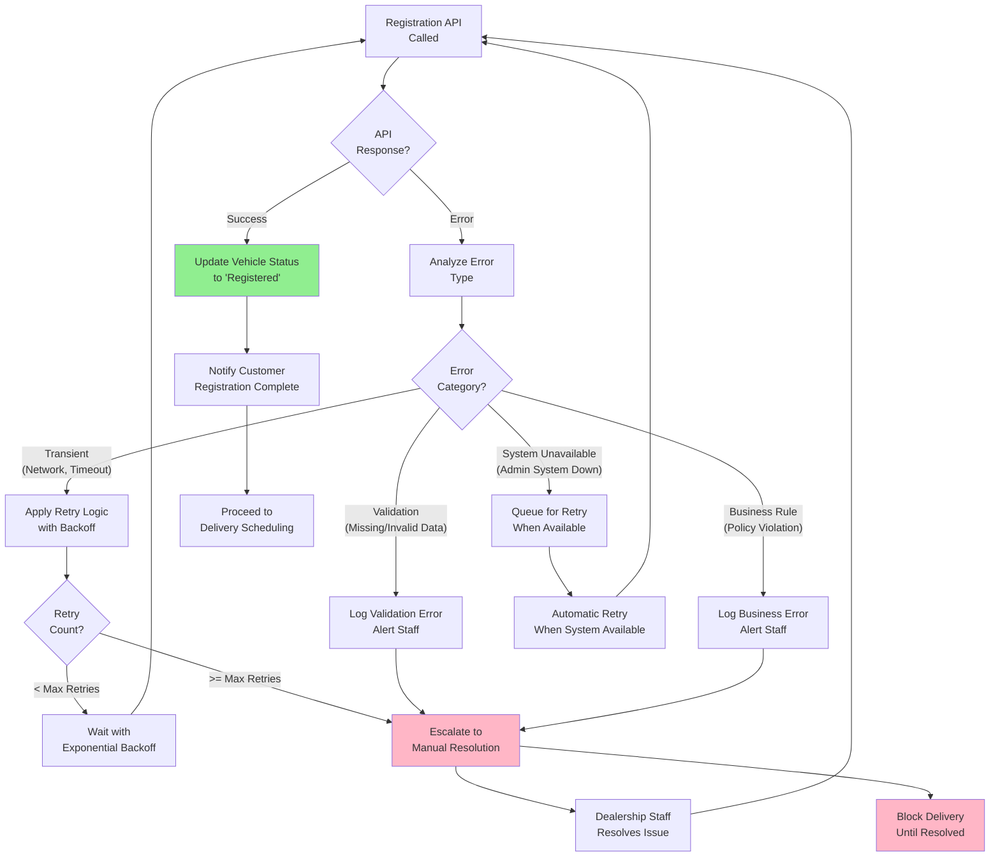

### Error Categories and Handling

| Error Category | Examples | Retry Strategy | Customer Impact |
|----------------|----------|----------------|-----------------|
| **Transient** | Network timeout, Connection refused, Rate limiting | Automatic retry with exponential backoff (5 attempts) | None if resolved within retry window |
| **Validation** | Missing NIE/DNI, Invalid VIN format, Missing required fields | No automatic retry - requires data correction | Delayed delivery until resolved |
| **Business Rule** | Vehicle already registered, Tax debt associated with customer | No automatic retry - requires investigation | Delayed delivery until resolved |
| **System Unavailable** | Admin system maintenance, Extended outage | Queue for retry when available | Delayed delivery, customer notified |
| **Authentication** | Invalid API credentials, Expired certificates | Alert technical team immediately | Critical - blocks all registrations |

**Sources:** [pasame las preguntas y sus respuestas a markdown.md:47-53]()

### Retry Configuration

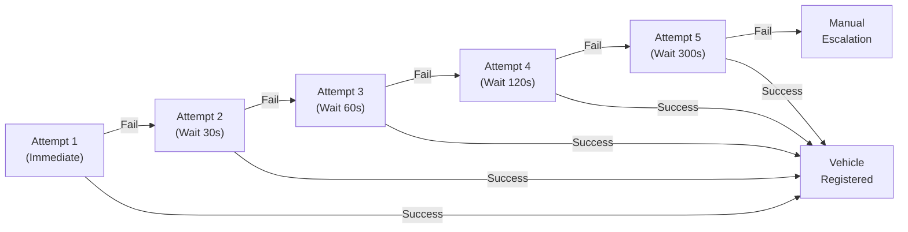

**Key Difference from OTA Failures**: While OTA activation failures result in no charge to the customer (protecting customer satisfaction), registration failures occur AFTER payment has been completed. The customer has paid but cannot receive their vehicle until registration succeeds. This creates urgency for resolution but does not involve refunds unless the registration cannot be completed at all (extremely rare).

**Sources:** [pasame las preguntas y sus respuestas a markdown.md:47-53]()

---

## Registration Response Data

### Information Received from Administrative Bodies

Upon successful registration, the administrative body returns critical information that must be stored in the CaaS system:

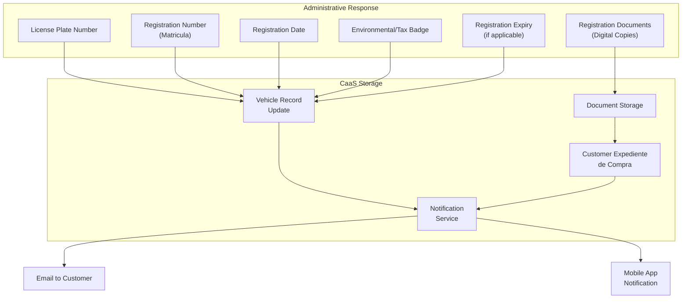

### Stored Registration Data

The following information is persisted in the vehicle database and customer expediente:

| Field | Type | Description | Visibility |
|-------|------|-------------|------------|
| `license_plate` | String | Official license plate number | Customer, Staff |
| `registration_number` | String | Administrative registration number (matricula) | Customer, Staff |
| `registration_date` | Timestamp | Date/time of successful registration | Customer, Staff |
| `registration_country` | String | ISO country code where registered | Staff |
| `registration_authority` | String | Specific administrative body | Staff |
| `environmental_badge` | String | Emissions/environmental classification | Customer, Staff |
| `registration_certificate_url` | String | Link to digital registration certificate | Customer, Staff |
| `registration_expiry_date` | Timestamp | If applicable (some countries) | Customer, Staff |

**Sources:** [enunciado.md:11](), [enunciado.md:15]()

---

## Customer Communication

### Notification Flow for Registration

Customers receive multiple notifications throughout the registration process to keep them informed of their vehicle's status:

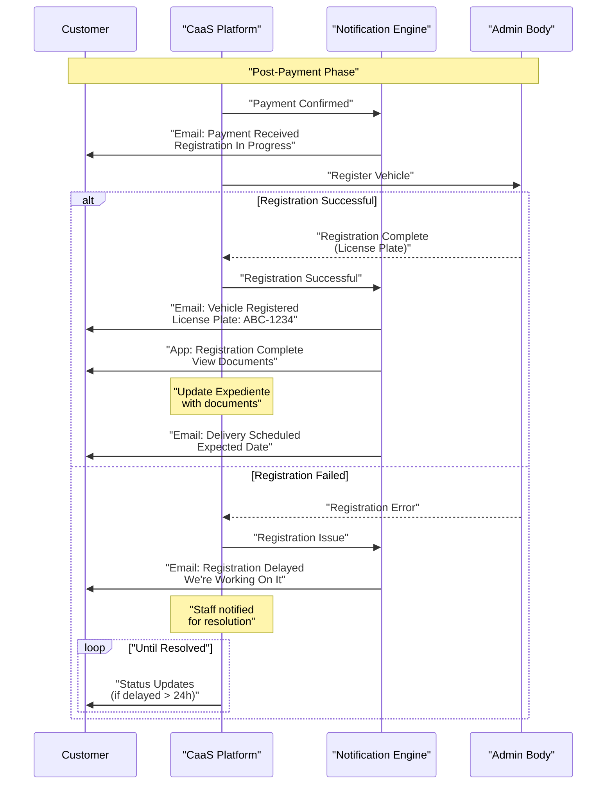

**Sources:** [enunciado.md:11](), [enunciado.md:13]()

---

## Integration with Other CaaS Systems

### Dependencies and Interactions

The registration integration interacts with multiple CaaS subsystems to complete the end-to-end workflow:

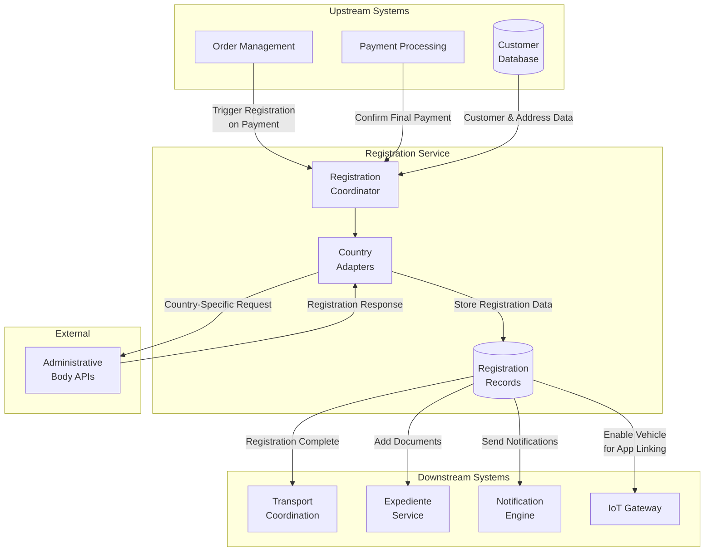

### Workflow Coordination

| Upstream Trigger | Registration Action | Downstream Effect |
|------------------|---------------------|-------------------|
| Payment confirmed | Initiate registration with country-specific adapter | Block delivery until complete |
| Vehicle data from factory | Provide vehicle specifications for registration | Ensure accurate registration documents |
| Customer address updated | Re-evaluate country/jurisdiction for registration | May require different adapter |
| Registration successful | Update vehicle state to "Registered" | Enable transport scheduling |
| Registration complete | Store license plate and documents | Add to customer expediente |
| Registration complete | Notify customer | Email + mobile app notification |
| Registration complete | Enable vehicle linking | IoT gateway allows mobile app to pair |

**Sources:** [enunciado.md:14-17]()

---

## Security and Compliance

### Legal and Regulatory Requirements

Vehicle registration is a heavily regulated process that must comply with multiple legal frameworks:

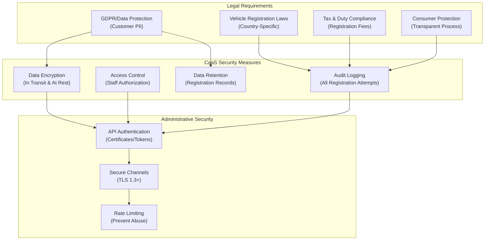

### Audit and Traceability

Every registration attempt, whether successful or failed, must be logged for audit and compliance purposes:

| Audit Field | Description | Retention Period |
|-------------|-------------|------------------|
| `timestamp` | Exact time of registration attempt | Permanent |
| `vehicle_vin` | Vehicle identification number | Permanent |
| `customer_id` | Customer identifier | Permanent |
| `country_code` | Target country for registration | Permanent |
| `api_request` | Full API request payload (sanitized) | 7 years |
| `api_response` | Full API response | 7 years |
| `staff_user_id` | If manual intervention occurred | 7 years |
| `registration_result` | Success/failure status | Permanent |
| `license_plate` | If successful | Permanent |
| `error_code` | If failed | 7 years |

**Sources:** [enunciado.md:15]()

---

## System Constraints and Limitations

### Known Constraints

1. **Synchronous Operation Timeout**: Maximum wait time of 120 seconds for registration API response
2. **Country Coverage**: Not all countries may have API integration; some may require manual processing
3. **Rate Limits**: Administrative APIs often have rate limits (e.g., 100 requests/hour)
4. **Operating Hours**: Some administrative systems only operate during business hours
5. **Dependency**: Registration cannot proceed without successful payment confirmation

### Performance Considerations

- **Expected Response Time**: 5-30 seconds for normal registration
- **Maximum Timeout**: 120 seconds before retry
- **Concurrency**: Support for up to 50 simultaneous registration requests
- **Queue Depth**: Can queue up to 1000 pending registrations during system unavailability

**Sources:** [enunciado.md:14-17](), [pasame las preguntas y sus respuestas a markdown.md:26-29]()

---

## Summary

The Administrative Registration Integration is a **critical synchronous blocking operation** that enables legal vehicle ownership transfer after purchase. Key characteristics:

- **Blocking**: Delivery cannot proceed until registration completes
- **Synchronous**: Unlike other integrations, CaaS waits for the response
- **Country-specific**: Different adapters for different jurisdictions
- **Post-payment**: Occurs only after customer completes final payment
- **Error-critical**: Requires careful error handling as customer has already paid
- **Audit-required**: Full logging for legal compliance

The integration bridges the purchase workflow and delivery workflow, serving as the legal gateway that authorizes vehicle operation on public roads.

**Sources:** [enunciado.md:14-17](), [pasame las preguntas y sus respuestas a markdown.md:26-29]()