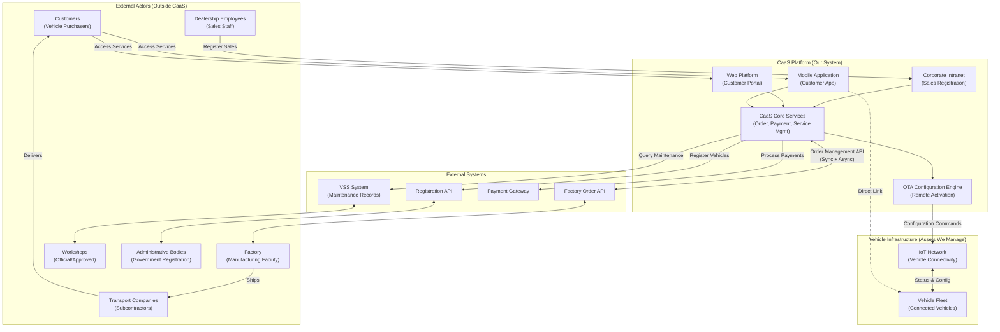
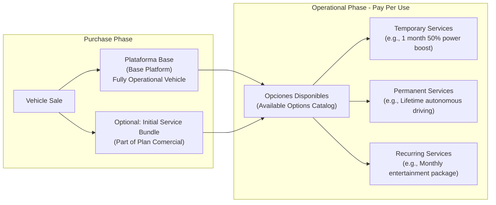
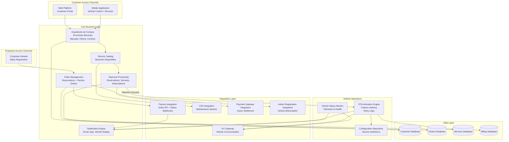
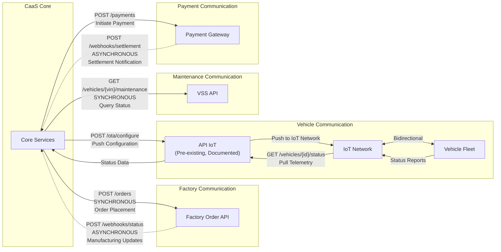
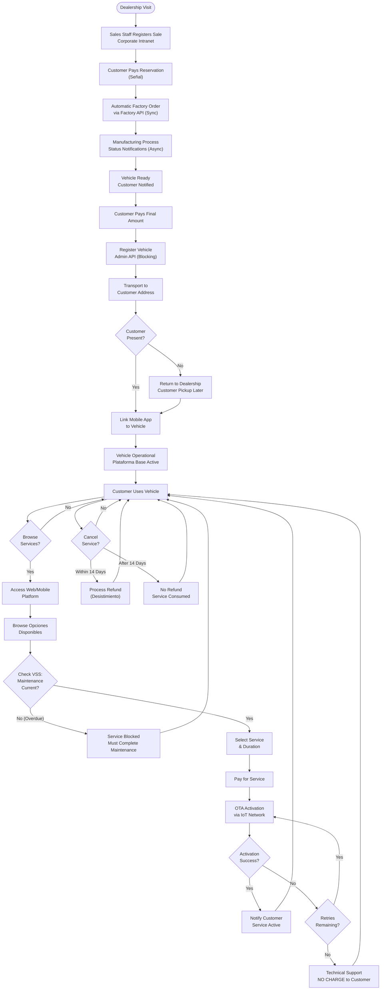

# Overview

Relevant source files

The following files were used as context for generating this wiki page:

- [enunciado.md](enunciado.md)
- [pasame las preguntas y sus respuestas a markdown.md](pasame las preguntas y sus respuestas a markdown.md)

## Purpose and Scope

This page provides a technical introduction to the Car as a Service (CaaS) system, its architecture, and core capabilities. It establishes the system context, defines key components, and explains how CaaS enables dynamic vehicle feature management through Over-The-Air (OTA) configuration.

For detailed information about specific topics:
- Business model and revenue streams: see [Business Model and Concept](#2)
- Complete customer journey workflows: see [Customer Journey](#4)
- External system integration details: see [External System Integrations](#5)
- Technical architecture specifications: see [System Architecture](#3)

**Sources:** [enunciado.md:1-23](), [pasame las preguntas y sus respuestas a markdown.md:1-104]()

---

## What is Car as a Service (CaaS)?

CaaS is an automotive sales and service platform that implements a pay-per-use business model for vehicle features. The system enables customers to purchase a base vehicle platform and dynamically activate or deactivate optional features on-demand throughout the vehicle's lifecycle.

**Core Capabilities:**
- Vehicle sales and order management integrated with manufacturing facilities
- Dynamic feature activation via OTA configuration
- Subscription and one-time payment processing for vehicle services
- Real-time vehicle connectivity through IoT infrastructure
- Maintenance tracking and service eligibility management
- Customer self-service through web and mobile platforms

**Technical Foundation:**
The system leverages pre-installed vehicle firmware where all functionality exists in a dormant state. CaaS activates or deactivates features remotely without requiring physical workshop visits or software updates.

**Sources:** [enunciado.md:1-7](), [pasame las preguntas y sus respuestas a markdown.md:54-56]()

---

## System Boundaries and External Actors

The CaaS platform operates as the central orchestration system between multiple external actors and infrastructure components. Understanding what is inside versus outside the system is critical for architectural clarity.

### System Context Diagram

### Key Architectural Decisions

| Boundary | Entity | Classification | Rationale |
|----------|--------|----------------|-----------|
| **External** | Customers | Actor | Users who purchase and use services; not part of system implementation |
| **External** | Dealership Employees | Actor | Use intranet to register sales but are not system components |
| **External** | Factory | Actor | Separate legal/operational entity with its own systems |
| **External** | Workshops | Actor | Independent service providers using VSS system |
| **Internal** | Intranet, Web, Mobile | System Components | Access channels we develop and maintain |
| **Internal** | Core Services | System Components | Business logic we implement |
| **Internal** | OTA Engine | System Component | Feature activation logic we implement |
| **Infrastructure** | IoT Network | Managed Asset | Communication infrastructure owned by CaaS organization |
| **Infrastructure** | Vehicles | Managed Asset | Physical assets we sell but remain connected to our systems |

**Critical Distinction:** Vehicles are **not actors**—they are infrastructure components that receive configurations and report status. They do not initiate use cases; customers and employees do.

**Sources:** [pasame las preguntas y sus respuestas a markdown.md:11-16](), [enunciado.md:8-9]()

---

## Core Business Concept: Platform Base + Optional Services

### The Two-Tier Model

### Service Characteristics

| Service Type | Payment Model | Duration | Example |
|--------------|---------------|----------|---------|
| **Plataforma Base** | One-time purchase | Vehicle lifetime | Basic operational vehicle with essential features |
| **Initial Bundle** | Included in vehicle purchase | Per plan comercial | Customer may purchase base + some options upfront |
| **Temporary Service** | Pay-per-use | Fixed duration (days/months) | 50% power increase for 1 month |
| **Permanent Service** | Pay-per-use | Vehicle lifetime | Highway autonomous driving |
| **Recurring Subscription** | Mes vencido (post-paid) | Monthly renewable | Entertainment streaming services |

### Available Options (Opciones Disponibles)

The system supports various categories of optional services, all pre-installed in vehicle firmware:

- **Performance enhancements**: Power increases (e.g., 50% boost)
- **Autonomous driving**: Highway autopilot, parking assist
- **Traction modes**: Off-road, snow, sport configurations
- **Climate systems**: Advanced HVAC, seat heating/cooling
- **Entertainment**: Streaming services, premium audio
- **Driver assistance**: Lane keeping, adaptive cruise control

**Technical Implementation:** All functionality exists in the vehicle firmware. CaaS only activates/deactivates features remotely—no software updates are required for service delivery.

**Sources:** [enunciado.md:3-5](), [pasame las preguntas y sus respuestas a markdown.md:54-56]()

---

## High-Level Component Architecture

### Main Subsystems

### Component Responsibilities

| Component | Primary Responsibility | Key Interactions |
|-----------|------------------------|------------------|
| **Web Platform** | Customer self-service portal for browsing and purchasing services | Accesses Expediente de Compra, Service Catalog |
| **Mobile Application** | Customer app for services + direct vehicle control | Accesses Expediente, communicates directly with vehicle |
| **Corporate Intranet** | Dealership interface for registering vehicle sales | Creates orders, registers customer data |
| **Order Management** | Handles vehicle reservations, factory orders, and delivery tracking | Factory API (sync orders), Admin API (registration) |
| **Service Catalog** | Manages available options, pricing, and eligibility rules | VSS (maintenance checks), Payment processing |
| **Payment Processing** | Processes reservations, final payments, and service payments | Payment Gateway, triggers OTA activation |
| **Expediente de Compra** | Central customer data repository containing purchase history, manuals, invoices | All customer-facing channels |
| **OTA Activation Engine** | Delivers services via remote configuration with retry logic | IoT Gateway, Configuration Repository |
| **Notification Engine** | Multi-channel notifications (email, app push, vehicle display) | Receives events from all subsystems |
| **IoT Gateway** | Single point of vehicle communication | Vehicle fleet via IoT Network |
| **Factory Integration** | Synchronous order placement + asynchronous status updates | Factory Order API |
| **VSS Integration** | Queries maintenance status to gate service availability | VSS System (read-only) |

**Sources:** [enunciado.md:8-22](), [pasame las preguntas y sus respuestas a markdown.md:31-56]()

---

## Integration Architecture and Communication Patterns

### External System Communication Model

### Integration Pattern Summary

| External System | Direction | Pattern | Sync/Async | Notes |
|-----------------|-----------|---------|------------|-------|
| **Factory API** | CaaS → Factory | Request-Response | Synchronous | Order placement with immediate confirmation |
| **Factory API** | Factory → CaaS | Webhook | Asynchronous | Manufacturing status updates (in progress, ready, shipped) |
| **API IoT** | CaaS → Vehicles | Command Push | Asynchronous | OTA configuration commands via IoT network |
| **API IoT** | Vehicles → CaaS | Status Pull | Synchronous | Telemetry and health status queries |
| **VSS System** | CaaS → VSS | Query | Synchronous | Read-only maintenance status checks |
| **Payment Gateway** | CaaS → Gateway | Request-Response | Synchronous | Payment initiation |
| **Payment Gateway** | Gateway → CaaS | Webhook | Asynchronous | Settlement confirmation (CaaS assumes risk) |
| **Admin API** | CaaS → Government | Request-Response | Synchronous | Vehicle registration (blocking operation) |

### Critical Integration Constraints

1. **API IoT is Pre-existing:** The IoT API is already documented, tested, and ready for CaaS. It was developed in a previous project and cannot be modified. Any integration issues are attributed to the previous project, not CaaS.

2. **VSS is External:** The Vehicle Service System (VSS) is maintained independently by workshops. CaaS queries it but does not write to it. Vehicles do not self-report maintenance status via IoT.

3. **Asynchronous Risk Assumption:** CaaS delivers services immediately after payment initiation, before bank settlement is confirmed. This optimizes customer experience but requires risk management processes.

4. **Factory Hybrid Model:** Order placement is synchronous (immediate confirmation), but manufacturing status arrives asynchronously via webhooks as production progresses.

**Sources:** [pasame las preguntas y sus respuestas a markdown.md:31-44](), [pasame las preguntas y sus respuestas a markdown.md:62-73](), [pasame las preguntas y sus respuestas a markdown.md:77-82]()

---

## Key Business Rules and Constraints

### User Management

- **No Public Registration:** All users must be known and controlled. No self-registration capability exists.
- **Customer Provisioning:** Customers receive credentials via email after dealership sales registration.
- **Employee Access:** Dealership employees use corporate intranet with pre-provisioned accounts.
- **No External SSO:** No integration with Google, Microsoft, or other external identity providers.

### Payment and Risk

- **Vehicle Purchase:** Requires reservation payment (señal) + final payment before registration.
- **Service Delivery:** Immediate activation after payment initiation (before settlement confirmation).
- **Risk Assumption:** CaaS assumes financial risk for asynchronous payment settlement.
- **Subscription Billing:** Mes vencido (post-paid) model—charge at month end for consumed services.

### OTA Activation

- **Retry Logic:** Failed activations trigger N retry attempts with status monitoring.
- **No Charge Rule:** If OTA activation fails after all retries, **customer is not charged**.
- **Technical Support:** Failed activations are escalated to technical support for manual resolution.
- **Customer Notification:** Customers receive status updates for all activation attempts.

### Maintenance and Service Access

- **Maintenance Does Not Block Vehicle:** A vehicle cannot be prevented from operating, even if maintenance is overdue.
- **Service Gating:** Some optional services may be blocked if required maintenance is overdue (safety rationale).
- **Warranty Loss:** Missing maintenance voids warranty but does not revoke already-purchased services.
- **VSS as Source of Truth:** Maintenance status is queried from VSS system, not reported by vehicles.

### Cancellation and Refunds (Desistimiento)

| Service Duration | Cancellation Window | Refund Eligibility |
|------------------|---------------------|-------------------|
| > 14 days | First 14 days | Full refund (legal requirement) |
| < 14 days | Anytime | Full refund (legal requirement) |
| After window | Not applicable | No refund (service consumed) |

- **Legal Compliance:** Implements EU distance selling regulations (derecho de desistimiento).
- **Subscription Cancellation:** Customer can cancel recurring subscriptions anytime; no future charges.
- **Theft Scenario:** Customer may cancel pending services but cannot refund already-delivered services past the desistimiento period.

### Delivery and Transport

- **Failed Home Delivery:** If customer is not present, vehicle returns to dealership for customer pickup.
- **Never Leave Vehicle Unattended:** Vehicles are never left in the street due to security risks.
- **Payment Failure Consequences:** If final payment fails, vehicle becomes dealership stock (sin asignar). Customer loses reservation entirely.

**Sources:** [pasame las preguntas y sus respuestas a markdown.md:15-16](), [pasame las preguntas y sus respuestas a markdown.md:24-28](), [pasame las preguntas y sus respuestas a markdown.md:48-53](), [pasame las preguntas y sus respuestas a markdown.md:66-73](), [pasame las preguntas y sus respuestas a markdown.md:84-96]()

---

## End-to-End Process Flow Overview

The following diagram captures the complete customer journey from initial purchase through ongoing service lifecycle:

### Process Phases

1. **Sales Registration:** Dealership staff register sale in corporate intranet, capturing customer data and plan comercial.
2. **Order and Manufacturing:** Automatic order placement to factory (synchronous), with asynchronous status updates during production.
3. **Payment and Registration:** Final payment triggers vehicle registration with government administrative bodies.
4. **Delivery:** Home delivery with fallback to dealership pickup if customer unavailable.
5. **Operational Lifecycle:** Continuous cycle of vehicle use and dynamic service activation.
6. **Service Activation:** Maintenance-gated service access with robust OTA retry logic and customer protection (no charge on failure).
7. **Cancellation:** Legal desistimiento (withdrawal) rights based on service duration and timing.

**Sources:** [enunciado.md:8-22](), [pasame las preguntas y sus respuestas a markdown.md:18-29](), [pasame las preguntas y sus respuestas a markdown.md:48-53](), [pasame las preguntas y sus respuestas a markdown.md:84-96]()

---

## System Characteristics and Design Principles

### Architectural Principles

| Principle | Implementation | Rationale |
|-----------|----------------|-----------|
| **Customer Protection** | Never charge for failed OTA activations | Builds trust; meets legal obligations for service delivery |
| **Risk-Tolerant Delivery** | Activate services before payment settlement | Optimizes customer experience over financial risk |
| **Maintenance-Gated Safety** | Block certain services if maintenance overdue | Safety and liability protection |
| **Legal Compliance** | Built-in desistimiento (14-day withdrawal) | EU distance selling regulations |
| **Single Source of Truth** | Expediente de Compra for customer data | Consistency across web, mobile, and intranet channels |
| **Pre-installed Functionality** | All features exist in firmware; activation only | No software updates required for service delivery |
| **Asynchronous Manufacturing** | Non-blocking factory status updates | System remains responsive during long manufacturing cycles |
| **Retry with Escalation** | N retries before technical support escalation | Handles transient IoT network failures gracefully |

### Technical Constraints

1. **API IoT is Fixed:** Pre-existing, documented, tested. Cannot be modified for CaaS.
2. **No Vehicle Blocking:** Cannot prevent vehicle operation, even for maintenance non-compliance.
3. **VSS is External:** Read-only access to maintenance records; workshops maintain the data.
4. **Multi-Country Registration:** Admin API must support country-specific vehicle registration requirements.
5. **Known Users Only:** No public registration; all users pre-provisioned by dealership or system administrators.

### Scalability Considerations

- **IoT Network:** Must handle bidirectional communication with entire vehicle fleet.
- **Notification Engine:** Multi-channel delivery (email, push, SMS, vehicle display) for all customer events.
- **Payment Processing:** Supports concurrent transactions for reservations, services, and subscriptions.
- **Retry Logic:** OTA engine must queue and retry failed activations without blocking other operations.
- **Asynchronous Integration:** Factory and payment webhooks enable non-blocking external system communication.

**Sources:** [pasame las preguntas y sus respuestas a markdown.md:11-16](), [pasame las preguntas y sus respuestas a markdown.md:34-38](), [pasame las preguntas y sus respuestas a markdown.md:48-53](), [pasame las preguntas y sus respuestas a markdown.md:66-73](), [pasame las preguntas y sus respuestas a markdown.md:77-82]()

---

## Document Organization

This wiki is organized hierarchically to guide readers from high-level concepts to detailed technical specifications:

### Business Context (Sections 2.x)
Understanding the business model, actors, and policies is essential before diving into technical details. Start here to understand *why* the system works the way it does.

### Architecture (Sections 3.x)
Technical architecture documentation covering system components, integration patterns, and design decisions. Critical for developers and architects.

### Customer Journey (Sections 4.x)
Process flows and user experience documentation. Explains how customers interact with the system from purchase through service lifecycle.

### External Integrations (Sections 5.x)
Detailed integration specifications for Factory API, VSS, IoT/OTA, Payment Gateway, and Administrative Registration systems.

### Service Lifecycle (Sections 6.x)
Deep dive into service catalog management, OTA activation, maintenance gating, and cancellation workflows.

### Payments (Sections 7.x)
Payment types, billing models, risk management, and financial workflows.

### Operations (Sections 8.x)
Operational processes including sales, manufacturing, delivery, and maintenance management.

### Failure Handling (Sections 9.x)
System behavior in failure scenarios, edge cases, and error recovery procedures.

### Technical Reference (Sections 10.x)
API documentation guidelines, terminology glossary, and technical reference material.

**Sources:** Table of contents provided in prompt