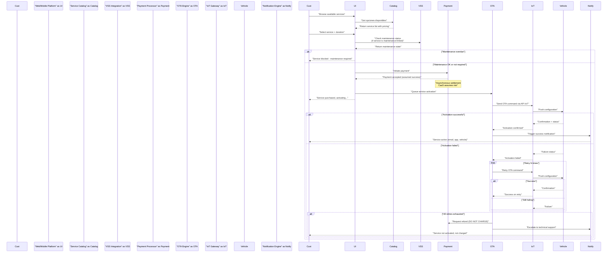
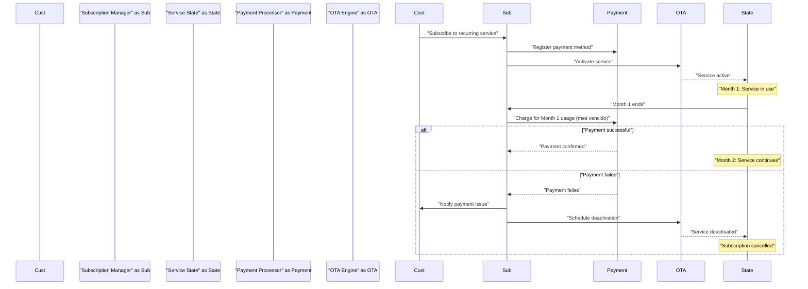
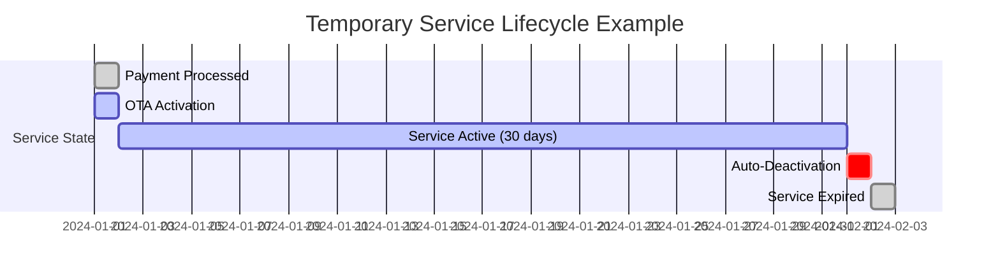

# Service Lifecycle Management

<details>
<summary>Relevant source files</summary>

The following files were used as context for generating this wiki page:

- [enunciado.md](enunciado.md)
- [pasame las preguntas y sus respuestas a markdown.md](pasame las preguntas y sus respuestas a markdown.md)

</details>


## Purpose and Scope

This document provides a comprehensive overview of how services are managed throughout their complete lifecycle in the CaaS platform, from initial catalog definition through purchase, activation, usage, and eventual cancellation or expiration.

Service lifecycle management encompasses:
- **Service catalog structure** and available service types (plataforma base and opciones disponibles)
- **Activation workflows** using OTA (Over The Air) delivery mechanisms
- **Billing models** including one-time payments, temporary services, and recurring subscriptions
- **Maintenance-gated access** rules that link service availability to vehicle maintenance status
- **Cancellation and refund policies** including legal desistimiento (right of withdrawal) requirements

For detailed information about specific aspects of service lifecycle management:
- Service catalog structure and pricing models: see [Service Catalog and Pricing](#6.1)
- OTA activation technical implementation: see [OTA Service Activation](#6.2)
- Maintenance requirements and service access rules: see [Maintenance-Linked Service Access](#6.3)
- Cancellation procedures and refund policies: see [Service Cancellation and Refunds](#6.4)

For payment processing and billing workflows, see [Payment and Billing](#7).

Sources: [enunciado.md:1-23](), [pasame las preguntas y sus respuestas a markdown.md:1-104]()

---

## Service Types and Models

The CaaS system offers two fundamental categories of vehicle functionality:

| Service Type | Description | Activation Timing | Payment Model |
|--------------|-------------|-------------------|---------------|
| **Plataforma Base** | Base platform with essential vehicle features that make the vehicle fully operational | Included at delivery | One-time purchase with vehicle |
| **Opciones Disponibles** | Optional features that complement the base platform (e.g., 50% power increase, autonomous driving, climate control, entertainment systems) | On-demand after vehicle delivery | Pay-per-use (pago por uso) |

### Optional Service Duration Models

Optional services (opciones disponibles) can be purchased with different duration models:

| Duration Model | Description | Billing Pattern | Use Case |
|----------------|-------------|-----------------|----------|
| **Temporary** | Service active for a specific time period (e.g., 1 month, 3 months) | Single upfront payment | Short-term needs (winter traction mode, vacation entertainment) |
| **Permanent** | Service active until end of vehicle lifecycle | Single upfront payment | Features customer wants to keep indefinitely |
| **Planned/Recurring** | Service scheduled for future activation or recurring subscription | Monthly billing (mes vencido) | Seasonal needs or continuous service |

### Pre-installed Functionality Model

All optional services are **pre-installed in the vehicle firmware** at the factory. The CaaS system performs only **activation or deactivation** of these pre-existing capabilities. This architectural decision means:
- No software updates required for service delivery
- Service activation is a configuration change, not a software installation
- All vehicle hardware capabilities are present from factory delivery
- OTA activation is lightweight and fast

Sources: [enunciado.md:3-5](), [pasame las preguntas y sus respuestas a markdown.md:55-56]()

---

## Service Lifecycle State Machine

The following diagram illustrates the complete state machine for an optional service from catalog availability through activation and eventual cancellation:

**Diagram: Service Lifecycle State Transitions**

```mermaid
stateDiagram-v2
    [*] --> "Catalog_Available": "Service defined in catalog"
    
    "Catalog_Available" --> "Maintenance_Check": "Customer requests service"
    
    "Maintenance_Check" --> "Available_For_Purchase": "Maintenance OK or<br/>service not maintenance-linked"
    "Maintenance_Check" --> "Blocked_By_Maintenance": "Maintenance overdue"
    
    "Blocked_By_Maintenance" --> "Catalog_Available": "Customer notified,<br/>must complete maintenance"
    
    "Available_For_Purchase" --> "Payment_Processing": "Customer selects duration<br/>and initiates payment"
    
    "Payment_Processing" --> "Payment_Failed": "Payment gateway<br/>returns failure"
    "Payment_Processing" --> "OTA_Queue": "Payment successful<br/>(or assumed successful)"
    
    "Payment_Failed" --> "Catalog_Available": "Notify customer,<br/>service not activated"
    
    "OTA_Queue" --> "OTA_Attempt": "Service queued<br/>for activation"
    
    "OTA_Attempt" --> "Active": "OTA activation<br/>successful"
    "OTA_Attempt" --> "OTA_Retry": "Activation failed"
    
    "OTA_Retry" --> "OTA_Attempt": "Retry N times"
    "OTA_Retry" --> "Technical_Support": "All retries exhausted"
    
    "Technical_Support" --> "Refund_Issued": "Customer NOT charged,<br/>refund if already charged"
    "Refund_Issued" --> "Catalog_Available": "Service returned to<br/>available state"
    
    "Active" --> "In_Use": "Service delivered<br/>to vehicle"
    
    "In_Use" --> "Cancellation_Requested": "Customer requests<br/>cancellation"
    "In_Use" --> "Expired": "Service duration ends<br/>(temporary services)"
    "In_Use" --> "Subscription_Billing": "Monthly billing cycle<br/>(recurring services)"
    
    "Cancellation_Requested" --> "Refund_Evaluation": "Check desistimiento<br/>eligibility"
    
    "Refund_Evaluation" --> "Refund_Granted": "Within 14 days OR<br/>service < 14 days duration"
    "Refund_Evaluation" --> "No_Refund": "After 14 days<br/>for service > 14 days"
    
    "Refund_Granted" --> "Deactivated": "Service deactivated,<br/>customer refunded"
    "No_Refund" --> "Deactivated": "Service deactivated,<br/>no refund"
    
    "Subscription_Billing" --> "Payment_OK": "Month-end billing<br/>successful"
    "Subscription_Billing" --> "Subscription_Cancelled": "Payment failed or<br/>customer cancels"
    
    "Payment_OK" --> "In_Use": "Service continues"
    "Subscription_Cancelled" --> "Deactivated": "Service deactivated"
    
    "Expired" --> "Deactivated": "Temporary service<br/>natural expiration"
    "Deactivated" --> [*]
```

Sources: [pasame las preguntas y sus respuestas a markdown.md:48-96]()

---

## Service Activation Workflow

The service activation workflow demonstrates how purchased services transition from payment to active state in the vehicle. This workflow is **asynchronous** and includes robust failure handling.

**Diagram: Service Purchase to Activation Flow**



### Critical Business Rule: No Charge on Failed Activation

The most important rule in the activation workflow is: **If OTA activation fails after all retries, the customer MUST NOT be charged**. This rule applies even if payment was already processed. The system must issue a refund and escalate the issue to technical support.

This customer-protection policy ensures that customers only pay for services they actually receive, maintaining trust and legal compliance.

Sources: [pasame las preguntas y sus respuestas a markdown.md:48-56](), [enunciado.md:19-20]()

---

## Billing Models and Payment Timing

The CaaS platform implements multiple billing models depending on service type:

### One-Time Services (Temporary and Permanent)

| Phase | Timing | Risk Management |
|-------|--------|-----------------|
| **Payment Initiation** | Customer completes payment via payment gateway | Payment sent to gateway |
| **Service Delivery** | Immediate (before bank settlement) | **CaaS assumes settlement risk** |
| **Payment Settlement** | Asynchronous (delayed bank confirmation) | May arrive minutes to hours later |
| **Reconciliation** | Backend process matches payments to activations | Handles failed settlements |

This model prioritizes **customer experience over financial risk**. Services activate immediately without waiting for bank confirmation, accepting the possibility of chargebacks or failed settlements.

### Subscription Services (Recurring)

Subscription services use a **mes vencido** (post-paid, in arrears) billing model:

1. **Service Activation**: Subscription service activates immediately upon sign-up
2. **Month Usage**: Customer uses service throughout the month
3. **Month End**: System calculates usage and charges for the completed month
4. **Payment Collection**: Charge customer's payment method for previous month's usage
5. **Payment Failure Handling**: 
   - Failed payment triggers subscription cancellation
   - Service deactivated at next billing cycle
   - No prorated refunds for partial month usage

**Diagram: Subscription Billing Cycle**



Sources: [pasame las preguntas y sus respuestas a markdown.md:77-82]()

---

## Maintenance-Linked Service Access

Certain optional services have dependencies on the vehicle's maintenance status for **safety and warranty reasons**. Before allowing purchase of these services, the system queries the **VSS (Vehicle Service System)** to verify maintenance compliance.

### Maintenance Verification Flow

```mermaid
flowchart TD
    "ServiceRequest"["Customer requests<br/>optional service"]
    "CheckDependency"{"Service requires<br/>maintenance check?"}
    "QueryVSS"["Query VSS API<br/>for maintenance status"]
    "EvaluateStatus"{"Maintenance<br/>current?"}
    "AllowPurchase"["Allow service<br/>purchase"]
    "BlockPurchase"["Block service<br/>purchase"]
    "NotifyCustomer"["Notify customer:<br/>Complete maintenance required"]
    "DirectToVSS"["Direct to workshop<br/>locator"]
    
    "ServiceRequest" --> "CheckDependency"
    "CheckDependency" -->|"Yes"| "QueryVSS"
    "CheckDependency" -->|"No"| "AllowPurchase"
    
    "QueryVSS" --> "EvaluateStatus"
    "EvaluateStatus" -->|"Current"| "AllowPurchase"
    "EvaluateStatus" -->|"Overdue"| "BlockPurchase"
    
    "BlockPurchase" --> "NotifyCustomer"
    "NotifyCustomer" --> "DirectToVSS"
```

### Maintenance Blocking Rules

| Scenario | System Behavior | Rationale |
|----------|----------------|-----------|
| **Service not maintenance-linked** | Allow purchase without VSS check | No safety dependency |
| **Maintenance current** | Allow purchase after VSS confirmation | Safe to activate service |
| **Maintenance overdue** | Block new service purchase | Safety risk or warranty void |
| **Service already active** | Continue service (no deactivation) | Cannot block already-paid services |
| **Base platform (plataforma base)** | Never blocked by maintenance | Vehicle must remain operational |

### Critical Constraint: Cannot Block Vehicle Operation

Per legal and safety requirements, the system **cannot prevent the vehicle from operating** due to maintenance issues. Only the police have authority to immobilize vehicles.

The maintenance-gating mechanism:
- ✅ **CAN** prevent activation of new premium services
- ✅ **CAN** void warranty coverage
- ❌ **CANNOT** deactivate already-purchased services
- ❌ **CANNOT** disable the plataforma base
- ❌ **CANNOT** prevent vehicle from driving

Sources: [pasame las preguntas y sus respuestas a markdown.md:60-73](), [enunciado.md:22-23]()

---

## Service Duration and Expiration

Services have different expiration behaviors based on their duration model:

### Temporary Services



Temporary services:
1. Activate immediately after successful OTA delivery
2. Remain active for the purchased duration (e.g., 1 month, 3 months)
3. **Automatically deactivate** at expiration (no customer action required)
4. Customer receives notification before expiration and at deactivation
5. Can be repurchased from catalog after expiration

### Permanent Services

Permanent services:
1. Activate immediately after successful OTA delivery
2. Remain active **until end of vehicle lifecycle**
3. No expiration date
4. Can be cancelled subject to desistimiento (withdrawal) rules
5. If cancelled within withdrawal period, service deactivates and customer receives refund

### Subscription Services

Subscription services:
1. Activate immediately upon subscription
2. Remain active as long as monthly payments succeed
3. **Automatically renew** each month (no customer action required)
4. Deactivate only on: payment failure, customer cancellation, or vehicle lifecycle end
5. Billed monthly in arrears (mes vencido model)

Sources: [enunciado.md:19-22](), [pasame las preguntas y sus respuestas a markdown.md:82-89]()

---

## Desistimiento (Right of Withdrawal)

Spanish and EU law requires that distance sales (venta a distancia) provide customers with a right of withdrawal (derecho de desistimiento). The CaaS platform implements these legal requirements with duration-dependent rules:

### Refund Eligibility Rules

```mermaid
flowchart TD
    "CancelRequest"["Customer requests<br/>service cancellation"]
    "ServiceDuration"{"Service<br/>duration?"}
    "CheckTime"{"Time since<br/>activation?"}
    "RefundGranted"["Refund GRANTED<br/>Service deactivated"]
    "RefundDenied"["Refund DENIED<br/>Service deactivated<br/>if requested"]
    
    "CancelRequest" --> "ServiceDuration"
    
    "ServiceDuration" -->|"Service > 14 days"| "CheckTime"
    "ServiceDuration" -->|"Service < 14 days"| "RefundGranted"
    
    "CheckTime" -->|"Within 14 days"| "RefundGranted"
    "CheckTime" -->|"After 14 days"| "RefundDenied"
```

| Service Duration | Cancellation Window | Refund Policy | Legal Basis |
|------------------|---------------------|---------------|-------------|
| **< 14 days** | Anytime during service period | Full refund | Short duration = full withdrawal period |
| **> 14 days** | Within first 14 days only | Full refund if within 14 days, none after | EU distance selling directive |
| **Subscription** | Anytime | Pro-rated to current month end (mes vencido) | Recurring contract rules |
| **Failed OTA** | N/A (automatic) | Full refund (never charged) | Service not delivered |

### Configurable Post-Cancellation Policy

The system includes a configurable business rule: services cancelled due to customer dissatisfaction can be **removed from that customer's catalog**, preventing repurchase. This policy:
- Discourages abuse of refund policies
- Can be enabled/disabled per service type
- Tracked in customer service history

Sources: [pasame las preguntas y sus respuestas a markdown.md:84-96]()

---

## Special Lifecycle Scenarios

### Vehicle Theft

When a vehicle is reported stolen, the service lifecycle management system handles active services according to specific rules:

| Service State | System Behavior | Rationale |
|---------------|----------------|-----------|
| **Delivered services** | Subject to normal desistimiento rules | Service was consumed before theft |
| **Pending services** (scheduled future activation) | Can be cancelled by customer | Service not yet delivered |
| **Active subscriptions** | Can be cancelled by customer | Recurring charges should stop |
| **Expired desistimiento period** | No automatic refund | Legal withdrawal period has passed |

**Important**: Vehicle theft does **NOT** trigger automatic refunds. The customer must explicitly request cancellation of pending/subscription services. Already-delivered services follow standard refund rules.

### Warranty Loss Due to Maintenance

If a customer fails to maintain the vehicle according to the official maintenance plan:

1. **Warranty Status**: Vehicle loses manufacturer warranty
2. **Service Blocking**: New maintenance-linked services are blocked from purchase
3. **Active Services**: Continue to function (cannot be deactivated)
4. **Customer Notification**: System notifies customer of warranty loss and service restrictions
5. **Resolution**: Customer must complete overdue maintenance at official workshop to restore access

The system queries VSS to determine maintenance status and enforces these rules at the service purchase boundary, not at the activation boundary.

Sources: [pasame las preguntas y sus respuestas a markdown.md:91-96](), [pasame las preguntas y sus respuestas a markdown.md:66-73]()

---

## Service Lifecycle Integration Points

The service lifecycle management subsystem integrates with multiple external and internal systems to deliver end-to-end functionality:

**Diagram: Service Lifecycle System Integration**

```mermaid
graph TB
    subgraph "Customer Access Layer"
        "WebPlatform"["Web Platform"]
        "MobileApp"["Mobile Application"]
        "Expediente"["Expediente de Compra"]
    end
    
    subgraph "Service Lifecycle Core"
        "ServiceCatalog"["Service Catalog<br/>Opciones Disponibles"]
        "ActivationEngine"["OTA Activation Engine<br/>Retry Logic"]
        "BillingManager"["Billing Manager<br/>Mes Vencido"]
        "CancellationHandler"["Cancellation Handler<br/>Desistimiento Rules"]
    end
    
    subgraph "External Integrations"
        "VSSIntegration"["VSS Integration<br/>Maintenance Queries"]
        "PaymentGateway"["Payment Gateway<br/>Async Settlement"]
        "IoTAPI"["API IoT<br/>Vehicle Communication"]
    end
    
    subgraph "Internal Services"
        "NotificationEngine"["Notification Engine"]
        "RefundProcessor"["Refund Processor"]
        "TechSupport"["Technical Support Queue"]
    end
    
    subgraph "Data Stores"
        "ServiceDB"["Service Database<br/>Activations & History"]
        "ConfigRepo"["Configuration Repository<br/>Service Definitions"]
    end
    
    "WebPlatform" --> "Expediente"
    "MobileApp" --> "Expediente"
    
    "Expediente" --> "ServiceCatalog"
    "ServiceCatalog" --> "VSSIntegration"
    "ServiceCatalog" --> "PaymentGateway"
    
    "PaymentGateway" --> "ActivationEngine"
    "ActivationEngine" --> "IoTAPI"
    "ActivationEngine" --> "ConfigRepo"
    
    "ActivationEngine" --> "NotificationEngine"
    "ActivationEngine" --> "TechSupport"
    "ActivationEngine" --> "RefundProcessor"
    
    "ServiceCatalog" --> "BillingManager"
    "BillingManager" --> "PaymentGateway"
    
    "Expediente" --> "CancellationHandler"
    "CancellationHandler" --> "RefundProcessor"
    "CancellationHandler" --> "ActivationEngine"
    
    "ServiceCatalog" --> "ServiceDB"
    "ActivationEngine" --> "ServiceDB"
    "BillingManager" --> "ServiceDB"
    "CancellationHandler" --> "ServiceDB"
```

### Key Integration Dependencies

1. **VSS (Vehicle Service System)**: Queried before allowing purchase of maintenance-linked services
2. **API IoT**: Pre-existing, documented API for sending OTA commands to vehicles
3. **Payment Gateway**: Processes payments asynchronously; CaaS delivers services before settlement confirmation
4. **Notification Engine**: Multi-channel notifications (email, app push, vehicle display) for service lifecycle events
5. **Technical Support Queue**: Receives failed activation cases for manual intervention

Sources: [pasame las preguntas y sus respuestas a markdown.md:31-56](), [pasame las preguntas y sus respuestas a markdown.md:60-73]()

---

## Service Lifecycle Key Metrics

The service lifecycle management system should track the following operational metrics for business intelligence and system health monitoring:

| Metric Category | Key Metrics | Purpose |
|----------------|-------------|---------|
| **Activation Success** | OTA activation success rate, average retry count, technical support escalations | Monitor OTA reliability |
| **Billing Performance** | Subscription renewal rate, failed payment rate, mes vencido collection efficiency | Financial health |
| **Customer Behavior** | Service purchase rate, cancellation rate, desistimiento usage, repurchase rate | Product optimization |
| **Maintenance Gating** | Services blocked by maintenance, maintenance compliance rate, VSS query latency | Safety and compliance |
| **Refund Volume** | Refunds issued, refund reasons (OTA failure vs desistimiento), refund processing time | Customer satisfaction and cost |

These metrics inform business decisions about service catalog composition, pricing strategies, and system reliability investments.

Sources: [pasame las preguntas y sus respuestas a markdown.md:1-104]()