# Service Catalog and Pricing

Relevant source files

The following files were used as context for generating this wiki page:

- [enunciado.md](enunciado.md)
- [pasame las preguntas y sus respuestas a markdown.md](pasame las preguntas y sus respuestas a markdown.md)

## Purpose and Scope

This document defines the service catalog structure and pricing models used in the CaaS platform. It covers the distinction between the **plataforma base** (base platform) and **opciones disponibles** (optional services), the various pricing models (pay-per-use, temporary, permanent, subscription), and how services are organized and presented to customers.

For information about the business model context and value proposition, see [Platform Base and Optional Services](#2.1). For details on OTA activation mechanics, see [OTA Service Activation](#6.2). For maintenance requirements that gate service access, see [Maintenance-Linked Service Access](#6.3). For cancellation policies and refund rules, see [Service Cancellation and Refunds](#6.4).

**Sources:** [enunciado.md:1-23](), [pasame las preguntas y sus respuestas a markdown.md:1-104]()

---

## Service Categories

The CaaS platform organizes vehicle functionality into two fundamental categories that define the commercial model:

### Plataforma Base (Base Platform)

The **plataforma base** is the foundational vehicle configuration that customers purchase outright. It includes all features necessary to make the vehicle fully operational from delivery:

- Core drivetrain and propulsion system
- Standard safety features
- Basic infotainment and controls
- Essential connectivity for IoT communication
- Standard climate control
- Factory-mandated equipment by regulation

The base platform is **permanently active** and cannot be disabled. It represents the minimum viable product that customers own in perpetuity.

### Opciones Disponibles (Optional Services)

**Opciones disponibles** are optional features available for on-demand activation. These services enhance the base platform functionality and are enabled via the pay-per-use model. Example services include:

| Service Category | Example Features | Activation Method |
|-----------------|------------------|-------------------|
| Performance | 50% power increase | OTA configuration |
| Safety & Assistance | Driver assistance systems | OTA configuration |
| Autonomous Driving | Highway autonomous mode | OTA configuration |
| Traction & Handling | Terrain-specific modes (snow, off-road, sport) | OTA configuration |
| Climate | Advanced climatization systems | OTA configuration |
| Entertainment | Premium in-vehicle entertainment services | OTA configuration |

All optional service functionality is **pre-installed in the vehicle firmware**. The CaaS system does not deploy new software; it only activates or deactivates existing capabilities through configuration changes.

**Sources:** [enunciado.md:3-4](), [pasame las preguntas y sus respuestas a markdown.md:55-56]()

---

## Pricing Models

The CaaS platform supports multiple pricing models to accommodate different customer usage patterns and preferences. All service payments follow the **pago por uso** (pay-per-use) principle.

### Pricing Model Taxonomy

**Sources:** [enunciado.md:5-6](), [enunciado.md:21](), [pasame las preguntas y sus respuestas a markdown.md:82]()

### One-Time Payment Services

Customers pay once to activate a service for a defined period or permanently:

- **Temporary Services**: Active for a specific duration (e.g., 1 day, 1 week, 1 month, 3 months)
  - Payment is collected upfront before OTA activation
  - Service automatically deactivates at the end of the period
  - Subject to desistimiento (withdrawal rights) based on service duration
  
- **Permanent Services**: Active until the end of the vehicle's operational life
  - Single upfront payment
  - Cannot be deactivated by the system (customer owns the feature)
  - Subject to 14-day desistimiento period

### Recurring Payment Services (Subscriptions)

Subscription services provide ongoing access with monthly billing:

- **Billing Model**: **Mes vencido** (post-paid) — customers are charged at the end of each month for services consumed during that month
- **Payment Timing**: Charge occurs after service delivery, accepting settlement risk
- **Cancellation**: Customer can cancel at any time; no charges for future months
- **Renewal**: Automatic renewal unless customer explicitly cancels

**Sources:** [pasame las preguntas y sus respuestas a markdown.md:82](), [enunciado.md:5-6]()

---

## Service Duration Types and Scheduling

Services can be purchased for immediate activation or scheduled for future delivery:

### Immediate Activation

Default mode where service activation occurs immediately after successful payment:

**Sources:** [enunciado.md:19](), [pasame las preguntas y sus respuestas a markdown.md:47-53]()

### Planned/Scheduled Activation

Customers can schedule service activation for a future date or create recurring activation patterns:

- **Single Future Activation**: Service activates at a specified date/time
  - Example: Activate performance mode for a planned road trip next month
  - Payment collected upfront at time of purchase
  - OTA activation queued for scheduled time
  
- **Recurring Activation**: Service automatically renews at regular intervals
  - Example: Activate winter traction mode every December-February
  - Functions as a scheduled subscription
  - Payment timing depends on subscription vs. one-time model

**Sources:** [enunciado.md:21]()

---

## Service Catalog Structure

The service catalog must support discovery, filtering, and purchase workflows across web and mobile platforms. While implementation details are in the expediente system (see [Customer-Facing Platforms](#4.3)), the catalog structure defines how services are organized.

### Service Metadata

Each service in the catalog contains the following attributes:

| Attribute | Description | Example Values |
|-----------|-------------|----------------|
| Service ID | Unique identifier | `PERF_BOOST_50`, `AUTO_HIGHWAY`, `CLIMATE_ADV` |
| Service Name | Customer-facing name | "50% Power Increase", "Highway Autopilot" |
| Category | Functional grouping | Performance, Safety, Entertainment |
| Base Platform | Compatible platforms | Platform A, Platform B, All |
| Description | Feature explanation | "Increases engine output by 50% for enhanced acceleration" |
| Pricing Tiers | Available durations/types | 1-day: €10, 1-month: €50, Permanent: €500 |
| Maintenance Required | VSS check required | true/false |
| Maintenance Block | Required maintenance category | Engine, Electronics, None |

### Pricing Tiers and Duration Options

Services can offer multiple pricing tiers based on duration:

Pricing tiers typically follow diminishing marginal costs to incentivize longer commitments. The permanent option represents the full feature purchase, while subscription provides flexibility.

**Sources:** [enunciado.md:3-4](), [enunciado.md:21]()

---

## Maintenance-Linked Pricing Dependencies

Some services have maintenance requirements that affect availability and pricing. This creates conditional access rules in the catalog.

### Maintenance-Gated Services

Certain high-performance or safety-critical services require current maintenance to be purchased:

**Key Rules:**
- If maintenance is **overdue**, maintenance-gated services are **hidden or marked unavailable** in the catalog
- Already-activated services remain active; only **new purchases** are blocked
- The base platform is never affected by maintenance status
- Customers are notified to complete maintenance to unlock gated services

For full details on maintenance checking and VSS integration, see [Maintenance-Linked Service Access](#6.3).

**Sources:** [enunciado.md:23](), [pasame las preguntas y sus respuestas a markdown.md:66-70]()

---

## Payment Processing and Service Delivery

The pricing model integrates tightly with payment processing and OTA activation workflows.

### Payment-to-Activation Flow

```mermaid
sequenceDiagram
    participant Customer
    participant Catalog as "Service Catalog"
    participant Payment as "Payment Gateway"
    participant OTA as "OTA Engine"
    participant Vehicle
    
    Customer->>Catalog: "Browse opciones disponibles"
    Catalog->>Customer: "Display services + pricing tiers"
    Customer->>Catalog: "Select service + duration"
    Catalog->>Customer: "Display total price"
    Customer->>Payment: "Submit payment"
    
    Note over Payment: Async settlement<br/>CaaS assumes risk
    
    Payment->>OTA: "Payment initiated - proceed"
    OTA->>Vehicle: "OTA activation command"
    
    alt Activation Successful
        Vehicle->>OTA: "Activation confirmed"
        OTA->>Customer: "Service active notification"
    else Activation Failed
        Vehicle->>OTA: "Activation failed"
        OTA->>OTA: "Retry logic"
        alt Retry Succeeds
            OTA->>Customer: "Service active (delayed)"
        else All Retries Fail
            OTA->>Customer: "Technical issue - NO CHARGE"
            Note over Payment: Refund or do not settle
        end
    end
```

**Critical Business Rule:** If OTA activation fails after all retries, the customer is **not charged** for the service. The payment must either be refunded or never settled. This protects customer trust and meets legal obligations for delivered services.

**Sources:** [pasame las preguntas y sus respuestas a markdown.md:47-53](), [pasame las preguntas y sus respuestas a markdown.md:77-82]()

---

## Subscription Billing (Mes Vencido)

Subscription services use a post-paid billing model unique from one-time purchases.

### Billing Cycle

**Billing Process:**
1. **Start of Month**: Subscription activates via OTA
2. **During Month**: Customer uses service; no charges
3. **End of Month**: System calculates usage charge
4. **Billing Event**: Payment gateway processes charge for completed month
5. **Payment Success**: Subscription continues into next month
6. **Payment Failure**: Subscription cancelled; service deactivated

This **mes vencido** (past month) model means customers pay for consumption after delivery, creating settlement risk that CaaS accepts for improved customer experience.

**Sources:** [pasame las preguntas y sus respuestas a markdown.md:82]()

---

## Pricing Rules and Business Logic

The service catalog enforces several business rules that affect pricing and availability:

### Desistimiento-Based Pricing Display

Service pricing must account for withdrawal rights (desistimiento):

| Service Duration | Withdrawal Period | Pricing Implication |
|------------------|-------------------|---------------------|
| < 14 days | Anytime | Lower pricing to offset refund risk |
| > 14 days | First 14 days only | Standard pricing |
| Subscription | Anytime (cancel future) | Monthly rate accounts for churn |
| Permanent | First 14 days | Premium pricing with refund risk |

Services shorter than 14 days face higher refund risk since customers can cancel anytime, which may influence pricing strategy.

**Sources:** [pasame las preguntas y sus respuestas a markdown.md:85-89]()

### Platform-Specific Service Availability

Not all services are available for all base platforms. The catalog must filter services based on the customer's vehicle platform:

The catalog must know the customer's base platform (stored during initial sale registration) to filter available services.

**Sources:** [enunciado.md:3]()

---

## Service Pricing Examples

The following table illustrates realistic pricing structures for various service types:

| Service | Category | 1 Day | 1 Week | 1 Month | 3 Months | Permanent | Subscription |
|---------|----------|-------|--------|---------|----------|-----------|--------------|
| 50% Power Increase | Performance | €15 | €60 | €180 | €450 | €1,500 | €200/mo |
| Highway Autopilot | Autonomous | €20 | €80 | €240 | €600 | €2,000 | €260/mo |
| Advanced Climate | Comfort | €5 | €20 | €60 | €150 | €500 | €70/mo |
| Off-Road Mode | Traction | €10 | €40 | €120 | €300 | €800 | €130/mo |
| Premium Entertainment | Entertainment | €8 | €30 | €90 | €225 | €600 | €100/mo |

**Pricing Patterns:**
- **Volume Discounts**: Longer durations have lower daily/weekly cost
- **Permanent Premium**: Permanent purchase costs 6-10x monthly price (break-even at 6-10 months)
- **Subscription Trade-off**: Higher monthly cost than one-time monthly purchase, but no upfront commitment

---

## Service Catalog System Integration

The service catalog interfaces with multiple CaaS subsystems:

**Integration Points:**
- **Customer Database**: Provides vehicle platform type to filter available services
- **VSS System**: Provides maintenance status to gate service access
- **Payment Gateway**: Receives pricing information and processes transactions
- **OTA Engine**: Receives service activation requests after successful payment
- **Web/Mobile/Intranet**: All access channels query catalog for available services

**Sources:** [enunciado.md:9-19](), [pasame las preguntas y sus respuestas a markdown.md:31-44]()

---

## Summary

The CaaS service catalog implements a flexible pricing model that supports:

1. **Two-tier service model**: Plataforma base (owned) + opciones disponibles (pay-per-use)
2. **Multiple pricing models**: One-time (temporary/permanent) and recurring (subscription/mes vencido)
3. **Scheduled activation**: Immediate or future-planned service delivery
4. **Maintenance-gated access**: Premium/safety services require current maintenance
5. **Risk-based pricing**: Desistimiento rules and settlement risk factored into pricing
6. **Pre-installed activation**: All services exist in firmware; CaaS only activates features
7. **Customer protection**: Failed activations result in no charge

The catalog serves as the central reference for service availability, pricing, and business rules, integrating with payment processing, OTA activation, and maintenance verification systems.

**Sources:** [enunciado.md:1-23](), [pasame las preguntas y sus respuestas a markdown.md:1-104]()