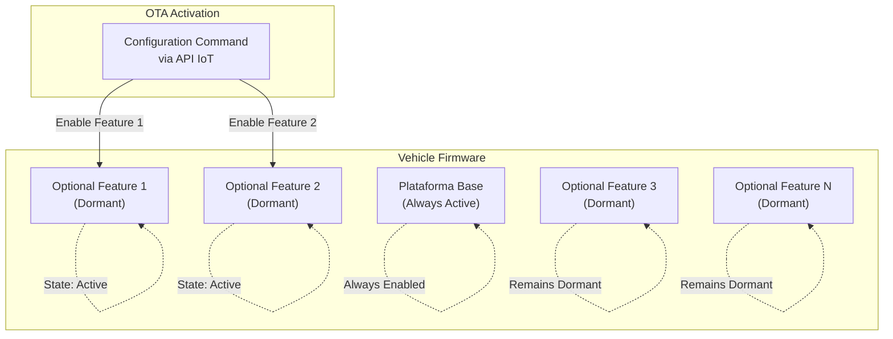
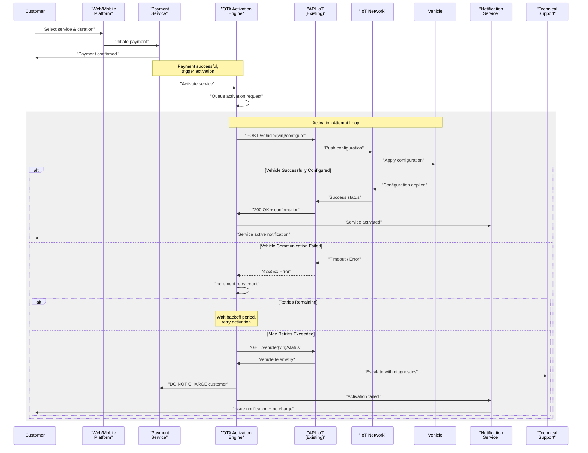
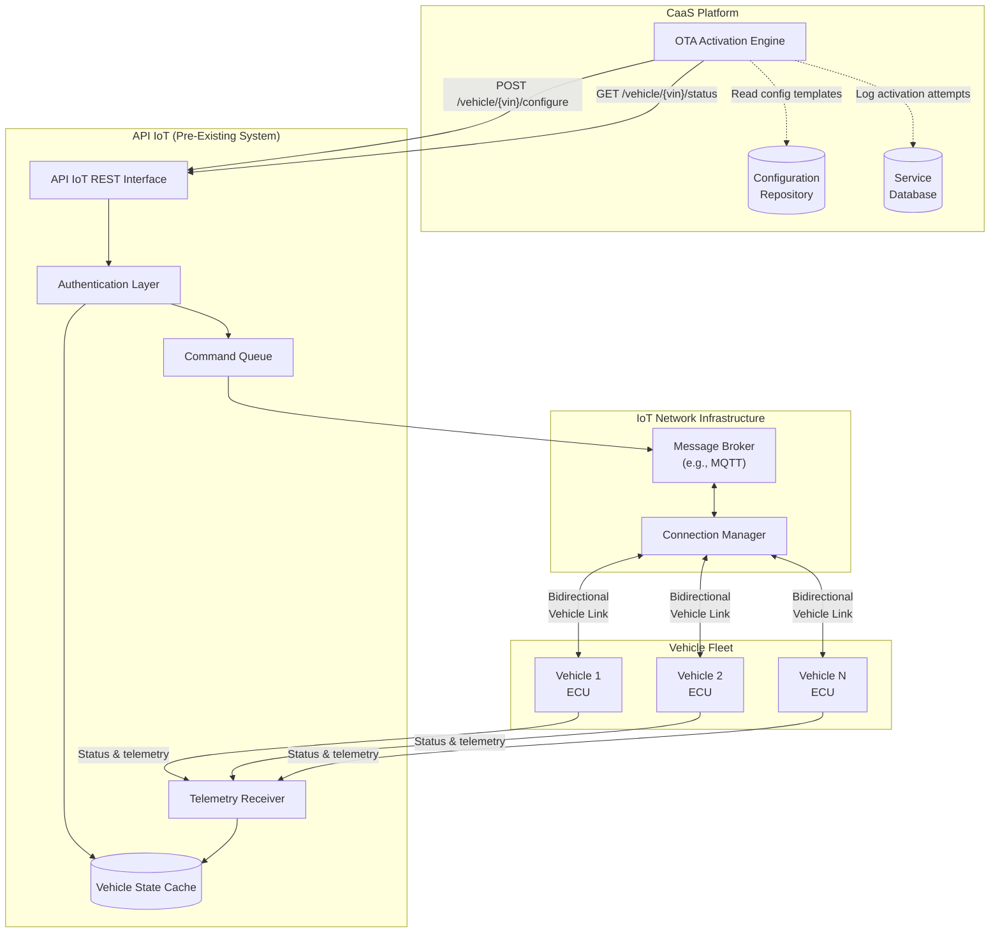
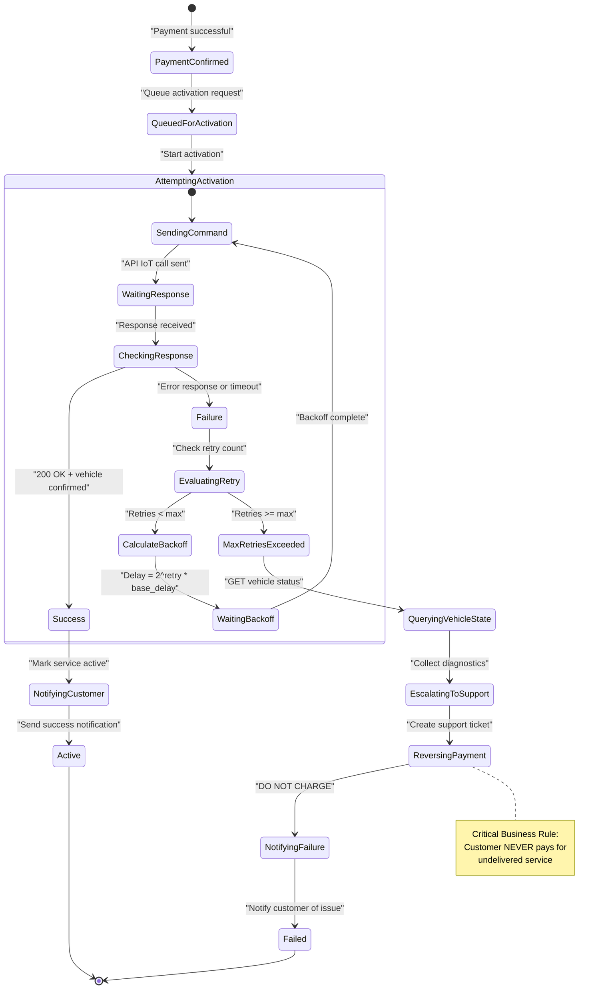
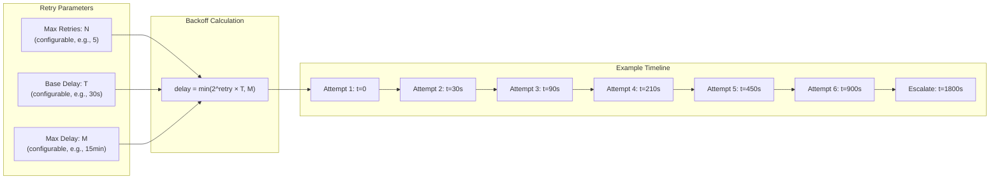
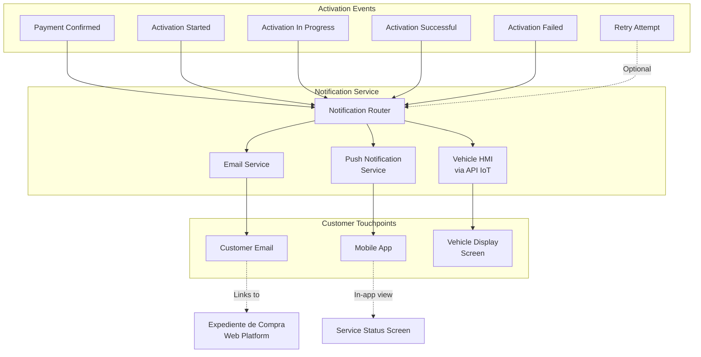
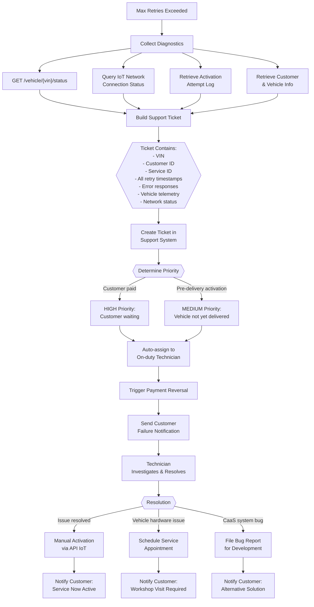

# OTA Service Activation

<details>
<summary>Relevant source files</summary>

The following files were used as context for generating this wiki page:

- [enunciado.md](enunciado.md)
- [pasame las preguntas y sus respuestas a markdown.md](pasame las preguntas y sus respuestas a markdown.md)

</details>


## Purpose and Scope

This page documents the Over-The-Air (OTA) service activation mechanism used to remotely enable optional services on customer vehicles after payment. OTA activation is the technical delivery mechanism for all services sold through the CaaS platform.

**Scope of this document:**
- Pre-installed functionality model and activation mechanics
- Integration with the existing API IoT infrastructure
- Activation workflow from payment to service delivery
- Retry logic and failure handling mechanisms
- The critical "do not charge" rule for failed activations
- Technical support escalation procedures

**Related pages:**
- For service catalog and pricing models, see [Service Catalog and Pricing](#6.1)
- For maintenance requirements that may block activation, see [Maintenance-Linked Service Access](#6.3)
- For payment processing before activation, see [Payment Types and Flows](#7.1)
- For the broader IoT infrastructure, see [Vehicle Communication (IoT and OTA)](#5.3)

Sources: [enunciado.md:1-23](), [pasame las preguntas y sus respuestas a markdown.md:31-56]()

---

## Pre-Installed Functionality Model

All vehicles sold through CaaS are delivered with **complete firmware pre-installed** containing all optional features in a dormant state. The OTA activation process does not install new software or update the vehicle's firmware; it merely **enables or disables** existing functionality through configuration changes.



**Key characteristics:**

| Aspect | Description |
|--------|-------------|
| **Software Updates** | Independent process, not managed by CaaS sales system |
| **Activation Mechanism** | Configuration flag changes sent via API IoT |
| **Hardware Requirements** | All hardware for optional features already present in vehicle |
| **Activation Speed** | Near-instantaneous once configuration received by vehicle |
| **Deactivation** | Services can be disabled by sending deactivation commands |
| **Workshop Visit** | Never required for CaaS-managed optional services |

This architecture enables:
- Fast service delivery (no software installation required)
- Reliable activation (no risk of failed downloads or corrupted installs)
- Reversibility (features can be disabled if subscription ends)
- Offline capability (vehicle doesn't need internet to use activated features, only to receive activation)

Sources: [pasame las preguntas y sus respuestas a markdown.md:55-56](), [enunciado.md:3-4]()

---

## OTA Activation Process Flow

The following sequence diagram illustrates the end-to-end flow from payment to service activation, including success and failure paths.

### OTA Activation Sequence Diagram



**Process steps:**

1. **Payment Confirmation**: Customer pays, payment service confirms success
2. **Activation Queuing**: OTA Engine receives activation request and queues it
3. **Configuration Push**: OTA Engine calls API IoT to push configuration to vehicle
4. **Vehicle Application**: IoT Network delivers configuration to physical vehicle
5. **Confirmation Loop**: System waits for vehicle to confirm configuration applied
6. **Success Path**: Notify customer and mark service as active
7. **Failure Path**: Retry with backoff, escalate to tech support if all retries fail
8. **Customer Protection**: Ensure customer is not charged if activation fails

Sources: [pasame las preguntas y sus respuestas a markdown.md:46-53](), [enunciado.md:18-20]()

---

## API IoT Integration

The CaaS platform integrates with a **pre-existing, documented, and tested** API IoT infrastructure. This API is a constraint of the system—it already exists and cannot be modified by the CaaS project.

### API IoT Architecture



### Key API IoT Endpoints

| Endpoint | Method | Purpose | CaaS Usage |
|----------|--------|---------|------------|
| `/vehicle/{vin}/configure` | POST | Send configuration command to vehicle | Activate/deactivate services |
| `/vehicle/{vin}/status` | GET | Query current vehicle state and telemetry | Pre-activation checks, failure diagnostics |
| `/vehicle/{vin}/health` | GET | Query vehicle connectivity and health | Determine if vehicle is reachable |
| `/vehicle/{vin}/history` | GET | Retrieve configuration history | Audit trail, troubleshooting |

**Integration characteristics:**

- **Synchronicity**: API calls are synchronous (request-response), but vehicle communication is asynchronous
- **Response Model**: API IoT returns immediate acceptance (202 Accepted) and requires polling or callback for final status
- **Authentication**: OAuth 2.0 client credentials flow for CaaS service account
- **Rate Limiting**: Maximum 10 configuration commands per vehicle per hour (prevent flooding)
- **Timeout**: Configuration commands timeout after 5 minutes if vehicle doesn't respond
- **Idempotency**: Configuration commands are idempotent (safe to retry)

**Responsibility boundaries:**

| Responsibility | API IoT | CaaS OTA Engine |
|----------------|---------|-----------------|
| **Message routing to vehicle** | ✓ | |
| **Vehicle connectivity management** | ✓ | |
| **Configuration persistence on vehicle** | ✓ | |
| **Retry logic for failed activation** | | ✓ |
| **Business rule enforcement** | | ✓ |
| **Customer notification** | | ✓ |
| **Payment reversal on failure** | | ✓ |

Sources: [pasame las preguntas y sus respuestas a markdown.md:33-38]()

---

## Retry and Failure Handling

The OTA Activation Engine implements **robust retry logic with exponential backoff** to handle transient failures in vehicle communication. The system distinguishes between recoverable errors (retry) and terminal failures (escalate).

### OTA Activation State Machine



### Retry Configuration



**Failure categories and handling:**

| Failure Type | Example | Retry? | Action |
|--------------|---------|--------|--------|
| **Transient Network** | IoT network congestion | Yes | Retry with backoff |
| **Vehicle Offline** | Vehicle in garage, no signal | Yes | Retry with backoff |
| **API IoT Error** | 5xx server error | Yes | Retry with backoff |
| **Invalid Configuration** | Malformed config data | No | Immediate escalation, code bug |
| **Vehicle Incompatible** | Service not supported by vehicle model | No | Immediate escalation, data error |
| **Authorization Failure** | Invalid API credentials | No | Immediate escalation, config error |
| **Max Retries Exceeded** | Vehicle persistently unreachable | No | Escalate to tech support |

**Critical rule: DO NOT CHARGE customer**

When activation fails after all retries are exhausted:

1. **Payment Reversal**: If payment was processed, initiate immediate refund
2. **Service Database**: Mark service as "Failed Activation" (not "Active")
3. **Customer Notification**: Send clear explanation that service was NOT delivered
4. **Audit Trail**: Log all retry attempts and final failure reason
5. **Technical Support**: Create ticket with vehicle diagnostics for manual intervention

This rule is **non-negotiable** and protects customer trust. The system must never charge for services it cannot deliver.

Sources: [pasame las preguntas y sus respuestas a markdown.md:48-53]()

---

## Customer Notifications

Customers receive **real-time notifications** about OTA activation status through multiple channels. Notifications are sent at key points in the activation process.

### Notification Flow



### Notification Content by Event

| Event | Email | Push Notification | Vehicle HMI | Timing |
|-------|-------|-------------------|-------------|--------|
| **Payment Confirmed** | Receipt + activation notice | "Service purchased" | None | Immediate |
| **Activation Started** | "Activating your service" | "Activating..." | "Receiving configuration" | Within 1 minute |
| **Activation Successful** | "Service now active" | "Service ready to use" | "Feature enabled" | Immediately after confirmation |
| **First Retry** | None (silent) | None (silent) | None | N/A |
| **Activation Failed** | Detailed explanation + no charge notice | "Activation issue - not charged" | None | After all retries exhausted |

**Key notification principles:**

1. **Multi-channel redundancy**: Critical notifications (success, failure) sent to all channels
2. **Customer reassurance**: Failed activation messages emphasize "not charged"
3. **In-vehicle feedback**: Vehicle display shows activation status in real-time
4. **Expediente integration**: All activation events logged in customer's purchase record
5. **Silent retries**: Don't alarm customer with transient failures; notify only on final outcome

**Example notification messages:**

**Success:**
```
Subject: Your [Service Name] is now active

Hello [Customer Name],

Your [Service Name] has been successfully activated on your [Vehicle Model].
You can start using this feature immediately.

Activation details:
- Service: [Service Name]
- Duration: [Duration]
- Cost: [Amount]
- Activated: [Timestamp]

View full details in your expediente de compra:
[Link to Web Platform]

Thank you for choosing CaaS.
```

**Failure:**
```
Subject: Service activation issue - You have NOT been charged

Hello [Customer Name],

We were unable to activate [Service Name] on your [Vehicle Model] due to
a technical issue. We have escalated this to our technical support team.

Important: You have NOT been charged for this service.

Our team will contact you shortly to resolve this issue. If you have any
questions, please contact support at [Contact Info].

Reference number: [Ticket ID]

We apologize for the inconvenience.
```

Sources: [enunciado.md:18-20](), [pasame las preguntas y sus respuestas a markdown.md:48-53]()

---

## Technical Support Escalation

When OTA activation fails after exhausting all retries, the system **automatically escalates** to technical support with comprehensive diagnostics.

### Escalation Workflow



### Support Ticket Data Structure

The escalation system creates a comprehensive support ticket containing all diagnostic information:

| Field | Source | Purpose |
|-------|--------|---------|
| **Ticket ID** | Auto-generated | Unique identifier for tracking |
| **VIN** | Service request | Identify specific vehicle |
| **Customer ID** | Service request | Contact information |
| **Customer Email** | Customer database | Notification endpoint |
| **Service ID** | Service catalog | Identify which feature to activate |
| **Service Name** | Service catalog | Human-readable service description |
| **Payment Transaction ID** | Payment service | For refund processing |
| **Payment Amount** | Payment service | For refund processing |
| **Activation Request Time** | OTA Engine | When activation was requested |
| **Retry Attempts** | OTA Engine logs | Array of all retry timestamps and responses |
| **Last Error Code** | API IoT response | Most recent failure reason |
| **Last Error Message** | API IoT response | Detailed error description |
| **Vehicle Status Snapshot** | API IoT | Telemetry at time of failure |
| **Vehicle Online Status** | API IoT | Is vehicle reachable? |
| **Network Signal Strength** | API IoT | Connection quality metrics |
| **Vehicle Firmware Version** | API IoT | For compatibility checking |
| **Configuration Payload** | Config repository | What configuration was attempted |
| **Priority** | Business rules | HIGH if customer already paid |

**Automatic actions triggered on escalation:**

1. **Payment reversal initiated** (if payment was processed)
2. **Customer notification sent** (via email and push)
3. **Service marked as "Pending Support"** in service database
4. **Ticket assigned to on-duty technician**
5. **SLA timer started** (response required within defined timeframe)

**Technician manual intervention options:**

- **Retry activation manually** if issue was transient
- **Modify configuration payload** if format issue detected
- **Schedule vehicle inspection** if hardware problem suspected
- **Escalate to API IoT team** if network infrastructure issue
- **Escalate to development** if CaaS system bug identified
- **Contact customer directly** for additional information

The goal is to **resolve activation issues quickly** while ensuring the customer is never charged for undelivered services.

Sources: [pasame las preguntas y sus respuestas a markdown.md:48-53]()

---

## Summary

OTA Service Activation is a critical component of the CaaS system, responsible for the technical delivery of purchased services to customer vehicles. Key takeaways:

| Aspect | Key Point |
|--------|-----------|
| **Delivery Model** | Pre-installed firmware + configuration activation |
| **Integration** | Existing API IoT infrastructure (constraint) |
| **Reliability** | Retry logic with exponential backoff |
| **Customer Protection** | Never charge for failed activations |
| **Failure Handling** | Automatic escalation to technical support |
| **Transparency** | Real-time notifications across multiple channels |

The system prioritizes **customer trust and satisfaction** by implementing robust failure handling and ensuring that customers are never charged for services that cannot be activated. This "customer-first" approach is embedded in the technical architecture and business logic of the OTA activation process.

Sources: [enunciado.md:1-23](), [pasame las preguntas y sus respuestas a markdown.md:31-56]()