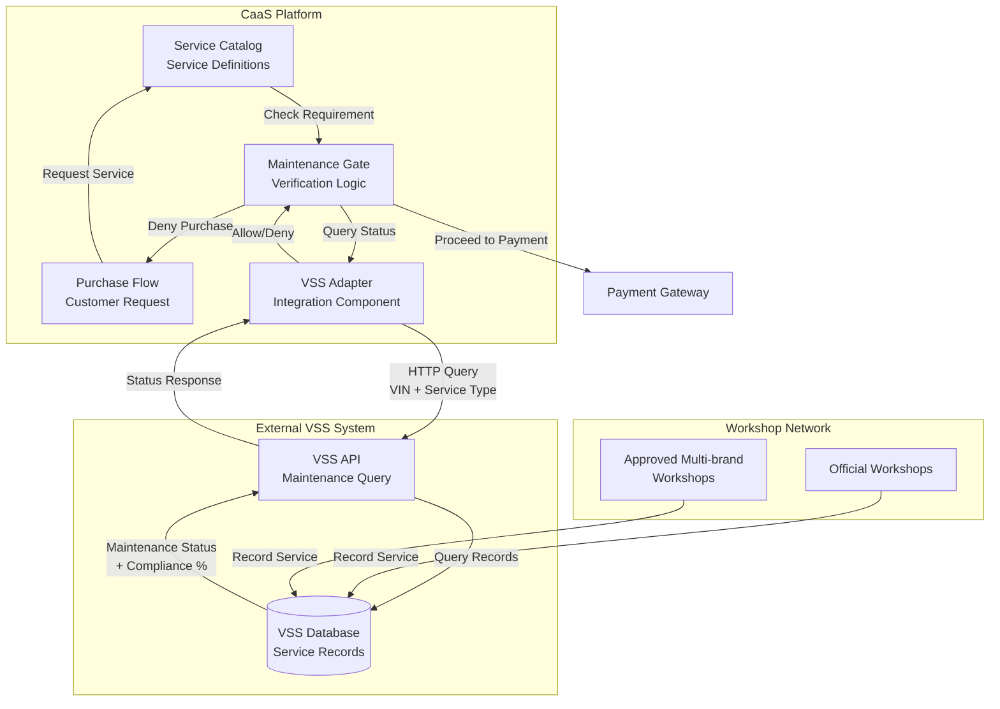
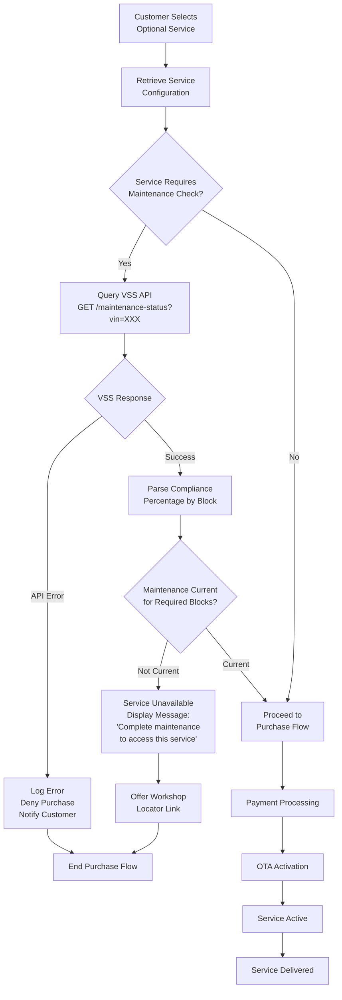
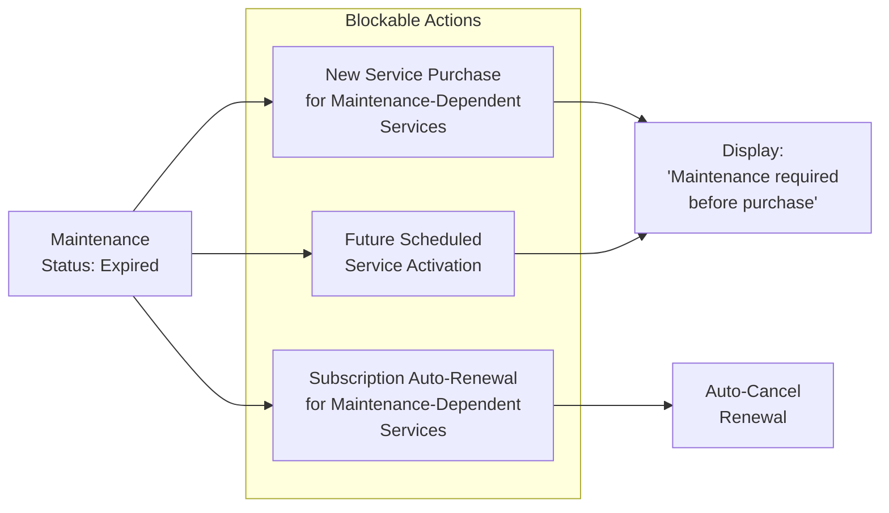
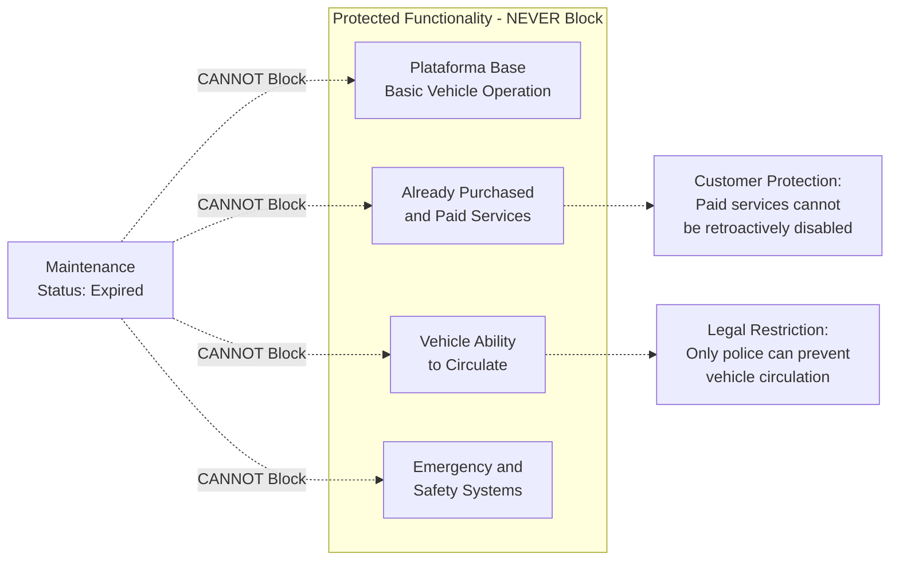
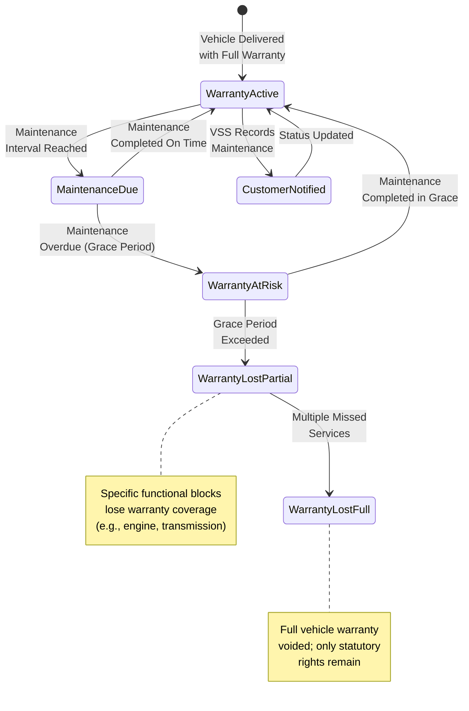
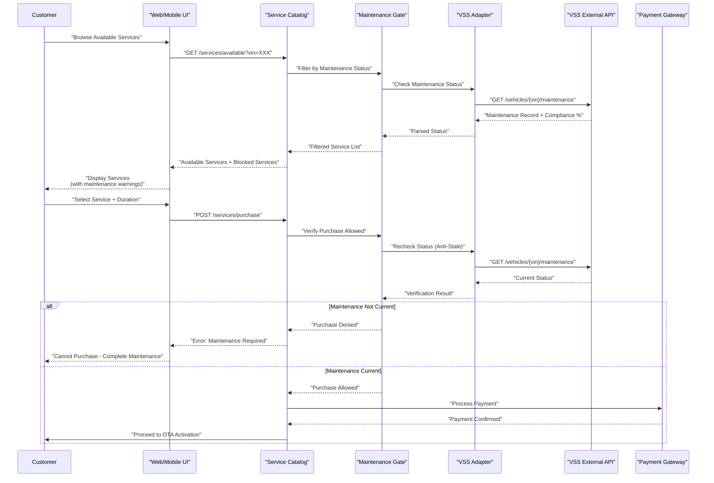
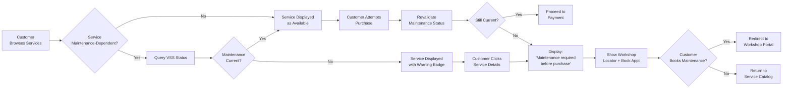

# Maintenance-Linked Service Access

Relevant source files

The following files were used as context for generating this wiki page:

- [enunciado.md](enunciado.md)
- [pasame las preguntas y sus respuestas a markdown.md](pasame las preguntas y sus respuestas a markdown.md)

## Purpose and Scope

This document details how the official maintenance status of a vehicle affects the availability and activation of optional services (opciones disponibles) within the CaaS platform. It covers the technical mechanisms for verifying maintenance compliance through the VSS (Vehicle Service System), the business rules governing service access based on maintenance status, and the critical distinctions between blocking future service purchases versus disabling already-delivered functionality.

For information about the broader service lifecycle and activation process, see [Service Lifecycle Management](#6). For details on the service catalog structure, see [Service Catalog and Pricing](#6.1). For the technical OTA activation process, see [OTA Service Activation](#6.2).

---

## Maintenance Prerequisites for Services

The CaaS system implements a **safety-driven gating mechanism** where certain optional services require the vehicle to be current with its official maintenance plan before they can be purchased or activated. This requirement is configured per service in the service catalog and is enforced at the point of purchase.

### Service Categories by Maintenance Dependency

| Service Category | Maintenance Requirement | Rationale |
|-----------------|-------------------------|-----------|
| **Safety-Critical Services** | Must be current with maintenance | Services affecting vehicle dynamics, power, or ADAS features require verified mechanical integrity |
| **Entertainment Services** | No maintenance requirement | Media, connectivity, and comfort features operate independently of mechanical condition |
| **Performance Services** | Must be current with maintenance | Power increases (e.g., 50% boost) require verified drivetrain maintenance |
| **Autonomous Driving Features** | Must be current with maintenance | Sensor calibration and system health depend on regular maintenance schedules |
| **Climate Control Enhancements** | Typically no requirement | Climate systems generally independent of critical maintenance |

The specific mapping of individual services to maintenance requirements is defined in the service catalog configuration, allowing business flexibility to adjust requirements based on safety assessments and regulatory compliance.

**Sources:** [enunciado.md:23-24](), [pasame las preguntas y sus respuestas a markdown.md:66-73]()

---

## VSS Integration for Maintenance Verification

The CaaS platform integrates with the **VSS (Vehicle Service System)**, an external system maintained by the workshop network (official dealerships and approved multi-brand workshops) that tracks all maintenance activities across the vehicle fleet.

### VSS System Architecture

**Diagram: Maintenance Verification Flow via VSS Integration**

### Key Integration Characteristics

1. **Pull-Based Query Pattern**: CaaS initiates queries to VSS when needed; vehicles do NOT push maintenance status via IoT
2. **Real-Time Verification**: Maintenance status is checked at the moment of service purchase, not cached
3. **External Data Ownership**: VSS is maintained independently by workshops; CaaS has read-only access
4. **VIN-Based Lookup**: Queries use the Vehicle Identification Number (VIN) to retrieve maintenance records
5. **Functional Block Compliance**: VSS tracks maintenance compliance by functional system blocks (engine, brakes, sensors, etc.)

**Sources:** [pasame las preguntas y sus respuestas a markdown.md:60-73]()

---

## Maintenance Verification Decision Flow

The following diagram illustrates the complete decision tree for service access based on maintenance status:

**Diagram: Service Purchase Decision Flow with Maintenance Gate**

### Critical Decision Points

1. **Service Configuration Check**: The service catalog defines which services require maintenance verification
2. **VSS Query**: Real-time API call to external VSS system using vehicle VIN
3. **Compliance Threshold**: Each service specifies which functional blocks must be current (e.g., "engine maintenance" for power boost)
4. **Deny vs. Allow**: Failed maintenance checks prevent purchase initiation; customer cannot proceed to payment
5. **Error Handling**: VSS API failures are treated as deny scenarios (fail-safe approach)

**Sources:** [enunciado.md:23-24](), [pasame las preguntas y sus respuestas a markdown.md:66-73]()

---

## Service Blocking Rules and Restrictions

The CaaS system enforces **strict separation** between preventing new service purchases and disabling existing functionality. This distinction is critical for customer experience, legal compliance, and safety.

### What CAN Be Blocked

**Diagram: Permitted Service Blocking Actions**

### What CANNOT Be Blocked

**Diagram: Protected Vehicle Functionality**

### Blocking Rules Summary

| Scenario | Action Permitted | Rationale |
|----------|------------------|-----------|
| Customer attempts to purchase maintenance-dependent service | **Block purchase** | Safety requirement; service may not function correctly without proper maintenance |
| Customer has existing active service, maintenance expires | **Do NOT disable service** | Service already paid for; retroactive removal violates customer rights |
| Vehicle maintenance expired | **Do NOT prevent vehicle operation** | Only law enforcement can legally prevent vehicle circulation |
| Plataforma base functionality | **Always available** | Base platform is owned functionality, never restricted |
| Emergency braking, airbags, basic safety | **Always available** | Safety-critical systems must never be disabled |
| Subscription renewal approaching, maintenance expired | **Cancel auto-renewal** | Prevent new billing for services that cannot be safely activated |

**Sources:** [pasame las preguntas y sus respuestas a markdown.md:66-73]()

---

## Warranty Implications

Failure to follow the official maintenance plan has **warranty consequences** that are separate from but related to service access restrictions.

### Warranty Loss Mechanism

**Diagram: Warranty Status State Machine**

### Relationship Between Maintenance, Warranty, and Service Access

| Customer Action | Warranty Status | Service Access | Business Impact |
|----------------|----------------|----------------|-----------------|
| Maintenance current | Full warranty active | All services available for purchase | Optimal customer state |
| Maintenance overdue (minor) | Warranty at risk | Maintenance-dependent services blocked | Revenue loss opportunity |
| Maintenance significantly overdue | Partial warranty loss | Maintenance-dependent services blocked | Customer dissatisfaction risk |
| Maintenance never performed | Full warranty void | Maintenance-dependent services permanently blocked | Customer relationship damaged |

### Warranty Loss vs. Service Blocking

**Important distinction:**
- **Warranty Loss**: Affects manufacturer liability for repairs; customer bears cost of failures
- **Service Blocking**: Prevents purchase of new optional services for safety reasons

These are **independent mechanisms**:
- A vehicle can have warranty voided but still operate with its plataforma base
- Service blocking prevents unsafe configurations; warranty loss is a financial consequence
- VSS tracks both warranty status and maintenance compliance separately

**Sources:** [pasame las preguntas y sus respuestas a markdown.md:68-70]()

---

## Technical Implementation Considerations

### VSS API Integration Points

The CaaS platform integrates with VSS at specific points in the customer journey:

**Diagram: End-to-End Maintenance Verification Sequence**

### Key Technical Requirements

1. **Real-Time Verification**: Maintenance status is checked twice:
   - During service browsing (to filter catalog)
   - At purchase time (to prevent stale data attacks)

2. **Graceful Degradation**: If VSS is unavailable:
   - Allow browsing of all services
   - Block purchases of maintenance-dependent services (fail-safe)
   - Log incidents for technical support review

3. **Caching Strategy**: 
   - Short-lived cache (5-15 minutes) for service catalog filtering
   - Always revalidate before payment processing
   - No caching for purchase verification

4. **Error Handling**:
   - VSS timeout: Treat as "maintenance status unknown" → block purchase
   - VSS returns partial data: Use most conservative interpretation
   - Network errors: Retry with exponential backoff, then fail-safe block

5. **Customer Communication**:
   - Clear messaging when services are blocked
   - Link to workshop locator
   - Estimated maintenance costs if available from VSS

**Sources:** [pasame las preguntas y sus respuestas a markdown.md:60-73]()

---

## Business Rules and Safety Considerations

### Safety-First Design Principle

The maintenance-linked service access system is designed with a **safety-first philosophy**:

1. **Prevent Unsafe Configurations**: Services that depend on mechanical integrity (power boosts, autonomous features) cannot be activated on poorly maintained vehicles
2. **Never Compromise Base Safety**: The plataforma base and all safety-critical systems remain operational regardless of maintenance status
3. **Customer Choice**: Customers cannot be forced to perform maintenance, but consequences (service blocking, warranty loss) are clearly communicated
4. **No Retroactive Punishment**: Already-purchased services are not disabled when maintenance lapses; only new purchases are blocked

### Business Policy Decisions

The following policies are implemented in the maintenance gate logic:

| Policy Area | Rule | Implementation |
|------------|------|----------------|
| **Compliance Threshold** | Service requires ≥ 90% maintenance compliance for related functional blocks | Configurable per service in catalog |
| **Grace Periods** | 30-day grace period after scheduled maintenance date before blocking services | Handled by VSS; CaaS queries final status |
| **Warning Notifications** | Customer receives email/app notification 14 days before maintenance blocks services | Notification engine triggered by VSS webhook (if implemented) |
| **Emergency Override** | Technical support can manually override blocks for documented edge cases | Admin panel with audit logging |
| **Subscription Handling** | Maintenance-dependent subscriptions auto-cancel if maintenance lapses during billing cycle | Billing engine checks maintenance at renewal time |

### Customer Experience Flow

**Diagram: Customer Experience with Maintenance-Blocked Services**

**Sources:** [enunciado.md:23-24](), [pasame las preguntas y sus respuestas a markdown.md:66-73]()

---

## Summary

The maintenance-linked service access system implements critical safety and business logic by:

1. **Integrating with VSS** to obtain authoritative maintenance status from the workshop network
2. **Blocking new purchases** of maintenance-dependent services when maintenance is not current
3. **Protecting already-paid services** from retroactive disabling
4. **Maintaining vehicle operability** regardless of maintenance status (legal requirement)
5. **Separating warranty consequences** from service access restrictions
6. **Providing clear customer communication** about maintenance requirements and consequences

This system balances customer autonomy (cannot force maintenance), safety requirements (prevent unsafe configurations), and business interests (encourage proper maintenance for warranty coverage and premium service access).

**Sources:** [enunciado.md:23-24](), [pasame las preguntas y sus respuestas a markdown.md:60-73]()