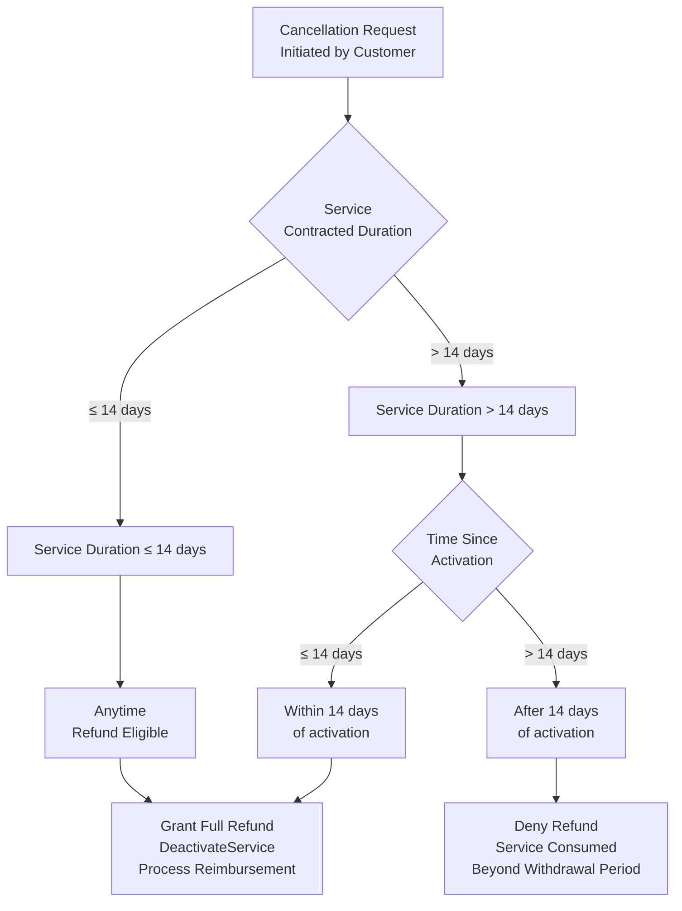
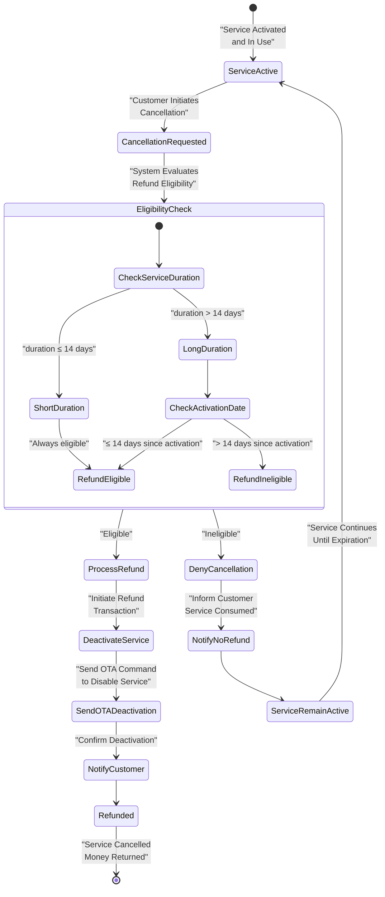
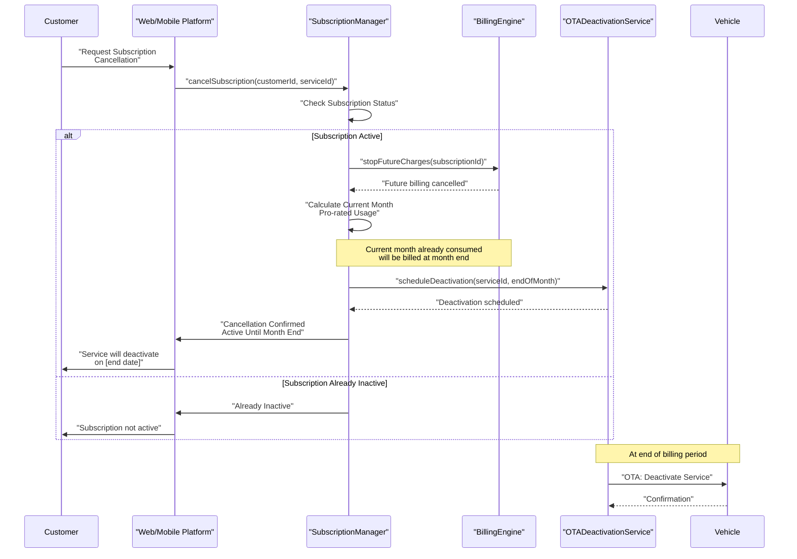
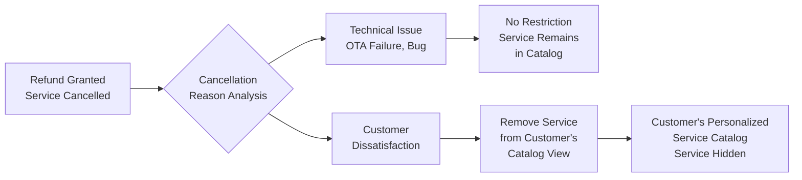
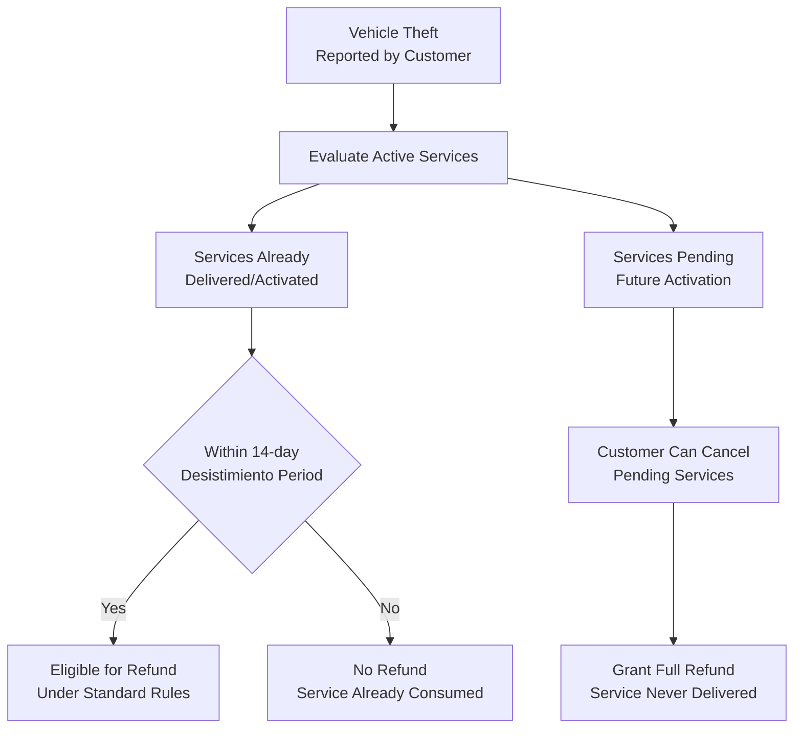
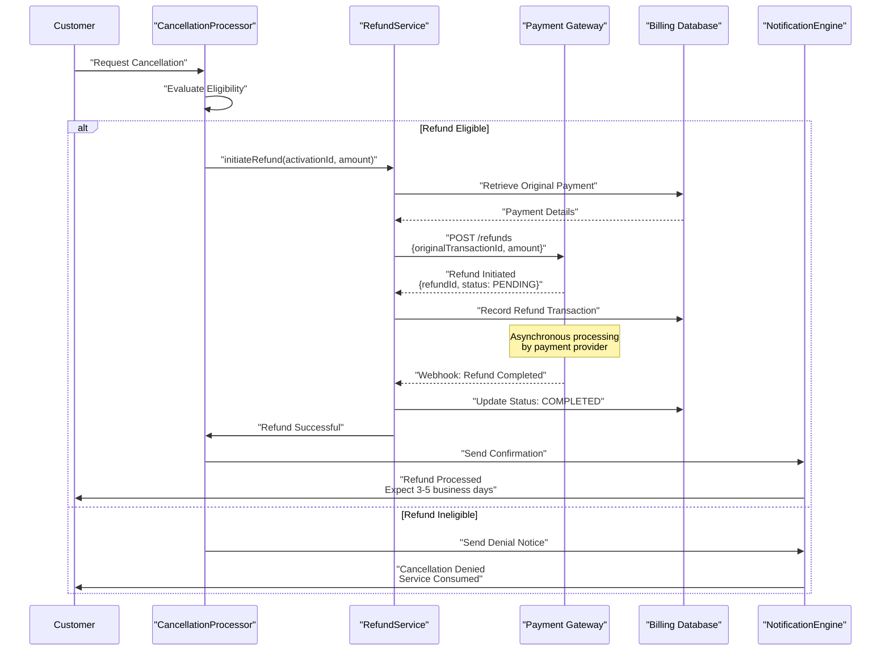

# Service Cancellation and Refunds

<details>
<summary>Relevant source files</summary>

The following files were used as context for generating this wiki page:

- [pasame las preguntas y sus respuestas a markdown.md](pasame las preguntas y sus respuestas a markdown.md)

</details>


## Purpose and Scope

This document explains the service cancellation and refund policies implemented in the CaaS platform, focusing on legal compliance with distance selling regulations (desistimiento), service duration-based refund eligibility, and subscription cancellation workflows.

For information about payment processing and billing models, see [Payment Types and Flows](#7.1). For details on how services are activated and delivered, see [OTA Service Activation](#6.2). For handling of failed service activations (which do not charge the customer), see [OTA Activation Failures](#9.1).

**Sources:** [pasame las preguntas y sus respuestas a markdown.md:84-96]()

---

## Legal Framework: Desistimiento (Right of Withdrawal)

The CaaS platform implements **desistimiento** (derecho de desistimiento), a legal requirement for distance selling that grants customers the right to cancel purchases within specific timeframes without providing justification.

### Regulatory Basis

Under distance selling laws applicable to the CaaS business model, customers purchasing services remotely (via web platform or mobile application) are entitled to withdraw from the purchase and receive a full refund, subject to time-based conditions.

### Key Principles

| Principle | Implementation |
|-----------|----------------|
| **No Justification Required** | Customer may cancel without stating a reason |
| **Full Refund** | Customer receives 100% refund of paid amount when eligible |
| **Time-Based Eligibility** | Refund window depends on service duration |
| **Already Consumed Services** | No refund for services consumed beyond withdrawal period |
| **Pending Services** | Customer can always cancel services not yet delivered/activated |

**Sources:** [pasame las preguntas y sus respuestas a markdown.md:84-89]()

---

## Refund Eligibility Rules

The CaaS platform applies different refund rules based on the **contracted duration** of the service.

### Duration-Based Policy Matrix



**Figure 1: Refund Eligibility Decision Flow**

### Rule Definitions

#### Rule 1: Services with Duration > 14 Days

For services contracted for more than 14 days (e.g., 30-day temporary service, 90-day seasonal service, permanent service):

- **Refund Window:** 14 calendar days from activation date
- **Within Window:** Full refund granted
- **Beyond Window:** No refund; service considered consumed

#### Rule 2: Services with Duration ≤ 14 Days

For short-duration services contracted for 14 days or less (e.g., weekend package, 7-day trial):

- **Refund Window:** Anytime during the contracted period
- **Rationale:** Since the entire service duration falls within the legal 14-day desistimiento period, the customer can cancel at any point

**Sources:** [pasame las preguntas y sus respuestas a markdown.md:84-89]()

---

## Cancellation Request Processing

### State Machine for Service Cancellation



**Figure 2: Service Cancellation State Machine**

### Technical Components

The cancellation process involves several system components:

| Component | Responsibility |
|-----------|----------------|
| `CancellationRequestHandler` | Receives and validates cancellation requests |
| `DesistimientoValidator` | Evaluates eligibility based on duration and activation date |
| `ServiceDurationCalculator` | Calculates contracted duration and elapsed time |
| `RefundProcessor` | Initiates refund transaction with payment gateway |
| `OTADeactivationService` | Sends OTA command to disable service on vehicle |
| `NotificationService` | Informs customer of cancellation status |

**Sources:** [pasame las preguntas y sus respuestas a markdown.md:84-89]()

---

## Subscription Service Cancellation

Subscription services (billed **mes vencido** - at month end for consumed services) have distinct cancellation rules.

### Subscription Cancellation Flow



**Figure 3: Subscription Cancellation Sequence**

### Subscription-Specific Rules

| Scenario | Policy |
|----------|--------|
| **Customer-Initiated Cancellation** | Subscription continues until end of current billing period |
| **Current Month Billing** | Customer is charged for partial month usage (no refund) |
| **Future Billing** | No charges for subsequent months |
| **Service Deactivation** | OTA deactivation sent at end of billing period |
| **Re-activation** | Customer can subscribe again in the future |

### Payment Failure Cancellation

If a subscription payment fails (payment method declined, insufficient funds):

1. **Automatic Cancellation:** Subscription is cancelled by the system
2. **Service Deactivation:** OTA command sent to disable service
3. **No Refund Owed:** No money was successfully collected
4. **Customer Notification:** Customer informed of cancellation reason
5. **Re-subscription Required:** Customer must manually re-subscribe and provide valid payment

**Sources:** [pasame las preguntas y sus respuestas a markdown.md:80-82]()

---

## Optional Business Policy: Service Catalog Restriction

The CaaS platform supports an **optional business policy** for handling services cancelled due to customer dissatisfaction.

### Policy Configuration



**Figure 4: Optional Catalog Restriction Policy**

### Policy Details

When enabled, this policy:

- **Identifies Dissatisfaction:** Distinguishes between technical failures and customer preference
- **Personalizes Catalog:** Removes cancelled service from that specific customer's view
- **Prevents Re-purchase:** Customer cannot purchase the same service again
- **Business Rationale:** Reduces repeat cancellations and support overhead
- **Configuration:** Can be enabled/disabled per service type or globally

**Note:** This policy is **configurable** and may not be active for all CaaS deployments.

**Sources:** [pasame las preguntas y sus respuestas a markdown.md:89]()

---

## Special Scenarios

### Vehicle Theft and Service Refunds

When a vehicle is stolen, specific rules govern service cancellations and refunds.

#### Theft Impact on Services



**Figure 5: Vehicle Theft Service Refund Logic**

#### Theft Scenario Rules

| Service Status | Refund Policy |
|----------------|---------------|
| **Already Delivered (≤ 14 days)** | Standard desistimiento applies; eligible for refund |
| **Already Delivered (> 14 days)** | No refund; service was consumed before theft |
| **Pending/Scheduled** | Full refund; service not yet delivered |
| **Active Subscriptions** | Customer can cancel; no charges for future periods |

**Key Principle:** Vehicle theft does **not** trigger automatic refunds. Normal desistimiento rules apply to delivered services. Only pending/future services are eligible for cancellation with full refund.

**Sources:** [pasame las preguntas y sus respuestas a markdown.md:91-96]()

---

## Technical Implementation Reference

### Core Classes and Services

The following conceptual components implement cancellation and refund logic:

#### Refund Eligibility Evaluation

```
RefundEligibilityService
├── evaluateEligibility(serviceActivation, cancellationRequest)
├── checkServiceDuration(service)
├── calculateDaysSinceActivation(activationDate)
└── determineRefundAmount(service, activationDate)

DesistimientoValidator
├── isWithinWithdrawalPeriod(activationDate, serviceDuration)
├── LONG_SERVICE_THRESHOLD = 14 days
└── WITHDRAWAL_WINDOW = 14 days
```

#### Cancellation Processing

```
CancellationProcessor
├── processCancellation(cancellationRequest)
├── validateCancellationRequest(request)
├── evaluateRefundEligibility(request)
├── initiateRefund(amount, paymentMethod)
├── scheduleServiceDeactivation(serviceId)
└── notifyCustomer(result)

OTADeactivationService
├── sendDeactivationCommand(vehicleId, serviceId)
├── verifyDeactivation(vehicleId, serviceId)
└── retryOnFailure(vehicleId, serviceId, maxRetries)
```

#### Subscription Management

```
SubscriptionManager
├── cancelSubscription(subscriptionId)
├── stopFutureCharges(subscriptionId)
├── calculateProRatedCharge(subscriptionId)
├── scheduleEndOfPeriodDeactivation(subscriptionId)
└── handlePaymentFailure(subscriptionId)
```

### Data Models

#### Service Activation Record

| Field | Type | Description |
|-------|------|-------------|
| `activationId` | UUID | Unique activation identifier |
| `customerId` | UUID | Customer who purchased service |
| `serviceId` | UUID | Service type identifier |
| `activationDate` | DateTime | When service was activated |
| `contractedDuration` | Integer | Duration in days (null for permanent) |
| `expirationDate` | DateTime | When service expires (null for permanent) |
| `cancellationDate` | DateTime | When cancelled (null if active) |
| `refundAmount` | Decimal | Amount refunded (0 if not refunded) |
| `refundStatus` | Enum | NONE, PENDING, COMPLETED, DENIED |

#### Cancellation Request

| Field | Type | Description |
|-------|------|-------------|
| `requestId` | UUID | Unique request identifier |
| `activationId` | UUID | Service activation being cancelled |
| `requestDate` | DateTime | When cancellation was requested |
| `reason` | String | Optional customer-provided reason |
| `eligibilityResult` | Enum | ELIGIBLE, INELIGIBLE |
| `refundAmount` | Decimal | Calculated refund amount |
| `processingStatus` | Enum | SUBMITTED, EVALUATING, APPROVED, DENIED, COMPLETED |

**Sources:** [pasame las preguntas y sus respuestas a markdown.md:84-96]()

---

## Integration with Payment System

### Refund Transaction Flow



**Figure 6: Refund Transaction Processing Flow**

### Refund Settlement Timeline

| Phase | Duration | Status |
|-------|----------|--------|
| **Refund Initiation** | Immediate | `PENDING` |
| **Payment Gateway Processing** | 1-3 business days | `PROCESSING` |
| **Bank Settlement** | 3-5 business days | `SETTLING` |
| **Customer Account Credit** | 5-7 business days total | `COMPLETED` |

**Note:** The CaaS platform marks the refund as `COMPLETED` once the payment gateway confirms processing. The actual appearance of funds in the customer's account depends on their bank's processing time.

**Sources:** [pasame las preguntas y sus respuestas a markdown.md:80-82]()

---

## Business Metrics and Reporting

### Key Metrics for Cancellation Management

| Metric | Description | Business Value |
|--------|-------------|----------------|
| **Cancellation Rate** | (Cancellations / Total Service Activations) × 100 | Measure service satisfaction |
| **Refund Rate** | (Refunds Granted / Total Cancellations) × 100 | Track desistimiento compliance |
| **Avg Days to Cancellation** | Average time between activation and cancellation | Identify problematic services |
| **Refund Amount Total** | Total monetary value refunded per period | Financial impact tracking |
| **Service-Specific Cancellation** | Cancellation rate per service type | Service quality assessment |
| **Repeat Cancellations** | Customers who cancel multiple services | Identify dissatisfied customers |

### Operational Dashboards

The CaaS platform should provide operational visibility into cancellation patterns:

- **Daily Cancellation Queue:** Pending cancellation requests awaiting processing
- **Refund Processing Status:** Current refunds in each settlement stage
- **Ineligible Cancellations:** Customers attempting to cancel beyond withdrawal period
- **High-Risk Services:** Services with cancellation rates exceeding threshold
- **Customer Satisfaction Scores:** Correlation between cancellations and satisfaction surveys

**Sources:** [pasame las preguntas y sus respuestas a markdown.md:84-89]()

---

## Summary

The CaaS service cancellation and refund system implements:

1. **Legal Compliance:** Full desistimiento (right of withdrawal) support for distance selling
2. **Duration-Based Rules:** Different refund windows based on service contracted duration
3. **Fair Customer Treatment:** No charge for undelivered services, full refunds within withdrawal periods
4. **Subscription Flexibility:** Customers can cancel subscriptions with clear end-of-period deactivation
5. **Special Scenario Handling:** Appropriate policies for vehicle theft and other edge cases
6. **Technical Integration:** Automated refund processing with payment gateway and OTA deactivation

The system prioritizes customer protection while maintaining business viability through clear, legally compliant policies that balance customer rights with revenue protection.

**Sources:** [pasame las preguntas y sus respuestas a markdown.md:84-96]()