# Payment and Billing

<details>
<summary>Relevant source files</summary>

The following files were used as context for generating this wiki page:

- [enunciado.md](enunciado.md)
- [pasame las preguntas y sus respuestas a markdown.md](pasame las preguntas y sus respuestas a markdown.md)

</details>


## Purpose and Scope

This page documents the payment processing architecture, billing models, and financial workflows within the CaaS platform. It covers all payment types (reservation, final, service), settlement strategies, and financial risk management.

For information about specific service payment flows and OTA activation consequences, see [Service Lifecycle Management](#6). For detailed refund policies related to desistimiento (right of withdrawal), see [Service Cancellation and Refunds](#6.4). For payment failure scenarios, see [Payment Failure Scenarios](#9.2).

**Sources:** [pasame las preguntas y sus respuestas a markdown.md:75-96](), [enunciado.md:1-23]()

---

## Payment Architecture Overview

The CaaS platform implements a multi-tiered payment architecture supporting three distinct payment types with different processing characteristics, risk profiles, and business rules.

### Payment System Components

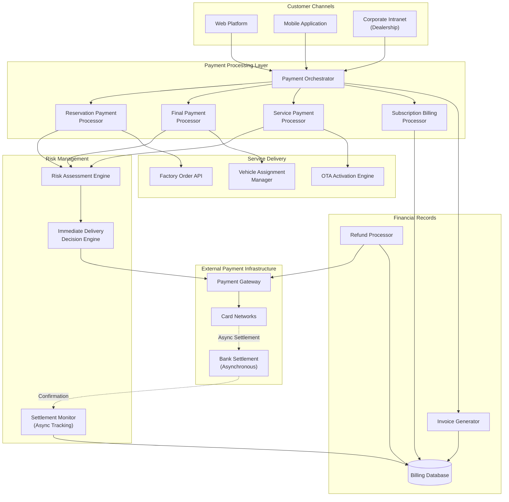

**Architectural Responsibilities:**

| Component | Responsibility | Risk Characteristics |
|-----------|---------------|---------------------|
| `RESERVATION_PROCESSOR` | Process initial reservation payment (señal) | Low risk - small amount, triggers factory order |
| `FINAL_PROCESSOR` | Process final vehicle payment before registration | High risk - large amount, blocks vehicle delivery |
| `SERVICE_PROCESSOR` | Process one-time service payments | Medium risk - immediate OTA delivery despite async settlement |
| `SUBSCRIPTION_PROCESSOR` | Bill monthly subscriptions at end of period (mes vencido) | High risk - post-paid model with collection risk |
| `IMMEDIATE_DELIVERY` | Decide whether to deliver service before settlement confirmation | Core risk management component |
| `SETTLEMENT_MONITOR` | Track async bank settlements and reconcile with delivered services | Detects settlement failures post-delivery |

**Sources:** [pasame las preguntas y sus respuestas a markdown.md:78-82](), [enunciado.md:13-19]()

---

## Payment Types

The CaaS platform processes three distinct payment types, each with unique characteristics and business rules.

### Payment Type Taxonomy

| Payment Type | Purpose | Timing | Amount | Settlement Risk | Refundable |
|--------------|---------|--------|--------|-----------------|------------|
| **Reservation Payment** | Secure vehicle allocation | At sales registration | Partial (señal/deposit) | Low | No (lost if final payment fails) |
| **Final Payment** | Complete vehicle purchase | Before vehicle registration | Remaining balance | None (blocking) | No |
| **Service Payment (One-time)** | Activate optional service | At service purchase | Service price | Medium (async settlement) | Yes (desistimiento rules apply) |
| **Service Payment (Subscription)** | Monthly recurring service | End of month (mes vencido) | Monthly fee | High (post-paid) | Yes (can cancel anytime) |

**Sources:** [pasame las preguntas y sus respuestas a markdown.md:78-96](), [enunciado.md:13-21]()

### Reservation Payment Flow

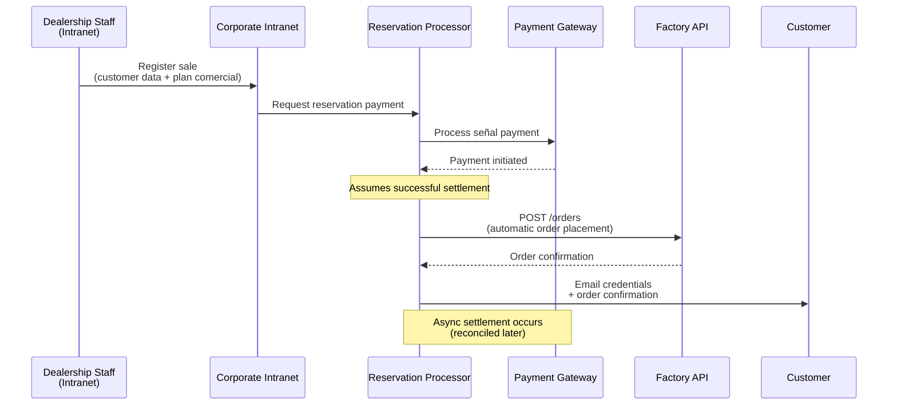

**Critical Rule:** Once reservation payment is initiated, the factory order is placed immediately. This creates financial exposure if the payment later fails, but optimizes manufacturing lead time.

**Sources:** [enunciado.md:8-13](), [pasame las preguntas y sus respuestas a markdown.md:78-82]()

### Final Payment Flow

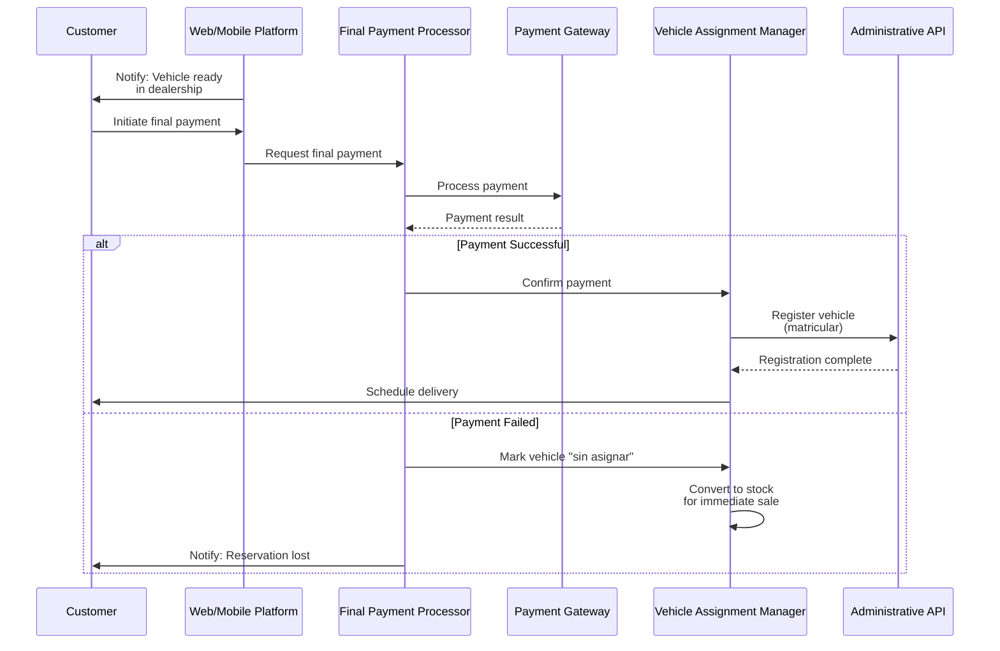

**Critical Rule:** Final payment is **blocking**. If payment fails, the vehicle immediately becomes unassigned stock. Customer loses their reservation entirely. This is non-negotiable for cash flow protection.

**Sources:** [pasame las preguntas y sus respuestas a markdown.md:26-27](), [enunciado.md:14-17]()

### Service Payment Flow (One-time)

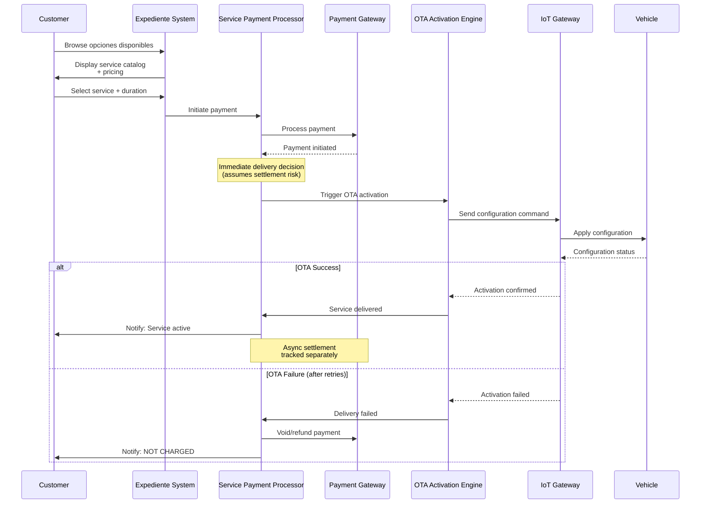

**Critical Rule:** If OTA activation fails after all retries, the customer is **NEVER CHARGED** for the service. This is a core customer protection policy. The payment is voided or refunded if already settled.

**Sources:** [pasame las preguntas y sus respuestas a markdown.md:48-53](), [enunciado.md:18-19]()

### Subscription Billing Flow (Mes Vencido)

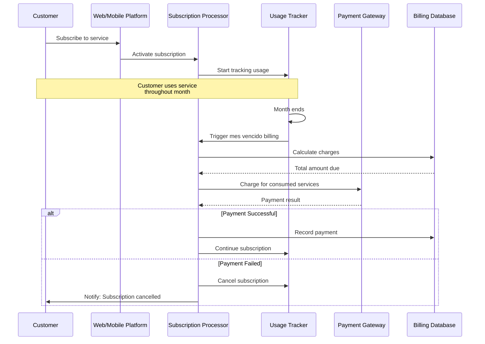

**Billing Model:** **Mes vencido** (post-paid) - customers are charged at the **end of each month** for services consumed during that month. This increases customer satisfaction but creates collection risk.

**Sources:** [pasame las preguntas y sus respuestas a markdown.md:82]()

---

## Payment Processing Architecture

### Payment Gateway Integration Pattern

The CaaS platform integrates with external payment gateways using an **asynchronous settlement pattern** where service delivery occurs before final settlement confirmation.

```mermaid
graph LR
    subgraph "CaaS Platform"
        PAYMENT_INIT["Payment Initiation"]
        DELIVERY_ENGINE["Service Delivery Engine"]
        SETTLEMENT_RECONCILE["Settlement Reconciliation"]
    end
    
    subgraph "Payment Gateway"
        AUTHORIZATION["Authorization"]
        CAPTURE["Capture"]
        SETTLEMENT["Settlement"]
    end
    
    subgraph "Banking Network"
        CARD_NETWORK["Card Networks"]
        BANK["Issuing Bank"]
    end
    
    PAYMENT_INIT -->|1. Authorize payment| AUTHORIZATION
    AUTHORIZATION -->|2. Authorization OK| PAYMENT_INIT
    PAYMENT_INIT -->|3. Immediate delivery| DELIVERY_ENGINE
    
    DELIVERY_ENGINE -->|4. Deliver service to customer| DELIVERY_ENGINE
    
    AUTHORIZATION -.5. Async: Capture funds.-> CAPTURE
    CAPTURE -.6. Async: Send to network.-> CARD_NETWORK
    CARD_NETWORK -.7. Async: Settlement.-> BANK
    BANK -.8. Async: Confirmation.-> SETTLEMENT
    SETTLEMENT -.9. Async: Notify CaaS.-> SETTLEMENT_RECONCILE
```

**Timeline Analysis:**

| Time | CaaS Action | Payment Status | Risk Level |
|------|-------------|----------------|------------|
| T+0 seconds | Payment initiated | Authorization only | **CaaS assumes risk** |
| T+1 second | Service delivered to customer | Not settled | **Maximum exposure** |
| T+2-4 hours | (waiting) | Capture processing | Elevated risk |
| T+24-72 hours | (waiting) | Settlement in progress | Moderate risk |
| T+3-5 days | Settlement confirmation received | Confirmed | Risk resolved |

**Sources:** [pasame las preguntas y sus respuestas a markdown.md:78-82]()

### Risk Assumption Strategy

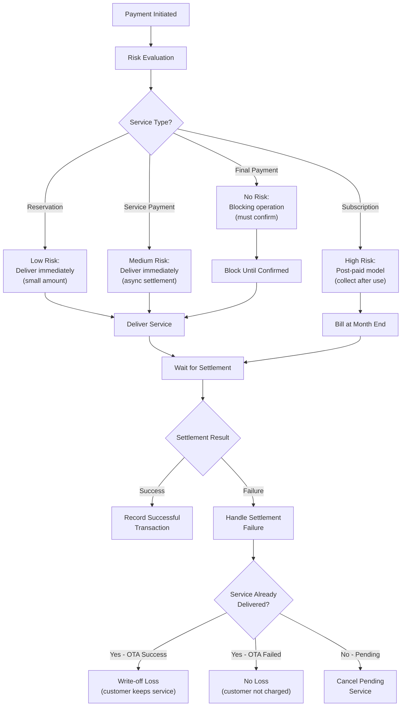

**Business Rationale:** CaaS prioritizes **customer experience over financial risk** by delivering services immediately upon payment authorization, before settlement confirmation. This creates financial exposure but improves customer satisfaction significantly.

**Sources:** [pasame las preguntas y sus respuestas a markdown.md:78-82]()

---

## Billing Models

### Pago por Uso (Pay-per-Use)

The fundamental billing model for optional services is **pago por uso** (pay-per-use), where customers pay for each service activation based on duration.

**Pricing Structure:**

| Duration Type | Payment Model | Example |
|--------------|---------------|---------|
| **Temporary** | One-time payment for fixed period | "Heated seats for 30 days: €50" |
| **Permanent** | One-time payment for vehicle lifetime | "50% power increase: €2,000" |
| **Planned** | One-time payment for future activation | "Winter mode from Dec 1-Feb 28: €150" |
| **Recurring** | Subscription with monthly billing | "Entertainment package: €30/month" |

**Sources:** [enunciado.md:3-5](), [enunciado.md:21]()

### Mes Vencido (Post-paid) Billing

For **subscription services**, CaaS implements **mes vencido** billing, a post-paid model where customers are charged at the end of each billing period for services consumed.

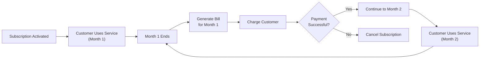

**Advantages:**
- Lower friction for customer adoption (no upfront payment)
- Aligns billing with actual usage
- Customer only pays for what they've consumed

**Risks:**
- Collection risk for services already delivered
- Requires dunning processes for failed payments
- Potential write-offs for uncollectable amounts

**Sources:** [pasame las preguntas y sus respuestas a markdown.md:82]()

---

## Refund and Cancellation Policies

### Desistimiento (Right of Withdrawal)

CaaS complies with **distance selling regulations** that grant customers a **right of withdrawal (desistimiento)** for remotely purchased services.

**Refund Rules by Service Duration:**

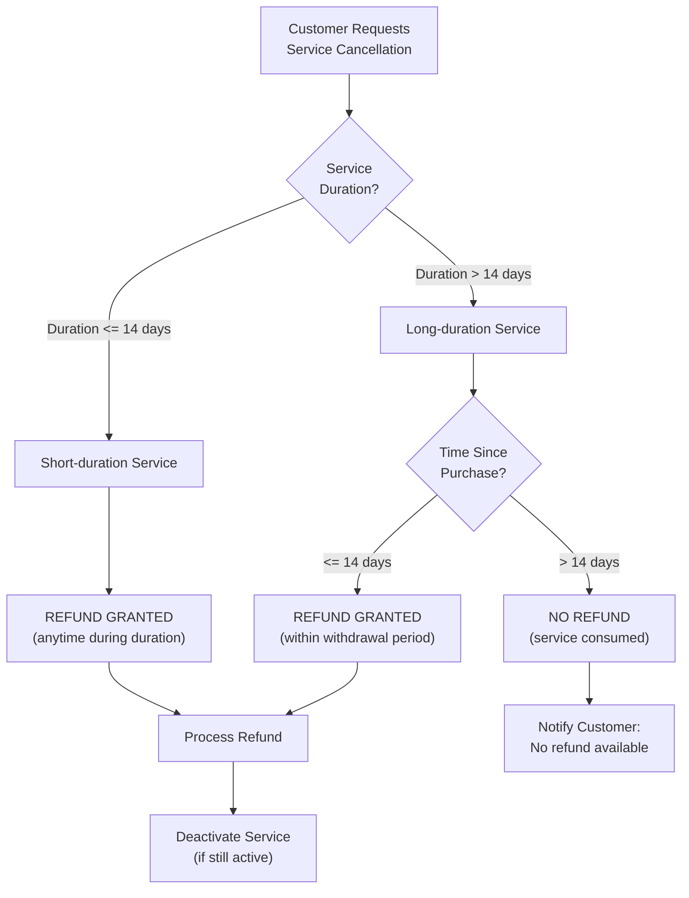

**Refund Policy Table:**

| Service Duration | Refund Window | Business Logic |
|-----------------|---------------|----------------|
| **> 14 days** | First 14 days after purchase | Customer can test service and withdraw if unsatisfied |
| **≤ 14 days** | Anytime during service duration | Service hasn't fully elapsed, so withdrawal always possible |
| **Subscription** | Anytime (cancel future billing) | Can cancel to stop future charges, but no refund for current period already used |

**Sources:** [pasame las preguntas y sus respuestas a markdown.md:84-89]()

### Special Scenarios

#### Vehicle Theft

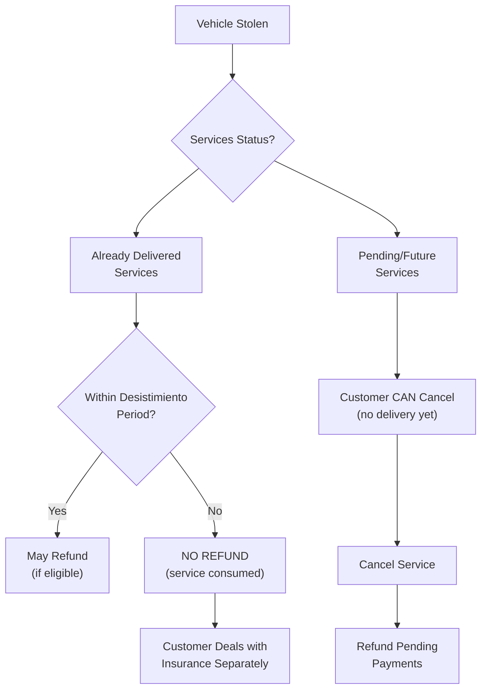

**Key Rule:** Vehicle theft does **not** automatically trigger special refund logic. Already-delivered services follow normal desistimiento rules. Customers can cancel pending services and future subscriptions.

**Sources:** [pasame las preguntas y sus respuestas a markdown.md:91-96]()

---

## Payment Failure Handling

### OTA Activation Failure → No Charge

The most critical payment protection rule in the CaaS system is: **if OTA activation fails, the customer is NOT charged**.

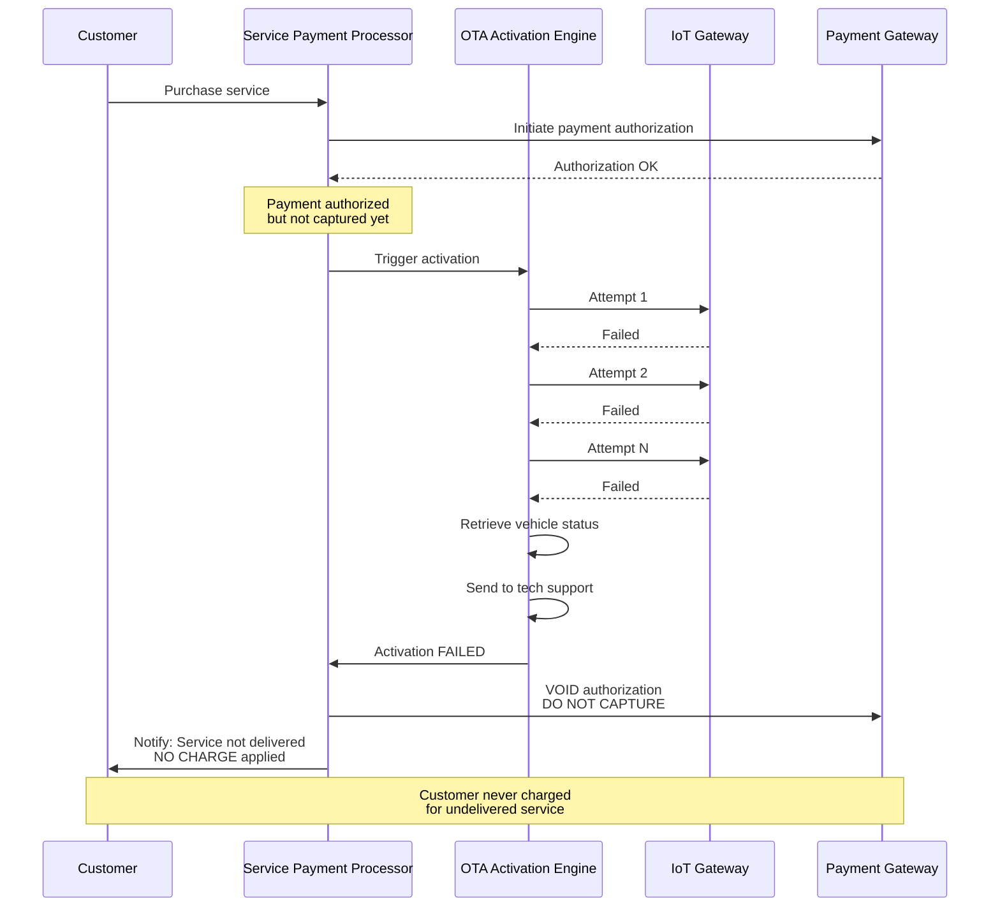

**Implementation Requirements:**
- Payment **authorization** (hold) occurs immediately
- Payment **capture** only occurs after OTA confirms successful activation
- If activation fails, authorization is **voided** before capture
- If already captured (due to gateway timing), **refund** is issued immediately

**Sources:** [pasame las preguntas y sus respuestas a markdown.md:48-53]()

### Final Payment Failure

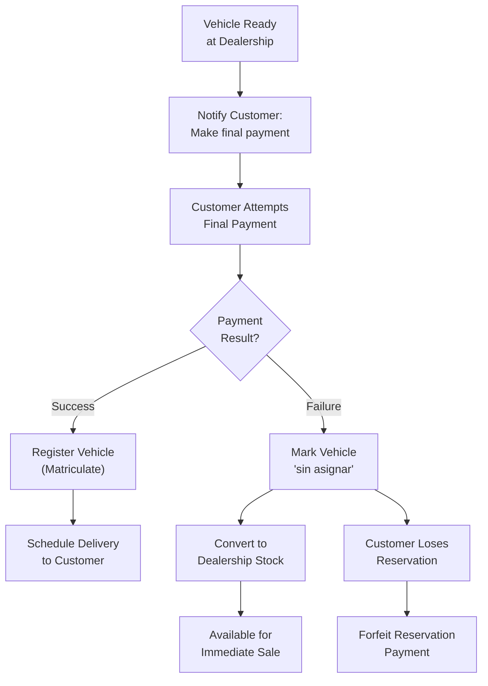

**Consequences of Final Payment Failure:**

| Action | System State | Customer Impact |
|--------|--------------|-----------------|
| Vehicle Status | Changed to `"sin asignar"` | Loses assigned vehicle |
| Inventory | Becomes stock for immediate sale | Another customer can purchase |
| Reservation Payment | Forfeited (not refunded) | Loses deposit |
| Customer Record | Reservation marked cancelled | Must start new purchase process |

**Business Rationale:** Protects company cash flow and prevents manufactured vehicles from sitting unsold. Harsh but necessary boundary.

**Sources:** [pasame las preguntas y sus respuestas a markdown.md:26-27]()

### Subscription Payment Failure

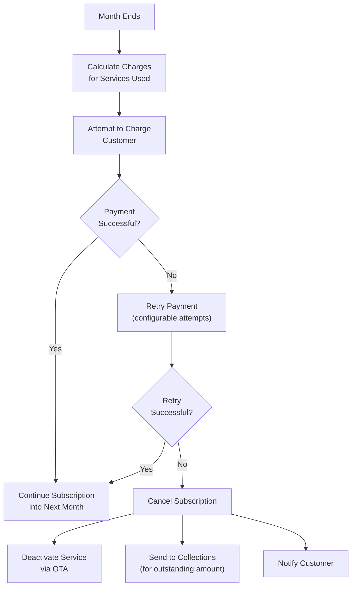

**Collection Process:**
1. **First Attempt:** At month end (mes vencido billing)
2. **Retries:** Configurable retry schedule (e.g., +3 days, +7 days)
3. **Cancellation:** If all retries fail, cancel subscription
4. **Service Deactivation:** Remove service via OTA
5. **Collections:** Outstanding amount sent to dunning process

**Write-off Risk:** Services already consumed but not paid for represent a loss. This is the inherent risk of the mes vencido model.

**Sources:** [pasame las preguntas y sua respuestas a markdown.md:82]()

---

## Financial Records and Invoicing

### Invoice Generation Flow

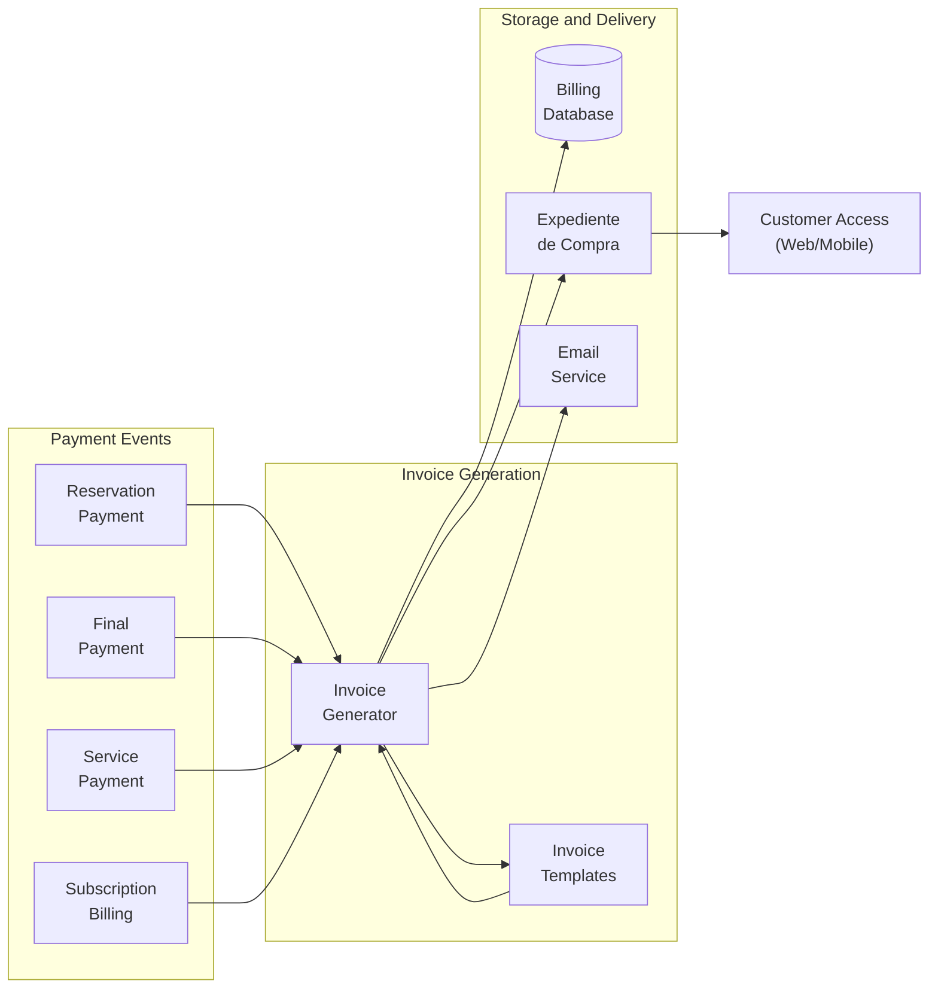

**Invoice Types:**

| Invoice Type | Trigger | Contents | Storage |
|-------------|---------|----------|---------|
| **Reservation Invoice** | Reservation payment successful | Deposit amount, vehicle details, order number | Expediente + Billing DB |
| **Final Payment Invoice** | Final payment successful | Remaining balance, vehicle VIN, registration details | Expediente + Billing DB |
| **Service Invoice** | Service payment successful + OTA confirmed | Service description, duration, price | Expediente + Billing DB |
| **Monthly Subscription Invoice** | End of month billing | List of services used, usage days, total charge | Expediente + Billing DB |
| **Refund Credit Note** | Desistimiento refund processed | Original invoice reference, refund amount, reason | Expediente + Billing DB |

All invoices are stored in the customer's **Expediente de Compra** and accessible via web/mobile platforms.

**Sources:** [enunciado.md:11]()

---

## Summary

The CaaS payment and billing architecture implements a **customer-first financial strategy** that prioritizes user experience while carefully managing financial risk:

**Key Characteristics:**

1. **Risk Assumption:** Delivers services immediately despite asynchronous payment settlement
2. **Customer Protection:** Never charges for failed OTA activations
3. **Legal Compliance:** Implements desistimiento (withdrawal) rules per EU distance selling regulations
4. **Flexible Billing:** Supports multiple models (one-time, temporary, permanent, subscription)
5. **Post-paid Option:** Mes vencido billing for subscriptions reduces adoption friction
6. **Strict Boundaries:** Final payment failure results in immediate loss of vehicle reservation

**Financial Risk Profile:**

| Risk Area | Exposure | Mitigation |
|-----------|----------|------------|
| OTA Failure | Medium | Void/refund if activation fails |
| Service Settlement Delay | Low-Medium | Monitor settlement, write off rare failures |
| Subscription Non-payment | High | Dunning process, service deactivation |
| Final Payment Failure | None | Blocking operation, vehicle returns to stock |

This architecture balances **business agility** (fast service delivery) with **customer protection** (no charge for failed delivery) and **financial prudence** (strict controls on high-value transactions).

**Sources:** [pasame las preguntas y sus respuestas a markdown.md:75-96](), [enunciado.md:1-23]()