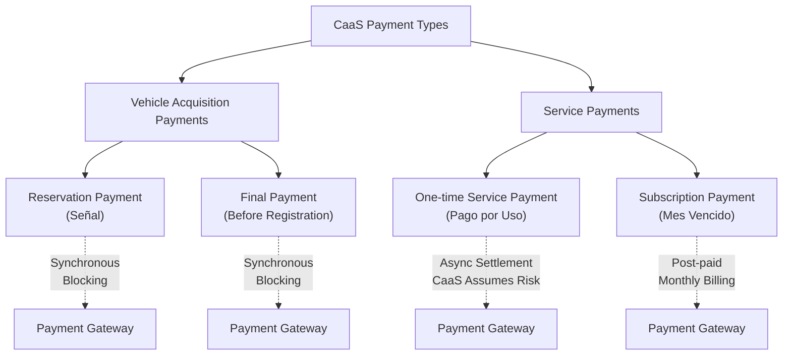
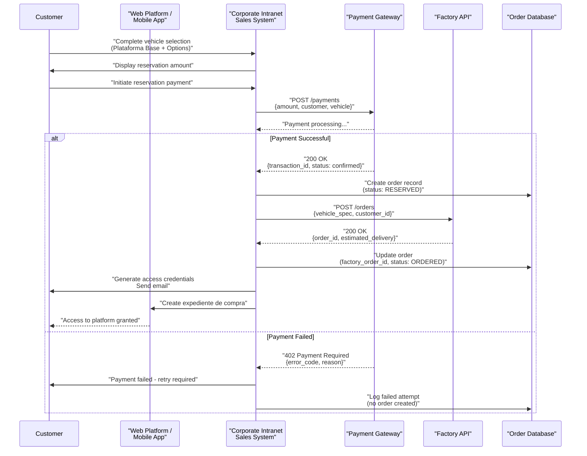
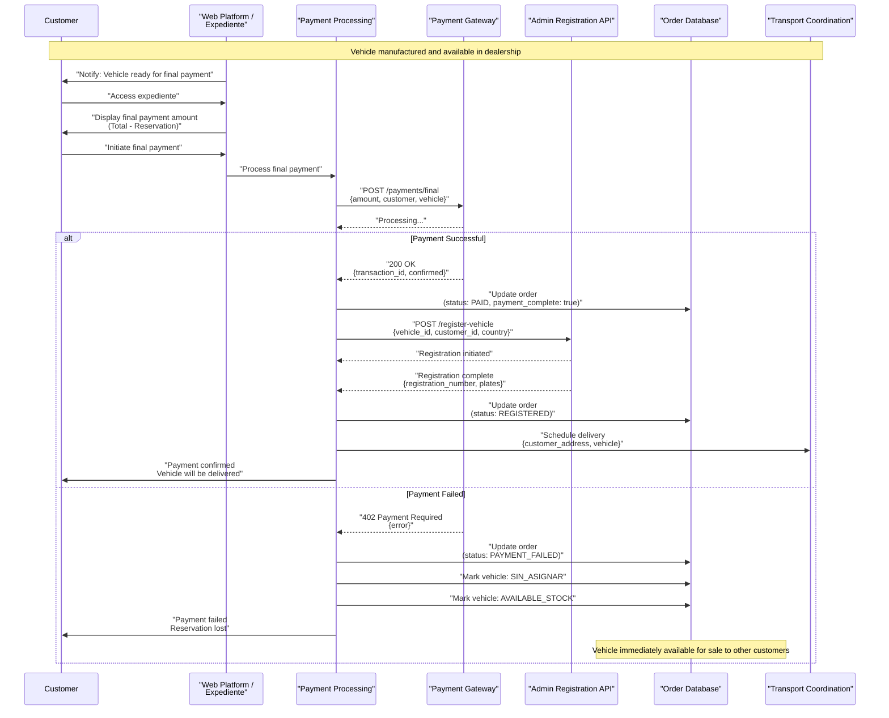
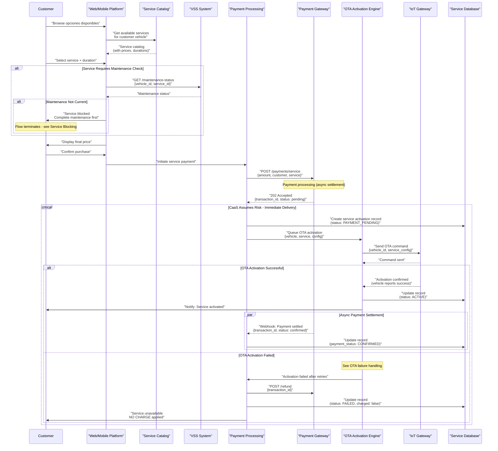
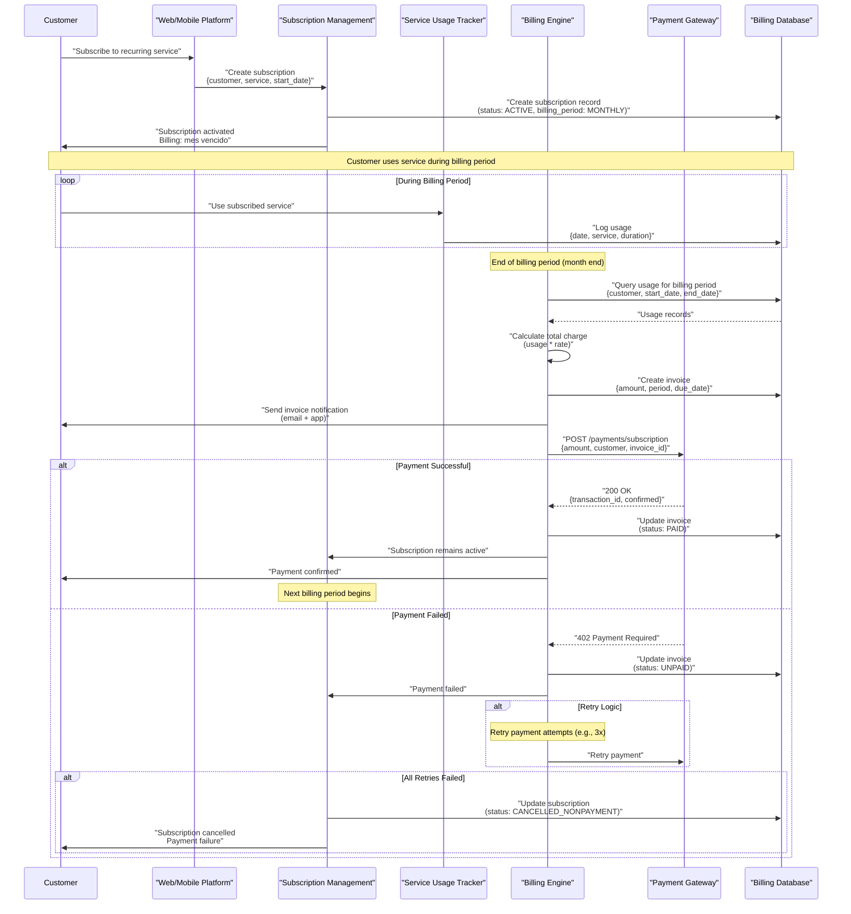
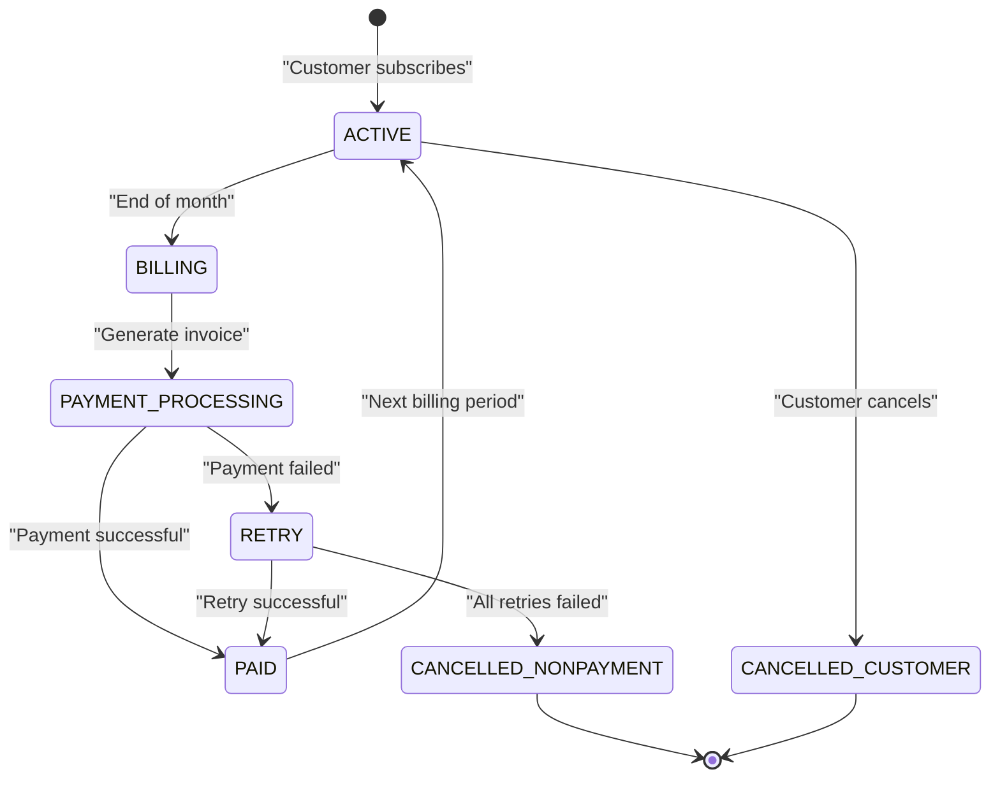
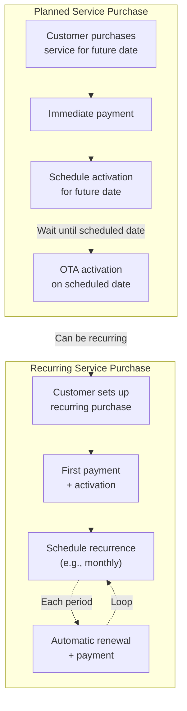
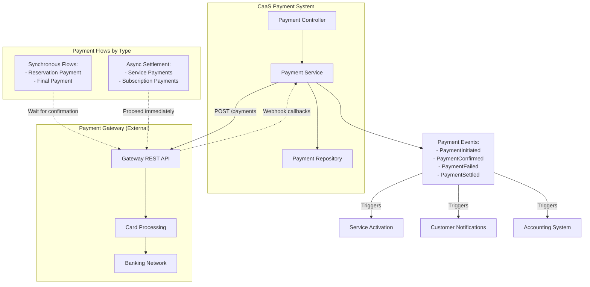
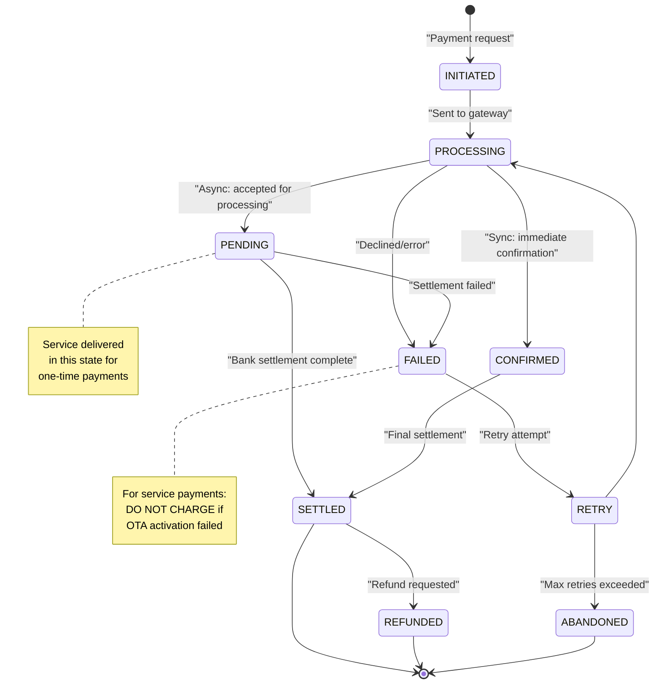
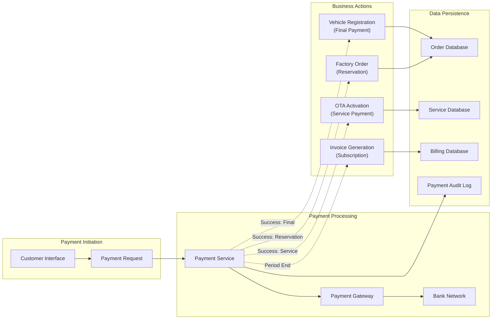

# Payment Types and Flows

Relevant source files

The following files were used as context for generating this wiki page:

- [enunciado.md](enunciado.md)
- [pasame las preguntas y sus respuestas a markdown.md](pasame las preguntas y sus respuestas a markdown.md)

## Purpose and Scope

This document details all payment types within the CaaS system, their processing flows, timing characteristics, and failure handling mechanisms. It covers payments for vehicle acquisition (reservation and final payment), one-time service purchases, and subscription-based services.

For information about risk management and asynchronous settlement strategies, see [Risk Management and Settlement](#7.2). For service cancellation and refund eligibility rules, see [Service Cancellation and Refunds](#6.4). For payment failure scenarios and system behavior, see [Payment Failure Scenarios](#9.2).

---

## Payment Type Taxonomy

The CaaS system processes four distinct payment types, each with different timing characteristics, settlement patterns, and business rules:

**Sources:** [pasame las preguntas y sus respuestas a markdown.md:77-82](), [enunciado.md:1-23]()

| Payment Type | Timing | Settlement Model | Risk Assumption | Criticality |
|-------------|--------|------------------|-----------------|-------------|
| **Reservation Payment (Señal)** | At vehicle reservation | Synchronous, blocking | None - must succeed | High - gates factory order |
| **Final Payment** | Before vehicle registration | Synchronous, blocking | None - must succeed | Critical - no vehicle without payment |
| **One-time Service Payment** | At service purchase | Async settlement | CaaS assumes settlement risk | Medium - service delivered immediately |
| **Subscription Payment (Mes Vencido)** | End of billing period | Post-paid, async | CaaS assumes collection risk | Medium - billed after consumption |

---

## Reservation Payment Flow

The reservation payment (señal) is the first financial transaction in the vehicle acquisition process. This payment triggers the factory order and reserves the vehicle for the customer.

**Sources:** [enunciado.md:9-13](), [pasame las preguntas y sus respuestas a markdown.md:80]()

### Key Characteristics

- **Synchronous Processing**: The payment must succeed before proceeding with factory order
- **Blocking Operation**: Sales process cannot continue without successful reservation payment
- **Triggers Multiple Actions**:
  - Factory order placement via API
  - Customer credential generation
  - Expediente de compra creation
  - Email notification with access credentials
- **No Risk Assumption**: CaaS does not proceed unless payment is confirmed

---

## Final Payment Flow

The final payment completes the vehicle acquisition and triggers the registration and delivery process. This is the most critical payment in the system.

**Sources:** [enunciado.md:14-17](), [pasame las preguntas y sus respuestas a markdown.md:26-27](), [pasame las preguntas y sus respuestas a markdown.md:80]()

### Critical Business Rules

1. **Payment Must Succeed**: No vehicle delivery without complete final payment
2. **Immediate Consequence of Failure**: 
   - Vehicle marked as `SIN_ASIGNAR` (unassigned)
   - Vehicle becomes available stock for immediate sale
   - Customer loses reservation entirely
3. **Triggers Registration**: Only after successful payment does registration begin
4. **Blocking Operation**: Customer cannot proceed to delivery without payment confirmation

---

## One-Time Service Payment Flow

One-time service payments enable customers to purchase optional features (opciones disponibles) on a pay-per-use basis. These payments follow an **asynchronous settlement model** where CaaS delivers the service immediately while assuming settlement risk.

**Sources:** [enunciado.md:18-19](), [pasame las preguntas y sus respuestas a markdown.md:77-82](), [pasame las preguntas y sus respuestas a markdown.md:48-53]()

### Key Characteristics

| Aspect | Behavior |
|--------|----------|
| **Settlement Model** | Asynchronous - CaaS proceeds before bank confirms |
| **Risk Assumption** | CaaS assumes risk of payment failure/chargeback |
| **Service Delivery** | Immediate upon payment initiation (not settlement) |
| **Failure Handling** | **DO NOT CHARGE** customer if OTA activation fails |
| **Maintenance Gating** | Some services blocked if maintenance not current |
| **Customer Protection** | No charge for undelivered functionality |

### Critical Rule: No Charge for Failed Activation

The most important business rule for one-time service payments is:

**If OTA activation fails after all retry attempts, the customer must NOT be charged for the service.**

This rule protects customers from paying for functionality they cannot use and is implemented by:
1. Initiating refund immediately upon final OTA failure
2. Marking the service record as `charged: false`
3. Notifying the customer that no charge has been applied
4. Escalating to technical support for resolution

**Sources:** [pasame las preguntas y sus respuestas a markdown.md:48-53]()

---

## Subscription Payment Flow (Mes Vencido)

Subscription payments follow a **post-paid billing model** where customers are charged at the end of each billing period for services consumed during that period. This model is referred to as "mes vencido" (expired month) billing.

**Sources:** [pasame las preguntas y sus respuestas a markdown.md:82]()

### Mes Vencido Billing Characteristics

| Aspect | Detail |
|--------|--------|
| **Billing Timing** | End of billing period (month end) |
| **Payment Model** | Post-paid (charge after consumption) |
| **Service Delivery** | Immediate upon subscription activation |
| **Billing Period** | Monthly (configurable) |
| **Risk** | CaaS bears collection risk |
| **Cancellation** | Automatic if payment fails after retries |

### Subscription Lifecycle States

**Sources:** [pasame las preguntas y sus respuestas a markdown.md:82]()

---

## Planned and Recurring Service Payments

The CaaS system supports future-scheduled service activations and recurring purchases, which combine aspects of both one-time and subscription payments.

**Sources:** [enunciado.md:21-22]()

### Planned Service Characteristics

- **Payment Timing**: Immediate (at purchase time)
- **Service Activation**: Scheduled for future date
- **Cancellation Rights**: Subject to desistimiento rules (14-day window if service > 14 days)
- **OTA Delivery**: Standard retry logic applies at activation time

### Recurring Service Characteristics

- **Initial Payment**: First period charged immediately
- **Renewal Payments**: Automatic at each recurrence interval
- **Cancellation**: Customer can cancel anytime (affects future renewals only)
- **Failed Payment**: Cancels future recurrences

---

## Payment Gateway Integration Architecture

**Sources:** [pasame las preguntas y sus respuestas a markdown.md:77-82]()

### Integration Patterns by Payment Type

| Payment Type | Integration Pattern | Behavior |
|-------------|-------------------|----------|
| **Reservation** | Synchronous request-response | Wait for payment confirmation before proceeding |
| **Final Payment** | Synchronous request-response | Block until payment confirmed or failed |
| **Service Payment** | Async initiate + webhook settlement | Deliver service immediately, settle later |
| **Subscription** | Async post-paid billing | Charge at period end, use webhooks for confirmation |

---

## Payment State Machine

**Sources:** [pasame las preguntas y sus respuestas a markdown.md:77-82](), [pasame las preguntas y sus respuestas a markdown.md:48-53]()

---

## Payment Failure Handling Summary

Payment failures are handled differently based on payment type and failure timing:

| Failure Scenario | System Behavior | Customer Impact |
|-----------------|-----------------|-----------------|
| **Reservation payment fails** | No order created, no factory order placed | Cannot proceed with purchase |
| **Final payment fails** | Vehicle marked `SIN_ASIGNAR`, becomes available stock | Loses reservation entirely |
| **Service payment fails (before OTA)** | No service activation attempted | No charge, can retry |
| **Service payment fails (after OTA success)** | Service delivered, payment still pending | CaaS assumes settlement risk |
| **OTA activation fails** | Payment refunded immediately | **NO CHARGE** - critical protection |
| **Subscription payment fails** | Retry attempts, then cancel subscription | Service terminates after grace period |

**Critical Business Rule**: The most important customer protection is: **Never charge for services that could not be activated via OTA**.

**Sources:** [pasame las preguntas y sus respuestas a markdown.md:26-27](), [pasame las preguntas y sus respuestas a markdown.md:48-53](), [pasame las preguntas y sus respuestas a markdown.md:77-82]()

---

## Payment Data Flow Summary

**Sources:** [enunciado.md:1-23](), [pasame las preguntas y sus respuestas a markdown.md:77-82]()

---

This document provides a comprehensive overview of all payment types and flows within the CaaS system. For detailed information on specific aspects:
- Risk management strategies: see [Risk Management and Settlement](#7.2)
- Refund processing: see [Service Cancellation and Refunds](#6.4)
- Payment failure scenarios: see [Payment Failure Scenarios](#9.2)
- OTA activation failures: see [OTA Activation Failures](#9.1)