# Risk Management and Settlement

Relevant source files

The following files were used as context for generating this wiki page:

- [pasame las preguntas y sus respuestas a markdown.md](pasame las preguntas y sus respuestas a markdown.md)

## Purpose and Scope

This document explains how the CaaS platform manages the financial risks associated with asynchronous payment settlement and describes the settlement reconciliation processes. Specifically, this covers:

- The temporal gap between payment initiation and bank settlement confirmation
- CaaS's strategic decision to deliver services immediately despite settlement delays
- Risk profiles for different payment types (reservation, final, service, subscription)
- Settlement reconciliation processes and state management
- Customer protection mechanisms that prevent charging for undelivered services

For information about the different payment types and their flows, see [Payment Types and Flows](#7.1). For handling of payment failure scenarios, see [Payment Failure Scenarios](#9.2). For the OTA activation process that integrates with payment, see [OTA Service Activation](#6.2).

**Sources:** Diagram 6 from high-level architecture, [pasame las preguntas y sus respuestas a markdown.md:76-82]()

---

## Asynchronous Settlement Architecture

The CaaS platform operates on a fundamental architectural principle: **immediate service delivery despite asynchronous payment settlement**. This creates a temporal gap between when a customer initiates payment and when the bank confirms settlement.

### Payment Initiation vs. Settlement Timeline

**Strategic Decision:** CaaS delivers the service immediately upon payment initiation, before receiving settlement confirmation from the bank. This optimizes customer experience but introduces financial risk.

**Sources:** [pasame las preguntas y sus respuestas a markdown.md:76-82](), Diagram 6 from high-level architecture

---

## Risk Assumption Strategy

CaaS explicitly assumes settlement risk to provide immediate service delivery. This business decision prioritizes customer satisfaction over financial risk mitigation.

### Risk Assumption Model

### Business Rationale

| Factor | Impact |
|--------|--------|
| **Customer Experience** | Immediate service activation eliminates waiting periods and improves satisfaction |
| **Competitive Advantage** | Faster service delivery differentiates CaaS from competitors requiring settlement confirmation |
| **Risk Exposure** | Potential for chargebacks, declined payments, and fraud |
| **Risk Magnitude** | Limited to service payment amounts (typically lower than vehicle purchase) |
| **Mitigation** | Known customer base (no anonymous transactions), payment history tracking |

**Sources:** [pasame las preguntas y sus respuestas a markdown.md:76-82](), Diagram 6 from high-level architecture

---

## Risk Profiles by Payment Type

Different payment types have different risk profiles and settlement handling strategies.

### Payment Type Risk Matrix

| Payment Type | Settlement Model | Risk Level | Delivery Timing | Risk Owner |
|--------------|------------------|------------|-----------------|------------|
| **Reservation Signal** | Synchronous required | Low | Blocking | Customer |
| **Final Vehicle Payment** | Synchronous required | High | Blocking (no vehicle without payment) | Customer |
| **One-Time Service** | Asynchronous | Medium | Immediate delivery | CaaS |
| **Subscription (Mes Vencido)** | Post-paid | High | Deliver first, charge later | CaaS |

### Detailed Risk Analysis

### Risk Mitigation by Type

**Reservation and Final Payments:**
- **Strategy:** Synchronous settlement required before proceeding
- **Rationale:** High value transactions (vehicle purchase) require confirmed payment
- **Consequence of Failure:** Vehicle marked "sin asignar" (unassigned), becomes stock for immediate sale, customer loses reservation

**One-Time Service Payments:**
- **Strategy:** Immediate delivery with asynchronous settlement
- **Rationale:** Lower transaction values, known customer base, improved experience
- **Mitigation:** Customer already owns vehicle and has payment history with CaaS
- **Consequence of Failure:** Potential chargeback, but service already delivered

**Subscription Payments (Mes Vencido):**
- **Strategy:** Post-paid billing (charge at month end for consumed services)
- **Rationale:** Reduces upfront friction, aligns with utility billing models
- **Risk:** Customer uses service for entire month before being charged
- **Mitigation:** Subscription cancellation upon payment failure, dunning processes required

**Sources:** [pasame las preguntas y sus respuestas a markdown.md:76-82](), [pasame las preguntas y sus respuestas a markdown.md:26-28]()

---

## Settlement State Machine

Each payment transaction progresses through multiple states from initiation to final reconciliation.

### Settlement State Diagram

### State Definitions

| State | Description | System Actions Required |
|-------|-------------|------------------------|
| `PaymentInitiated` | Payment gateway has accepted the transaction | Log transaction, generate reference ID |
| `ServiceDelivered` | OTA activation completed successfully | Update service database, send confirmation to customer |
| `SettlementPending` | Awaiting bank confirmation | Monitor settlement notifications, track timeout |
| `SettlementConfirmed` | Bank has confirmed money transfer | Update billing database, close transaction |
| `SettlementFailed` | Bank declined or payment reversed | Alert finance team, evaluate refund necessity |
| `SettlementTimeout` | No settlement notification received within expected timeframe | Escalate to manual review, query payment gateway |
| `Reconciled` | Payment matched to service, transaction complete | Archive transaction, update reporting |

**Sources:** Diagram 6 from high-level architecture

---

## Customer Protection Mechanisms

CaaS implements strict customer protection rules that override financial considerations in specific scenarios.

### The "No Charge for Failed Delivery" Rule

**Critical Business Rule:** If service activation fails (OTA activation unsuccessful after all retries), **DO NOT CHARGE the customer**.

### Implementation Requirements

The "no charge" rule requires specific implementation capabilities:

| Scenario | Payment Status | Required Action | Implementation |
|----------|---------------|-----------------|----------------|
| **Pre-Settlement Failure** | Payment initiated but not settled | Cancel payment transaction | Call payment gateway cancel API |
| **Post-Settlement Failure** | Payment already settled with bank | Issue refund | Process refund transaction |
| **Partial Settlement** | Payment in settlement process | Cancel if possible, otherwise refund | Check settlement state, then cancel or refund |

### Reconciliation Process for Failed Activations

**Sources:** [pasame las preguntas y sus respuestas a markdown.md:47-53](), Diagram 6 from high-level architecture

---

## Settlement Reconciliation Process

The reconciliation process matches payment settlements to delivered services and resolves discrepancies.

### Reconciliation Architecture

### Reconciliation Scenarios

| Scenario | Service Status | Payment Status | Settlement Status | Action Required |
|----------|---------------|----------------|-------------------|-----------------|
| **Normal Flow** | Delivered | Initiated | Confirmed | Close transaction (no action) |
| **OTA Failure** | Failed | Initiated | Pending | Cancel payment or refund if settled |
| **Settlement Failure** | Delivered | Initiated | Failed | Contact customer for alternate payment |
| **Orphan Settlement** | Not Found | Initiated | Confirmed | Investigate missing service record |
| **Orphan Service** | Delivered | Not Found | N/A | Investigate missing payment record |
| **Chargeback** | Delivered | Initiated | Reversed | Service remains active, accept loss |

### Reconciliation Timing

```mermaid
gantt
    title Settlement Reconciliation Timeline
    dateFormat HH:mm
    axisFormat %H:%M
    
    section Payment
    Payment Initiated           :milestone, m1, 00:00, 0m
    
    section Service
    OTA Activation Started      :active, ota1, 00:01, 5m
    Service Delivered           :milestone, m2, 00:06, 0m
    
    section Settlement
    Settlement Processing       :settlement, 00:00, 4h
    Settlement Confirmed        :milestone, m3, 04:00, 0m
    
    section Reconciliation
    Initial State Check         :recon1, 00:06, 10m
    Settlement Notification     :milestone, m4, 04:00, 0m
    Final Reconciliation        :recon2, 04:00, 30m
    Transaction Closed          :milestone, m5, 04:30, 0m
```

**Reconciliation Windows:**
- **Immediate:** Service delivery triggers initial reconciliation check (confirm payment initiated)
- **Short-Term:** Hourly reconciliation batch to identify pending settlements
- **Medium-Term:** Daily reconciliation to identify failed settlements or timeouts
- **Long-Term:** Weekly review of unreconciled transactions for manual intervention

**Sources:** Diagram 6 from high-level architecture

---

## Risk Management Strategies

CaaS employs multiple strategies to mitigate the financial risks associated with immediate service delivery.

### Multi-Layered Risk Mitigation

| Layer | Strategy | Effectiveness |
|-------|----------|---------------|
| **1. Customer Verification** | Only registered customers who purchased vehicles can access services | Eliminates anonymous fraud risk |
| **2. Payment History** | Track customer payment behavior, flag problematic accounts | Identifies high-risk customers |
| **3. Transaction Limits** | Cap maximum one-time service value | Limits per-transaction exposure |
| **4. Fraud Detection** | Monitor for unusual patterns (rapid purchases, geographic anomalies) | Proactive fraud prevention |
| **5. Settlement Monitoring** | Real-time tracking of settlement confirmations | Early detection of issues |
| **6. Subscription Dunning** | Automated collection process for failed subscription payments | Reduces subscription payment risk |
| **7. Service Deactivation** | Remote deactivation of services for non-payment (subscriptions only) | Recovers unpaid subscription services |

### Financial Risk Controls

### Key Risk Metrics

**Operational Metrics:**
- **Settlement Confirmation Rate:** Percentage of payments that settle successfully
- **Settlement Delay:** Average time between payment initiation and settlement confirmation
- **Chargeback Rate:** Percentage of settled payments later reversed by customer/bank
- **OTA Failure Rate:** Percentage of service deliveries requiring refund due to activation failure

**Financial Metrics:**
- **Risk Exposure:** Total value of services delivered but not yet settled
- **Outstanding Receivables:** Total value of settled payments awaiting reconciliation
- **Write-Off Rate:** Percentage of delivered services never collected (chargebacks, failed settlements)
- **Subscription Collection Rate:** Percentage of mes vencido charges successfully collected

**Sources:** [pasame las preguntas y sus respuestas a markdown.md:76-82](), Diagram 6 from high-level architecture

---

## Subscription-Specific Risk Management

Subscription services (mes vencido billing) present unique risk challenges requiring specialized handling.

### Mes Vencido (Post-Paid) Risk Profile

### Subscription Risk Mitigation

| Risk Factor | Mitigation Strategy | Implementation |
|-------------|-------------------|----------------|
| **Usage Before Payment** | Accept risk as part of business model | Monitor usage patterns, flag excessive use |
| **Payment Failure** | Automated dunning process with multiple retry attempts | Retry on days 1, 3, 7, 14 after month end |
| **Chronic Non-Payment** | Service deactivation and subscription cancellation | OTA deactivation command after dunning failure |
| **Reactivation After Default** | Require upfront payment for reinstatement | Block subscription reactivation without payment |
| **Multiple Subscription Fraud** | Limit subscriptions per customer | System validation on subscription purchase |

### Dunning Process Flow

**Sources:** [pasame las preguntas y sus respuestas a markdown.md:76-82]()

---

## Settlement Risk Dashboard (Conceptual)

For operational monitoring, CaaS requires a real-time risk dashboard tracking settlement health and financial exposure.

### Dashboard Metrics

| Metric Category | Key Indicators | Alert Thresholds |
|----------------|----------------|------------------|
| **Exposure** | Total unsettled service value | > €50,000 |
| | Number of unreconciled transactions | > 100 |
| | Average settlement delay | > 48 hours |
| **Performance** | Settlement success rate | < 95% |
| | OTA activation success rate | < 98% |
| | Reconciliation error rate | > 2% |
| **Collections** | Subscription payment failure rate | > 10% |
| | Dunning recovery rate | < 60% |
| | Chargeback rate | > 1% |
| **Customer Impact** | Failed activation refunds (last 7 days) | > 10 |
| | Customer complaints related to payment | > 5 per week |

### Risk Trend Analysis

**Sources:** Based on risk management best practices for asynchronous payment systems

---

## Integration with Other Financial Processes

Settlement reconciliation integrates with multiple financial and operational processes within CaaS.

### Cross-Functional Dependencies

### Integration Points

| System | Integration Type | Data Exchange | Timing |
|--------|-----------------|---------------|---------|
| **Payment Processing** | Inbound | Payment initiation events, settlement notifications | Real-time + batch |
| **OTA Engine** | Inbound | Activation success/failure events | Real-time |
| **Refund Management** | Bidirectional | Refund requests (outbound), refund confirmations (inbound) | Near real-time |
| **Invoice Generation** | Outbound | Confirmed payment records | Daily batch |
| **Accounting System** | Outbound | Revenue recognition, receivables | Daily batch |
| **Customer Support** | Outbound | Payment status, refund status | On-demand API |
| **Financial Reporting** | Outbound | Settlement metrics, write-offs | Daily/Monthly batch |

**Sources:** Diagram 2 from high-level architecture

---

## Summary

The CaaS risk management and settlement strategy represents a deliberate business decision to prioritize customer experience over financial risk minimization. Key principles include:

1. **Immediate Service Delivery:** Services are activated upon payment initiation, before settlement confirmation
2. **Risk Assumption:** CaaS accepts settlement risk, potential chargebacks, and collection challenges
3. **Customer Protection:** Failed service activations never result in customer charges, even if payment has settled
4. **Differentiated Risk:** Payment types have different risk profiles (synchronous for vehicle, asynchronous for services)
5. **Post-Paid Subscriptions:** Mes vencido billing maximizes customer convenience but increases collection risk
6. **Robust Reconciliation:** Comprehensive reconciliation processes ensure payment-service matching and resolve discrepancies

This architecture requires sophisticated monitoring, reconciliation, and dunning capabilities to manage the inherent financial risks while maintaining the customer-first service delivery model.

**Sources:** [pasame las preguntas y sus respuestas a markdown.md:76-96](), Diagrams 2 and 6 from high-level architecture