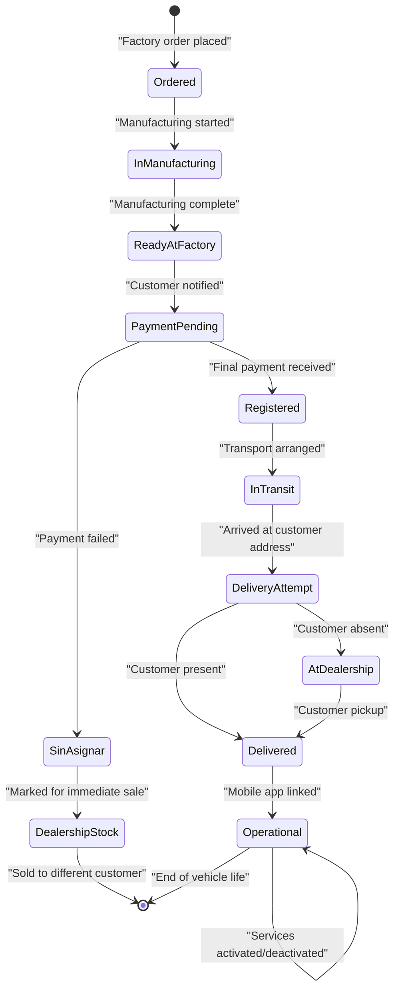
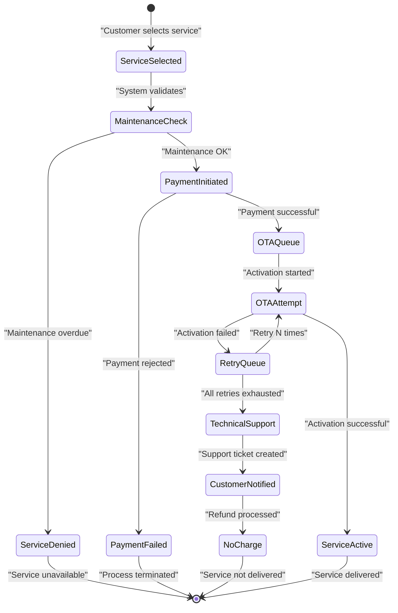
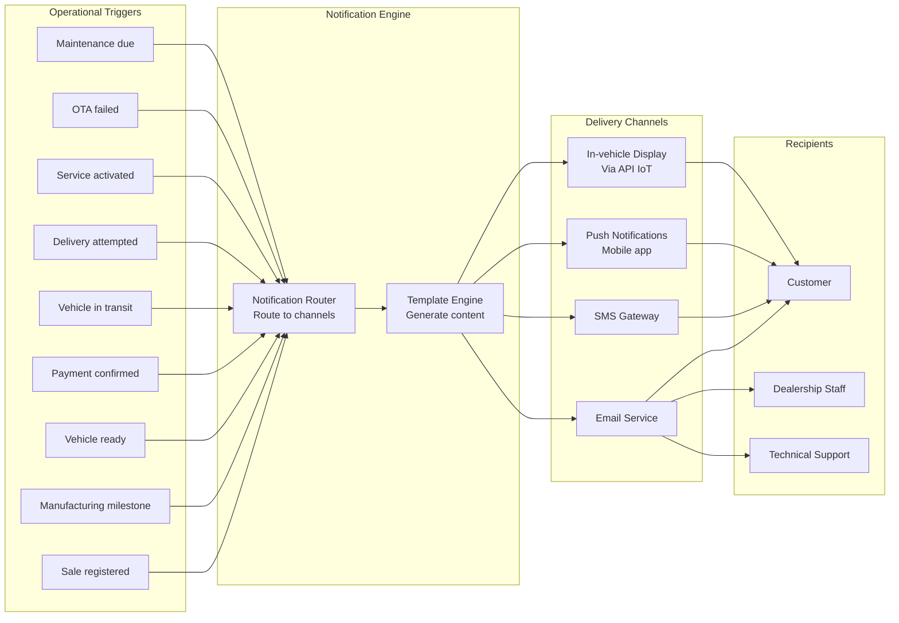
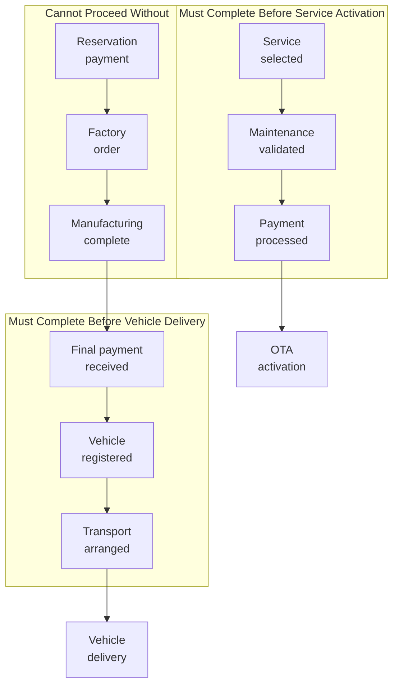
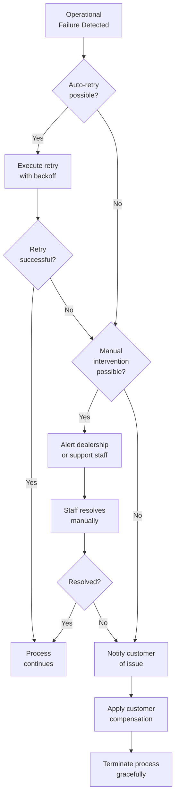
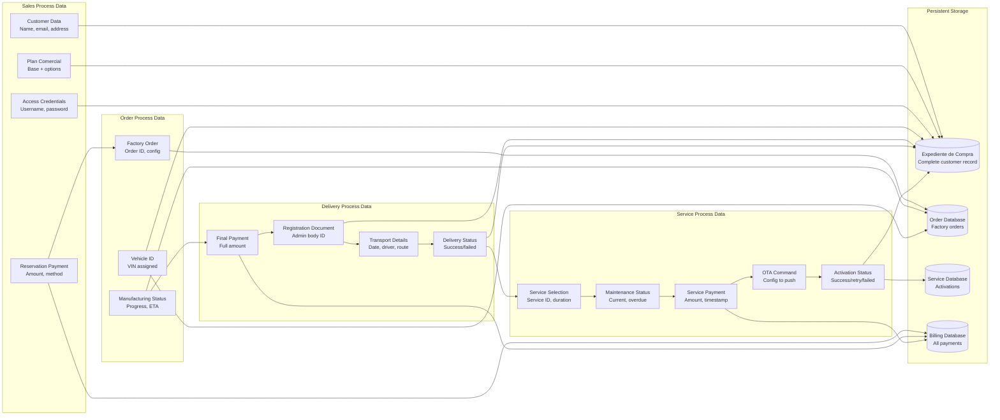

# Operational Processes

Relevant source files

The following files were used as context for generating this wiki page:

- [enunciado.md](enunciado.md)
- [pasame las preguntas y sus respuestas a markdown.md](pasame las preguntas y sus respuestas a markdown.md)

## Purpose and Scope

This document provides a comprehensive overview of the key operational workflows and business processes that execute within the CaaS platform. It describes how different operational activities coordinate to deliver the Car as a Service business model from initial sale through ongoing service delivery.

This page focuses on the **operational execution layer** - the concrete processes, workflows, and procedural steps that implement the business model described in [Business Model and Concept](#2). For detailed information on specific operational areas, see:
- Sales and order management procedures: [Sales and Order Management](#8.1)
- Manufacturing tracking and vehicle delivery: [Manufacturing and Delivery Workflow](#8.2)
- Maintenance plan execution: [Maintenance Management](#8.3)

For payment-specific workflows, see [Payment and Billing](#7). For service lifecycle processes, see [Service Lifecycle Management](#6).

**Sources:** [enunciado.md:1-23](), [pasame las preguntas y sus respuestas a markdown.md:1-104]()

---

## Overview of Operational Workflows

The CaaS system orchestrates multiple concurrent operational workflows that span from initial customer acquisition through the complete vehicle ownership lifecycle. These processes involve coordination between dealerships, factories, transport companies, administrative bodies, workshops, and customers.

### Primary Operational Domains

| Operational Domain | Key Activities | Primary Systems | External Actors |
|-------------------|----------------|-----------------|-----------------|
| **Sales Operations** | Customer registration, plan configuration, credential generation, reservation processing | Corporate Intranet | Dealership employees, customers |
| **Order Fulfillment** | Factory order placement, manufacturing tracking, status notifications | Factory API, notification engine | Factory, transport companies |
| **Vehicle Registration** | Administrative registration, matriculation processing | Admin API | Government administrative bodies |
| **Delivery Operations** | Transport coordination, home delivery, customer handoff, mobile app linking | Transport coordination system, mobile app | Transport companies, customers |
| **Service Operations** | Service catalog browsing, payment processing, OTA activation, retry handling | Service catalog, OTA engine, API IoT | Customers, vehicles |
| **Maintenance Operations** | Maintenance status tracking, service eligibility verification, warranty management | VSS integration | Workshops, customers |
| **Notification Operations** | Multi-channel customer communication, status updates, alert delivery | Notification engine | Customers |

**Sources:** [enunciado.md:8-23](), [pasame las preguntas y sus respuestas a markdown.md:18-53]()

---

## Complete Customer Lifecycle Workflow

The following diagram illustrates the end-to-end operational workflow from initial sale through ongoing service delivery, showing the sequence of operational steps and decision points.

**Diagram: Complete Operational Process Flow**

```mermaid
flowchart TD
    Start["Customer visits dealership"]
    
    subgraph "Sales Operations (8.1)"
        SalesReg["Employee registers sale<br/>in corporate intranet"]
        CaptureData["Capture customer data<br/>+ plan comercial"]
        GenCreds["System generates<br/>access credentials"]
        EmailCreds["Email credentials<br/>to customer"]
        PayReserv["Customer pays<br/>reservation signal"]
    end
    
    subgraph "Order Fulfillment (8.2)"
        AutoOrder["System automatically places<br/>factory order via API"]
        MfgTracking["Track manufacturing status<br/>via async notifications"]
        NotifyProgress["Send status updates<br/>to customer"]
        VehicleReady["Vehicle ready<br/>at factory"]
    end
    
    subgraph "Payment and Registration"
        NotifyAvail["Notify customer<br/>vehicle available"]
        FinalPayment["Customer completes<br/>final payment"]
        PaymentCheck{Payment<br/>successful?}
        RegisterVehicle["Register vehicle<br/>with admin bodies"]
        MarkUnassigned["Mark vehicle<br/>'sin asignar'"]
        MoveStock["Move to dealership<br/>stock for sale"]
    end
    
    subgraph "Delivery Operations (8.2)"
        ArrangeTransport["Arrange transport<br/>to customer address"]
        AttemptDelivery["Attempt home<br/>delivery"]
        DeliveryCheck{Customer<br/>present?}
        LinkMobile["Link mobile app<br/>to vehicle"]
        ReturnDealer["Return vehicle<br/>to dealership"]
        CustomerPickup["Customer picks up<br/>at dealership"]
    end
    
    subgraph "Service Operations (6.2)"
        VehicleActive["Vehicle operational<br/>with plataforma base"]
        CustomerBrowse["Customer browses<br/>service catalog"]
        CheckMaint["Check maintenance<br/>status via VSS"]
        MaintOK{Maintenance<br/>current?}
        SelectService["Customer selects<br/>service and pays"]
        OTAActivation["OTA activation<br/>via API IoT"]
        RetryLogic["Retry activation<br/>if failed"]
        TechSupport["Escalate to<br/>tech support"]
        NoCharge["Do not charge<br/>customer"]
    end
    
    subgraph "Maintenance Operations (8.3)"
        MaintSchedule["Maintenance scheduled<br/>per plan"]
        CustomerMaint["Customer takes vehicle<br/>to workshop"]
        WorkshopRecord["Workshop records service<br/>in VSS system"]
        UpdateStatus["VSS updates<br/>maintenance status"]
    end
    
    Start --> SalesReg
    SalesReg --> CaptureData
    CaptureData --> GenCreds
    GenCreds --> EmailCreds
    EmailCreds --> PayReserv
    
    PayReserv --> AutoOrder
    AutoOrder --> MfgTracking
    MfgTracking --> NotifyProgress
    NotifyProgress --> VehicleReady
    
    VehicleReady --> NotifyAvail
    NotifyAvail --> FinalPayment
    FinalPayment --> PaymentCheck
    PaymentCheck -->|Yes| RegisterVehicle
    PaymentCheck -->|No| MarkUnassigned
    MarkUnassigned --> MoveStock
    MoveStock --> End1["Customer loses<br/>reservation"]
    
    RegisterVehicle --> ArrangeTransport
    ArrangeTransport --> AttemptDelivery
    AttemptDelivery --> DeliveryCheck
    DeliveryCheck -->|Yes| LinkMobile
    DeliveryCheck -->|No| ReturnDealer
    ReturnDealer --> CustomerPickup
    CustomerPickup --> LinkMobile
    
    LinkMobile --> VehicleActive
    
    VehicleActive --> CustomerBrowse
    CustomerBrowse --> CheckMaint
    CheckMaint --> MaintOK
    MaintOK -->|Yes| SelectService
    MaintOK -->|No| DenyService["Deny service<br/>activation"]
    DenyService --> VehicleActive
    
    SelectService --> OTAActivation
    OTAActivation --> ActivationCheck{Activation<br/>successful?}
    ActivationCheck -->|Yes| ServiceActive["Service active<br/>on vehicle"]
    ActivationCheck -->|No| RetryLogic
    RetryLogic --> RetryCheck{Retries<br/>remaining?}
    RetryCheck -->|Yes| OTAActivation
    RetryCheck -->|No| TechSupport
    TechSupport --> NoCharge
    NoCharge --> VehicleActive
    
    ServiceActive --> VehicleActive
    
    VehicleActive --> MaintSchedule
    MaintSchedule --> CustomerMaint
    CustomerMaint --> WorkshopRecord
    WorkshopRecord --> UpdateStatus
    UpdateStatus --> VehicleActive
```

**Sources:** [enunciado.md:8-23](), [pasame las preguntas y sus respuestas a markdown.md:18-96]()

---

## Process Integration and System Interactions

The operational processes require integration with multiple external systems and internal components. This section documents how processes interact with system components.

**Diagram: Operational Process to System Component Mapping**

```mermaid
graph TB
    subgraph "Operational Processes"
        SalesOps["Sales Operations"]
        OrderOps["Order Fulfillment"]
        DeliveryOps["Delivery Operations"]
        ServiceOps["Service Operations"]
        MaintOps["Maintenance Operations"]
        NotifOps["Notification Operations"]
    end
    
    subgraph "Internal Systems"
        Intranet["Corporate Intranet<br/>Sales registration"]
        ExpedienteDB["Expediente de Compra<br/>Customer records"]
        ServiceCatalog["Service Catalog<br/>Opciones disponibles"]
        PaymentProc["Payment Processing"]
        OTAEngine["OTA Activation Engine<br/>Retry logic"]
        NotifEngine["Notification Engine<br/>Multi-channel"]
    end
    
    subgraph "External System APIs"
        FactoryAPI["Factory API<br/>Order + Status"]
        VSSAPI["VSS API<br/>Maintenance queries"]
        IoTAPI["API IoT<br/>Vehicle communication"]
        AdminAPI["Admin API<br/>Registration"]
        PaymentGW["Payment Gateway"]
        TransportSys["Transport Coordination<br/>(subcontracted)"]
    end
    
    subgraph "Infrastructure"
        EmailSys["Email Service"]
        SMSSys["SMS Gateway"]
        PushSys["Push Notifications"]
        VehicleNetwork["IoT Network<br/>Vehicle fleet"]
    end
    
    SalesOps --> Intranet
    SalesOps --> ExpedienteDB
    SalesOps --> EmailSys
    SalesOps --> PaymentProc
    
    OrderOps --> FactoryAPI
    OrderOps --> NotifEngine
    OrderOps --> ExpedienteDB
    
    DeliveryOps --> TransportSys
    DeliveryOps --> AdminAPI
    DeliveryOps --> NotifEngine
    
    ServiceOps --> ServiceCatalog
    ServiceOps --> PaymentProc
    ServiceOps --> VSSAPI
    ServiceOps --> OTAEngine
    
    MaintOps --> VSSAPI
    
    NotifOps --> NotifEngine
    NotifOps --> EmailSys
    NotifOps --> SMSSys
    NotifOps --> PushSys
    
    PaymentProc --> PaymentGW
    OTAEngine --> IoTAPI
    IoTAPI --> VehicleNetwork
    
    NotifEngine --> EmailSys
    NotifEngine --> SMSSys
    NotifEngine --> PushSys
```

**Sources:** [enunciado.md:8-23](), [pasame las preguntas y sus respuestas a markdown.md:31-56]()

---

## Automated vs Manual Operational Steps

Understanding which operational steps are automated versus manual is critical for system design and resource planning.

| Process Step | Automation Level | Actor/System | Trigger |
|--------------|-----------------|--------------|---------|
| Sales registration in intranet | Manual entry | Dealership employee | Customer completes sale |
| Customer credential generation | Fully automated | System | Sales registration complete |
| Credential email delivery | Fully automated | Email service | Credentials generated |
| Factory order placement | Fully automated | Factory API integration | Reservation payment received |
| Manufacturing status notifications | Fully automated | Factory webhooks | Manufacturing milestones |
| Customer status notifications | Fully automated | Notification engine | Factory status received |
| Final payment processing | Manual initiation | Customer | Vehicle ready notification |
| Vehicle registration with admin bodies | Automated API call | Admin API integration | Final payment confirmed |
| Transport arrangement | Manual/Semi-automated | Dealership + Transport company | Vehicle registered |
| Home delivery attempt | Manual | Transport driver | Transport scheduled |
| Mobile app linking | Manual | Customer + Support | Vehicle delivered |
| Service browsing | Manual | Customer | Customer initiative |
| Maintenance status check | Fully automated | VSS API integration | Service selection |
| Service payment processing | Automated | Payment gateway | Customer confirms purchase |
| OTA service activation | Fully automated | OTA engine + API IoT | Payment successful |
| OTA retry logic | Fully automated | OTA engine | Activation failure |
| Technical support escalation | Automated alert | System → Support team | All retries failed |
| Maintenance recording | Manual | Workshop technician | Service completed |

**Sources:** [enunciado.md:8-23](), [pasame las preguntas y sus respuestas a markdown.md:18-53]()

---

## Operational State Tracking

The CaaS system must track multiple operational states across different entities. This section documents the key state machines that govern operational processes.

### Vehicle Operational States

### Service Activation States

**Sources:** [pasame las preguntas y sus respuestas a markdown.md:24-96]()

---

## Notification Workflows

Notifications are a critical operational component that keeps customers, employees, and support staff informed throughout all processes.

**Diagram: Notification Triggers and Channels**

### Notification Types and Timing

| Event | Recipient | Channels | Timing | Priority |
|-------|-----------|----------|--------|----------|
| Credentials generated | Customer | Email | Immediate | High |
| Order placed with factory | Customer | Email, Push | Immediate | Medium |
| Manufacturing status update | Customer | Email, Push | As received from factory | Low |
| Vehicle ready at factory | Customer | Email, SMS, Push | Immediate | High |
| Payment successful | Customer | Email | Immediate | Medium |
| Vehicle registered | Customer | Email | Immediate | Medium |
| Vehicle in transit | Customer | Email, SMS, Push | When transport starts | High |
| Delivery attempted - failed | Customer | SMS, Push | Immediate | High |
| Mobile app linked | Customer | Push, In-app | Immediate | Medium |
| Service activated | Customer | Push, In-app, Email | Immediate | Medium |
| OTA activation failed | Customer | Email | After all retries | High |
| OTA activation failed | Support | Email | After all retries | Critical |
| Maintenance due soon | Customer | Email, Push | Based on schedule | Low |
| Maintenance overdue | Customer | Email, SMS, Push | When overdue | High |
| Service denied - maintenance | Customer | Push, In-app | Immediate | High |

**Sources:** [enunciado.md:11-14](), [pasame las preguntas y sus respuestas a markdown.md:28-29]()

---

## Process Dependencies and Sequencing

Certain operational processes have strict dependencies and must occur in specific sequences. Violations of these sequences can result in operational failures or business rule violations.

### Critical Process Dependencies

### Dependency Rules

| Dependent Process | Must Wait For | Reason | Exception Handling |
|-------------------|---------------|--------|-------------------|
| Factory order placement | Reservation payment | Financial commitment | None - hard requirement |
| Vehicle registration | Final payment | Legal ownership transfer | Vehicle becomes "sin asignar" if payment fails |
| Transport arrangement | Vehicle registration | Cannot transport unregistered vehicle | None |
| Mobile app linking | Physical delivery | Security - customer must possess vehicle | None |
| Service activation | Maintenance validation | Safety and warranty | Service denied if maintenance overdue |
| Service delivery (OTA) | Payment confirmation | Business rule - pay before use | None - hard requirement |
| Maintenance-dependent service | Current maintenance status | Safety and warranty | Blocks only specific services, not all |

**Sources:** [enunciado.md:14-19](), [pasame las preguntas y sus respuestas a markdown.md:24-73]()

---

## Failure Handling and Operational Recovery

Operational processes must handle various failure scenarios. This section documents the standard recovery procedures.

### Standard Failure Recovery Patterns

| Failure Scenario | Detection Method | Recovery Procedure | Customer Impact |
|------------------|------------------|-------------------|-----------------|
| Factory order API failure | Synchronous API error response | Retry with exponential backoff; alert dealership staff | Manual order placement if API down |
| Payment gateway timeout | Timeout on payment confirmation | Assume success, reconcile async; deliver service | Service delivered; rare chargeback risk |
| OTA activation failure | Status query after timeout | Retry N times; escalate to support; **do not charge** | No charge for failed service |
| Delivery - customer absent | Driver contact attempt | Return to dealership; customer picks up | Slight delay; customer inconvenience |
| Final payment failure | Payment gateway rejection | Mark vehicle "sin asignar"; move to stock | Customer loses reservation |
| Maintenance status check failure | VSS API timeout/error | Deny service activation (fail-safe) | Service temporarily unavailable |
| Vehicle registration API failure | Synchronous API error | Retry; manual registration if persistent | Delivery delayed |
| Transport coordination failure | Manual escalation | Dealership arranges alternate transport | Delivery delayed |

### Operational Escalation Paths

**Sources:** [pasame las preguntas y sus respuestas a markdown.md:48-53](), [pasame las preguntas y sus respuestas a markdown.md:24-29]()

---

## Data Flow Across Operational Processes

Understanding how data flows through operational processes is essential for maintaining data consistency and traceability.

**Diagram: Data Entities and Process Flow**

**Sources:** [enunciado.md:8-23](), [pasame las preguntas y sus respuestas a markdown.md:1-104]()

---

## Operational Metrics and Monitoring

Key metrics that should be tracked for operational health and performance:

### Process Performance Metrics

| Process | Key Metrics | Target | Monitoring Frequency |
|---------|-------------|--------|---------------------|
| Sales registration | Time from sale to credentials sent | < 1 hour | Real-time |
| Factory order | API success rate | > 99% | Real-time |
| Manufacturing tracking | Notification delivery rate | > 99.5% | Daily |
| Payment processing | Settlement success rate | > 98% | Real-time |
| Vehicle registration | Registration time | < 24 hours | Daily |
| Delivery operations | First-attempt success rate | > 85% | Weekly |
| OTA activation | First-attempt success rate | > 95% | Real-time |
| OTA retry | Success rate after retries | > 99% | Daily |
| Technical escalation | Resolution time | < 48 hours | Daily |
| Maintenance status check | API response time | < 2 seconds | Real-time |

### Operational Health Indicators

- **End-to-end sales cycle time**: Dealership sale → vehicle delivered
- **Customer satisfaction score**: Post-delivery survey
- **Service activation success rate**: Including retries
- **Payment failure rate**: By payment type
- **Manufacturing status update frequency**: From factory webhooks
- **Notification delivery success rate**: By channel
- **Manual intervention frequency**: Escalations requiring staff action
- **Process automation percentage**: Automated vs manual steps

**Sources:** [pasame las preguntas y sus respuestas a markdown.md:48-53]()

---

## Related Pages

For detailed information on specific operational processes:
- **Sales and customer onboarding**: [Sales and Order Management](#8.1)
- **Manufacturing tracking and delivery**: [Manufacturing and Delivery Workflow](#8.2)
- **Maintenance operations**: [Maintenance Management](#8.3)
- **Payment processing details**: [Payment and Billing](#7)
- **OTA activation procedures**: [OTA Service Activation](#6.2)
- **Failure handling specifics**: [Failure Handling and Edge Cases](#9)