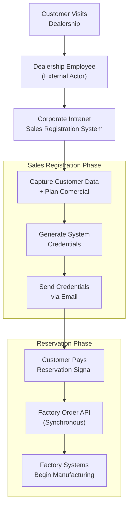
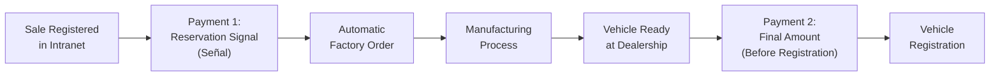
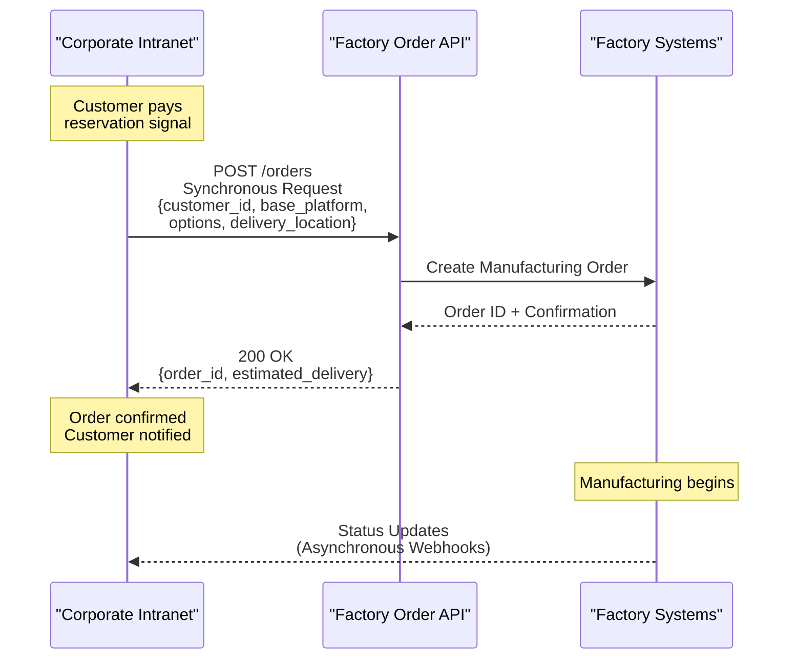
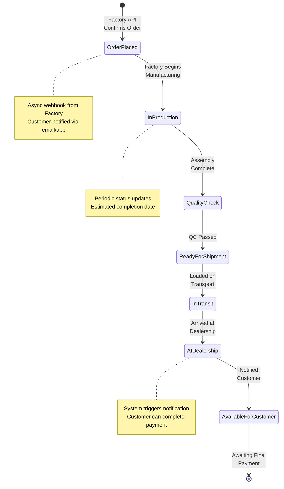
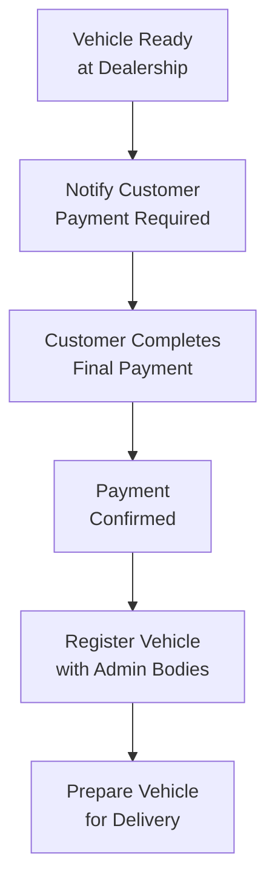
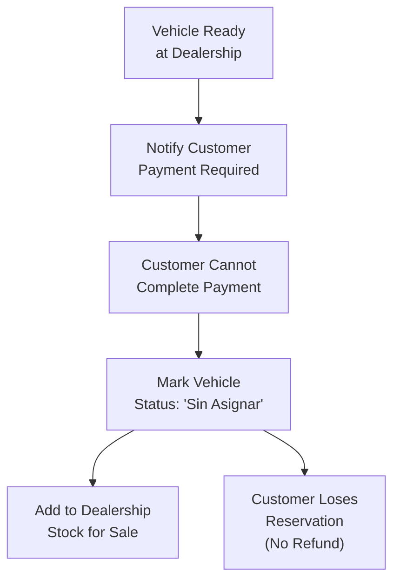
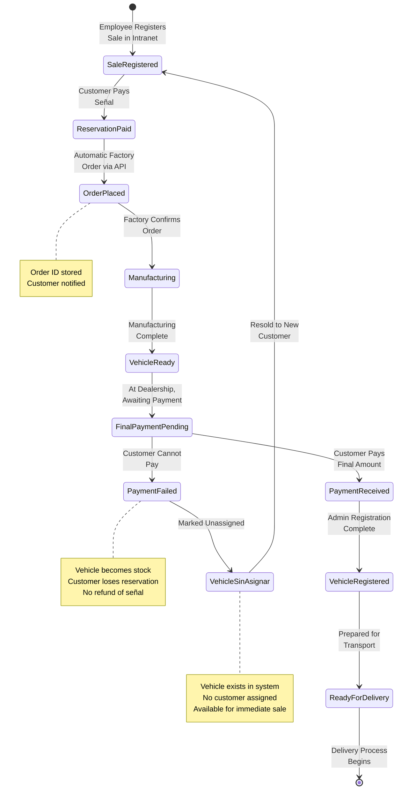
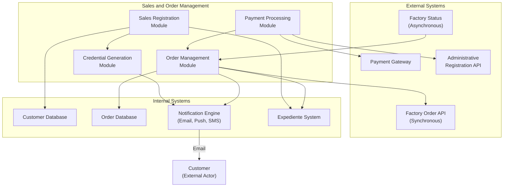

# Sales and Order Management

Relevant source files

The following files were used as context for generating this wiki page:

- [enunciado.md](enunciado.md)
- [pasame las preguntas y sus respuestas a markdown.md](pasame las preguntas y sus respuestas a markdown.md)

## Purpose and Scope

This page documents the dealership-initiated sales workflow, encompassing customer registration, credential generation, reservation processing, and factory order placement. This is the entry point for all vehicle sales in the CaaS system, occurring before manufacturing and delivery.

For information about the subsequent manufacturing tracking and delivery processes, see [Manufacturing and Delivery Workflow](#8.2). For details on service purchases after vehicle delivery, see [Service Acquisition and Management](#4.2).

**Sources:** [enunciado.md:8-17](), [pasame las preguntas y sus respuestas a markdown.md:8-29]()

---

## Overview of Sales Process

The sales process is initiated exclusively at **concesionarios** (dealerships) by **employees** (commercial staff), who are external actors using the corporate intranet system. The process transforms a customer interaction into a registered sale, generates system credentials, and automatically triggers factory manufacturing.

**Diagram: End-to-End Sales Workflow from Dealership to Factory**

**Sources:** [enunciado.md:8-13](), [pasame las preguntas y sus respuestas a markdown.md:41-44]()

---

## Customer Registration and Data Capture

### Registration Process

When an employee closes a sale at a dealership, they register it in the **corporate intranet servers**. This registration is mandatory before any further processing can occur.

**Data Captured During Registration:**

| Data Category | Description | Purpose |
|--------------|-------------|---------|
| Customer Identification | Full name, contact information, address | System authentication and delivery logistics |
| Email Address | Primary contact email | Credential delivery and notifications |
| Plan Comercial | Selected base platform model | Defines vehicle to manufacture |
| Optional Services | Pre-selected opciones disponibles | Initial service configuration |
| Payment Information | Reservation payment details | Order validation |

### Credential Generation

Upon successful registration, the system automatically generates access credentials for the customer. These credentials provide access to both the **web platform** and **mobile application**.

**Credential Components:**
- Username (typically derived from email)
- Initial password (auto-generated, secure)
- Account activation link

The credentials are sent to the customer's registered email address, enabling them to access their **expediente de compra** (purchase dossier) immediately.

**Important System Rule:** The CaaS system does NOT support self-registration or external OAuth (Google, Microsoft, etc.). All users must be explicitly registered by dealership staff. Anonymous or public access is not permitted.

**Sources:** [enunciado.md:8-11](), [pasame las preguntas y sus respuestas a markdown.md:15-16]()

---

## Reservation Payment Processing

### Payment Structure

The vehicle purchase follows a two-stage payment model:

**Diagram: Two-Stage Payment Model for Vehicle Purchase**

### Reservation Signal (Señal)

The **señal** (reservation payment) is the first payment made by the customer. This payment:
- Confirms customer commitment to the purchase
- Triggers automatic factory order placement
- Is non-refundable once the factory order is placed
- Represents a partial payment toward the total vehicle cost

### Final Payment

The final payment occurs when the vehicle is ready and available at the dealership. This payment:
- Covers the remaining balance of the vehicle purchase
- Must be completed before vehicle registration
- Is blocking for all subsequent operations (registration, delivery)

**Sources:** [pasame las preguntas y sus respuestas a markdown.md:80-82](), [enunciado.md:13-15]()

---

## Factory Order Placement

### Automatic Order Submission

Once the customer pays the reservation signal, the system **automatically** places an order with the factory through the **Factory Order API**. This is not a manual process—no employee intervention is required.

### API Communication Pattern

The factory integration uses a **synchronous** (request-response) pattern for order placement:

**Diagram: Factory Order API Integration Pattern**

**Key Integration Characteristics:**

1. **Initiative:** CaaS initiates the order (synchronous call)
2. **Response:** Factory returns immediate confirmation with order ID
3. **Status Updates:** Factory sends asynchronous notifications as manufacturing progresses
4. **Blocking:** Order placement must succeed for the sale to proceed

### Order Data Structure

The order submitted to the factory includes:

| Field | Description | Source |
|-------|-------------|--------|
| `customer_id` | Internal customer identifier | Generated during registration |
| `base_platform` | Vehicle model/platform code | From plan comercial |
| `options` | List of pre-selected opciones disponibles | From plan comercial |
| `delivery_location` | Dealership or customer address | Customer registration data |
| `order_date` | Timestamp of order creation | System timestamp |

**Sources:** [pasame las preguntas y sus respuestas a markdown.md:41-44](), [enunciado.md:13]()

---

## Manufacturing Status Notifications

After the order is placed, the factory sends **asynchronous notifications** to update the status of the vehicle manufacturing process. These notifications enable the customer to track their vehicle's progress.

### Notification Flow

**Diagram: Vehicle Manufacturing State Transitions with Notifications**

### Customer Notification System

The system provides **automatic notifications** to customers throughout the manufacturing process. This is identified as a key value differentiator for the CaaS platform.

**Notification Channels:**
- Email notifications
- Mobile app push notifications
- Web platform status updates (visible in expediente de compra)

**Notification Triggers:**
- Order placed confirmation
- Manufacturing started
- Manufacturing milestones reached
- Quality check completed
- Vehicle ready for shipment
- Vehicle arrived at dealership
- Vehicle available for final payment

**Sources:** [pasame las preguntas y sus respuestas a markdown.md:28-29](), [enunciado.md:13]()

---

## Final Payment and Vehicle Assignment

### Final Payment Requirement

When the vehicle arrives at the dealership and is ready for delivery, the customer receives a notification and must complete the **final payment** (remaining balance). This payment is a **blocking operation**—no further steps can proceed until payment is confirmed.

### Payment Success Scenario

**Diagram: Successful Final Payment Flow**

### Payment Failure Scenario

If the customer **does not have the money** or fails to complete the final payment, the system implements a strict business rule:

**Actions on Payment Failure:**

1. **Vehicle Status Change:** The vehicle is marked as **"sin asignar"** (unassigned) in the system
2. **Customer Loses Reservation:** The customer loses all rights to the reserved vehicle
3. **Vehicle Becomes Stock:** The dealership retains the vehicle as available stock for immediate sale to other customers
4. **Reservation Payment Not Refunded:** The initial señal is forfeited

**Diagram: Final Payment Failure Flow**

**System State Implications:**
- The vehicle record exists in the system but has no associated customer
- The vehicle can be immediately reassigned to a new customer
- The original customer's expediente shows the failed purchase
- The customer retains access to the platform but has no active vehicle

**Sources:** [pasame las preguntas y sus respuestas a markdown.md:26-27](), [enunciado.md:14-15]()

---

## Vehicle Registration with Administrative Bodies

After successful final payment, the **dealership** (not the customer) is responsible for registering the vehicle with the appropriate **government administrative bodies**. This registration process varies by country.

### Registration Process

The registration includes:
- Obtaining official license plates
- Registering ownership in government databases
- Completing tax declarations
- Obtaining circulation permits

### Multi-Country Considerations

Since the CaaS system operates in multiple countries, the registration process must accommodate country-specific requirements. The system likely maintains configuration for:
- Country-specific administrative API endpoints
- Required documentation per jurisdiction
- Registration fees and tax structures
- Processing timelines

**Integration Point:** The system integrates with administrative registration systems (see [Administrative Registration Integration](#5.5) for technical details).

**Sources:** [enunciado.md:15-16](), [pasame las preguntas y sus respuestas a markdown.md:18-29]()

---

## Order and Vehicle State Management

### Core State Entities

The sales and order management system tracks several concurrent state machines:

**Diagram: Order and Vehicle State Machine**

### State Persistence

The system must persist the following state information throughout the sales process:

| State Data | Storage Purpose | Used By |
|-----------|-----------------|---------|
| Sale Registration Record | Customer + plan comercial details | Corporate intranet, expediente |
| Order ID | Factory order tracking | Manufacturing notifications, customer queries |
| Payment Status | Reservation and final payment confirmation | Order progression, vehicle assignment |
| Vehicle Status | Assigned/unassigned, registration status | Delivery scheduling, stock management |
| Customer Credentials | System access | Web platform, mobile app authentication |

**Sources:** [enunciado.md:8-17](), [pasame las preguntas y sus respuestas a markdown.md:26-27]()

---

## Integration Points Summary

The Sales and Order Management subsystem integrates with multiple external and internal systems:

**Diagram: Sales and Order Management Integration Architecture**

**Key Integration Characteristics:**

1. **Factory API:** Synchronous order placement initiated by CaaS
2. **Factory Webhooks:** Asynchronous status updates pushed by factory
3. **Payment Gateway:** Processes reservation and final payments
4. **Admin Registration:** Handles vehicle registration with government bodies
5. **Notification Engine:** Multi-channel customer communication
6. **Expediente System:** Customer-facing purchase dossier

**Sources:** [enunciado.md:8-17](), [pasame las preguntas y sus respuestas a markdown.md:41-44]()

---

## Business Rules Summary

### Critical Business Rules

| Rule | Description | Enforcement |
|------|-------------|-------------|
| **No Self-Registration** | All users must be registered by dealership employees | System does not provide registration UI |
| **Automatic Order Placement** | Factory order placed automatically upon reservation payment | No manual intervention allowed |
| **Synchronous Order API** | Order placement must receive immediate confirmation | Blocking operation, error handling required |
| **Final Payment Blocking** | Vehicle registration cannot proceed without final payment | State transition guard condition |
| **Payment Failure Penalty** | Failed final payment results in lost reservation | Vehicle marked "sin asignar", no refund |
| **Dealership Registration** | Only dealership can register vehicles, not customers | Role-based access control |

### State Transition Guards

The following conditions must be met for state transitions:

- **Sale Registration → Reservation Paid:** Valid customer data captured
- **Reservation Paid → Order Placed:** Payment confirmation received
- **Order Placed → Manufacturing:** Factory API returns success
- **Vehicle Ready → Final Payment Pending:** Vehicle physically at dealership
- **Final Payment Pending → Payment Received:** Full payment confirmed
- **Payment Received → Vehicle Registered:** Admin registration successful

**Sources:** [enunciado.md:8-17](), [pasame las preguntas y sus respuestas a markdown.md:15-16, 26-27, 41-44, 80-82]()