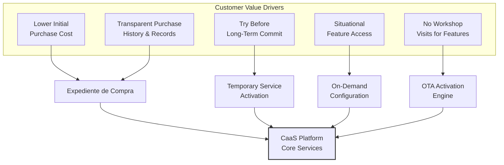
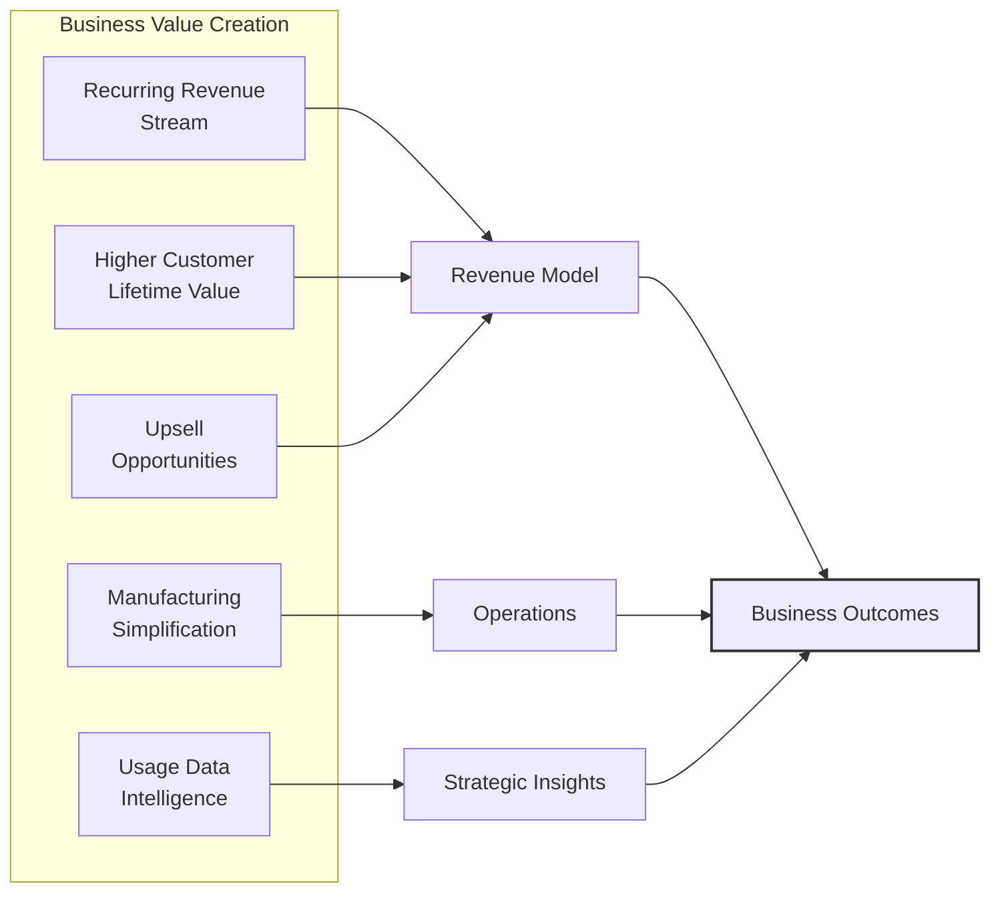
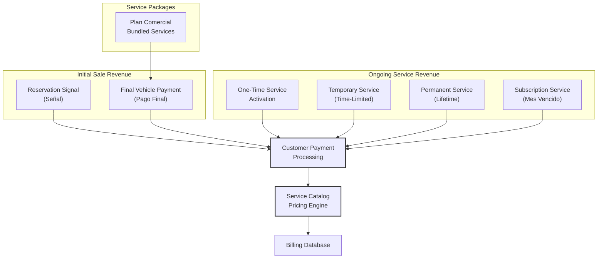
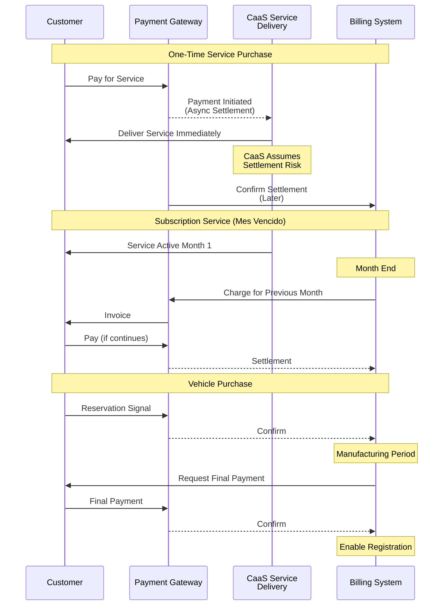
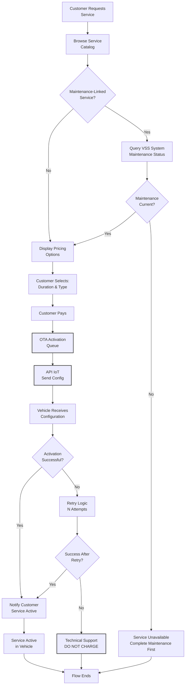
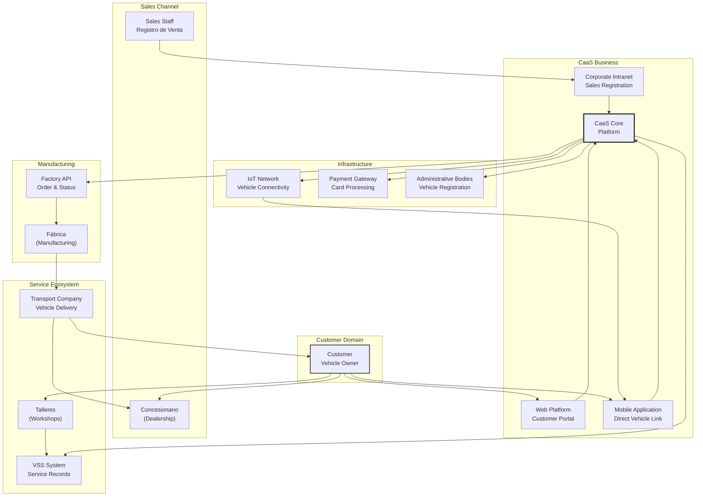

# Business Model and Concept

Relevant source files

The following files were used as context for generating this wiki page:

- [enunciado.md](enunciado.md)
- [pasame las preguntas y sus respuestas a markdown.md](pasame las preguntas y sus respuestas a markdown.md)

## Purpose and Scope

This document explains the fundamental business model and value proposition of the Car as a Service (CaaS) system. It defines the core revenue streams, service delivery mechanisms, and key differentiators that distinguish CaaS from traditional automotive sales models.

**Scope of this document:**
- Core CaaS business concept and rationale
- Revenue model and monetization strategies
- Value proposition for customers and the business
- High-level service delivery approach

**Related documentation:**
- For detailed explanation of platform base and optional services architecture, see [Platform Base and Optional Services](#2.1)
- For actor definitions and system boundaries, see [Key Actors and System Boundaries](#2.2)
- For specific business rules and policy details, see [Business Rules and Policies](#2.3)
- For technical service lifecycle management, see [Service Lifecycle Management](#6)

---

## Core CaaS Business Concept

The Car as a Service (CaaS) model fundamentally changes the traditional automotive value proposition by separating **vehicle ownership** from **feature usage**. Customers purchase a fully functional base vehicle (plataforma base) and subsequently activate or deactivate optional features (opciones disponibles) on-demand throughout the vehicle's lifecycle.

### Traditional vs. CaaS Model Comparison

| Aspect | Traditional Model | CaaS Model |
|--------|------------------|------------|
| **Purchase Decision** | Customer must decide all features upfront | Customer buys base vehicle, decides features later |
| **Feature Availability** | Fixed at purchase time | Dynamic, activatable on-demand |
| **Revenue Timing** | One-time sale | Recurring revenue through service usage |
| **Feature Cost** | Bundled into vehicle price | Pay-per-use (pago por uso) |
| **Customer Flexibility** | Locked into initial configuration | Try features temporarily or permanently |
| **Vehicle Preparation** | Features installed physically | All features pre-installed, activated remotely via OTA |

### Key Business Principles

1. **Ownership + Flexibility**: Customer owns the physical vehicle but rents features as needed
2. **Pre-installed Functionality**: All optional capabilities are embedded in firmware at manufacture; CaaS only activates/deactivates them
3. **Remote Delivery**: All services delivered via OTA (Over The Air) configuration, never requiring physical workshop visits for feature activation
4. **Connected Infrastructure**: Every vehicle sold is IoT-connected, enabling remote configuration and status monitoring
5. **Usage-Based Monetization**: Revenue generated throughout vehicle lifetime, not just at point of sale

**Sources:** [enunciado.md:1-23]()

---

## Value Proposition

### For Customers

The CaaS model provides multiple value dimensions for vehicle purchasers:

**Customer Benefits:**

| Benefit | Implementation | Business Impact |
|---------|---------------|-----------------|
| **Reduced Upfront Cost** | Only pay for plataforma base initially | Lower barrier to entry, expanded market |
| **Situational Feature Use** | Activate 4WD only for ski trip, not year-round | Customer pays only for actual value received |
| **Risk-Free Trial** | Test premium features temporarily before permanent purchase | Increases conversion to permanent features |
| **Simplified Ownership** | All manuals, invoices, service history in Expediente | Reduces customer support burden |
| **Immediate Delivery** | OTA activation, no dealership visits | Enhanced convenience, customer satisfaction |

### For the Business

**Business Advantages:**

1. **Predictable Recurring Revenue**: Services generate ongoing cash flow beyond initial vehicle sale
2. **Inventory Simplification**: Manufacture single base configuration per model, differentiate in software
3. **Manufacturing Efficiency**: No need to track hundreds of configuration permutations at factory
4. **Customer Lock-In**: Once subscribed to features, high switching cost to competitor
5. **Feature Optimization**: Usage data informs which features to invest in vs. deprecate
6. **Warranty Management**: Maintenance-linked services enforce proper vehicle care (see [Maintenance-Linked Service Access](#6.3))

**Sources:** [enunciado.md:1-7](), [pasame las preguntas y sus respuestas a markdown.md:77-89]()

---

## Revenue Model

The CaaS business generates revenue through multiple streams across the vehicle purchase and ownership lifecycle:

### Revenue Streams Diagram

### Revenue Stream Details

| Revenue Stream | Timing | Amount | Characteristics | Related System Component |
|----------------|--------|--------|-----------------|--------------------------|
| **Reservation Signal** | At dealership sale | Partial payment | Reserves vehicle, triggers factory order | Order Management API |
| **Final Vehicle Payment** | Before registration | Remainder of base price + plan comercial | Enables vehicle registration and delivery | Payment Processing |
| **One-Time Service** | On-demand during ownership | Per-service pricing | Single activation, permanent or temporary | Service Catalog |
| **Subscription Service** | Monthly recurring | Monthly fee | Billed mes vencido (post-paid) | Subscription Billing Engine |
| **Plan Comercial Bundle** | Included in initial sale | Bundled with base vehicle | Specific opciones available for vehicle lifetime | Service Configuration Repository |

### Payment Timing Models

The CaaS system implements different payment timing strategies based on service type:

**Key Payment Policies:**

1. **Immediate Service Delivery**: Services activated before payment fully settles (CaaS assumes settlement risk for customer experience)
2. **Mes Vencido Subscriptions**: Monthly subscriptions billed at end of month for consumed services (post-paid model)
3. **Failed Final Payment**: If customer cannot complete final vehicle payment, vehicle becomes dealership stock ("sin asignar")
4. **OTA Failure Protection**: If service cannot be activated, customer is **never charged** (see [OTA Activation Failures](#9.1))

**Sources:** [pasame las preguntas y sus respuestas a markdown.md:75-96](), [enunciado.md:8-13]()

---

## Service Delivery Model

The CaaS service delivery model is predicated on remote, automated activation of pre-installed vehicle functionality:

### Service Activation Flow

### Key Delivery Mechanisms

| Component | Function | Business Rationale |
|-----------|----------|-------------------|
| **Service Catalog** | Lists available opciones for each plataforma base | Ensures only compatible services offered |
| **VSS Integration** | Queries maintenance status before service sale | Protects warranty, ensures safety compliance |
| **OTA Activation Engine** | Remotely configures vehicle via API IoT | Eliminates workshop visits, instant gratification |
| **Retry Logic** | Attempts activation multiple times before failure | Maximizes successful delivery rate |
| **Technical Support Escalation** | Manual intervention when OTA fails | Ensures customer never charged for non-delivered service |
| **Expediente de Compra** | Customer's consolidated purchase record | Single source of truth for all services, history, invoices |

### Pre-Installed Functionality Model

A critical architectural principle of CaaS is that **all optional features are embedded in vehicle firmware at manufacture**. The CaaS system only activates or deactivates existing functionality; it never installs new software as part of service delivery.

**Business Implications:**

1. **Instant Activation**: No lengthy download or installation process
2. **Predictable Testing**: All features tested during manufacturing quality assurance
3. **Reduced Failure Modes**: Activation is simple configuration change, not complex software update
4. **Manufacturing Cost**: Higher upfront BOM (Bill of Materials) but simplified production
5. **Security**: No third-party software distribution risk

**Sources:** [enunciado.md:14-23](), [pasame las preguntas y sus respuestas a markdown.md:31-57]()

---

## Business Ecosystem and Boundaries

The CaaS business model operates within a complex ecosystem of external entities and systems:

### Ecosystem Diagram

### Business Entity Roles

| Entity | Role in CaaS Ecosystem | Relationship Type |
|--------|------------------------|-------------------|
| **Concesionario (Dealership)** | Sales initiation point, vehicle delivery location | Partner (company-owned or franchised) |
| **Fábrica (Factory)** | Manufacturing entity, order fulfillment | Internal (same corporate entity as CaaS) |
| **Customer** | Vehicle owner, service purchaser | Primary external actor |
| **Sales Staff** | Register sales, capture customer data | Employees (system users) |
| **Talleres (Workshops)** | Perform maintenance, record service history | Partners (official or authorized) |
| **VSS System** | Maintenance tracking system | External system (workshop-maintained) |
| **Transport Company** | Physical vehicle delivery | Subcontractor |
| **Payment Gateway** | Financial transaction processing | Third-party service |
| **Administrative Bodies** | Vehicle registration authorities | Government entities (per country) |

### Key Business Boundaries

**What CaaS Controls:**
- Customer purchase records (Expediente de Compra)
- Service catalog and pricing (Opciones Disponibles)
- Vehicle configuration via OTA
- Payment processing and billing
- Manufacturing order placement
- Customer communications and notifications

**What CaaS Does NOT Control:**
- Manufacturing schedule and capacity (Factory determines)
- Maintenance execution (Customer decides when/where)
- Maintenance record-keeping (VSS system, managed by workshops)
- Vehicle registration process (Administrative bodies)
- Physical transport logistics (Subcontracted)
- Payment settlement timing (Asynchronous, bank-controlled)

**Critical Business Constraints:**
1. **No User Self-Registration**: All customers must be known and vetted (purchased vehicle or are employees)
2. **Factory API Pre-Exists**: CaaS must use existing factory integration (see [Factory Integration](#5.1))
3. **API IoT Pre-Exists**: Vehicle communication infrastructure already deployed (see [Vehicle Communication (IoT and OTA)](#5.3))
4. **Cannot Block Vehicle Operation**: Even if maintenance overdue, vehicle cannot be prevented from driving (legal constraint)

**Sources:** [pasame las preguntas y sus respuestas a markdown.md:1-16, 18-29, 58-73](), [enunciado.md:8-17]()

---

## Business Model Summary

The CaaS business model represents a fundamental shift in automotive value delivery:

### Core Business Formula

**Traditional Model:**  
`Revenue = Vehicle Sale Price (one-time)`

**CaaS Model:**  
`Revenue = Vehicle Base Price + Σ(Service Activations) + Σ(Subscriptions) + Lifetime Value`

### Strategic Advantages

1. **Extended Revenue Timeline**: Generate income throughout vehicle ownership, not just at sale
2. **Feature Monetization**: Extract value from R&D investment over time through usage fees
3. **Market Segmentation**: Offer same base vehicle to budget and premium customers, differentiated by activated services
4. **Customer Data**: Continuous interaction provides insights into feature preferences and usage patterns
5. **Agile Feature Development**: Can deploy new services remotely to existing vehicle fleet via OTA
6. **Manufacturing Efficiency**: Simplified production with software-based differentiation

### Risk Factors

| Risk | Mitigation Strategy | Implementation |
|------|---------------------|----------------|
| **OTA Activation Failure** | Never charge if service not delivered | Automatic retry + technical support escalation |
| **Payment Settlement Delay** | Assume settlement risk, deliver immediately | Asynchronous payment processing with reconciliation |
| **Customer Churn** | 14-day desistimiento (withdrawal) rights | Liberal refund policy for customer confidence |
| **Maintenance Non-Compliance** | Link premium services to maintenance status | VSS integration gates service availability |
| **Failed Final Payment** | Vehicle becomes dealership stock | Clear policy: no payment = no delivery, vehicle reused |

**Sources:** [enunciado.md:1-23](), [pasame las preguntas y sus respuestas a markdown.md:1-104]()

---

For detailed information on specific aspects of the business model:
- **Service structure and pricing details**: See [Platform Base and Optional Services](#2.1)
- **Actor definitions and responsibilities**: See [Key Actors and System Boundaries](#2.2)  
- **Detailed business rules and policies**: See [Business Rules and Policies](#2.3)
- **Complete customer journey walkthrough**: See [Customer Journey](#4)
- **Service lifecycle management**: See [Service Lifecycle Management](#6)
- **Payment processing details**: See [Payment and Billing](#7)