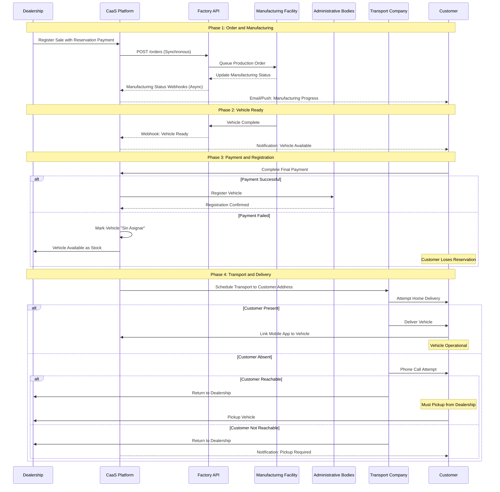
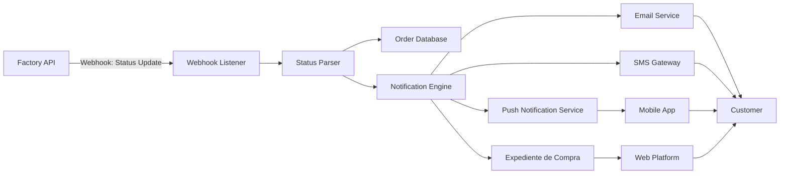
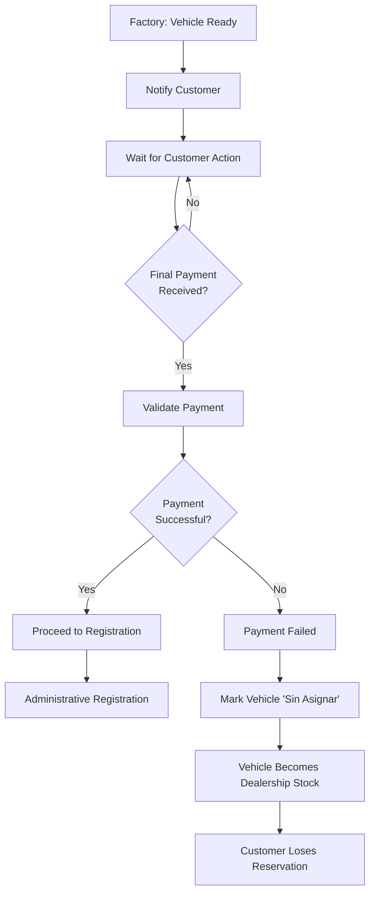
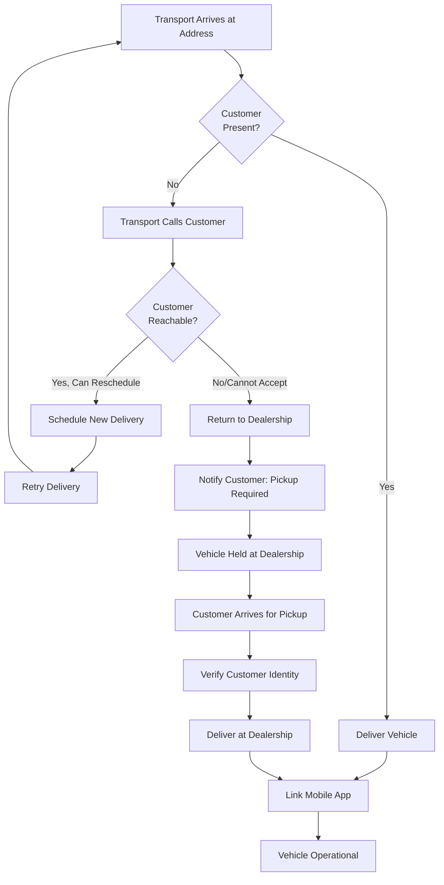
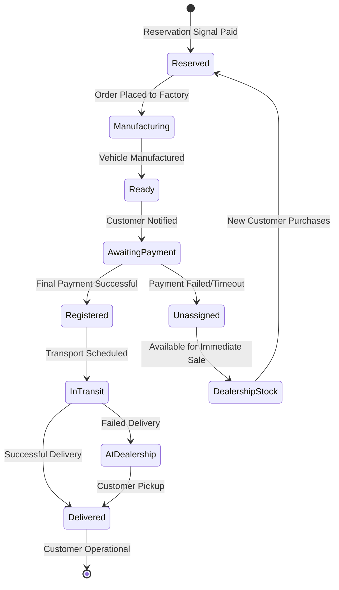
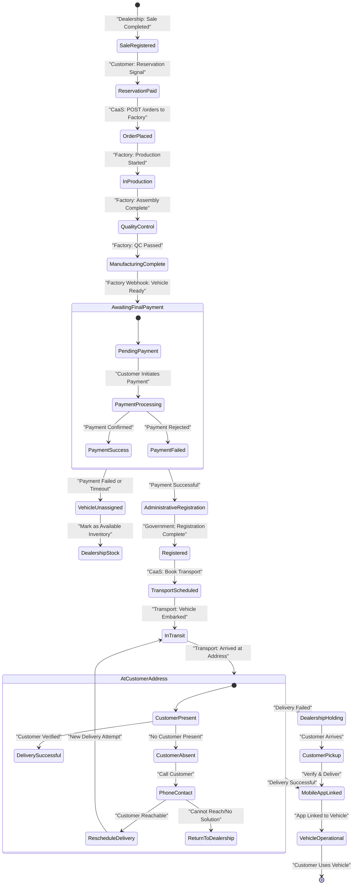

# Manufacturing and Delivery Workflow

Relevant source files

The following files were used as context for generating this wiki page:

- [enunciado.md](enunciado.md)
- [pasame las preguntas y sus respuestas a markdown.md](pasame las preguntas y sus respuestas a markdown.md)

## Purpose and Scope

This document describes the manufacturing tracking, transport coordination, and delivery procedures that occur after a customer has completed the sales process at a dealership. It covers the workflow from the moment an order is placed with the factory through final delivery of the vehicle to the customer.

**Scope boundaries:**
- For the initial sales registration and order placement process, see [Sales and Order Management](#8.1)
- For detailed failure handling and edge cases during delivery, see [Delivery and Transport Issues](#9.3)
- For the factory integration API specifications, see [Factory Integration](#5.1)
- For administrative registration with government bodies, see [Administrative Registration Integration](#5.5)

This page focuses on the operational workflow, status tracking mechanisms, and the various delivery scenarios including successful delivery and fallback procedures.

**Sources:** [enunciado.md:1-23](), [pasame las preguntas y sus respuestas a markdown.md:18-29]()

---

## Workflow Overview

The manufacturing and delivery workflow spans from order placement through final customer possession of the vehicle. This process involves multiple external actors and systems working in coordination.

### High-Level Process Flow

**Sources:** [enunciado.md:9-17](), [pasame las preguntas y sus respuestas a markdown.md:20-29]()

---

## Manufacturing Phase

### Order Placement to Factory

Once a sale is registered in the dealership and the customer has paid the reservation signal (señal), the CaaS platform automatically places an order with the manufacturing facility via the Factory API.

**Integration Pattern:**
- **Direction:** CaaS → Factory
- **Communication Mode:** Synchronous (Request-Response)
- **API Endpoint:** `POST /orders` on Factory API
- **Initiative:** CaaS system initiates the order

**Order Data Transmitted:**
- Customer identification (linked to purchase record)
- Selected plataforma base (vehicle model)
- Optional features included in plan comercial
- Dealership location for final delivery coordination
- Expected delivery locality

The synchronous nature of this API call ensures that CaaS receives immediate confirmation that the order has been accepted into the factory's production queue. Any immediate validation errors (e.g., invalid model configuration, unavailable components) are returned synchronously.

**Sources:** [pasame las preguntas y sus respuestas a markdown.md:41-44](), [enunciado.md:13-14]()

### Manufacturing Status Tracking

After the order is placed, the factory provides ongoing status updates about the manufacturing progress through an asynchronous notification mechanism.

**Integration Pattern:**
- **Direction:** Factory → CaaS
- **Communication Mode:** Asynchronous (Event-Driven)
- **Delivery Method:** Webhooks
- **Initiative:** Factory pushes status updates when state changes occur

**Typical Manufacturing States:**
- Order received and queued
- Production started
- Vehicle assembly in progress
- Quality control and testing
- Vehicle completed and ready
- Vehicle dispatched to locality/dealership

The CaaS platform must implement webhook endpoints to receive these asynchronous notifications. Upon receiving a status update, the system:
1. Updates the internal order/vehicle state
2. Triggers customer notifications
3. Logs the state transition in the purchase record (expediente de compra)

**Sources:** [pasame las preguntas y sus respuestas a markdown.md:41-44](), [enunciado.md:13-14]()

### Customer Notifications During Manufacturing

A key value proposition of the CaaS system is keeping customers informed throughout the manufacturing process. The notification system is triggered by incoming factory status updates.

**Notification Channels:**
- **Email:** Detailed status updates with estimated timelines
- **Push Notifications:** Brief real-time alerts via mobile app
- **SMS:** Optional for critical milestones
- **Web Platform:** Status visible in expediente de compra

**Critical Business Rule:** Automated manufacturing notifications are considered a differentiating value feature of the CaaS platform and must be reliable and timely.

**Sources:** [pasame las preguntas y sus respuestas a markdown.md:28-29](), [enunciado.md:11-14]()

---

## Vehicle Readiness and Final Payment

When the factory notifies CaaS that the vehicle manufacturing is complete and the vehicle is available in the customer's locality, the system triggers a notification to the customer that final payment is required.

### Payment Requirement Before Registration

**Critical Business Rules:**

1. **No Registration Without Full Payment:** The dealership cannot proceed with administrative registration until the customer has completed 100% of the vehicle purchase price (reservation signal + remaining amount).

2. **Payment Failure Consequences:** If the customer cannot or does not complete the final payment:
   - The vehicle is immediately marked as "sin asignar" (unassigned) in the system
   - The vehicle becomes available stock for the dealership to sell to other customers
   - The original customer loses their reservation entirely
   - The reservation signal payment may or may not be refunded depending on dealership policy (not specified in system requirements)

3. **Vehicle State in System:** The vehicle entity exists in the CaaS database but its assignment status transitions from "assigned to customer X" to "unassigned stock."

**Sources:** [pasame las preguntas y sus respuestas a markdown.md:26-27](), [enunciado.md:15-16]()

---

## Administrative Registration

After successful final payment, the dealership must register the vehicle with the appropriate administrative bodies before delivery can occur.

### Registration Process

The registration process varies by country but typically involves:
- Vehicle identification documentation
- Proof of ownership transfer
- Tax payments
- License plate assignment
- Environmental compliance certification

**Integration Pattern:**
- CaaS integrates with administrative registration systems via country-specific APIs
- The registration process is **synchronous and blocking**
- Delivery cannot proceed until registration is confirmed

**System Behavior:**
The CaaS platform calls the administrative registration integration layer, which routes requests to the appropriate country-specific registration authority based on the customer's location and dealership jurisdiction.

**Sources:** [enunciado.md:15-16]()

---

## Transport Coordination

Once the vehicle is registered, the CaaS platform coordinates transport from the factory/dealership location to the customer's address.

### Transport Subcontracting

**Key Facts:**
- Transport is **subcontracted to external transport companies**
- CaaS does not operate its own vehicle transport fleet
- The system must track two critical events:
  1. **Embarkation:** When vehicle leaves factory/dealership (provider records)
  2. **Reception:** When vehicle arrives at destination (dealership/customer records)

### Transport Scheduling

```mermaid
flowchart LR
    REG["Vehicle Registered"] --> SCHEDULE["Schedule Transport"]
    SCHEDULE --> SELECT["Select Transport Provider"]
    SELECT --> BOOK["Book Transport Slot"]
    BOOK --> EMBARK["Record Embarkation"]
    EMBARK --> TRANSIT["Vehicle in Transit"]
    TRANSIT --> ARRIVE["Arrival at Destination"]
    ARRIVE --> ATTEMPT["Attempt Delivery"]
```

The system must maintain transport tracking information including:
- Transport company assigned
- Scheduled delivery date/time
- Embarkation timestamp
- Expected arrival timestamp
- Actual delivery outcome

**Sources:** [pasame las preguntas y sus respuestas a markdown.md:20-21]()

---

## Delivery Procedures

The final phase of the workflow is physical delivery of the vehicle to the customer. The standard procedure is home delivery to the customer's registered address.

### Successful Home Delivery

When delivery proceeds as planned:

1. **Transport Arrival:** Transport company arrives at customer address
2. **Customer Verification:** Customer identity is verified
3. **Vehicle Handover:** Physical transfer of vehicle and documentation
4. **Mobile App Linking:** Customer links their mobile application to the vehicle
5. **Vehicle Activation:** Vehicle becomes operational with plataforma base features active

**Mobile App Linking Process:**
- The mobile application establishes direct communication with the vehicle
- This link enables operational control and service management
- The linking occurs through the existing IoT network infrastructure
- Once linked, the customer can access vehicle features and request service activations

### Vehicle Operational State

After successful delivery and app linking, the vehicle transitions to "Operational" state where:
- Plataforma base features are fully active
- Customer can use the vehicle immediately
- Customer can browse and purchase opciones disponibles via web or mobile platforms
- Maintenance tracking begins

**Sources:** [enunciado.md:17-19](), [pasame las preguntas y sus respuestas a markdown.md:24-25]()

---

## Fallback Scenarios

The delivery process includes comprehensive fallback logic for handling various failure scenarios.

### Customer Absence at Delivery

**Fallback Logic:**

1. **Initial Contact Attempt:** If customer is not present, transport company immediately calls the customer
2. **Rescheduling Option:** If customer is reachable and can arrange a specific time, delivery is rescheduled
3. **Return to Dealership:** If customer cannot be reached or cannot accept delivery, vehicle is returned to dealership
4. **Security Requirement:** Vehicle is **never left unattended** at customer address due to security and liability risks
5. **Customer Notification:** CaaS system sends notification that pickup at dealership is required
6. **Dealership Pickup:** Customer must go to dealership to collect the vehicle

**Critical Business Rule:** Security and risk management prohibit leaving a vehicle unattended. The fallback to dealership pickup ensures controlled handover.

**Sources:** [pasame las preguntas y sus respuestas a markdown.md:24-25]()

### Payment Failure After Manufacturing

If the customer fails to complete final payment after the vehicle is manufactured and ready:

**Immediate Consequences:**
- Vehicle assignment to customer is removed in the system
- Vehicle status changes to "sin asignar" (unassigned)
- Vehicle becomes available inventory for dealership
- Dealership can immediately sell to other customers as stock

**System State Transitions:**

**Database Representation:**
The vehicle record persists in the database with:
- `status`: "unassigned" or "stock"
- `assigned_customer_id`: NULL
- `available_for_sale`: TRUE
- `dealership_id`: Original dealership location

This allows the dealership to manage the vehicle as regular inventory while maintaining full manufacturing and configuration history.

**Sources:** [pasame las preguntas y suas respuestas a markdown.md:26-27]()

---

## Factory Date Planning

The delivery timeline is fundamentally driven by factory production scheduling.

**Key Principle:** The delivery date for the vehicle is always determined by the factory based on their production planning and capacity. Neither the dealership nor the transport provider controls this date.

**Workflow:**
1. Factory receives order and evaluates production capacity
2. Factory assigns production slot based on internal scheduling
3. Factory communicates expected completion date to CaaS
4. CaaS shares estimated delivery timeframe with customer
5. Factory provides updated estimates as manufacturing progresses
6. Final "ready" notification triggers customer payment and delivery coordination

This constraint means the CaaS system must:
- Display estimated delivery dates to customers with appropriate disclaimers
- Update estimated dates as factory provides revised information
- Handle customer inquiries about delays with factory-provided information
- Not guarantee specific delivery dates until vehicle is actually completed

**Sources:** [pasame las preguntas y sus respuestas a markdown.md:22-23]()

---

## Manufacturing and Delivery State Machine

The following comprehensive state diagram shows all possible states and transitions for a vehicle from order through delivery:

**Sources:** [enunciado.md:9-19](), [pasame las preguntas y sus respuestas a markdown.md:18-29]()

---

## Integration Points Summary

The manufacturing and delivery workflow integrates with multiple external systems and internal CaaS components:

| Integration Point | Direction | Pattern | Purpose |
|------------------|-----------|---------|---------|
| **Factory Order API** | CaaS → Factory | Synchronous | Place manufacturing orders |
| **Factory Status Webhooks** | Factory → CaaS | Asynchronous | Receive manufacturing status updates |
| **Payment Gateway** | CaaS ↔ Gateway | Async Settlement | Process final payment before registration |
| **Administrative Bodies** | CaaS → Admin | Synchronous | Register vehicle with government |
| **Transport Companies** | CaaS → Transport | Coordination | Schedule and track vehicle transport |
| **Notification Engine** | Internal | Event-Driven | Send customer updates via email/push/SMS |
| **IoT Network** | CaaS ↔ Vehicle | Bidirectional | Enable mobile app linking and activation |
| **Expediente System** | Internal | Data Storage | Maintain purchase records and history |

**Sources:** [pasame las preguntas y sus respuestas a markdown.md:41-44](), [enunciado.md:1-23]()

---

## Key Takeaways

1. **Hybrid Factory Integration:** Order placement is synchronous while status tracking is asynchronous via webhooks

2. **Payment is Blocking:** Vehicle cannot be registered or delivered until full payment is received

3. **Factory Controls Timeline:** Delivery dates are determined by factory production scheduling, not by CaaS or customer requests

4. **Security-First Delivery:** Vehicles are never abandoned; failed home delivery results in dealership pickup requirement

5. **Payment Failure Consequences:** Customers who fail to complete payment lose their reservation and the vehicle becomes dealership stock

6. **Automatic Notifications:** Manufacturing status updates are automatically communicated to customers as a value-added service

7. **Mobile App Linking:** Final delivery step includes linking customer's mobile application to the vehicle for operational control

8. **Transport Tracking:** System must record embarkation and reception events for transport coordination

**Sources:** [pasame las preguntas y sus respuestas a markdown.md:18-29](), [enunciado.md:9-19]()