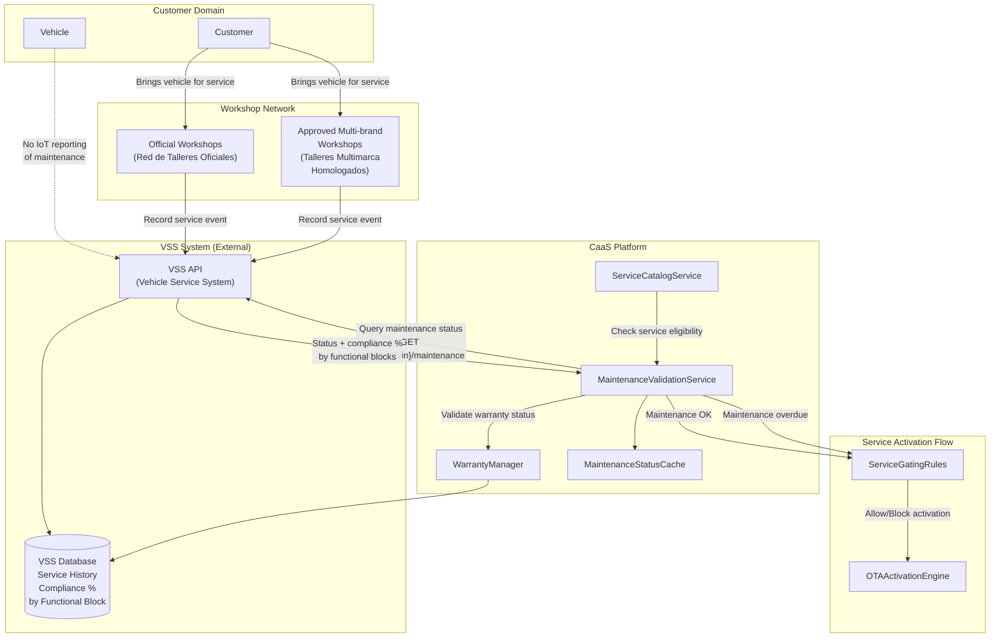
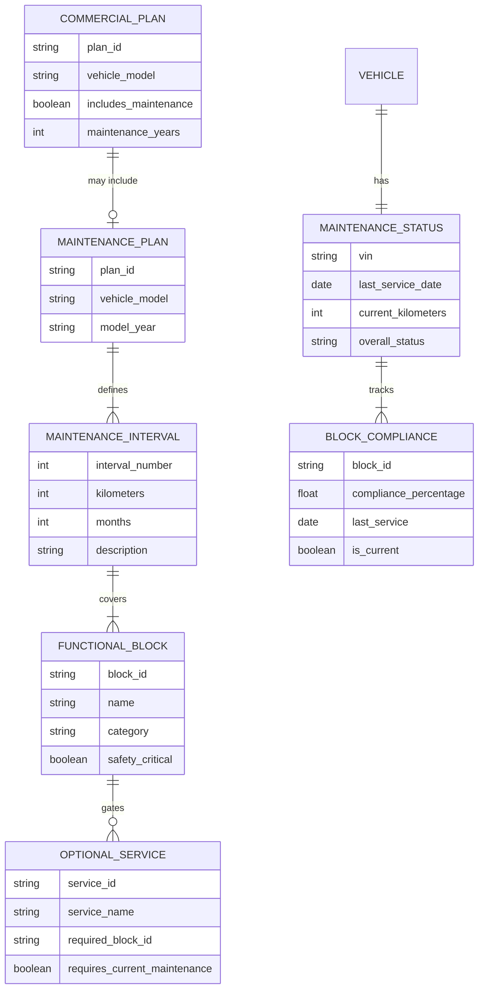
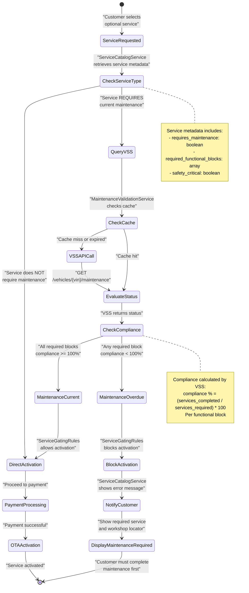
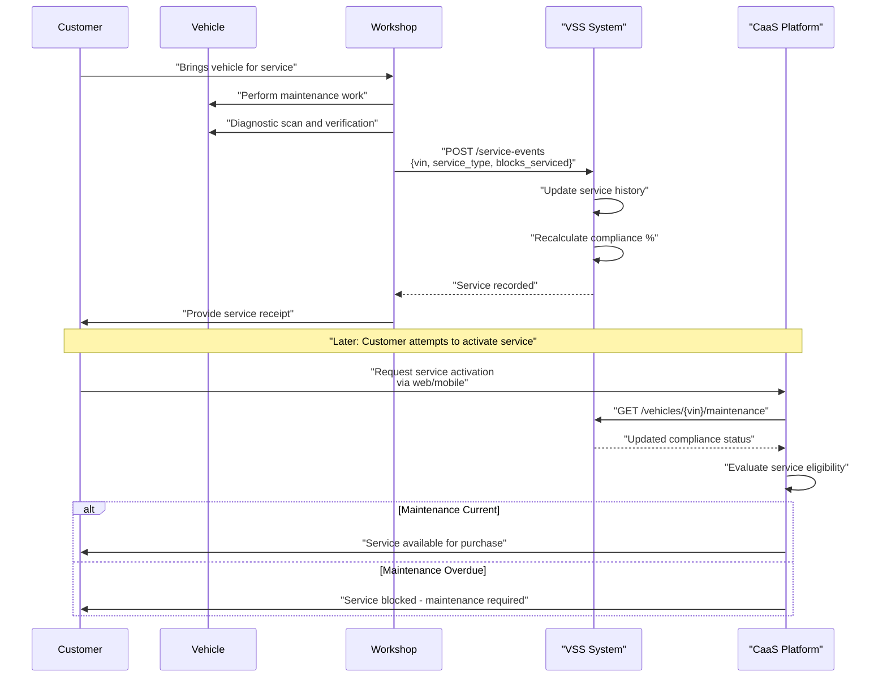
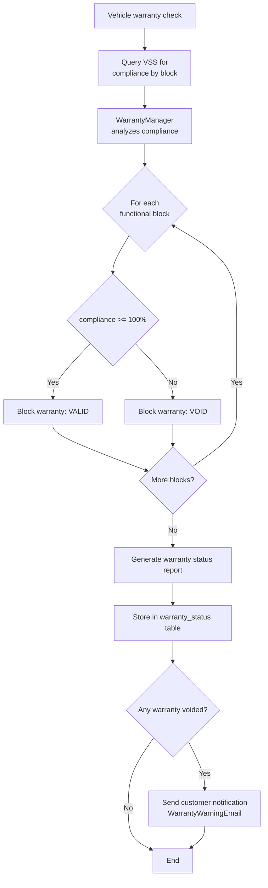
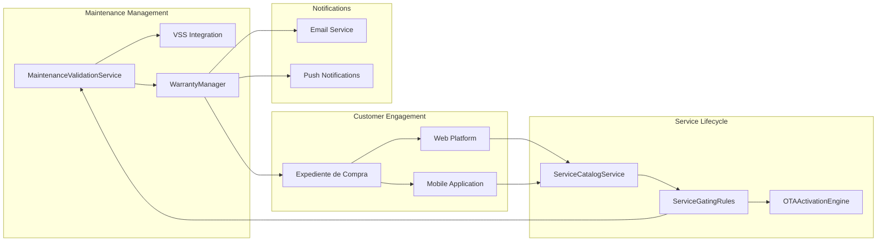

# Maintenance Management

<details>
<summary>Relevant source files</summary>

The following files were used as context for generating this wiki page:

- [enunciado.md](enunciado.md)
- [pasame las preguntas y sus respuestas a markdown.md](pasame las preguntas y sus respuestas a markdown.md)

</details>


## Purpose and Scope

This document describes how the CaaS system integrates with maintenance service providers and uses maintenance status to manage service availability, warranty compliance, and customer safety. It covers the VSS (Vehicle Service System) integration, maintenance plan tracking, service gating rules, and warranty implications.

For information about how maintenance status affects individual service purchases, see [Maintenance-Linked Service Access](#6.3). For details on the workshop service recording workflow from the customer perspective, see [Vehicle Purchase and Delivery Process](#4.1). For technical details on VSS API integration patterns, see [VSS Integration](#5.2).

**Sources:** [enunciado.md:23](), [pasame las preguntas y sus respuestas a markdown.md:58-74]()

---

## Maintenance System Overview

The CaaS maintenance management system operates on several key architectural principles:

1. **External Service Recording**: Maintenance work is performed by a network of official and approved workshops who record service events in the **VSS (Vehicle Service System)**, which is an external system independent of CaaS.

2. **Query-Based Status**: CaaS does not receive maintenance data from vehicles via IoT. Instead, it queries the VSS system when service status validation is required.

3. **Service Gating**: Maintenance status directly affects the availability of certain optional services (`opciones disponibles`). Services with safety implications require current maintenance to be activated.

4. **Warranty Management**: Missing scheduled maintenance results in warranty loss for affected functional blocks, but does not affect vehicle operability or already-activated services.

5. **No Vehicle Blocking**: CaaS can never prevent a vehicle from being driven. Only service activation for maintenance-dependent services can be blocked.

**Sources:** [enunciado.md:23](), [pasame las preguntas y sus respuestas a markdown.md:60-73]()

---

## VSS Integration Architecture

The following diagram shows how CaaS integrates with the VSS system and workshop network for maintenance tracking:



**Architecture Components:**

| Component | Responsibility | Integration Pattern |
|-----------|---------------|---------------------|
| `ServiceCatalogService` | Displays available services to customers | Calls `MaintenanceValidationService` before showing maintenance-dependent services |
| `MaintenanceValidationService` | Queries VSS for maintenance status | Synchronous HTTP GET to VSS API, caches results |
| `MaintenanceStatusCache` | Caches maintenance status | TTL-based cache to reduce VSS API calls |
| `WarrantyManager` | Determines warranty validity | Analyzes compliance percentages from VSS |
| `ServiceGatingRules` | Enforces service availability rules | Blocks activation of maintenance-dependent services if status is not current |
| `OTAActivationEngine` | Executes service activation | Only proceeds if `ServiceGatingRules` approves |

**Key VSS API Endpoints (External, Pre-existing):**

- `GET /vehicles/{vin}/maintenance` - Returns current maintenance status and compliance percentage by functional block
- `GET /vehicles/{vin}/service-history` - Returns complete service event history
- `GET /maintenance-schedules/{model}/{year}` - Returns scheduled maintenance intervals

**Sources:** [pasame las preguntas y sus respuestas a markdown.md:60-73]()

---

## Maintenance Plans and Schedules

Maintenance plans are programmed schedules that define required service intervals. These may or may not be included in the customer's commercial plan (`plan comercial`).

### Maintenance Plan Structure



### Maintenance Interval Configuration

Maintenance intervals are defined per vehicle model and include:

- **Interval number** (e.g., 1st service, 2nd service)
- **Distance-based trigger** (e.g., every 15,000 km)
- **Time-based trigger** (e.g., every 12 months)
- **Functional blocks covered** (e.g., engine, brakes, suspension)
- **Safety-critical flag** (determines if services are gated)

### Commercial Plan Integration

When a customer purchases a vehicle, their `plan comercial` may include:

| Plan Component | Description | Impact on Maintenance |
|----------------|-------------|----------------------|
| **Included maintenance** | Pre-paid service intervals | Customer has no additional cost for scheduled services |
| **Maintenance duration** | Number of years/km covered | After expiration, customer pays for services directly |
| **Service network** | Official vs. approved workshops | All workshops must record in VSS regardless |

**Critical Business Rule**: Even if maintenance is not included in the commercial plan, the customer must still complete maintenance to maintain warranty and unlock maintenance-dependent services. The CaaS system does not prevent the customer from skipping maintenance, but it does enforce consequences.

**Sources:** [enunciado.md:23](), [pasame las preguntas y sus respuestas a markdown.md:60-73]()

---

## Service Gating Rules and Logic

The following state diagram illustrates how maintenance status affects service activation requests:



### Service Gating Implementation

The `ServiceGatingRules` component implements the following logic:

```
Algorithm: CheckServiceEligibility(service_id, vin)

1. service_metadata = ServiceCatalog.GetService(service_id)

2. IF service_metadata.requires_maintenance == false:
     RETURN ALLOW

3. required_blocks = service_metadata.required_functional_blocks

4. maintenance_status = MaintenanceValidationService.GetStatus(vin)
   // This queries VSS API or cache

5. FOR EACH block IN required_blocks:
     block_compliance = maintenance_status.GetBlockCompliance(block.id)
     
     IF block_compliance.compliance_percentage < 100:
       RETURN DENY_MAINTENANCE_REQUIRED(block.name, block_compliance.last_service)

6. RETURN ALLOW
```

### Maintenance-Dependent Service Categories

Examples of services that typically require current maintenance:

| Service Category | Required Functional Block(s) | Safety Rationale |
|------------------|------------------------------|------------------|
| **50% Power Increase** | Engine, Transmission | High-performance operation requires verified mechanical condition |
| **Autonomous Driving** | Brakes, Sensors, ADAS | Critical safety systems must be certified operational |
| **Off-road/Winter Modes** | Suspension, Drivetrain | Extreme conditions require validated component integrity |
| **High-speed Limiter Removal** | Brakes, Tires, Suspension | High-speed operation requires safety system certification |

Services that do NOT require maintenance:

| Service Category | Rationale |
|------------------|-----------|
| **Entertainment Systems** | No safety impact |
| **Climate Control Upgrades** | No mechanical dependencies |
| **Interior Lighting** | No safety impact |
| **Navigation Enhancements** | No mechanical dependencies |

**Sources:** [enunciado.md:23](), [pasame las preguntas y sus respuestas a markdown.md:66-73]()

---

## Workshop Network and Service Recording

### Workshop Types and Authorization

The CaaS system recognizes two types of authorized workshops:

1. **Official Workshops (Red de Talleres Oficiales)**
   - Manufacturer-owned or franchised locations
   - Full access to all service procedures
   - Automatically authorized in VSS

2. **Approved Multi-brand Workshops (Talleres Multimarca Homologados)**
   - Independent workshops with manufacturer certification
   - Must meet technical standards
   - Registered in VSS with approval status

### Service Recording Workflow



### VSS Service Event Data Structure

When workshops record service in VSS, the following data is captured:

| Field | Type | Description |
|-------|------|-------------|
| `vin` | String | Vehicle identification number |
| `service_date` | DateTime | Date service was completed |
| `workshop_id` | String | Authorized workshop identifier |
| `service_type` | Enum | Scheduled, corrective, warranty, recall |
| `interval_number` | Integer | Which scheduled service (1st, 2nd, 3rd, etc.) |
| `kilometers` | Integer | Vehicle odometer at service time |
| `functional_blocks_serviced` | Array | List of functional blocks worked on |
| `parts_replaced` | Array | Parts replaced during service |
| `technician_id` | String | Certified technician who performed work |
| `notes` | String | Free-text service notes |

**Sources:** [pasame las preguntas y sus respuestas a markdown.md:60-65]()

---

## Warranty Management and Implications

### Warranty Status Calculation

The `WarrantyManager` component determines warranty validity based on maintenance compliance:



### Warranty Rules

| Scenario | Warranty Status | Service Activation | Vehicle Operation |
|----------|----------------|-------------------|-------------------|
| All maintenance current | **Full warranty on all blocks** | All services available | Unrestricted |
| Engine maintenance overdue | **Engine warranty VOID**<br/>Other blocks still covered | Power increase service blocked<br/>Other services available | Unrestricted |
| Multiple blocks overdue | **Affected blocks warranty VOID** | All safety-critical services blocked | Unrestricted |
| No maintenance ever done | **All warranty VOID** | Only non-maintenance services available | Unrestricted |

### Critical Constraints

1. **Cannot Block Vehicle Operation**: Even with zero warranty and no maintenance, the vehicle's base platform (`plataforma base`) continues to function. The customer can still drive the vehicle.

2. **Cannot Block Paid Services**: Already activated services continue to work regardless of maintenance status. Only NEW service activations are blocked.

3. **Granular Warranty**: Warranty is voided per functional block, not globally. A customer who skips engine maintenance loses engine warranty but retains brake warranty if brake maintenance is current.

### Customer Notification Requirements

When warranty status changes due to maintenance non-compliance, the system must:

1. **Immediate notification** via email and push notification
2. **Display warning** in expediente de compra
3. **Show in mobile app** vehicle status screen
4. **List affected services** that can no longer be activated
5. **Provide workshop locator** to schedule service

**Notification Template Components:**
- `WarrantyWarningEmail` - Email notification
- `PushNotificationService.SendWarrantyAlert()` - Mobile push
- `ExpedienteService.AddWarrantyWarning()` - Web platform display
- `VehicleStatusWidget.ShowWarrantyStatus()` - Mobile app widget

**Sources:** [pasame las preguntas y sus respuestas a markdown.md:66-73]()

---

## Maintenance Management Business Rules Summary

The following table consolidates all business rules related to maintenance management:

| Rule ID | Category | Rule Statement | Enforcement Point |
|---------|----------|----------------|------------------|
| **MNT-001** | Service Gating | Services requiring maintenance can only be activated if all required functional blocks have compliance >= 100% | `ServiceGatingRules.CheckServiceEligibility()` |
| **MNT-002** | Vehicle Operation | The vehicle can NEVER be blocked from driving, regardless of maintenance status | System-wide constraint - no blocking logic exists |
| **MNT-003** | Paid Services | Already activated services continue to function even if maintenance becomes overdue | `OTAActivationEngine` - no deactivation on maintenance lapse |
| **MNT-004** | Base Platform | The plataforma base always functions regardless of maintenance | System design - base platform independent of maintenance |
| **MNT-005** | Warranty Granularity | Warranty is voided per functional block, not globally | `WarrantyManager.CalculateBlockWarranty()` |
| **MNT-006** | Customer Decision | Customer decides when to perform maintenance - system cannot force it | Business policy - no enforcement mechanism |
| **MNT-007** | Data Source | Maintenance status comes from VSS system, NOT from vehicle IoT | `MaintenanceValidationService` queries VSS API only |
| **MNT-008** | Workshop Network | Both official and approved multi-brand workshops can record service | VSS system authorization - CaaS queries all authorized workshops |
| **MNT-009** | Commercial Plan | Maintenance may or may not be included in customer's plan, but compliance is required either way | `ServiceGatingRules` checks compliance regardless of payment source |
| **MNT-010** | Cache Policy | Maintenance status can be cached but must be revalidated before service activation | `MaintenanceStatusCache` with TTL, invalidated on activation attempt |
| **MNT-011** | Notification | Customer must be notified when warranty is voided due to maintenance non-compliance | `WarrantyManager` triggers notification on status change |
| **MNT-012** | Service Display | Web and mobile platforms must show maintenance requirements clearly for blocked services | `ServiceCatalogService.GetServiceDetails()` includes maintenance metadata |

**Sources:** [enunciado.md:23](), [pasame las preguntas y sus respuestas a markdown.md:58-97]()

---

## Integration Touch Points

The maintenance management system integrates with multiple other CaaS subsystems:



### Key Integration Points

1. **Service Catalog Integration** - `ServiceCatalogService` calls `ServiceGatingRules` before displaying service as available
2. **Payment Integration** - Payment proceeds only after maintenance validation passes (see [Payment Types and Flows](#7.1))
3. **OTA Integration** - `OTAActivationEngine` requires gating approval before attempting activation (see [OTA Service Activation](#6.2))
4. **Expediente Integration** - Maintenance status and warranty information displayed in customer purchase record (see [Customer-Facing Platforms](#4.3))
5. **Notification Integration** - Warranty status changes trigger multi-channel notifications (see [Core Technical Components](#3.2))

**Sources:** [enunciado.md:23](), [pasame las preguntas y sus respuestas a markdown.md:60-73]()