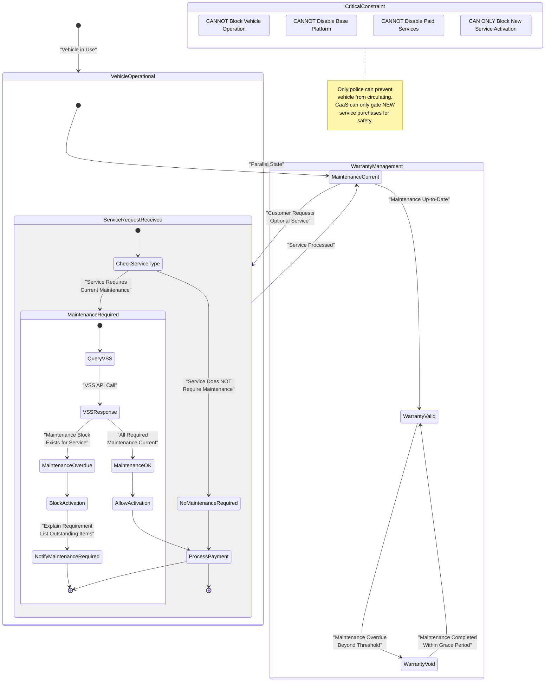

# Failure Handling and Edge Cases

<details>
<summary>Relevant source files</summary>

The following files were used as context for generating this wiki page:

- [pasame las preguntas y sus respuestas a markdown.md](pasame las preguntas y sus respuestas a markdown.md)

</details>


## Purpose and Scope

This document provides a comprehensive overview of failure handling mechanisms and edge case behaviors across the CaaS platform. The system is designed with a customer-first philosophy where technical failures should never result in customer charges for undelivered services, while business logic failures (e.g., payment issues) follow strict policies to protect company assets.

This page covers:
- Core failure handling philosophy and design principles
- Critical failure detection and recovery mechanisms
- Customer communication requirements during failures
- System state management during error conditions

For detailed information on specific failure scenarios:
- OTA activation failures and retry logic: see [OTA Activation Failures](#9.1)
- Payment processing failures across different payment types: see [Payment Failure Scenarios](#9.2)
- Delivery and transport logistics issues: see [Delivery and Transport Issues](#9.3)
- Special edge cases including theft and warranty loss: see [Special Scenarios (Theft, Warranty Loss)](#9.4)

**Sources:** pasame las preguntas y sus respuestas a markdown.md:1-104

---

## Failure Handling Philosophy

The CaaS platform implements two distinct failure handling strategies based on the nature of the failure:

| Failure Category | Handling Strategy | Customer Impact | Business Rationale |
|------------------|-------------------|-----------------|-------------------|
| **Technical Failures** | Customer-favorable defaults | No charge for undelivered services | Build trust, legal compliance, maintain reputation |
| **Business Logic Failures** | Strict policy enforcement | Full consequences (e.g., lose vehicle reservation) | Protect company assets, ensure financial integrity |
| **Third-Party Integration Failures** | Retry with exponential backoff | Transparent status communication | Resilience against external system unavailability |
| **Partial Service Delivery** | Conservative approach | Service marked as failed if not 100% delivered | Avoid customer dissatisfaction with partial functionality |

### Core Principles

1. **Never charge for undelivered services**: If OTA activation fails after all retries, the customer is not charged and receives full notification (lines 48-53).

2. **Immediate service delivery despite async settlement**: CaaS assumes payment settlement risk to optimize customer experience, delivering services before bank confirmation (lines 77-82).

3. **Cannot block vehicle operation**: Only police can prevent a vehicle from circulating. CaaS can only prevent new service activations, never disable base platform or already-paid services (lines 66-73).

4. **Maintenance as safety gate**: Services requiring specific maintenance can be blocked from activation until maintenance is current, but this is a preventive measure, not a punitive one (lines 66-73).

5. **Legal compliance built-in**: Desistimiento (right of withdrawal) rules are enforced automatically based on service duration and purchase date (lines 84-89).

**Sources:** pasame las preguntas y sus respuestas a markdown.md:48-53, 66-82, 84-89

---

## Failure Detection and Classification

### Failure Detection Matrix


**Failure Classification Logic:**

- **Technical Failures**: OTA timeout, API IoT unavailability, network errors → Retry with backoff, escalate to technical support, never charge customer
- **Business Failures**: Payment declined, customer absent at delivery, final payment failure → Enforce business rules strictly (e.g., lose reservation)
- **Data Validation Failures**: Maintenance overdue for requested service, user not authorized → Block operation preventively, communicate requirements
- **External System Failures**: Factory API down, VSS unreachable, payment gateway timeout → Implement circuit breaker pattern, queue for retry

**Sources:** pasame las preguntas y sus respuestas a markdown.md:48-53, 24-29

---

## Critical Failure Scenarios Overview

### OTA Activation Failure Flow


**Key Implementation Requirements:**
- **Retry count**: Configurable N attempts (suggested: 3-5)
- **Backoff strategy**: Exponential (e.g., 1min, 5min, 15min, 1hr)
- **State capture**: Query vehicle diagnostic state after final failure
- **No-charge rule**: Must prevent payment capture or issue automatic refund
- **Customer communication**: Multi-channel notification within 15 minutes of final failure

**Sources:** pasame las preguntas y sus respuestas a markdown.md:48-56

---

### Payment Failure Decision Tree


**Critical Business Rules:**
- **Final payment failure**: Customer immediately loses vehicle reservation; vehicle becomes available stock marked "sin asignar" (unassigned) (lines 26-27)
- **Service payment with assumed risk**: If service already delivered (immediate delivery strategy), attempt collection but never disable already-activated service
- **Subscription mes vencido**: Charge at month end; if fails, cancel subscription but services continue until period expires
- **No blocking of base platform**: Payment failures for optional services never affect the plataforma base functionality

**Sources:** pasame las preguntas y sus respuestas a markdown.md:26-27, 77-82

---

### Delivery Failure Handling


**Delivery Failure Protocol:**
1. Transport company arrives at customer address
2. If customer absent, transport calls customer phone
3. If customer cannot receive vehicle immediately, **return to dealership** (never leave on street due to security risks)
4. Customer notified that vehicle awaits pickup at dealership
5. Customer collects vehicle at dealership at their convenience
6. Mobile app linking occurs at point of actual delivery (home or dealership)

**Sources:** pasame las preguntas y sus respuestas a markdown.md:24-25

---

### Maintenance-Gated Service Blocking



**Maintenance Blocking Rules:**

| Scenario | Allowed Action | Forbidden Action |
|----------|----------------|------------------|
| Maintenance overdue, customer requests new service requiring maintenance | Block new service activation, explain requirement | Disable vehicle operation |
| Maintenance overdue, customer has active paid services | Allow continued use of paid services | Revoke already-activated services |
| Maintenance overdue, customer using base platform | Allow base platform operation | Disable base functionality |
| Warranty voided due to missed maintenance | Mark warranty void, communicate to customer | Prevent vehicle use |

**VSS Integration for Maintenance Checks:**
- CaaS queries VSS system to determine maintenance status (VSS is external, maintained by workshops)
- Vehicle does NOT self-report maintenance status via IoT
- VSS maintains historical records and compliance percentage by functional block
- Each service definition specifies required maintenance blocks

**Sources:** pasame las preguntas y sus respuestas a markdown.md:60-73

---

## Customer Communication During Failures

### Multi-Channel Notification Requirements

All critical failures require immediate multi-channel notification to ensure customer awareness:

| Failure Type | Email | Push Notification | SMS | In-App Alert | Timeframe |
|--------------|-------|-------------------|-----|--------------|-----------|
| OTA Activation Failed (Final) | ✓ Required | ✓ Required | Optional | ✓ Required | < 15 minutes |
| Payment Declined | ✓ Required | ✓ Required | ✓ Required | ✓ Required | Immediate |
| Delivery Failed (Return to Dealership) | ✓ Required | ✓ Required | ✓ Required | Optional | < 1 hour |
| Maintenance Blocking Service | ✓ Required | Optional | Optional | ✓ Required | At request time |
| Subscription Cancelled (Payment Fail) | ✓ Required | ✓ Required | Optional | ✓ Required | < 24 hours |

### Notification Content Requirements

**OTA Failure Notification Template:**
```
Subject: Service Activation Issue - [Service Name]

Dear [Customer Name],

We encountered a technical issue activating the [Service Name] on your vehicle.

Status: Activation unsuccessful after multiple attempts
Action: You have NOT been charged for this service
Next Steps: Our technical team is investigating. We will contact you within 24 hours.

If you have questions, contact support at [Contact Info].
```

**Payment Failure Notification Template:**
```
Subject: Payment Issue - Action Required

Dear [Customer Name],

Your payment for [Service/Vehicle] could not be processed.

Amount: [Amount]
Reason: [Decline Reason]
Action Required: Update payment method within [Timeframe]

[For final payment]: Without payment, your vehicle reservation will be cancelled.
[For service]: Service activation has been postponed until payment succeeds.
```

**Delivery Failure Notification Template:**
```
Subject: Vehicle Delivery Update - Pickup at Dealership

Dear [Customer Name],

We attempted delivery of your vehicle to [Address] but were unable to complete delivery.

Current Location: [Dealership Name and Address]
Status: Vehicle ready for pickup
Action: Please contact us to schedule pickup at your convenience

Your vehicle is secure at the dealership.
```

**Sources:** pasame las preguntas y sus respuestas a markdown.md:48-53, 24-29

---

## State Management During Failures

### Entity State Transitions on Failure


**State Persistence Requirements:**
- All state transitions must be atomic and logged for audit
- Failed transactions must include rollback mechanisms
- Customer-visible states must be consistent across all channels (web, mobile, intranet)
- State transitions during failures must trigger appropriate notification workflows

**Sources:** pasame las preguntas y sus respuestas a markdown.md:26-27, 48-53, 77-82

---

## Integration Failure Handling

### External System Circuit Breaker Pattern


**Integration Failure Strategies by System:**

| External System | Primary Strategy | Fallback Strategy | Maximum Retry | Recovery Action |
|-----------------|------------------|-------------------|---------------|-----------------|
| **API IoT** | Circuit breaker with 5-failure threshold | Queue for later retry | N attempts over 24 hours | Technical support escalation |
| **Factory API** | Exponential backoff retry | Manual order queue | 10 attempts | Human intervention required |
| **VSS System** | Cache recent maintenance data (TTL: 1 hour) | Allow with warning notification | 3 attempts | Proceed with customer acknowledgment |
| **Payment Gateway** | Async processing with reconciliation | Manual payment verification | Immediate + daily batch | Accounting team resolution |

**Sources:** pasame las preguntas y sus respuestas a markdown.md:33-44, 60-73

---

## Monitoring and Alerting for Failures

### Failure Metrics and Thresholds

Critical failures that require immediate operational alerts:

| Metric | Threshold | Alert Severity | Response Team |
|--------|-----------|----------------|---------------|
| OTA activation failure rate | > 5% in 1 hour | CRITICAL | Technical operations + IoT team |
| Payment gateway availability | < 95% in 15 minutes | CRITICAL | Finance + IT operations |
| Factory API timeout rate | > 10% in 30 minutes | HIGH | Integration team + factory liaison |
| VSS query failures | > 20% in 1 hour | MEDIUM | Integration team |
| Customer notification delivery failures | > 2% | HIGH | Communications team |
| Final payment failure rate | > 15% in 1 day | HIGH | Finance + sales teams |

### Failure Audit Trail Requirements

All failures must be logged with:
- Timestamp (UTC)
- Customer identifier (hashed for privacy)
- Failure type and category
- System component that detected failure
- Retry attempts made (if applicable)
- Final resolution status
- Customer communication sent
- Financial impact (charged/not charged)

**Sources:** pasame las preguntas y suas respuestas a markdown.md:48-53

---

## Summary and Sub-Page Navigation

This page provides a comprehensive overview of failure handling philosophy and critical scenarios across the CaaS platform. The system implements customer-favorable defaults for technical failures while enforcing strict business rules for policy violations.

**For detailed implementation guidance on specific failure scenarios:**

- **[OTA Activation Failures](#9.1)**: Detailed retry algorithms, backoff strategies, technical support escalation procedures, and the critical no-charge guarantee
- **[Payment Failure Scenarios](#9.2)**: Comprehensive handling of reservation payment failures, final payment failures, service payment issues, and subscription billing failures
- **[Delivery and Transport Issues](#9.3)**: Complete protocols for failed home delivery, customer absence, return to dealership procedures, and fallback scenarios
- **[Special Scenarios (Theft, Warranty Loss)](#9.4)**: Edge case handling for vehicle theft, warranty voiding due to missed maintenance, and service blocking rules

**Key Architectural Principles:**
- Technical failures favor the customer (no charge, automatic refunds)
- Business failures enforce policy strictly (lose reservation, cancel services)
- External system failures use circuit breakers and retry logic
- All failures trigger multi-channel customer communication
- State management ensures consistency across all platforms

**Sources:** pasame las preguntas y sus respuestas a markdown.md:1-104