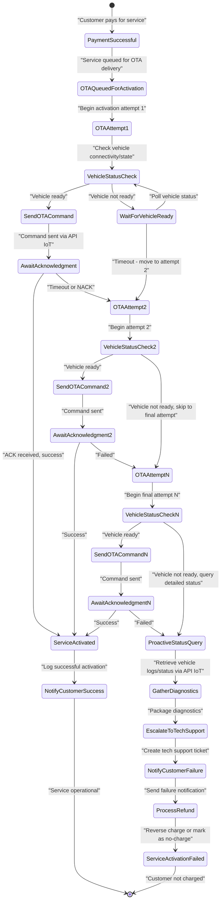
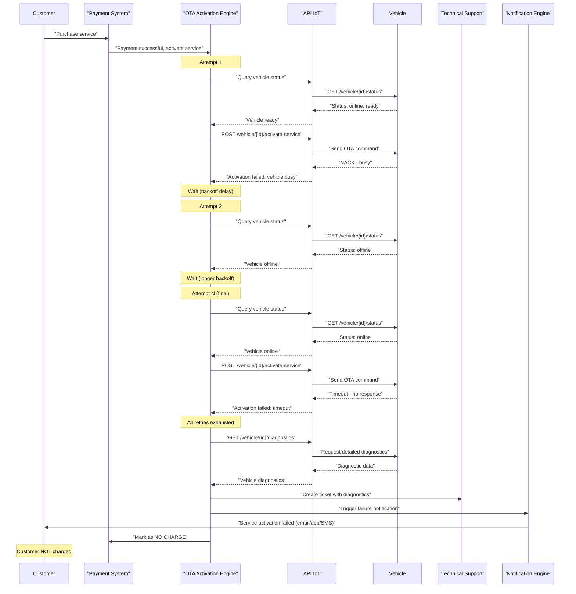
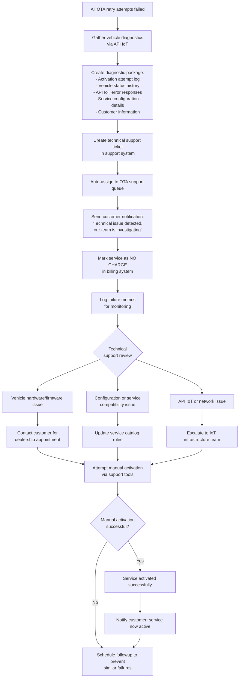
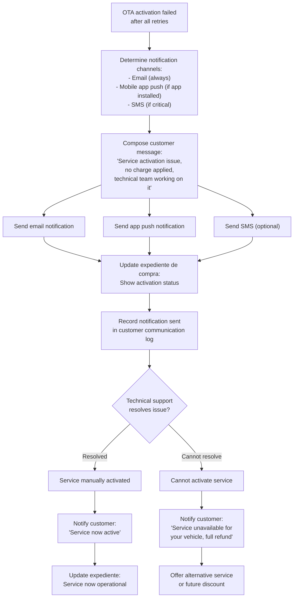
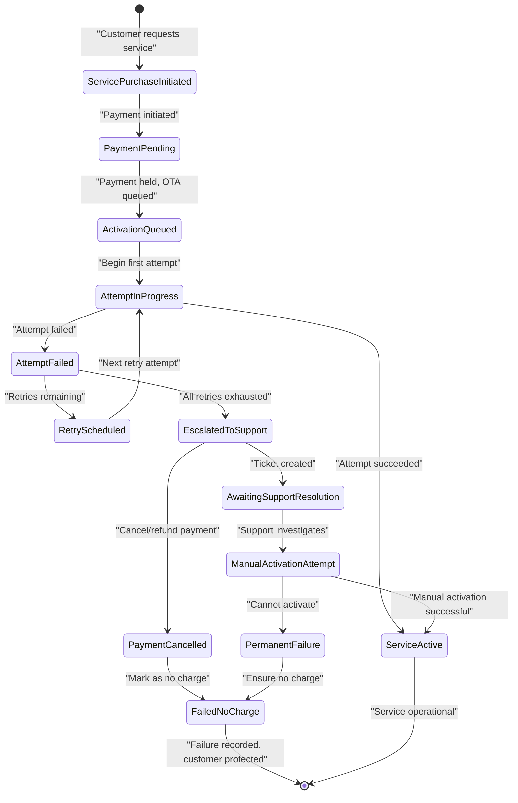
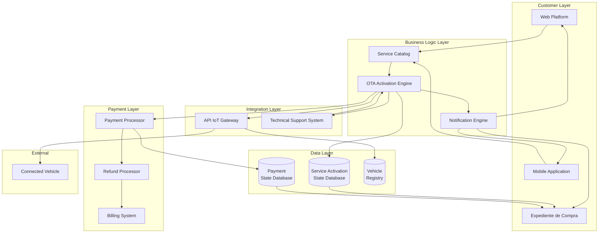

# OTA Activation Failures

Relevant source files

The following files were used as context for generating this wiki page:

- [pasame las preguntas y sus respuestas a markdown.md](pasame las preguntas y sus respuestas a markdown.md)

## Purpose and Scope

This document details how the CaaS system handles failures during Over-The-Air (OTA) service activation. It covers the retry logic, technical support escalation procedures, and the critical business rule that **customers must never be charged for services that fail to activate**.

For information about the normal OTA activation process and successful service delivery, see [OTA Service Activation](#6.2). For technical details about the IoT infrastructure and communication protocols, see [Vehicle Communication (IoT and OTA)](#5.3). For payment risk management strategies, see [Risk Management and Settlement](#7.2).

Sources: [pasame las preguntas y sus respuestas a markdown.md:48-56]()

---

## OTA Activation Failure Overview

OTA activation failures occur when the system cannot successfully deliver a purchased service configuration to the customer's vehicle via the IoT network. These failures can happen due to various reasons including connectivity issues, vehicle state problems, or IoT network disruptions.

### Critical Business Rule

**The customer must NEVER be charged for a service that fails to activate.** This is a fundamental customer protection policy that ensures CaaS only charges for successfully delivered functionality.

### Failure Categories

| Failure Type | Description | System Response |
|--------------|-------------|-----------------|
| **Transient Connectivity** | Temporary network issues, vehicle offline | Automatic retry with backoff |
| **Vehicle State Issues** | Vehicle in incompatible state (e.g., driving, powered off) | Automatic retry when state changes |
| **Configuration Conflicts** | Service conflicts with existing vehicle configuration | Technical support escalation |
| **Persistent IoT Failures** | API IoT system errors or vehicle communication module failure | Technical support escalation |
| **Timeout Errors** | Command sent but no acknowledgment received | Retry with status query |

Sources: [pasame las preguntas y sus respuestas a markdown.md:48-56]()

---

## OTA Activation State Machine

**Diagram: OTA Activation State Machine with Retry Logic**

This state machine shows how the system progresses through multiple activation attempts, proactively gathers diagnostics on final failure, and ensures the customer is never charged for failed activations.

Sources: [pasame las preguntas y sus respuestas a markdown.md:48-56]()

---

## Retry Logic and Configuration

### Retry Mechanism

The system implements a configurable retry mechanism with the following characteristics:

1. **Multiple Attempts**: The system attempts OTA activation a predetermined number of times (N attempts)
2. **Proactive Status Queries**: Between attempts, the system actively queries vehicle status via the API IoT
3. **Exponential Backoff**: Delays between retries increase progressively to avoid overwhelming the IoT network
4. **State-Aware Retries**: The system checks vehicle readiness before each attempt

### Retry Flow Sequence

**Diagram: OTA Activation Retry Sequence with Final Failure**

This sequence diagram illustrates the multiple retry attempts, vehicle status checks, and eventual escalation when all retries are exhausted.

Sources: [pasame las preguntas y sus respuestas a markdown.md:48-56]()

### Retry Configuration Parameters

| Parameter | Typical Value | Description |
|-----------|--------------|-------------|
| `max_retry_attempts` | 3-5 | Maximum number of activation attempts before escalation |
| `initial_backoff_seconds` | 60 | Delay before first retry |
| `backoff_multiplier` | 2.0 | Exponential backoff factor |
| `max_backoff_seconds` | 3600 | Maximum delay between retries (1 hour) |
| `status_query_timeout` | 30 | Timeout for vehicle status queries (seconds) |
| `activation_command_timeout` | 120 | Timeout for OTA activation command acknowledgment (seconds) |

---

## Technical Support Escalation

### Escalation Trigger

Technical support escalation occurs when:
1. All retry attempts have been exhausted
2. The service still cannot be activated
3. The system has gathered proactive diagnostic information from the vehicle

### Escalation Workflow

**Diagram: Technical Support Escalation Workflow**

This flowchart shows the complete escalation process from failure detection through technical support resolution.

Sources: [pasame las preguntas y sus respuestas a markdown.md:48-56]()

### Diagnostic Package Contents

The system proactively gathers the following information to include in the technical support ticket:

| Diagnostic Data | Source | Purpose |
|-----------------|--------|---------|
| **Activation Attempt Log** | OTA Engine internal logs | Complete history of all retry attempts with timestamps and results |
| **Vehicle Status Snapshots** | API IoT queries | Vehicle connectivity, power state, active services at each retry |
| **API IoT Error Responses** | API IoT integration layer | Detailed error codes and messages from the IoT API |
| **Service Configuration** | Service Catalog | Exact service definition and configuration parameters attempted |
| **Vehicle Model/Firmware** | Vehicle registry | Vehicle identification, model, and firmware version |
| **Customer Information** | Customer database | Customer contact details and vehicle purchase date |
| **Network Metrics** | IoT Gateway logs | Network latency, packet loss, connection stability |

---

## Customer Protection: The "Do Not Charge" Rule

### Business Rule Implementation

The fundamental business rule states: **If a service fails to activate via OTA, the customer must NOT be charged for that service.**

This rule is implemented at multiple layers to ensure customer protection:

```mermaid
flowchart LR
    PaymentInitiated["Payment initiated<br/>by customer"]
    
    HoldPayment["Hold payment in<br/>PENDING state"]
    
    OTAActivation["OTA activation<br/>process"]
    
    ActivationSuccess{"Activation<br/>successful?"}
    
    CompleteCharge["Complete payment:<br/>PENDING → CHARGED"]
    
    ReverseCharge["Reverse payment:<br/>PENDING → CANCELLED"]
    
    AlreadyCharged{"Payment already<br/>settled?"}
    
    IssueRefund["Issue immediate refund<br/>to customer"]
    
    MarkNoCharge["Mark as NO CHARGE<br/>in billing system"]
    
    UpdateAccountingState["Update service state:<br/>PAID → FAILED_NO_CHARGE"]
    
    NotifyCustomer["Notify customer:<br/>'No charge for failed service'"]
    
    UpdateExpediente["Update expediente de compra:<br/>Show failed activation,<br/>no charge applied"]
    
    PaymentInitiated --> HoldPayment
    HoldPayment --> OTAActivation
    OTAActivation --> ActivationSuccess
    
    ActivationSuccess -->|Yes| CompleteCharge
    ActivationSuccess -->|No| ReverseCharge
    
    ReverseCharge --> AlreadyCharged
    AlreadyCharged -->|Yes| IssueRefund
    AlreadyCharged -->|No| MarkNoCharge
    
    IssueRefund --> UpdateAccountingState
    MarkNoCharge --> UpdateAccountingState
    
    UpdateAccountingState --> NotifyCustomer
    NotifyCustomer --> UpdateExpediente
```

**Diagram: Payment Protection Flow for Failed OTA Activations**

This diagram shows how the payment system protects customers from being charged for failed service activations.

Sources: [pasame las preguntas y sus respuestas a markdown.md:48-56]()

### Payment State Management

The system manages payment states carefully to implement the "do not charge" rule:

| Payment State | Description | Transition Conditions |
|--------------|-------------|----------------------|
| `INITIATED` | Customer clicked "pay" but payment not yet sent to gateway | Initial state when service purchase begins |
| `PENDING` | Payment sent to gateway, awaiting settlement | Payment gateway accepted the payment request |
| `HELD_FOR_ACTIVATION` | Payment held until OTA activation completes | OTA activation process started |
| `CHARGED` | Payment completed, service successfully activated | OTA activation successful |
| `CANCELLED` | Payment cancelled before settlement | OTA activation failed before payment settled |
| `REFUNDED` | Payment settled but refunded due to activation failure | OTA activation failed after payment settled |
| `FAILED_NO_CHARGE` | Service purchase failed, customer never charged | Final state for failed activations |

### Implementation Across System Layers

The "do not charge" rule is enforced at multiple levels:

1. **OTA Engine Layer**: Marks service activation as failed and triggers payment reversal
2. **Payment Processing Layer**: Cancels pending charges or issues refunds for settled charges
3. **Billing System Layer**: Records the service as "FAILED_NO_CHARGE" in billing records
4. **Customer Expediente Layer**: Updates the customer's purchase file to reflect the failed activation and zero charge
5. **Notification Layer**: Sends clear communication to customer about the failure and no-charge status

---

## Notification and Communication Flow

### Customer Communication Strategy

When OTA activation fails, the system must communicate clearly with the customer to maintain trust and transparency.

**Diagram: Customer Notification Flow for OTA Failures**

Sources: [pasame las preguntas y sus respuestas a markdown.md:48-56]()

### Notification Message Templates

| Notification Type | Channel | Message Content | Timing |
|------------------|---------|-----------------|--------|
| **Initial Failure** | Email, App | "We're experiencing a technical issue activating [Service Name] on your vehicle. Our technical team is working to resolve this. You will NOT be charged for this service." | Immediately after final retry fails |
| **Technical Support Ticket Created** | Email | "We've created a support ticket (#[TICKET_ID]) for your service activation issue. Our team will contact you if we need any information." | After escalation |
| **Manual Resolution Success** | Email, App, SMS | "Good news! We've successfully activated [Service Name] on your vehicle. The service is now available for use." | After technical support manually activates |
| **Permanent Failure** | Email, Phone | "Unfortunately, we cannot activate [Service Name] on your vehicle due to technical compatibility. We've issued a full refund and would like to offer you [Alternative]." | After technical support determines permanent failure |

---

## System State Management During Failures

### Service Activation State Lifecycle

The system maintains detailed state information for each service activation attempt:

**Diagram: Service Activation State Lifecycle with Failure Handling**

Sources: [pasame las preguntas y sus respuestas a markdown.md:48-56]()

### State Tracking Tables

The system maintains several state tracking mechanisms:

#### Service Activation Attempts Table

| Field | Type | Description |
|-------|------|-------------|
| `attempt_id` | UUID | Unique identifier for each activation attempt |
| `service_activation_id` | UUID | Foreign key to service activation request |
| `attempt_number` | Integer | Sequential attempt number (1, 2, ..., N) |
| `attempt_timestamp` | Timestamp | When the attempt was made |
| `vehicle_status_at_attempt` | JSON | Vehicle status snapshot from API IoT |
| `ota_command_sent` | Boolean | Whether OTA command was successfully sent |
| `ota_response_code` | String | Response code from API IoT |
| `ota_response_message` | Text | Detailed response message |
| `attempt_result` | Enum | `SUCCESS`, `FAILED_RETRY`, `FAILED_ESCALATE` |

#### Service Activation State Table

| Field | Type | Description |
|-------|------|-------------|
| `service_activation_id` | UUID | Unique identifier for service activation |
| `customer_id` | UUID | Customer who purchased the service |
| `vehicle_id` | UUID | Target vehicle |
| `service_id` | UUID | Service being activated |
| `payment_id` | UUID | Associated payment record |
| `current_state` | Enum | Current state in lifecycle |
| `activation_queued_at` | Timestamp | When activation was queued |
| `total_attempts` | Integer | Total number of attempts made |
| `tech_support_ticket_id` | String | Support ticket if escalated |
| `final_result` | Enum | `ACTIVE`, `FAILED_NO_CHARGE`, `MANUAL_ACTIVATION` |
| `created_at` | Timestamp | Record creation time |
| `updated_at` | Timestamp | Last update time |

---

## Integration with Payment and Service Systems

### Cross-System Coordination

OTA activation failures require coordination across multiple system components:

**Diagram: System Integration for OTA Failure Handling**

This diagram shows how OTA activation failures trigger coordinated actions across payment, notification, and technical support systems.

Sources: [pasame las preguntas y suas respuestas a markdown.md:48-56]()

### Failure Event Propagation

When OTA activation fails, events propagate through the system:

| Source Component | Event Type | Target Components | Action Triggered |
|-----------------|------------|-------------------|------------------|
| **OTA Engine** | `OTA_ACTIVATION_FAILED` | Payment Processor | Cancel or refund payment |
| **OTA Engine** | `OTA_ACTIVATION_FAILED` | Notification Engine | Send customer failure notification |
| **OTA Engine** | `OTA_ACTIVATION_ESCALATED` | Technical Support System | Create support ticket with diagnostics |
| **OTA Engine** | `OTA_ACTIVATION_FAILED` | Service Database | Update service state to `FAILED_NO_CHARGE` |
| **OTA Engine** | `OTA_ACTIVATION_FAILED` | Expediente System | Update customer purchase file |
| **Technical Support System** | `MANUAL_ACTIVATION_SUCCESSFUL` | OTA Engine | Mark service as active |
| **Technical Support System** | `PERMANENT_ACTIVATION_FAILURE` | Payment Processor | Ensure refund completed |
| **Payment Processor** | `PAYMENT_CANCELLED` | Billing System | Record zero-charge transaction |
| **Payment Processor** | `REFUND_ISSUED` | Notification Engine | Notify customer of refund |

---

## Monitoring and Metrics

### Key Failure Metrics

The system should track the following metrics to monitor OTA activation health:

| Metric | Description | Alert Threshold |
|--------|-------------|----------------|
| **OTA Success Rate** | Percentage of successful first-attempt activations | < 95% |
| **Average Retries to Success** | Average number of attempts before success | > 2.0 |
| **Escalation Rate** | Percentage of activations escalated to tech support | > 5% |
| **Time to Activation** | Average time from payment to successful activation | > 15 minutes |
| **Permanent Failure Rate** | Percentage of activations that never succeed | > 1% |
| **Customer Impact Rate** | Activations that failed after payment settled (requiring refund) | > 0.5% |

### Failure Analysis Dashboard

Technical teams should monitor:

1. **Failure by Reason**: Breakdown of failure types (connectivity, timeout, vehicle state)
2. **Failure by Vehicle Model**: Which vehicle models have higher failure rates
3. **Failure by Service Type**: Which services fail more frequently
4. **Failure by Time of Day**: Temporal patterns in failures
5. **Retry Success Rate by Attempt**: How many succeed on attempt 1, 2, 3, etc.
6. **Tech Support Resolution Time**: Time from escalation to resolution

---

## Summary

OTA activation failures are handled through a multi-layered approach that prioritizes customer protection:

1. **Automatic Retry Logic**: Multiple attempts with progressive backoff and proactive vehicle status checks
2. **Diagnostic Gathering**: Proactive collection of vehicle and system diagnostics for troubleshooting
3. **Technical Support Escalation**: Automatic ticket creation with comprehensive diagnostic packages
4. **Payment Protection**: Strict enforcement of the "do not charge" rule through payment state management
5. **Customer Communication**: Clear, multi-channel notifications keeping customers informed
6. **State Tracking**: Comprehensive state management across all system components
7. **Monitoring**: Metrics and alerting to detect and address systemic issues

The critical business rule—**never charge for failed activations**—is enforced at multiple system layers to ensure customer trust and legal compliance.

Sources: [pasame las preguntas y sus respuestas a markdown.md:48-56]()