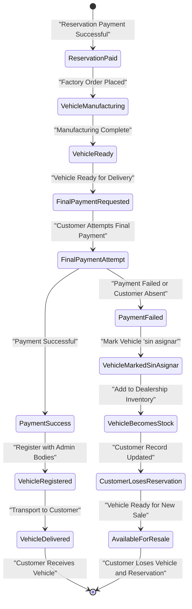
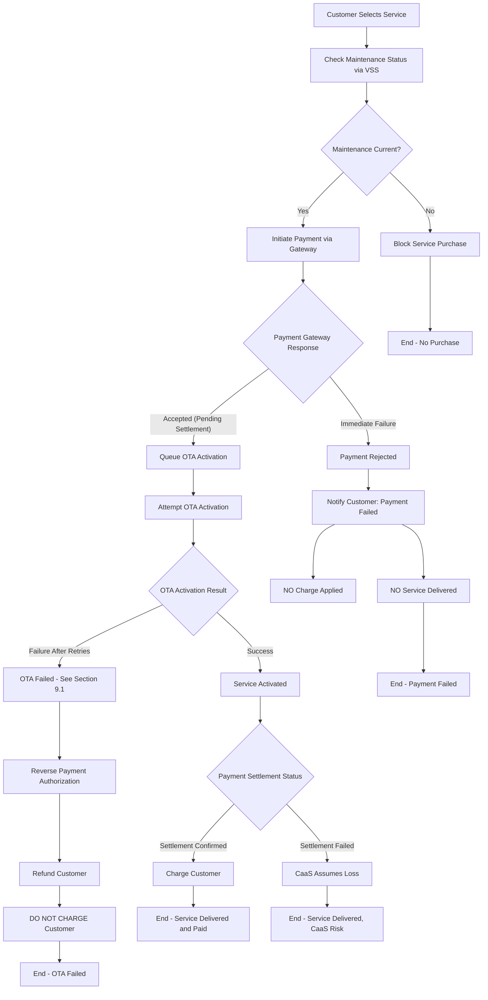
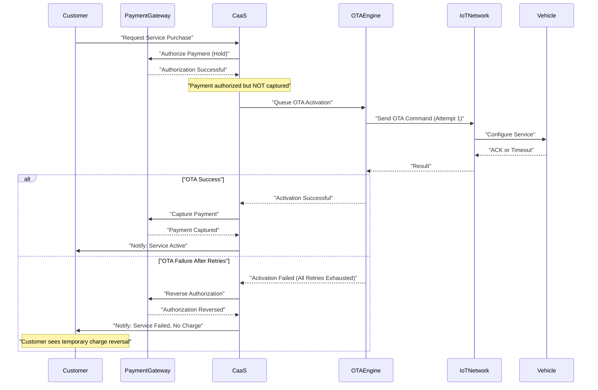
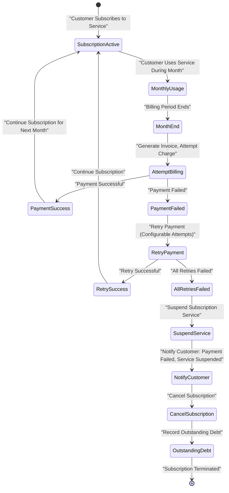
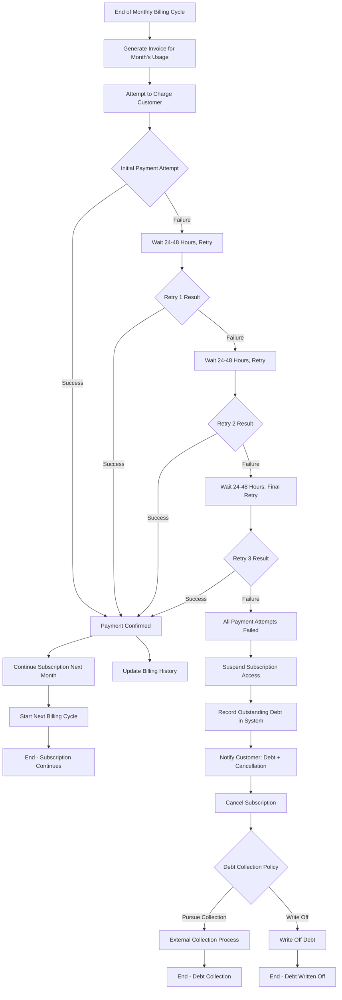
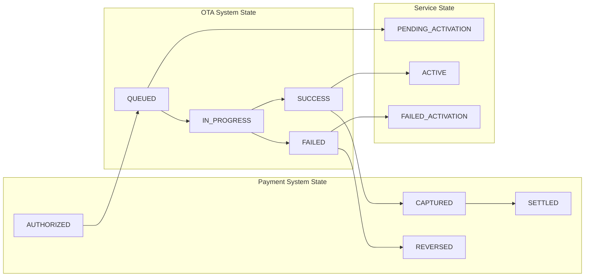

# Payment Failure Scenarios

Relevant source files

The following files were used as context for generating this wiki page:

- [pasame las preguntas y sus respuestas a markdown.md](pasame las preguntas y sus respuestas a markdown.md)

## Purpose and Scope

This document details the system's behavior when payment transactions fail at various stages of the customer journey. It covers three distinct payment failure scenarios: final vehicle payments, one-time service payments, and subscription billing failures. Each scenario has different business implications and system responses.

For information about the payment processing architecture and risk management strategy, see [Risk Management and Settlement](#7.2). For details about payment types and normal flows, see [Payment Types and Flows](#7.1). For OTA activation failures (which may trigger payment reversals), see [OTA Activation Failures](#9.1).

**Sources:** [pasame las preguntas y sus respuestas a markdown.md:1-104]()

---

## Final Payment Failure (Vehicle Purchase)

### Business Context

When a customer completes the vehicle purchase process, two payments are required:
1. **Reservation payment (señal)** - Initial deposit to secure the vehicle order
2. **Final payment** - Remaining balance, due before vehicle registration and delivery

The final payment is a critical checkpoint. Failure at this stage has severe consequences for the customer and triggers specific system state transitions.

### System Behavior on Final Payment Failure

When the final payment fails or the customer cannot provide payment at delivery time:

1. **Vehicle ownership reverts to dealership** - The vehicle is immediately reclaimed
2. **Vehicle status changes to "sin asignar" (unassigned)** - System marks vehicle as no longer assigned to any customer
3. **Vehicle becomes stock for immediate sale** - Vehicle enters dealership inventory for sale to other customers
4. **Customer loses reservation entirely** - No refund of reservation payment, no vehicle delivery
5. **Customer record remains but vehicle link is severed** - Customer account exists but has no associated vehicle

**Sources:** [pasame las preguntas y sus respuestas a markdown.md:26-27]()

### Final Payment Failure State Diagram

**Sources:** [pasame las preguntas y sus respuestas a markdown.md:26-27]()

### Database State Transitions

The following table shows the critical state changes in the system when final payment fails:

| Entity | Field | Before Failure | After Failure |
|--------|-------|----------------|---------------|
| Vehicle | `assignment_status` | `ASSIGNED_TO_CUSTOMER` | `SIN_ASIGNAR` |
| Vehicle | `inventory_status` | `IN_MANUFACTURING` or `AWAITING_DELIVERY` | `DEALERSHIP_STOCK` |
| Customer Order | `status` | `AWAITING_FINAL_PAYMENT` | `CANCELLED_PAYMENT_FAILURE` |
| Customer Order | `vehicle_id` | `<vehicle_id>` | `NULL` |
| Vehicle | `customer_id` | `<customer_id>` | `NULL` |
| Dealership Inventory | `available_stock` | `N` | `N + 1` |

**Sources:** [pasame las preguntas y sus respuestas a markdown.md:26-27]()

### Business Rules for Final Payment Failure

1. **No grace period** - Payment must succeed at the designated time; no payment plans or extensions
2. **Reservation payment is non-refundable** - Customer forfeits the initial deposit
3. **Immediate inventory transition** - Vehicle must be available for resale without delay
4. **No customer recourse** - Customer cannot reclaim the vehicle by later providing payment
5. **Dealership bears no loss** - Vehicle returns to saleable inventory at full value

**Sources:** [pasame las preguntas y sus respuestas a markdown.md:26-27]()

---

## Service Payment Failure (One-Time Services)

### Business Context

When customers purchase optional services (opciones disponibles) as one-time activations, payment is processed through the payment gateway. Due to the asynchronous nature of payment settlement, CaaS assumes risk by delivering services before bank confirmation.

### System Behavior on Service Payment Failure

The service payment failure scenario differs significantly from final payment failures because of the **customer-protection policy** and **OTA activation dependency**.

**Sources:** [pasame las preguntas y sus respuestas a markdown.md:77-82, 48-53]()

### Critical Business Rule: No Charge for Undelivered Services

The most important rule for service payment failures is:

**If OTA activation fails after all retries, the customer MUST NOT be charged, even if payment was initially authorized.**

This rule protects customers from paying for functionality they did not receive and is implemented through:
1. Payment authorization hold (not immediate capture)
2. OTA activation attempt with retries (see [OTA Activation Failures](#9.1))
3. Payment reversal if OTA ultimately fails
4. Customer notification of both OTA failure and payment reversal

**Sources:** [pasame las preguntas y suas respuestas a markdown.md:48-53]()

### Payment-OTA Coordination Logic

**Sources:** [pasame las preguntas y suas respuestas a markdown.md:48-53, 77-82]()

### Asynchronous Settlement Risk

CaaS assumes settlement risk by delivering services before final bank settlement confirmation. This creates a potential failure scenario:

| Scenario | Payment Gateway Status | OTA Status | System Action |
|----------|----------------------|------------|---------------|
| Happy Path | Authorized → Settled | Success | Charge confirmed, service active |
| OTA Failure | Authorized → Reversed | Failed all retries | NO CHARGE, customer notified |
| Settlement Failure | Authorized → Settlement Failed | Success | **CaaS absorbs loss**, service remains active |
| Authorization Failure | Rejected immediately | Not attempted | No service, no charge, notify customer |

**Sources:** [pasame las preguntas y suas respuestas a markdown.md:77-82]()

### Key Difference from Final Payment Failure

Unlike final payment failure (which revokes vehicle ownership), service payment failure:
- **Does not revoke existing services** - Previously activated services remain active
- **Does not block future purchases** - Customer can attempt to purchase again
- **Protects customer from OTA failures** - No charge if service cannot be delivered
- **Allows CaaS to assume settlement risk** - Prioritizes customer experience over financial guarantee

**Sources:** [pasame las preguntas y suas respuestas a markdown.md:77-82, 48-53]()

---

## Subscription Payment Failure

### Business Context

Subscription services use a **mes vencido** (post-paid) billing model where customers are charged at the end of each billing period for services consumed during that period. This creates a unique payment failure scenario where the service has already been delivered before payment is attempted.

### System Behavior on Subscription Payment Failure

**Sources:** [pasame las preguntas y suas respuestas a markdown.md:77-82]()

### Mes Vencido Billing Implications

The **mes vencido** (end-of-month) billing model creates specific challenges:

1. **Service already consumed** - Customer has used the service for the entire billing period before payment is attempted
2. **Cannot revoke delivered service** - Unlike one-time services where OTA can be reversed, subscription services consumed during the month cannot be "taken back"
3. **Debt accumulation** - Failed payment creates an outstanding debt for services already rendered
4. **Subscription cancellation** - Failure to pay results in automatic subscription cancellation for future periods

**Sources:** [pasame las preguntas y suas respuestas a markdown.md:77-82]()

### Subscription Payment Failure Decision Tree

**Sources:** [pasame las preguntas y suas respuestas a markdown.md:77-82]()

### Subscription vs One-Time Payment Failure Comparison

| Aspect | One-Time Service Payment Failure | Subscription Payment Failure |
|--------|----------------------------------|------------------------------|
| **Timing** | Payment before service delivery | Payment after service consumption (mes vencido) |
| **Service Delivery** | NO service if payment fails | Service already delivered for the period |
| **Customer Impact** | Customer doesn't get service | Customer gets service but owes payment |
| **System Action** | Reverse authorization, no charge | Record debt, cancel future subscription |
| **Future Access** | Can purchase again immediately | Subscription cancelled, no future access until resolved |
| **Financial Risk** | Low - no service delivered | High - service consumed without payment |
| **Retry Logic** | Single payment attempt at purchase | Multiple retry attempts over days/weeks |
| **Customer Protection** | Strong - no charge for failed delivery | Standard - customer responsible for consumed services |

**Sources:** [pasame las preguntas y suas respuestas a markdown.md:77-82]()

### Outstanding Debt Management

When subscription payment fails after all retries, the system must:

1. **Record the debt** - Store outstanding amount, billing period, and service consumed
2. **Cancel future billing** - Prevent new charges while debt exists
3. **Suspend service access** - Deactivate subscription service via OTA
4. **Block new subscriptions** - Prevent customer from subscribing to other services until debt resolved
5. **Notify customer** - Send notification of debt, cancellation, and resolution options
6. **Track debt status** - Monitor whether customer pays outstanding amount or debt is written off

**Sources:** [pasame las preguntas y suas respuestas a markdown.md:77-82]()

---

## Payment Failure Impact Matrix

The following table summarizes the system-wide impacts of different payment failure scenarios:

| Payment Type | Failure Point | Vehicle Access | Service Access | Customer Status | Financial Impact | Recovery Path |
|--------------|---------------|----------------|----------------|-----------------|------------------|---------------|
| **Final Payment** | Before registration | Customer loses vehicle | No services (no vehicle) | Reservation cancelled | Customer loses deposit | Cannot recover - must purchase new vehicle |
| **One-Time Service** | Before OTA activation | No impact | Service not activated | Active customer | No charge to customer | Can attempt purchase again immediately |
| **One-Time Service** | After OTA failure | No impact | Service not activated | Active customer | CaaS absorbs auth/reversal costs | Can attempt purchase again after tech support resolution |
| **One-Time Service** | Settlement failure after OTA success | No impact | Service remains active | Active customer | **CaaS absorbs full cost** | Customer keeps service, CaaS takes loss |
| **Subscription Billing** | End of month (mes vencido) | No impact | Subscription cancelled after retries | Active but in debt | Customer owes for consumed month | Pay debt to restore subscription access |

**Sources:** [pasame las preguntas y suas respuestas a markdown.md:26-27, 48-53, 77-82]()

---

## Technical Implementation Considerations

### Payment Authorization vs Capture

The system must implement a two-phase payment protocol for one-time services:

1. **Authorization Phase** - Hold funds on customer's payment method but do not capture
2. **OTA Activation Phase** - Attempt service delivery with retries
3. **Capture Phase** - Only capture if OTA succeeds; otherwise reverse authorization

This pattern prevents charging customers for services that fail to activate.

**Sources:** [pasame las preguntas y suas respuestas a markdown.md:48-53, 77-82]()

### Idempotency and Retry Safety

Payment operations must be idempotent to handle:
- Network failures during payment processing
- Duplicate webhook notifications from payment gateway
- System crashes between payment and OTA activation
- Multiple retry attempts for subscription billing

Each payment transaction should have a unique `idempotency_key` to prevent duplicate charges.

**Sources:** [pasame las preguntas y suas respuestas a markdown.md:77-82]()

### State Consistency Between Payment and OTA Systems

The system must maintain consistency between payment state and OTA activation state:

**Sources:** [pasame las preguntas y suas respuestas a markdown.md:48-53, 77-82]()

### Notification Requirements

The system must send customer notifications for all payment failure scenarios:

| Scenario | Notification Channels | Message Content | Timing |
|----------|----------------------|-----------------|--------|
| Final payment failure | Email + SMS | Vehicle reservation lost, no refund | Immediate |
| Service payment rejected | Email + Push notification | Payment declined, no service delivered, no charge | Immediate |
| OTA failure after payment | Email + Push notification | Service failed to activate, payment reversed, no charge | After final retry fails |
| Subscription payment failure | Email | Payment failed, will retry, subscription at risk | After each failed attempt |
| Subscription cancelled | Email + Push notification | Payment failed after retries, subscription cancelled, debt owed | After final retry fails |

**Sources:** [pasame las preguntas y suas respuestas a markdown.md:26-27, 48-53, 77-82]()

### Reconciliation Process

Due to asynchronous payment settlement, the system requires a reconciliation process:

1. **Daily reconciliation** - Compare payment gateway settlement reports with CaaS internal records
2. **Identify discrepancies** - Flag transactions where settlement status differs from expected
3. **Handle settlement failures** - Mark services as "CaaS absorbed cost" when settlement fails after delivery
4. **Report for accounting** - Generate financial reports showing risk assumption costs

**Sources:** [pasame las preguntas y suas respuestas a markdown.md:77-82]()

---

## Integration with Other Failure Scenarios

Payment failures often interact with other failure scenarios:

- **OTA Failures** - See [OTA Activation Failures](#9.1) for details on retry logic and technical support escalation
- **Delivery Failures** - Final payment typically occurs at delivery; see [Delivery and Transport Issues](#9.3) for coordination
- **Theft/Loss** - Outstanding subscription debts may exist when vehicle is stolen; see [Special Scenarios](#9.4)

**Sources:** [pasame las preguntas y suas respuestas a markdown.md:26-27, 48-53, 77-82, 91-96]()