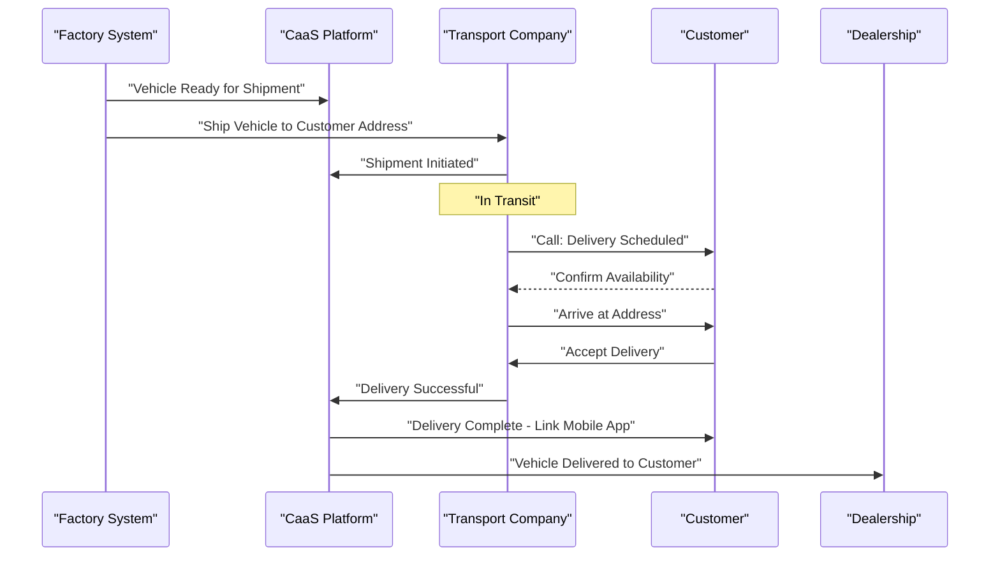
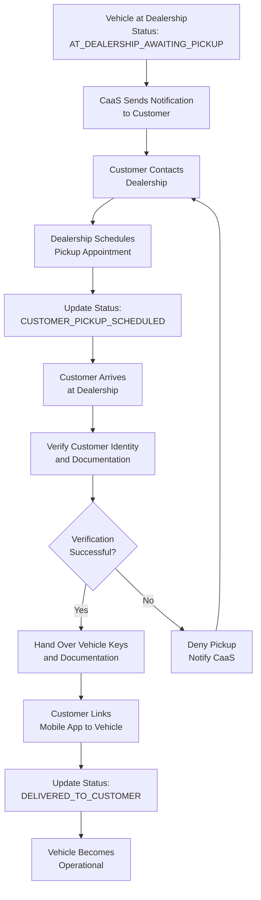

# Delivery and Transport Issues

<details>
<summary>Relevant source files</summary>

The following files were used as context for generating this wiki page:

- [pasame las preguntas y sus respuestas a markdown.md](pasame las preguntas y sus respuestas a markdown.md)

</details>


## Purpose and Scope

This document details the procedures and system behaviors for handling vehicle delivery failures and transport complications in the CaaS system. It covers scenarios where home delivery cannot be completed, customer absence at delivery time, return-to-dealership procedures, and related status management.

For information about the normal manufacturing and delivery workflow, see [Manufacturing and Delivery Workflow](#8.2). For payment-related failures that occur during final payment before registration, see [Payment Failure Scenarios](#9.2).

**Sources:** [pasame las preguntas y sus respuestas a markdown.md:1-104]()

---

## Overview

Vehicle delivery in the CaaS system involves coordination between the factory, a subcontracted transport company, the dealership, and the customer. The system must handle several failure scenarios while maintaining strict security policies that prohibit leaving vehicles unattended in unsecured locations.

The primary failure scenario occurs when home delivery is attempted but the customer is not present to receive the vehicle. This triggers a fallback procedure where the vehicle returns to the dealership for customer pickup.

**Sources:** [pasame las preguntas y sus respuestas a markdown.md:20-29]()

---

## Transport Coordination Architecture

### Transport Subcontracting Model

The CaaS system does not manage its own vehicle transport fleet. Instead, transport is **subcontracted to specialized transport companies** ("empresa de transporte"). The system's responsibility is to track critical handoff points:

| Tracking Point | Location | Recording Responsibility |
|---|---|---|
| **Shipment (Embarcación)** | Factory/Manufacturer | Factory system notifies CaaS |
| **Receipt (Recepción)** | Dealership | Dealership records in CaaS intranet |
| **Delivery Attempt** | Customer Address | Transport company/Dealership logs outcome |
| **Final Delivery** | Customer Address or Dealership | Customer acceptance recorded |

### Delivery Scheduling

**The factory determines the delivery date** based on its manufacturing schedule and logistics planning. Neither the dealership nor the transport subcontractor has authority to modify this schedule unilaterally. The CaaS system receives delivery date information asynchronously from the factory API.

**Sources:** [pasame las preguntas y sus respuestas a markdown.md:20-23]()

---

## Home Delivery Process

### Normal Delivery Flow



**Delivery Successful Flow Diagram**

In the successful scenario, the transport company contacts the customer in advance, confirms availability, completes delivery, and notifies the CaaS system. The customer can then proceed to link their mobile application to the vehicle.

**Sources:** [pasame las preguntas y sus respuestas a markdown.md:24-29]()

---

### Failed Delivery Scenarios

#### Customer Absence at Delivery Time

The most common delivery failure occurs when the transport arrives at the customer's address and the customer is not present or cannot receive the vehicle.

**Procedure:**

1. **Transport attempts contact**: The transport company ("la grúa") calls the customer upon arrival
2. **Customer unavailable**: If the customer cannot come to receive the vehicle immediately
3. **Security policy enforced**: The vehicle is **never left on the street** due to theft and liability risks
4. **Return to dealership**: The transport returns the vehicle to the dealership
5. **Customer notification**: CaaS system notifies the customer that delivery failed and the vehicle awaits pickup at the dealership

**Sources:** [pasame las preguntas y sus respuestas a markdown.md:24-25]()

#### Critical Security Rule

> **The vehicle is NEVER left unattended on the street.** This is a firm security policy to prevent theft, vandalism, and liability issues. If delivery cannot be completed, return to dealership is mandatory.

**Sources:** [pasame las preguntas y sus respuestas a markdown.md:24-25]()

---

## Return to Dealership Procedure

### Delivery Failure State Machine

```mermaid
stateDiagram-v2
    [*] --> "In Transit to Customer"
    
    "In Transit to Customer" --> "Delivery Attempted"
    
    "Delivery Attempted" --> "Delivery Successful": "Customer Present & Accepts"
    "Delivery Attempted" --> "Customer Contact Failed": "Customer Absent/Unavailable"
    
    "Customer Contact Failed" --> "Returning to Dealership": "Security Policy: Never Leave Unattended"
    
    "Returning to Dealership" --> "At Dealership - Awaiting Pickup": "Vehicle Stored Securely"
    
    "At Dealership - Awaiting Pickup" --> "Customer Notified": "CaaS Sends Notification"
    
    "Customer Notified" --> "Customer Pickup Scheduled": "Customer Contacts Dealership"
    
    "Customer Pickup Scheduled" --> "Vehicle Handed Over": "Customer Arrives at Dealership"
    
    "Vehicle Handed Over" --> "Delivery Successful"
    
    "Delivery Successful" --> [*]: "Link Mobile App to Vehicle"
```

**Vehicle Delivery State Machine**

This state machine illustrates the complete delivery lifecycle including the fallback path through dealership pickup.

**Sources:** [pasame las preguntas y sus respuestas a markdown.md:24-25]()

---

### Status Tracking and Notifications

The CaaS system must track vehicle status throughout the delivery process and provide automatic notifications to customers.

#### Vehicle Status Values During Delivery

| Status Value | Meaning | Next Valid States |
|---|---|---|
| `IN_TRANSIT_TO_CUSTOMER` | Vehicle en route to customer address | `DELIVERY_ATTEMPTED`, `AT_DEALERSHIP_AWAITING_PICKUP` |
| `DELIVERY_ATTEMPTED` | Transport attempted delivery | `DELIVERED_TO_CUSTOMER`, `RETURNING_TO_DEALERSHIP` |
| `RETURNING_TO_DEALERSHIP` | Transport returning vehicle | `AT_DEALERSHIP_AWAITING_PICKUP` |
| `AT_DEALERSHIP_AWAITING_PICKUP` | Vehicle stored at dealership waiting for customer | `CUSTOMER_PICKUP_SCHEDULED`, `IN_TRANSIT_TO_CUSTOMER` (retry) |
| `CUSTOMER_PICKUP_SCHEDULED` | Customer has scheduled pickup time | `DELIVERED_TO_CUSTOMER` |
| `DELIVERED_TO_CUSTOMER` | Customer has accepted vehicle | `OPERATIONAL` (after app linking) |

#### Automatic Notifications

**Notification Type: Delivery Failure**

The notification system must automatically inform the customer when delivery fails:

- **Channel**: Email, SMS, and push notification (if app installed)
- **Content**: 
  - Delivery was attempted at [address]
  - Vehicle returned to dealership: [dealership name and address]
  - Instructions for scheduling pickup
  - Contact information for dealership
- **Timing**: Immediately upon transport company reporting return to dealership

**Notification Type: Pickup Reminder**

Follow-up notifications may be sent if customer does not schedule pickup within a reasonable timeframe.

**Sources:** [pasame las preguntas y sus respuestas a markdown.md:28-29]()

---

## Customer Pickup at Dealership

### Pickup Process Flow



**Customer Pickup at Dealership Process**

When home delivery fails, the customer must physically visit the dealership to receive the vehicle. This process includes identity verification and the same mobile app linking that would have occurred at home delivery.

**Sources:** [pasame las preguntas y sus respuestas a markdown.md:24-25]()

---

### Dealership Responsibilities During Pickup

The dealership must:

1. **Secure Storage**: Store the vehicle securely until customer pickup
2. **Status Updates**: Record in the CaaS intranet system when customer schedules pickup
3. **Customer Verification**: Verify customer identity matches purchase records
4. **Vehicle Handover**: Provide keys, documentation, and basic vehicle orientation
5. **Mobile App Linking**: Assist customer in linking mobile app to vehicle if needed
6. **Status Confirmation**: Mark delivery as complete in the CaaS system

---

## Vehicle Status Management

### Database State Transitions

The system must maintain accurate vehicle status throughout the delivery process. While actual code implementation is not provided, the system would typically maintain:

#### Vehicle Delivery Record Fields

```
Vehicle.delivery_status: ENUM
Vehicle.delivery_address: String (customer address)
Vehicle.assigned_customer_id: Foreign Key
Vehicle.delivery_attempted_at: Timestamp
Vehicle.delivery_failure_reason: String
Vehicle.at_dealership_since: Timestamp
Vehicle.dealership_id: Foreign Key (for storage location)
```

#### Delivery Attempt Logging

Each delivery attempt should be logged for tracking and analytics:

```
DeliveryAttempt.vehicle_id: Foreign Key
DeliveryAttempt.attempt_number: Integer
DeliveryAttempt.attempted_at: Timestamp
DeliveryAttempt.outcome: ENUM (SUCCESS, CUSTOMER_ABSENT, ADDRESS_INACCESSIBLE, etc.)
DeliveryAttempt.notes: Text
DeliveryAttempt.transport_company_id: Foreign Key
```

**Sources:** [pasame las preguntas y sus respuestas a markdown.md:24-29]()

---

## Integration Points

### Transport Company Communication

The CaaS system must integrate with transport companies to receive delivery status updates. This may involve:

- **Webhooks**: Transport company posts delivery outcomes to CaaS API
- **Status Polling**: CaaS queries transport company API for status updates
- **Manual Entry**: Dealership staff record delivery outcomes in intranet

### Factory Integration

The factory system notifies CaaS when vehicles are ready for shipment. This triggers the delivery workflow:

- **Factory → CaaS**: Asynchronous notification of shipment
- **Data Included**: Vehicle VIN, expected delivery date, transport company assigned
- **CaaS Action**: Create delivery tracking record, schedule customer notifications

Related to factory integration documented in [Factory Integration](#5.1).

**Sources:** [pasame las preguntas y sus respuestas a markdown.md:20-23, 42-44]()

---

## Related Failure Scenarios

### Payment Failure at Pickup

If the customer arrives at the dealership for pickup but cannot complete the final payment:

- **Outcome**: Vehicle is **not delivered** to customer
- **Vehicle Status**: Changes to `SIN_ASIGNAR` (unassigned)
- **Business Impact**: Vehicle becomes available stock for immediate sale
- **Customer Impact**: Customer loses their reservation

This scenario is detailed in [Payment Failure Scenarios](#9.2).

**Sources:** [pasame las preguntas y sus respuestas a markdown.md:26-27]()

### Repeated Delivery Failures

If a customer repeatedly fails to receive delivery or pickup the vehicle, the dealership may:

1. Contact customer to understand availability constraints
2. Offer alternative delivery times or locations
3. As last resort, consider the purchase abandoned and mark vehicle as stock

The system should track number of delivery attempts and flag vehicles requiring management attention.

---

## Operational Metrics

### Key Performance Indicators for Delivery

The CaaS system should track:

| Metric | Description | Business Value |
|---|---|---|
| **First-Attempt Delivery Rate** | Percentage of deliveries successful on first attempt | Customer satisfaction, cost efficiency |
| **Average Time to Pickup** | Days from failed delivery to customer pickup at dealership | Process efficiency |
| **Failed Delivery Rate** | Percentage requiring return to dealership | Transport cost, customer inconvenience |
| **Delivery to Operational Time** | Time from vehicle receipt to customer using vehicle | End-to-end customer experience |

### Reporting Requirements

Dealerships and management should have access to:

- **Vehicles awaiting pickup**: List of vehicles at dealership waiting for customers
- **Delivery failure trends**: Analysis of failure reasons by region, time of day, etc.
- **Customer contact effectiveness**: Success rate of customer contact before delivery

**Sources:** [pasame las preguntas y sus respuestas a markdown.md:18-29]()

---

## Summary

Delivery and transport issues in the CaaS system primarily center on the **customer absence scenario** during home delivery. The system enforces a strict security policy that vehicles are never left unattended, requiring a fallback to dealership pickup when the customer is unavailable.

**Key Principles:**

1. **Security First**: Never leave vehicles unsecured on streets
2. **Customer Communication**: Proactive notifications about delivery status and pickup requirements
3. **Status Tracking**: Accurate recording of delivery attempts and vehicle location
4. **Flexible Recovery**: Dealership pickup provides reliable fallback for failed home delivery
5. **Payment Enforcement**: Final payment must be completed before vehicle handover

The delivery process integrates with factory systems, transport companies, and dealership operations, requiring careful coordination and status management across organizational boundaries.

**Sources:** [pasame las preguntas y sus respuestas a markdown.md:1-104]()