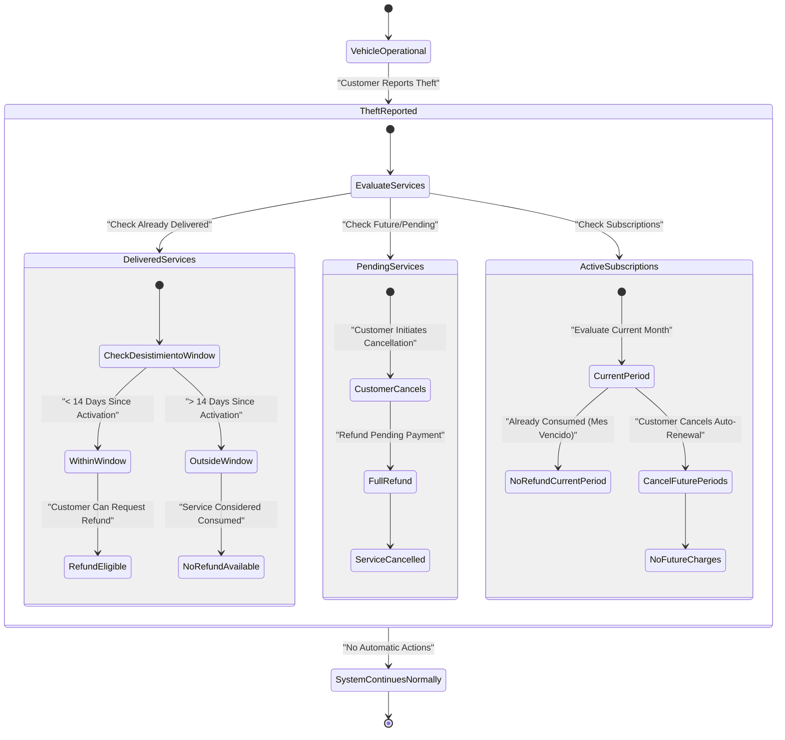
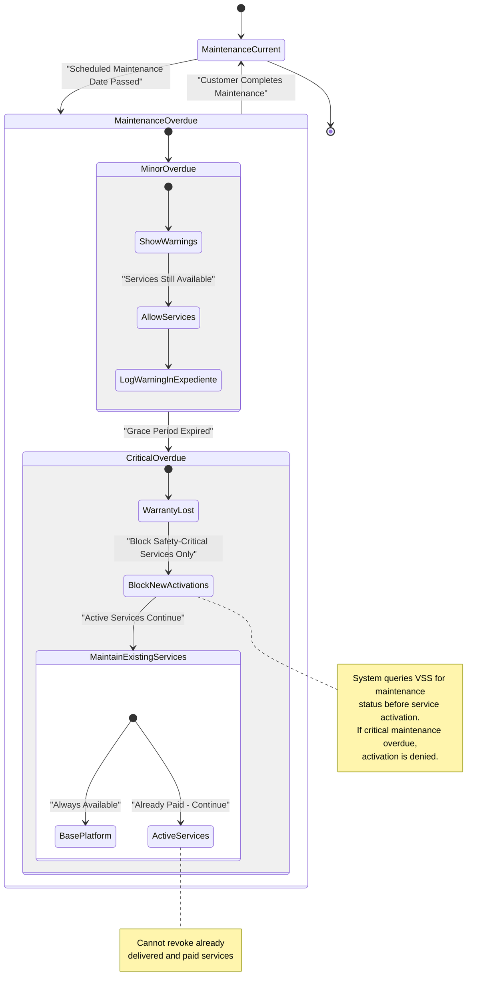
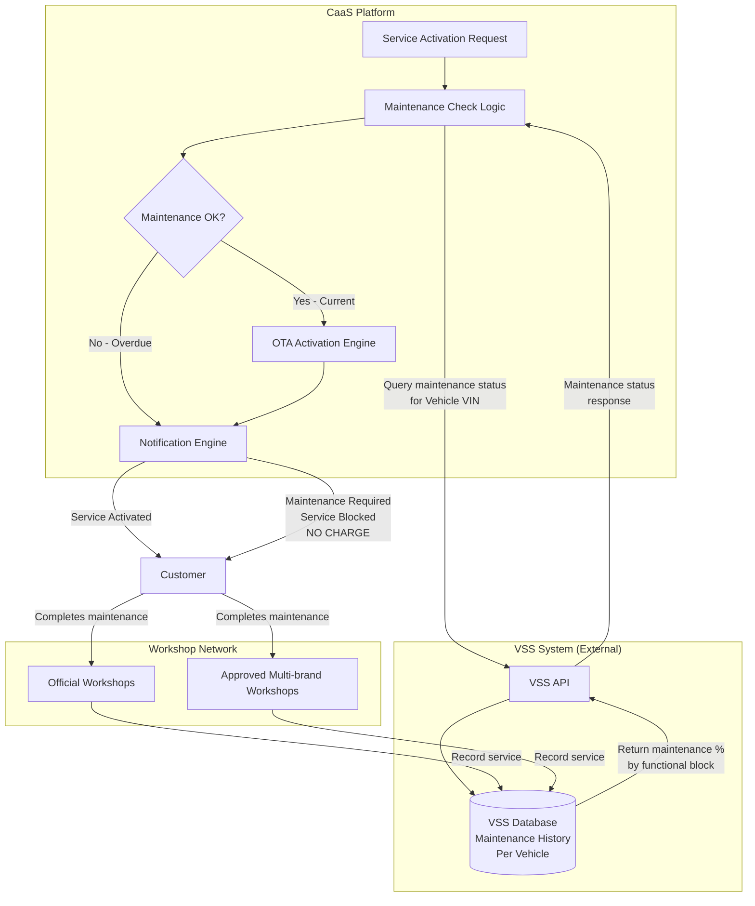
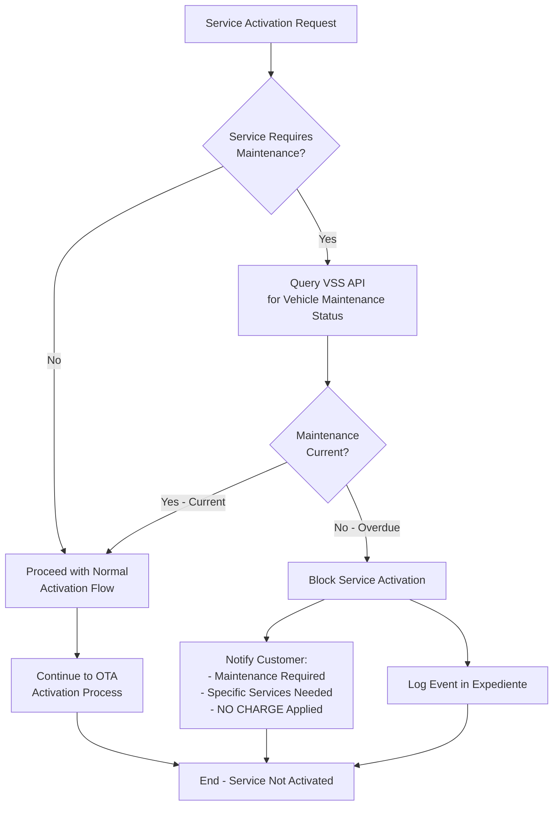

# Special Scenarios (Theft, Warranty Loss)

<details>
<summary>Relevant source files</summary>

The following files were used as context for generating this wiki page:

- [pasame las preguntas y sus respuestas a markdown.md](pasame las preguntas y sus respuestas a markdown.md)

</details>


## Purpose and Scope

This page documents system behavior for exceptional scenarios that affect service availability and customer rights: **vehicle theft** and **warranty loss due to missed maintenance**. These scenarios require special handling because they alter the normal service lifecycle without following standard cancellation or refund paths.

For standard service cancellation and refund processes, see [Service Cancellation and Refunds](#6.4). For maintenance-gated service access during normal operations, see [Maintenance-Linked Service Access](#6.3). For warranty rules during normal operations, see [Business Rules and Policies](#2.3).

This page covers:
- How vehicle theft affects active and pending services
- Warranty loss implications when mandatory maintenance is missed
- Service blocking rules that prevent unsafe activations
- System constraints that protect customer mobility rights

---

## Vehicle Theft Scenarios

### Business Rules for Stolen Vehicles

When a vehicle is reported stolen, the CaaS system applies distinct rules for different service states:

| Service State | System Behavior | Refund Eligibility |
|---------------|-----------------|-------------------|
| **Delivered Services** | No automatic cancellation | Subject to standard desistimiento rules (14-day window if service > 14 days) |
| **Pending Services** | Customer can cancel future activations | Full refund for undelivered services |
| **Active Subscriptions** | Customer can cancel auto-renewal | No refund for current billing period (already consumed) |
| **Future Subscription Periods** | Can be cancelled preemptively | Full refund (service not yet delivered) |

**Critical Rule**: Vehicle theft does **not** trigger automatic service cancellation or refunds. The customer must explicitly cancel services through normal channels.

Sources: [pasame las preguntas y sus respuestas a markdown.md:91-96]()

### Theft Handling State Machine



**Diagram: Vehicle Theft Service Lifecycle Impact**

Sources: [pasame las preguntas y sus respuestas a markdown.md:91-96]()

### System Implementation Requirements

The system **must not**:
- Automatically cancel or refund services upon theft report
- Block access to the customer's expediente or service history
- Prevent customer from managing their services

The system **must**:
- Allow customer to manually cancel pending services via web/mobile platforms
- Apply standard desistimiento rules to delivered services
- Process cancellation requests for future subscription periods
- Maintain full service history for insurance and legal purposes

**Integration Points**: 
- No special API integration with police or insurance systems required
- Customer must initiate all actions through standard customer-facing platforms
- Theft status is not tracked as a vehicle state in CaaS (external concern)

---

## Warranty Loss Due to Missed Maintenance

### Maintenance-Warranty Relationship

The CaaS system integrates with the VSS (Vehicle Service System) to enforce maintenance requirements. When a vehicle's maintenance falls behind schedule, warranty coverage is affected:

| Maintenance Status | Warranty Status | Base Platform | Already Active Services | New Service Activation |
|-------------------|-----------------|---------------|------------------------|------------------------|
| **Current** | Valid | ✓ Available | ✓ Functional | ✓ Allowed (if maintenance-linked) |
| **Overdue (Minor)** | Valid | ✓ Available | ✓ Functional | ⚠ Warning Shown |
| **Overdue (Critical)** | **Lost** | ✓ Available | ✓ Functional | ✗ **Blocked for safety-critical services** |

**Fundamental Constraint**: The system **cannot** block vehicle circulation or disable the plataforma base. Only law enforcement has authority to immobilize vehicles.

Sources: [pasame las preguntas y sus respuestas a markdown.md:66-73]()

### Warranty Loss State Diagram



**Diagram: Warranty Loss and Service Blocking Logic**

Sources: [pasame las preguntas y sus respuestas a markdown.md:66-73]()

### Service Blocking Rules

When warranty is lost due to missed maintenance, the system applies **selective blocking**:

**Always Available (Cannot Block)**:
- Plataforma base functionality
- Services already activated and paid
- Vehicle's ability to circulate
- Access to expediente and service history

**May Be Blocked (Safety-Critical Services)**:
- New service activations requiring specific maintenance (e.g., advanced suspension requires suspension maintenance)
- Services that could create safety hazards without proper maintenance
- Premium performance features dependent on specific subsystem health

**Implementation Logic**:
```
Before OTA Activation:
  1. Query VSS API for vehicle maintenance status
  2. Check service's maintenance dependencies
  3. IF (maintenance required AND maintenance overdue) THEN
       Block activation
       Notify customer with specific maintenance needed
       DO NOT charge customer
     ELSE
       Proceed with normal activation flow
```

Sources: [pasame las preguntas y sus respuestas a markdown.md:66-73]()

### VSS Integration for Maintenance Status



**Diagram: Maintenance Status Check Integration Flow**

Sources: [pasame las preguntas y sus respuestas a markdown.md:60-73]()

---

## Customer Communication Requirements

### Notification Scenarios

Both theft and warranty loss scenarios require specific customer communications:

| Scenario | Trigger | Notification Channel | Message Content |
|----------|---------|---------------------|-----------------|
| **Theft Reported** | Customer reports via customer service | Email + App Push | Instructions for service cancellation process, link to expediente |
| **Warranty Lost** | Critical maintenance overdue detected | Email + App Push | Warning about warranty loss, required maintenance, services at risk |
| **Service Blocked (Maintenance)** | Attempted activation with overdue maintenance | Email + App Push + In-App Modal | Specific maintenance needed, no charge applied, how to restore access |
| **Theft - Service Cancellation** | Customer cancels pending services | Email | Confirmation of cancellation, refund timeline |

**Critical Customer Protection Rule**: When a service activation is blocked due to maintenance, the customer **must not be charged**. The system follows the same rule as OTA failures: no charge for undelivered services.

Sources: [pasame las preguntas y sus respuestas a markdown.md:48-53](), [pasame las preguntas y sus respuestas a markdown.md:66-73]()

---

## Implementation Requirements Summary

### Theft Scenario Implementation

**Required System Components**:
- Standard service cancellation flows (reuse existing cancellation logic)
- Desistimiento rule engine (already exists for normal cancellations)
- No new APIs or integrations required
- Customer service must document theft in customer notes (external to CaaS)

**No Automated Actions**: The system remains passive. Customer initiates all actions.

### Warranty Loss Implementation

**Required System Components**:
- VSS API integration for maintenance status queries
- Pre-activation maintenance check logic
- Service-to-maintenance dependency mapping in service catalog
- Customer notification engine for blocked activations
- Warranty status tracking in vehicle records

**Business Logic Flow**:


**Diagram: Warranty-Gated Service Activation Business Logic**

Sources: [pasame las preguntas y sus respuestas a markdown.md:66-73](), [pasame las preguntas y sus respuestas a markdown.md:48-53]()

---

## Edge Cases and Special Considerations

### Concurrent Scenarios

**Theft + Active Subscription**:
- Customer must cancel auto-renewal before next billing period
- If theft occurs mid-month, current month charges still apply (mes vencido billing)
- No prorated refunds for partial month usage

**Warranty Loss + Theft**:
- Maintenance obligations remain with vehicle owner (customer)
- Warranty status irrelevant once vehicle is stolen
- Insurance claims are external to CaaS system

**Service Activated During Grace Period**:
- If customer activates service when maintenance is "minor overdue" and then maintenance becomes "critical overdue", the already activated service continues
- New activations of the same service are blocked until maintenance completed

### Legal Compliance

**Consumer Protection**:
- Desistimiento (right of withdrawal) applies regardless of theft
- Customer must be informed of warranty loss consequences
- No charge for blocked services (failure to deliver = no payment)

**Safety Requirements**:
- System must prevent activation of safety-critical services without proper maintenance
- Cannot override maintenance requirements (liability issue)
- Base platform mobility must never be blocked (legal requirement)

Sources: [pasame las preguntas y sus respuestas a markdown.md:66-73](), [pasame las preguntas y sus respuestas a markdown.md:85-96]()

---

## Related System Components

The following system components are involved in handling these special scenarios:

| Component | Role in Theft Scenarios | Role in Warranty Loss |
|-----------|-------------------------|----------------------|
| **Expediente de Compra** | Displays service history, enables cancellations | Shows maintenance warnings and warranty status |
| **Service Catalog** | Standard cancellation flows | Maintenance dependency definitions |
| **VSS Integration** | Not involved | Primary data source for maintenance status |
| **Payment Processing** | Processes refunds per desistimiento rules | Prevents charges for blocked activations |
| **OTA Engine** | Not involved (no activations during theft) | Checks maintenance before activation |
| **Notification Engine** | Sends theft-related communications | Sends maintenance warnings and block notifications |

For detailed information on these components, see [Core Technical Components](#3.2) and [External System Integrations](#5).

---

## Testing Considerations

**Theft Scenario Tests**:
- Verify no automatic service cancellations occur
- Test desistimiento window calculations for delivered services
- Validate refund processing for cancelled pending services
- Confirm subscription auto-renewal cancellation

**Warranty Loss Tests**:
- Test VSS API integration and error handling
- Verify service blocking when maintenance overdue
- Confirm already-active services continue functioning
- Test customer notification delivery for blocked activations
- Validate NO CHARGE rule when service blocked

**Integration Tests**:
- VSS API timeout handling (maintenance check must not block UI)
- Concurrent service activation attempts during maintenance updates
- Theft report during pending OTA activation

Sources: [pasame las preguntas y sus respuestas a markdown.md:66-96]()