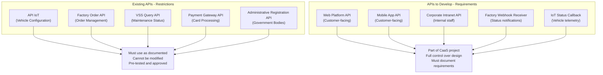
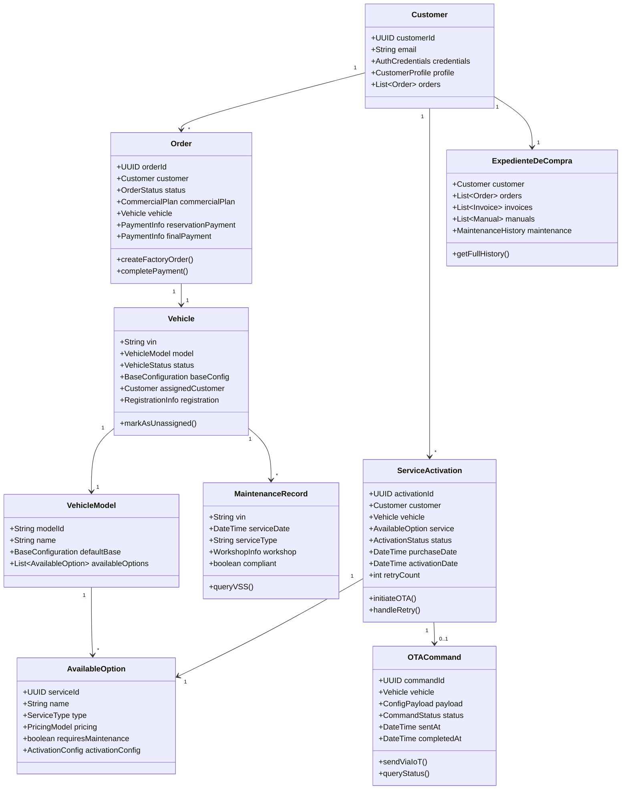
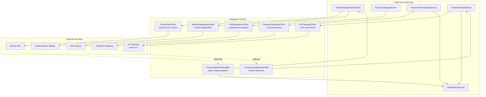
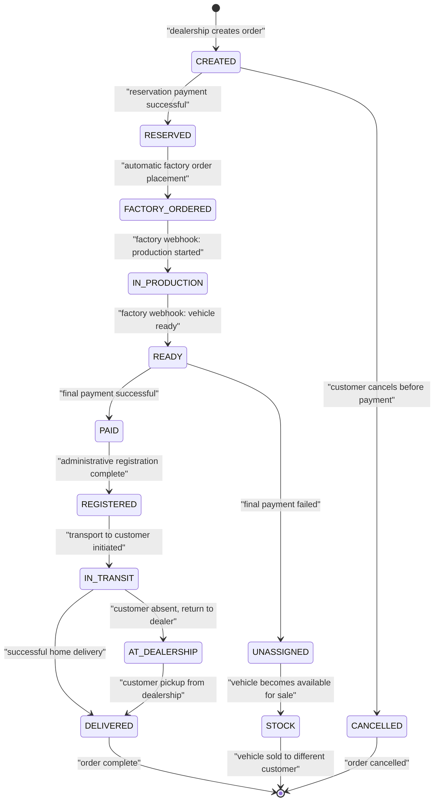
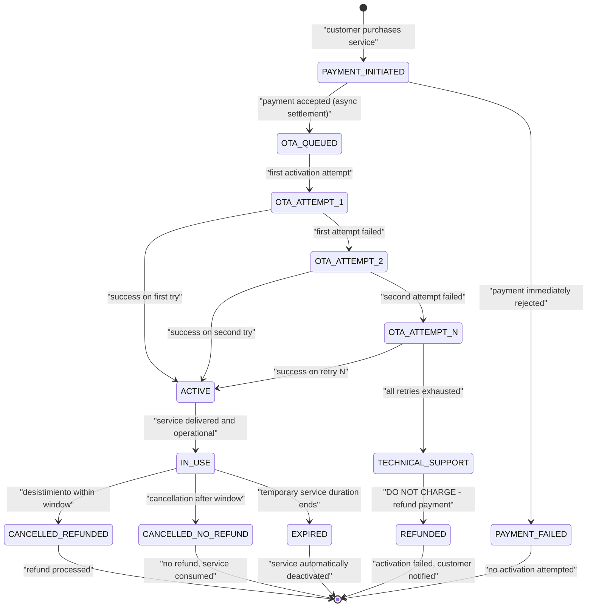
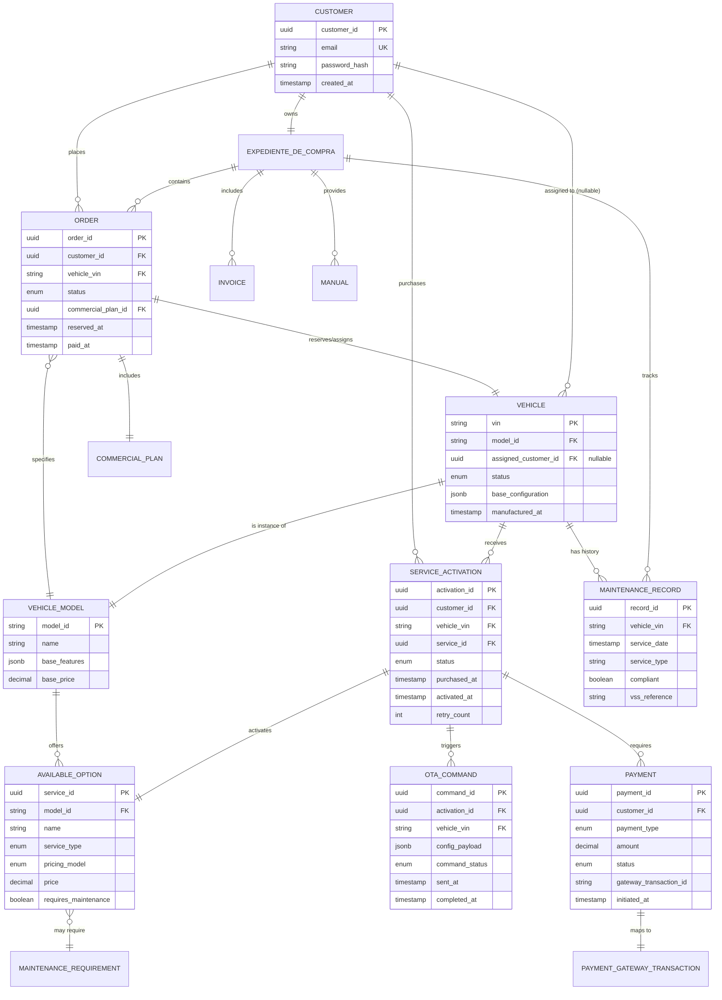
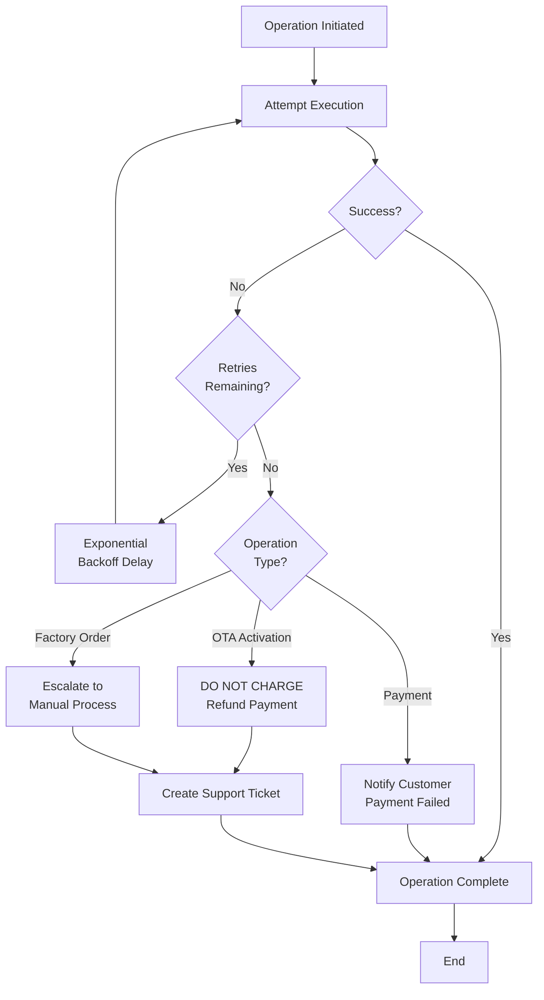

# Technical Reference

<details>
<summary>Relevant source files</summary>

The following files were used as context for generating this wiki page:

- [enunciado.md](enunciado.md)
- [pasame las preguntas y sus respuestas a markdown.md](pasame las preguntas y sus respuestas a markdown.md)

</details>


This page provides technical reference material for developers and architects working with the CaaS system. It includes comprehensive terminology definitions, API documentation guidelines, technical constraints, and mappings between business concepts and code entities.

For operational workflows and business process details, see [Operational Processes](#8). For specific integration implementation details, see [Integration Architecture](#3.3) and [External System Integrations](#5).

**Sources:** [enunciado.md:1-23](), [pasame las preguntas y sus respuestas a markdown.md:1-104]()

---

## Core Technical Terminology

This section defines all critical technical terms used throughout the CaaS system, bridging business language with technical implementation concepts.

### Business Model Terms

| Term | Spanish | Definition | Technical Implication |
|------|---------|------------|----------------------|
| **Platform Base** | Plataforma Base | The base vehicle model with essential features that make it fully operational | Represents the default vehicle configuration in the system; stored as `VehicleModel.baseConfiguration` |
| **Available Options** | Opciones Disponibles | Optional features that can be enabled/disabled on-demand (e.g., 50% power boost, autonomous driving, climate control) | Catalog of configurable services; stored in `ServiceCatalog` with activation rules |
| **Purchase Record** | Expediente de Compra | Customer's complete purchase dossier including manuals, maintenance history, invoices | Customer-facing data aggregation entity; accessed via web/mobile platforms |
| **Pay-per-Use** | Pago por Uso | Payment model where customers pay only for optional services they activate | Billing model requiring usage tracking and flexible payment processing |
| **Overdue Month Billing** | Mes Vencido | Post-paid billing model where subscription charges occur at month-end for consumed services | Delayed billing pattern requiring month-end batch processing |
| **Right of Withdrawal** | Desistimiento | Legal right allowing customers to cancel services within specific timeframes | Business rule: 14-day window for services >14 days duration, anytime for services <14 days |

### Technical Infrastructure Terms

| Term | Definition | Code Entity Reference |
|------|------------|----------------------|
| **IoT Network** | Connectivity infrastructure enabling vehicle-to-server communication | `IoTGateway`, `VehicleConnectivityService` |
| **OTA (Over The Air)** | Remote configuration system for activating/deactivating vehicle features without workshop visits | `OTAActivationEngine`, `OTACommandQueue` |
| **API IoT** | Pre-existing, documented API for remote vehicle configuration | External constraint; must use as-is; documented in separate API specification |
| **VSS (Vehicle Service System)** | External system maintained by workshops tracking maintenance records and compliance | `VSSIntegrationClient`, accessed via query API |
| **Commercial Plan** | Plan Comercial | Customer's specific purchase agreement including base platform plus any permanent options | `CustomerPlan`, stored in `Order.commercialPlan` |
| **Unassigned Vehicle** | Vehículo Sin Asignar | Vehicle that exists in inventory but is not allocated to a customer (e.g., after payment failure) | `Vehicle.status = UNASSIGNED` state |

### Process and State Terms

| Term | Definition | System State |
|------|------------|--------------|
| **Reservation Signal** | Initial payment to reserve a vehicle | `Order.status = RESERVED`, triggers factory order |
| **Final Payment** | Complete payment required before vehicle registration | `Order.status = PAID`, triggers registration workflow |
| **Vehicle Registration** | Process of registering vehicle with government administrative bodies | `Vehicle.registrationStatus`, country-specific implementation |
| **Home Delivery** | Transport of vehicle to customer's address | `Delivery.type = HOME`, with fallback to dealership pickup |
| **Service Activation** | OTA process to enable purchased optional features | `ServiceActivation.status`, with retry logic |
| **Maintenance-Linked Service** | Service that requires up-to-date maintenance before activation | `Service.requiresMaintenanceCheck = true` |

**Sources:** [enunciado.md:1-23](), [pasame las preguntas y sus respuestas a markdown.md:16-104]()

---

## API Documentation Guidelines

The CaaS system integrates with multiple external systems via APIs. This section distinguishes between existing APIs (constraints) and APIs to be developed (requirements).

### API Classification



**Sources:** [pasame las preguntas y sus respuestas a markdown.md:100-104]()

### Existing APIs (Restrictions)

These APIs already exist and must be used as-is. They are external constraints on the CaaS project.

#### API IoT (Vehicle Configuration)

**Status:** Pre-existing, documented, tested  
**Owner:** Factory IoT Infrastructure Team  
**Purpose:** Remote configuration of vehicle features via OTA  
**Integration Pattern:** Command-based, bidirectional  
**Documentation:** Reference external API IoT specification document

**Key Characteristics:**
- All vehicle functionality is pre-installed in firmware
- API only activates/deactivates features; does not install software
- Supports configuration push and status query
- Any integration issues are charged to the previous project (not CaaS)

**Usage in CaaS:**
```
OTAActivationEngine -> API IoT: sendActivationCommand(vehicleId, serviceConfig)
API IoT -> IoTNetwork: pushConfiguration(vehicleId, config)
IoTNetwork -> Vehicle: applyConfiguration(config)
Vehicle -> IoTNetwork: reportStatus(newState)
IoTNetwork -> API IoT: updateStatus(vehicleId, status)
API IoT -> OTAActivationEngine: statusCallback(vehicleId, success/failure)
```

**Sources:** [pasame las preguntas y sus respuestas a markdown.md:33-56]()

#### Factory Order API

**Status:** Pre-existing  
**Owner:** Factory Order Management System  
**Purpose:** Submit vehicle orders and receive manufacturing status updates  
**Integration Pattern:** Hybrid (synchronous orders + asynchronous notifications)

**Synchronous Operations:**
```
POST /api/v1/orders
Request: { customerId, vehicleModel, baseConfig, options[], dealershipId }
Response: { orderId, estimatedDeliveryDate, factoryLocation }
```

**Asynchronous Notifications (Webhooks):**
```
POST /caas/webhooks/factory-status
Payload: { orderId, status, timestamp, location, estimatedCompletion }
Status values: ORDERED, IN_PRODUCTION, QUALITY_CHECK, READY_FOR_SHIPMENT, SHIPPED
```

**Sources:** [pasame las preguntas y sus respuestas a markdown.md:40-44]()

#### VSS Query API

**Status:** Pre-existing  
**Owner:** Workshop Network  
**Purpose:** Query vehicle maintenance status and compliance percentage  
**Integration Pattern:** Pull-based (CaaS queries on-demand)

**Important Constraint:** Vehicles do NOT self-report maintenance status via IoT. Workshops record service in VSS, and CaaS queries VSS when needed.

```
GET /api/v1/vehicles/{vin}/maintenance-status
Response: {
  vin,
  lastServiceDate,
  nextServiceDue,
  compliancePercentage,
  functionalBlockCompliance: [
    { block: "ENGINE", compliant: true, lastService: "2024-01-15" },
    { block: "BRAKES", compliant: false, lastService: "2023-06-10" }
  ]
}
```

**Sources:** [pasame las preguntas y sus respuestas a markdown.md:60-73]()

### APIs to Develop (Requirements)

These APIs are part of the CaaS project scope and must be designed, implemented, and documented.

#### Customer-Facing APIs

**Web Platform API** (`WebPlatformController`)
- Authentication and session management
- Expediente de compra retrieval
- Service catalog browsing
- Service purchase and payment initiation
- Order history and invoice access

**Mobile Application API** (`MobileAppController`)
- All web platform features
- Vehicle linking (QR code or manual pairing)
- Direct vehicle status queries
- Push notification registration

#### Internal APIs

**Corporate Intranet API** (`IntranetController`)
- Sales registration (`POST /api/sales/register`)
- Customer credential generation
- Vehicle assignment to customers
- Order management for dealership staff

**Factory Status Webhook Receiver** (`FactoryWebhookHandler`)
- Endpoint: `POST /api/webhooks/factory-status`
- Handles asynchronous manufacturing status updates
- Triggers customer notifications
- Updates order state machine

**Sources:** [pasame las preguntas y sus respuestas a markdown.md:1-104]()

---

## System Component Mapping

This diagram bridges business concepts to actual code entities, showing how the system is structured technically.

### Core Domain Model



**Sources:** [enunciado.md:1-23]()

### Integration Layer Components



**Sources:** [pasame las preguntas y sus respuestas a markdown.md:33-82]()

---

## Technical Constraints and Rules

This section documents hard technical constraints that must be respected in the implementation.

### Actor and System Boundaries

**Constraint:** An entity cannot be both an actor and part of the system  
**Rationale:** Actors are always external to the system; internal components collaborate but are not actors  
**Implication:** 
- Customers and employees are actors (external users)
- Vehicles are infrastructure components, not actors
- Vehicles receive configurations and report status but do not initiate use cases

**Implementation Guidance:**
- Use case diagrams must show customers/employees as actors
- Vehicles appear in sequence diagrams as passive infrastructure
- IoT Network is the communication channel, not an actor

**Sources:** [pasame las preguntas y sus respuestas a markdown.md:10-16]()

### User Authentication and Registration

**Constraint:** No public self-registration allowed  
**Rationale:** CaaS is not a public system; all users must be known and controlled  
**Implication:**
- No integration with external SSO providers (Google, Microsoft, etc.)
- All customers created through dealership sales process
- Employees managed through internal user management

**Implementation Approach:**
```
// User creation only via internal APIs
POST /api/internal/customers/create
Authorization: Required (dealership staff credentials)

// No public registration endpoint
POST /api/public/register <- NOT ALLOWED
```

**Sources:** [pasame las preguntas y sus respuestas a markdown.md:15-16]()

### OTA Activation Requirements

**Constraint:** All services sold by CaaS are delivered via OTA; workshop visits never required  
**Rationale:** Pre-installed functionality model where activation is remote  
**Technical Requirements:**
- All vehicle features pre-installed in firmware
- CaaS only sends activation/deactivation commands
- Software updates are independent of CaaS service sales

**Failure Handling (Critical Rule):**
```
if (otaActivation.status == FAILED && retryCount >= MAX_RETRIES) {
    // CRITICAL: DO NOT CHARGE CUSTOMER
    refundOrCancelPayment(serviceActivation.payment);
    
    // Escalate to technical support
    createSupportTicket(serviceActivation);
    
    // Notify customer
    notificationService.sendFailureNotification(customer, service);
}
```

**Sources:** [pasame las preguntas y sus respuestas a markdown.md:46-56]()

### Maintenance Status Queries

**Constraint:** Vehicles do NOT self-report maintenance status via IoT  
**Rationale:** Maintenance records are maintained by workshops in external VSS system  
**Technical Approach:**
- Query VSS API when service requires maintenance check
- Cache maintenance status with expiration
- Block service activation if maintenance overdue

```java
// Before allowing service purchase
MaintenanceStatus status = vssClient.queryMaintenanceStatus(vehicle.vin);

if (service.requiresMaintenance && !status.isCompliant()) {
    throw new MaintenanceRequiredException(
        "Service blocked: maintenance overdue for " + status.getOutdatedBlocks()
    );
}
```

**Important:** Never block base platform or already-activated services; only prevent new service activation

**Sources:** [pasame las preguntas y sus respuestas a markdown.md:60-73]()

### Payment Processing and Risk Assumption

**Constraint:** Services delivered immediately despite asynchronous payment settlement  
**Rationale:** Optimize customer experience by accepting settlement risk  
**Technical Implementation:**

```java
public class PaymentProcessingService {
    
    public ServiceActivation processServicePayment(Customer customer, Service service) {
        // Initiate payment (async settlement)
        PaymentInitiation payment = paymentGateway.initiatePayment(
            customer.paymentMethod,
            service.price
        );
        
        // Assume risk: deliver immediately
        ServiceActivation activation = serviceActivationService.create(
            customer, service, payment
        );
        
        // Queue OTA activation without waiting for settlement
        otaService.queueActivation(activation);
        
        return activation;
    }
    
    // Handle async settlement callback
    public void handlePaymentSettlement(PaymentSettlement settlement) {
        if (settlement.status == FAILED) {
            // Handle failed settlement
            riskManagement.recordSettlementFailure(settlement);
            // May trigger collection/dunning process
        }
    }
}
```

**Sources:** [pasame las preguntas y sus respuestas a markdown.md:77-82]()

---

## State Machine Specifications

### Order Status State Machine



**State Descriptions:**

| State | Code Constant | Description | Triggers |
|-------|--------------|-------------|----------|
| CREATED | `OrderStatus.CREATED` | Initial order created by dealership | Sales registration |
| RESERVED | `OrderStatus.RESERVED` | Reservation payment received | Payment confirmation |
| FACTORY_ORDERED | `OrderStatus.FACTORY_ORDERED` | Order sent to factory API | Automatic after RESERVED |
| IN_PRODUCTION | `OrderStatus.IN_PRODUCTION` | Vehicle being manufactured | Factory webhook |
| READY | `OrderStatus.READY` | Vehicle available at dealership | Factory webhook |
| PAID | `OrderStatus.PAID` | Final payment completed | Payment confirmation |
| REGISTERED | `OrderStatus.REGISTERED` | Vehicle registered with authorities | Admin API success |
| IN_TRANSIT | `OrderStatus.IN_TRANSIT` | Vehicle being transported | Transport initiated |
| DELIVERED | `OrderStatus.DELIVERED` | Vehicle delivered to customer | Delivery confirmation |
| UNASSIGNED | `OrderStatus.UNASSIGNED` | Payment failed, vehicle unassigned | Payment failure |
| CANCELLED | `OrderStatus.CANCELLED` | Order cancelled before completion | Customer/system cancel |

**Sources:** [pasame las preguntas y sus respuestas a markdown.md:24-29](), [enunciado.md:13-17]()

### Service Activation State Machine



**Implementation Constants:**
```java
public enum ServiceActivationStatus {
    PAYMENT_INITIATED,      // Initial state after payment starts
    OTA_QUEUED,            // Queued for OTA delivery
    OTA_ATTEMPT_1,         // First activation attempt
    OTA_ATTEMPT_2,         // Second attempt
    OTA_ATTEMPT_N,         // Subsequent retries
    TECHNICAL_SUPPORT,     // Escalated after all retries failed
    ACTIVE,                // Successfully activated
    IN_USE,                // Delivered and operational
    REFUNDED,              // Failed activation - customer refunded
    CANCELLED_REFUNDED,    // Customer cancelled within desistimiento window
    CANCELLED_NO_REFUND,   // Customer cancelled after window
    EXPIRED,               // Temporary service expired
    PAYMENT_FAILED         // Payment rejected
}

public static final int MAX_OTA_RETRIES = 3; // Configurable
public static final int DESISTIMIENTO_DAYS_LONG = 14; // For services > 14 days
```

**Sources:** [pasame las preguntas y sus respuestas a markdown.md:48-96]()

---

## Data Model Relationships

### Core Entities and Relationships



**Key Relationships:**
- `VEHICLE.assigned_customer_id` is nullable (supports "sin asignar" state)
- `SERVICE_ACTIVATION.retry_count` tracks OTA retry attempts
- `AVAILABLE_OPTION.requires_maintenance` flags maintenance-linked services
- `MAINTENANCE_RECORD.vss_reference` links to external VSS system

**Sources:** [enunciado.md:1-23]()

---

## Integration Patterns Summary

### Synchronous vs Asynchronous Patterns

| Integration Point | Pattern | Initiator | Response | Rationale |
|------------------|---------|-----------|----------|-----------|
| Factory Order Placement | Synchronous | CaaS → Factory | Immediate order confirmation | Need immediate orderId and estimated delivery |
| Factory Status Updates | Asynchronous | Factory → CaaS | Webhook callbacks | Manufacturing is long-running; don't block |
| VSS Maintenance Query | Synchronous | CaaS → VSS | Immediate status response | Needed for real-time service eligibility check |
| OTA Command Send | Asynchronous | CaaS → IoT | Command queued, status via callback | Vehicle may be offline; unreliable network |
| Vehicle Status Report | Asynchronous | IoT → CaaS | Telemetry push via callback | Vehicle-initiated when data available |
| Payment Initiation | Asynchronous | CaaS → Gateway | Accepted, settlement delayed | Optimize UX; CaaS assumes risk |
| Admin Registration | Synchronous | CaaS → Admin | Registration confirmation | Blocking operation; must complete before delivery |

### Retry and Failure Patterns



**Implementation Example:**
```java
public class OTARetryStrategy {
    private static final int MAX_RETRIES = 3;
    private static final int BASE_DELAY_MS = 1000;
    
    public void executeWithRetry(ServiceActivation activation) {
        int attempt = 0;
        boolean success = false;
        
        while (attempt < MAX_RETRIES && !success) {
            try {
                activation.setStatus(getAttemptStatus(attempt));
                
                OTACommand command = createOTACommand(activation);
                iotClient.sendCommand(command);
                
                // Wait for callback or timeout
                success = waitForActivationCallback(command, TIMEOUT_SECONDS);
                
            } catch (Exception e) {
                attempt++;
                if (attempt < MAX_RETRIES) {
                    sleep(calculateBackoff(attempt));
                }
            }
        }
        
        if (!success) {
            handleActivationFailure(activation); // DO NOT CHARGE
        }
    }
    
    private void handleActivationFailure(ServiceActivation activation) {
        // Critical: customer protection
        paymentService.refundPayment(activation.getPayment());
        
        supportTicketService.createTicket(
            activation,
            "OTA activation failed after " + MAX_RETRIES + " attempts"
        );
        
        notificationService.notifyCustomer(
            activation.getCustomer(),
            "Service activation failed. No charge applied. Support ticket created."
        );
    }
}
```

**Sources:** [pasame las preguntas y sus respuestas a markdown.md:48-53]()

---

## Business Rule Implementation Checklist

This checklist ensures critical business rules are implemented correctly in code.

### Payment and Refund Rules

- [ ] **Failed OTA Activation = No Charge**
  - Implementation: `if (activation.status == TECHNICAL_SUPPORT) { refundPayment(activation.payment); }`
  - Location: `OTAActivationService.handleActivationFailure()`
  
- [ ] **Desistimiento for Services > 14 Days**
  - Rule: 14-day refund window
  - Implementation: `if (service.duration > 14 && cancellationDate <= purchaseDate + 14 days) { processRefund(); }`
  - Location: `ServiceCancellationService.processCancellation()`

- [ ] **Desistimiento for Services < 14 Days**
  - Rule: Refund anytime during service period
  - Implementation: `if (service.duration <= 14 && service.isActive()) { processRefund(); }`
  - Location: `ServiceCancellationService.processCancellation()`

- [ ] **Subscription Billing (Mes Vencido)**
  - Rule: Charge at month-end for consumed services
  - Implementation: Batch job at month-end: `subscriptionBillingJob.chargeForPreviousMonth()`
  - Location: `SubscriptionBillingService.processMonthEndBilling()`

- [ ] **Immediate Service Delivery Despite Async Settlement**
  - Rule: Deliver service before payment confirmation
  - Implementation: `paymentInitiated() -> immediately queueOTAActivation()`
  - Location: `PaymentProcessingService.processServicePayment()`

### Vehicle and Order Rules

- [ ] **Failed Final Payment = Vehicle Becomes Stock**
  - Rule: Vehicle marked "sin asignar" and available for immediate sale
  - Implementation: `if (finalPaymentFailed()) { vehicle.setStatus(UNASSIGNED); vehicle.setCustomer(null); }`
  - Location: `OrderManagementService.handleFinalPaymentFailure()`

- [ ] **Customer Absent = Return to Dealership**
  - Rule: Never leave vehicle unattended
  - Implementation: `if (customerNotPresent()) { delivery.setStatus(RETURNED_TO_DEALER); }`
  - Location: `DeliveryService.handleFailedHomeDelivery()`

- [ ] **Automatic Credential Generation**
  - Rule: Customer receives email with platform access credentials after sales registration
  - Implementation: `createOrder() -> generateCredentials() -> sendEmail()`
  - Location: `CustomerOnboardingService.setupCustomerAccess()`

### Maintenance and Service Eligibility Rules

- [ ] **Maintenance Check Before Service Activation**
  - Rule: Query VSS before allowing purchase of maintenance-linked services
  - Implementation: `if (service.requiresMaintenance) { vssClient.checkMaintenance(vehicle.vin); }`
  - Location: `ServiceEligibilityService.checkServiceAvailability()`

- [ ] **Block Service Purchase If Maintenance Overdue**
  - Rule: Prevent activation (not purchase display) if maintenance non-compliant
  - Implementation: `if (!maintenanceStatus.isCompliant()) { throw MaintenanceRequiredException; }`
  - Location: `ServiceActivationService.validateEligibility()`

- [ ] **Never Block Base Platform**
  - Rule: Maintenance issues never disable base vehicle functionality
  - Implementation: Base platform activation is not conditional on maintenance
  - Location: No blocking logic for `ServiceType.BASE_PLATFORM`

- [ ] **Never Block Already-Activated Services**
  - Rule: Maintenance only gates NEW service purchases, not existing ones
  - Implementation: `activationCheck() only for status == PAYMENT_INITIATED`
  - Location: `ServiceActivationService.initiateActivation()`

### Notification Rules

- [ ] **Automatic Factory Status Notifications**
  - Rule: Customer notified at each manufacturing milestone
  - Implementation: `factoryWebhookHandler() -> sendCustomerNotification()`
  - Location: `FactoryWebhookHandler.handleStatusUpdate()`

- [ ] **Multi-Channel Notification Delivery**
  - Rule: Critical notifications sent via email, push, and potentially SMS
  - Implementation: `notificationService.sendMultiChannel(email, push, sms)`
  - Location: `NotificationService.sendCriticalNotification()`

**Sources:** [pasame las preguntas y sus respuestas a markdown.md:1-104](), [enunciado.md:1-23]()

---

## Configuration and Environment

### External System Endpoints

Expected configuration structure:

```yaml
external_systems:
  factory_api:
    base_url: "${FACTORY_API_URL}"
    endpoints:
      create_order: "/api/v1/orders"
      query_status: "/api/v1/orders/{orderId}/status"
    auth:
      type: "api_key"
      key: "${FACTORY_API_KEY}"
    timeout_seconds: 30
    
  vss_api:
    base_url: "${VSS_API_URL}"
    endpoints:
      maintenance_status: "/api/v1/vehicles/{vin}/maintenance-status"
    auth:
      type: "bearer_token"
      token: "${VSS_API_TOKEN}"
    timeout_seconds: 10
    cache_ttl_seconds: 3600
    
  iot_api:
    base_url: "${IOT_API_URL}"
    endpoints:
      send_command: "/api/v2/vehicles/{vin}/commands"
      query_status: "/api/v2/vehicles/{vin}/status"
    auth:
      type: "mutual_tls"
      cert_path: "${IOT_CLIENT_CERT}"
      key_path: "${IOT_CLIENT_KEY}"
    timeout_seconds: 60
    
  payment_gateway:
    base_url: "${PAYMENT_GW_URL}"
    merchant_id: "${MERCHANT_ID}"
    auth:
      type: "api_key"
      key: "${PAYMENT_API_KEY}"
    timeout_seconds: 45
    
  admin_registration:
    endpoints:
      spain: "${SPAIN_ADMIN_URL}"
      france: "${FRANCE_ADMIN_URL}"
      germany: "${GERMANY_ADMIN_URL}"
    timeout_seconds: 120

caas_webhooks:
  factory_status:
    endpoint: "/api/webhooks/factory-status"
    auth_token: "${FACTORY_WEBHOOK_SECRET}"
  
  iot_callback:
    endpoint: "/api/webhooks/iot-status"
    auth_token: "${IOT_CALLBACK_SECRET}"
    
ota_configuration:
  max_retries: 3
  retry_delay_base_ms: 1000
  retry_backoff_multiplier: 2.0
  command_timeout_seconds: 300
  
desistimiento_rules:
  long_service_days: 14
  refund_window_days: 14
  
subscription_billing:
  billing_day_of_month: 1
  grace_period_days: 3
```

### Database Schema Conventions

- Primary keys: UUID (`uuid` type in PostgreSQL)
- Foreign keys: Suffix with `_id` (e.g., `customer_id`)
- Timestamps: `created_at`, `updated_at`, use UTC timezone
- Enums: Store as strings, not integers, for clarity
- JSON/JSONB: Use for flexible configuration fields like `base_configuration`, `config_payload`
- Nullable fields: `assigned_customer_id` for vehicles, `activated_at` for pending activations

**Sources:** Inferred from system requirements

---

## Summary

This technical reference provides the foundational material needed for developers and architects working with the CaaS system. Key takeaways:

1. **Terminology**: All Spanish business terms have precise technical mappings
2. **API Classification**: Distinguish between existing APIs (constraints) and APIs to develop (requirements)
3. **Critical Rules**: Failed OTA = no charge; maintenance gates new services only; vehicles never blocked
4. **Integration Patterns**: Mix of synchronous and asynchronous based on use case requirements
5. **State Machines**: Well-defined states for orders and service activations with clear transitions
6. **Technical Constraints**: Actor boundaries, no self-registration, OTA-only delivery

For detailed implementation of specific subsystems, refer to the child pages: [API Documentation Guidelines](#10.1) and [Key Terminology and Glossary](#10.2).

**Sources:** [enunciado.md:1-23](), [pasame las preguntas y sus respuestas a markdown.md:1-104]()