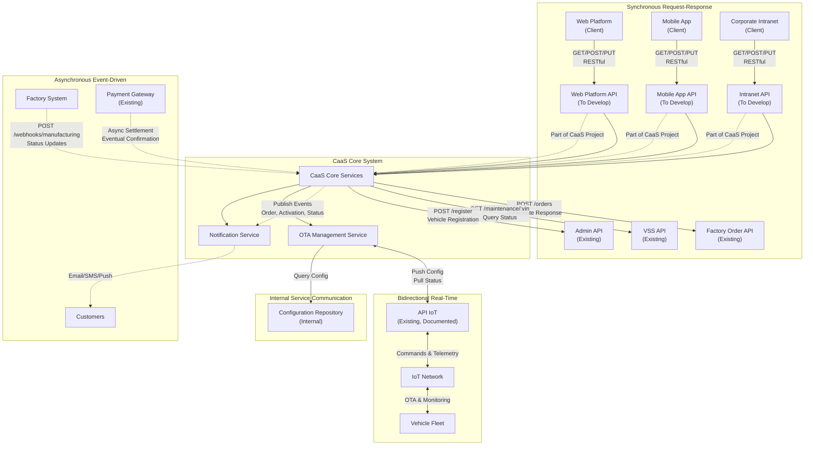
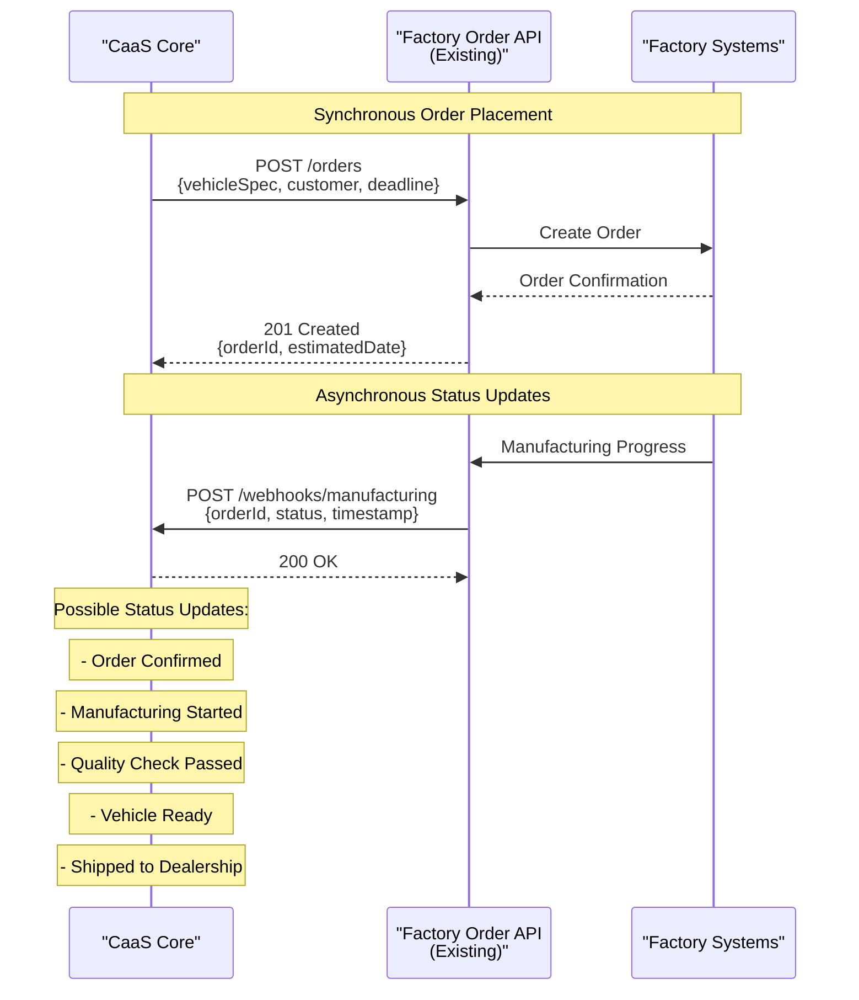
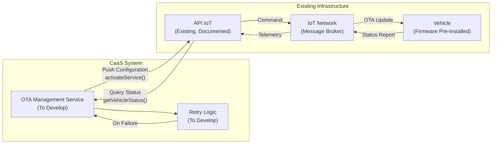
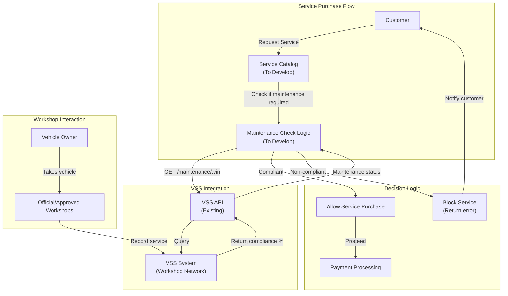
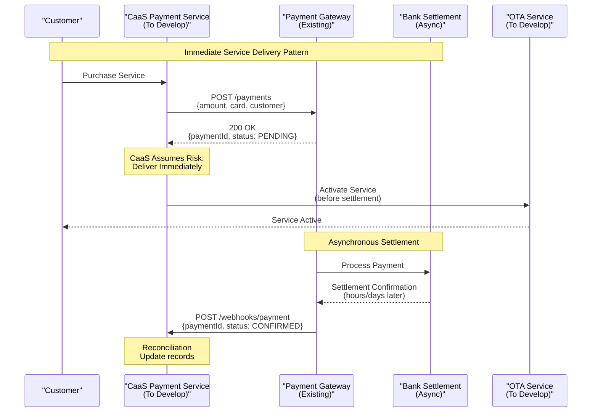
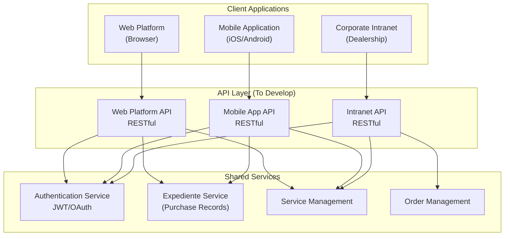
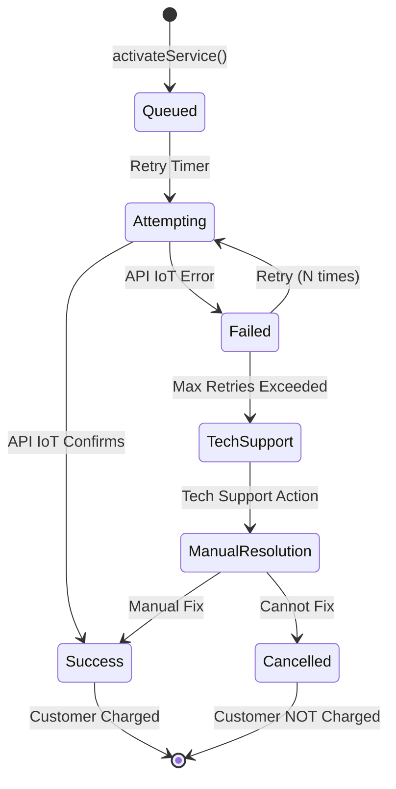

# API Documentation Guidelines

<details>
<summary>Relevant source files</summary>

The following files were used as context for generating this wiki page:

- [pasame las preguntas y sus respuestas a markdown.md](pasame las preguntas y sus respuestas a markdown.md)

</details>


## Purpose and Scope

This document establishes standards for documenting APIs within the CaaS system architecture. It provides guidelines for technical specification writers, developers, and architects to ensure consistent, complete, and maintainable API documentation throughout the project lifecycle.

The scope covers:
- Classification of APIs as **existing** (restrictions) vs **to develop** (requirements)
- Documentation standards for each API category
- Inventory of all external and internal APIs in the CaaS ecosystem
- Integration patterns and communication models
- Templates for API specification documents

For business rules governing API usage (e.g., maintenance-gated service access, payment settlement delays), see [Business Rules and Policies](#2.3). For integration architecture patterns, see [Integration Architecture](#3.3).

**Sources:** [pasame las preguntas y sus respuestas a markdown.md:100-104]()

---

## API Categories in CaaS

The CaaS system distinguishes between two fundamentally different categories of APIs, which require different documentation approaches and have different implications for the project.

### Existing APIs (Restrictions)

**Existing APIs** are those that have already been developed, tested, documented, and deployed by other teams or systems. These APIs represent **restrictions** or **constraints** on the CaaS system design.

**Key Characteristics:**
- Already exist with defined contracts
- Cannot be modified by the CaaS development team
- Must be used as-is with existing behavior
- Have their own external documentation
- Integration problems are charged to the providing system's project
- CaaS must adapt to their interface specifications

**Examples in CaaS:**
- **API IoT**: Existing, documented, tested API for vehicle configuration and telemetry
- **Factory Order API**: Pre-existing API for order management
- **VSS API**: External system for maintenance record queries
- **Payment Gateway API**: Third-party payment processing service
- **Administrative Registration API**: Government body APIs for vehicle registration

**Sources:** [pasame las preguntas y sus respuestas a markdown.md:32-38](), [pasame las preguntas y sus respuestas a markdown.md:100-104]()

### APIs to Develop (Requirements)

**APIs to Develop** are those that will be created as part of the CaaS project. These APIs form part of the project scope and have associated requirements, development effort, and quality criteria.

**Key Characteristics:**
- Part of the CaaS project deliverables
- Have functional and non-functional requirements
- Design decisions are under CaaS team control
- Must be fully specified before development
- Subject to testing and validation within the project
- May evolve based on business needs

**Examples in CaaS:**
- **Web Platform API**: RESTful endpoints for customer web interface
- **Mobile App API**: API endpoints for mobile application features
- **Corporate Intranet API**: Internal endpoints for dealership operations
- **Notification Service API**: Internal API for multi-channel notifications
- **OTA Management API**: Internal service for orchestrating vehicle activations

**Sources:** [pasame las preguntas y sus respuestas a markdown.md:100-104]()

---

## API Inventory

Below is a comprehensive inventory of all APIs in the CaaS ecosystem, categorized by type and integration layer.

| API Name | Category | Owner | Direction | Protocol | Sync/Async | Purpose |
|----------|----------|-------|-----------|----------|------------|---------|
| **Factory Order API** | Existing | Factory Systems | CaaS → Factory | REST/HTTP | Synchronous | Order placement and management |
| **Factory Status Webhook** | Existing | Factory Systems | Factory → CaaS | Webhook/HTTP | Asynchronous | Manufacturing status notifications |
| **API IoT** | Existing | Vehicle Infrastructure | CaaS ↔ IoT Network | Proprietary/Documented | Bidirectional | Vehicle configuration and telemetry |
| **VSS API** | Existing | Workshop Network | CaaS → VSS | REST/HTTP | Synchronous | Maintenance record queries |
| **Payment Gateway API** | Existing | Payment Provider | CaaS → Gateway | REST/HTTPS | Async Settlement | Payment processing |
| **Admin Registration API** | Existing | Government Bodies | CaaS → Admin | SOAP/REST | Synchronous | Vehicle registration |
| **Web Platform API** | To Develop | CaaS Core | Web Client → CaaS | REST/HTTP | Synchronous | Customer self-service features |
| **Mobile App API** | To Develop | CaaS Core | Mobile Client → CaaS | REST/HTTP | Synchronous | Mobile application backend |
| **Corporate Intranet API** | To Develop | CaaS Core | Intranet Client → CaaS | REST/HTTP | Synchronous | Dealership operations |
| **Notification Service API** | To Develop | CaaS Core | Internal | Message Queue | Asynchronous | Multi-channel notifications |
| **OTA Management API** | To Develop | CaaS Core | Internal | REST/HTTP | Async Processing | Service activation orchestration |
| **Service Catalog API** | To Develop | CaaS Core | Internal/External | REST/HTTP | Synchronous | Service definitions and pricing |

**Sources:** High-level architecture diagrams (Diagram 4), [pasame las preguntas y sus respuestas a markdown.md:32-44]()

---

## Integration Patterns and Communication Models

The following diagram illustrates the integration patterns and communication models used by CaaS APIs, distinguishing between synchronous, asynchronous, and bidirectional patterns.



**Communication Pattern Summary:**

| Pattern | Use Case | APIs | Characteristics |
|---------|----------|------|-----------------|
| **Synchronous Request-Response** | Order placement, queries, CRUD operations | Factory Order API, VSS API, Admin API, all customer-facing APIs | Blocking, immediate response, error handling in same request |
| **Asynchronous Event-Driven** | Status notifications, payment settlement, alerts | Factory webhooks, Payment Gateway, Notification Service | Non-blocking, eventual consistency, requires callback endpoints |
| **Bidirectional Real-Time** | Vehicle communication, telemetry | API IoT | Push commands to vehicles, pull status updates, real-time monitoring |
| **Internal Service-to-Service** | Microservice coordination | All To-Develop internal APIs | Synchronous or async based on use case, internal contracts |

**Sources:** High-level architecture diagrams (Diagram 2, Diagram 4), [pasame las preguntas y sus respuestas a markdown.md:40-44]()

---

## Documentation Standards

### For Existing APIs (Restrictions)

When documenting an existing API that CaaS must integrate with, the documentation should focus on **how CaaS uses** the API rather than **how the API works internally**.

#### Required Documentation Elements:

1. **API Identification**
   - API name and version
   - Owning system/team
   - Reference to external documentation (URL or document ID)
   - Contact information for support

2. **Integration Summary** (Brief)
   - What the API does from CaaS perspective
   - Why CaaS needs it
   - Which CaaS components call it

3. **Usage Constraints**
   - Rate limits
   - Authentication/authorization requirements
   - Network constraints (VPN, firewall rules)
   - SLA or availability guarantees
   - Known limitations or bugs

4. **Integration Assumptions**
   - Any problems or edge cases that are "charged to the providing system's project"
   - Fallback behavior if API is unavailable
   - Responsibility boundaries

5. **Reference to Technical Documentation**
   - Link to API specification (OpenAPI/Swagger, WSDL, etc.)
   - Example requests/responses
   - Error codes and handling

#### Documentation Template for Existing APIs:

```markdown
## [API Name] Integration

**Category:** Existing API (Restriction)  
**Owner:** [Team/System Name]  
**Documentation:** [Link to external docs]  
**Version:** [Version number]

### Purpose
Brief 1-2 sentence description of what this API does and why CaaS needs it.

### CaaS Usage
- **Called by:** [Which CaaS component(s)]
- **Frequency:** [How often / under what conditions]
- **Critical Path:** [Yes/No - is this blocking for critical flows?]

### Integration Pattern
- **Protocol:** [REST/SOAP/etc]
- **Authentication:** [Method used]
- **Communication:** [Synchronous/Asynchronous]
- **Retry Policy:** [How CaaS handles failures]

### Constraints and Limitations
- [List any rate limits, size restrictions, etc.]
- [Known issues or workarounds]

### Error Handling
- [How CaaS handles API failures]
- [Fallback behavior]

### Reference
- Full API Specification: [Link]
- Example Requests: [Link or inline examples]
- Support Contact: [Email/Team]
```

**Sources:** [pasame las preguntas y sus respuestas a markdown.md:100-104](), [pasame las preguntas y sus respuestas a markdown.md:32-38]()

### For APIs to Develop (Requirements)

APIs being developed as part of the CaaS project require full specification as requirements documents. These APIs form deliverables and must be specified before implementation.

#### Required Documentation Elements:

1. **Functional Requirements**
   - API purpose and business context
   - Endpoints/operations to be provided
   - Request/response schemas
   - Business rules and validation
   - Data models

2. **Non-Functional Requirements**
   - Performance requirements (latency, throughput)
   - Scalability requirements
   - Security requirements (authentication, authorization, encryption)
   - Availability and reliability targets
   - Monitoring and logging requirements

3. **API Contract Specification**
   - Full OpenAPI 3.0 specification (or equivalent)
   - All endpoints with HTTP methods
   - Request parameters (path, query, header, body)
   - Response codes and schemas
   - Error response formats

4. **Integration Requirements**
   - Which systems/clients will consume this API
   - Authentication/authorization mechanisms to implement
   - API versioning strategy
   - Backward compatibility requirements

5. **Test Requirements**
   - Acceptance criteria for each endpoint
   - Edge cases and error scenarios
   - Performance benchmarks

#### Documentation Template for APIs to Develop:

```markdown
## [API Name] Specification

**Category:** API to Develop  
**Status:** [Draft/Review/Approved]  
**Owner:** CaaS Development Team  
**Version:** [Semantic version]

### Business Context
[Why this API is needed, what business problem it solves]

### Functional Requirements

#### FR-[ID]: [Requirement Name]
**Description:** [Detailed description]  
**Priority:** [Must/Should/Could]  
**Acceptance Criteria:**
- [Criterion 1]
- [Criterion 2]

### API Contract

#### Base URL
```
[Environment]: [Base URL]
```

#### Authentication
[Details of auth mechanism]

#### Endpoints

##### [HTTP METHOD] /path/to/resource
**Description:** [What this endpoint does]  
**Request:**
```json
{
  "field": "type"
}
```
**Response (200 OK):**
```json
{
  "field": "type"
}
```
**Error Responses:**
- 400 Bad Request: [When and why]
- 401 Unauthorized: [When and why]
- 500 Internal Server Error: [When and why]

### Non-Functional Requirements

#### Performance
- Latency: [p50, p95, p99 targets]
- Throughput: [requests per second]

#### Security
- [Authentication mechanism]
- [Authorization rules]
- [Data encryption requirements]

#### Availability
- Target uptime: [percentage]
- Maximum downtime per month: [duration]

### Data Models
[Entity schemas, relationships]

### Dependencies
- [External systems this API depends on]
- [Internal services required]

### Testing Strategy
- [Unit test coverage requirements]
- [Integration test scenarios]
- [Performance test plan]
```

**Sources:** [pasame las preguntas y sus respuestas a markdown.md:100-104]()

---

## API-Specific Guidelines

### Factory Integration APIs

#### Factory Order API (Existing)



**Documentation Requirements:**
- **Category:** Existing API (Restriction)
- **Pattern:** Hybrid - Synchronous for orders, Asynchronous for status
- **CaaS Responsibility:** 
  - Call order API when customer pays reservation signal
  - Expose webhook endpoint for status notifications
  - Store manufacturing status in Order Management database
  - Trigger customer notifications on status changes
- **Constraint:** Factory determines delivery date, not CaaS
- **Error Handling:** Any integration issues are charged to Factory API project

**Sources:** [pasame las preguntas y sus respuestas a markdown.md:40-44](), High-level architecture diagrams (Diagram 4)

#### Factory Webhook Endpoint (To Develop)

```markdown
POST /webhooks/manufacturing

Category: API to Develop (CaaS must implement receiver)

Request Body:
{
  "orderId": "string",
  "status": "enum[ORDER_CONFIRMED, MANUFACTURING_STARTED, QUALITY_CHECK, READY, SHIPPED]",
  "timestamp": "ISO8601",
  "estimatedDelivery": "ISO8601 (optional)",
  "details": "string (optional)"
}

Response: 200 OK (acknowledge receipt)

Requirements:
- Must be idempotent (same update can arrive multiple times)
- Must validate orderId exists in CaaS system
- Must update order status in Order Management database
- Must trigger notification to customer
- Must log all incoming webhooks for audit
```

**Sources:** [pasame las preguntas y sus respuestas a markdown.md:28-29]()

---

### Vehicle Communication: API IoT (Existing)

The **API IoT** is a pre-existing, documented, and tested API for vehicle configuration and telemetry. This is a critical constraint for the CaaS project.



**Documentation Requirements:**

**Category:** Existing API (Restriction)

**Key Characteristics:**
- **Pre-existing:** Developed, tested, and documented before CaaS project
- **Cannot be modified:** CaaS must use as-is
- **Integration problems:** Charged to the API IoT project, not CaaS
- **Bidirectional:** Push commands to vehicles, pull status from vehicles
- **Functionality model:** All features pre-installed in vehicle firmware; API only activates/deactivates

**CaaS Usage:**
- **Push Service Activation:** After successful payment, send activation command
- **Pull Vehicle Status:** Query status after activation attempt to verify
- **Retry Mechanism:** CaaS implements retry logic (N attempts before escalation)
- **Failure Handling:** If all retries fail, escalate to technical support and DO NOT CHARGE customer

**Critical Business Rule:** Never charge customer for services that cannot be activated due to OTA failures.

**Integration Pattern:**
```
1. Customer pays for service
2. CaaS calls API IoT to activate service
3. API IoT queues command to IoT Network
4. IoT Network sends OTA update to vehicle
5. Vehicle attempts activation
6. If success: Vehicle reports status back
7. If failure: CaaS retries N times
8. If all fail: Technical support escalation + no charge
```

**Reference:** External API IoT documentation (link to be provided by infrastructure team)

**Sources:** [pasame las preguntas y sus respuestas a markdown.md:32-38](), [pasame las preguntas y sus respuestas a markdown.md:46-56]()

---

### VSS (Vehicle Service System) API (Existing)



**Documentation Requirements:**

**Category:** Existing API (Restriction)

**Purpose:** Query maintenance compliance status for maintenance-dependent services.

**CaaS Usage:**
- **When:** Before allowing purchase of services that require specific maintenance (e.g., performance enhancements, certain features)
- **Query Pattern:** Pull-based; CaaS queries when needed
- **NOT Used For:** Vehicles do NOT push maintenance status to CaaS
- **Data Source:** Workshops record service in VSS; CaaS queries VSS

**Integration Pattern:**
```
GET /maintenance/{vin}?subsystem={subsystemId}

Response:
{
  "vin": "string",
  "subsystem": "string",
  "compliancePercentage": "number (0-100)",
  "lastMaintenanceDate": "ISO8601",
  "nextMaintenanceDue": "ISO8601",
  "inWarranty": "boolean"
}
```

**Business Rules:**
- **Blocking Services:** If `compliancePercentage < 100` for required subsystem, deny service purchase
- **No Vehicle Blocking:** Never block vehicle operation (police-only authority)
- **Warranty Impact:** If maintenance overdue (`compliancePercentage < 100`), vehicle loses warranty but can still operate
- **Already-Paid Services:** Cannot revoke services already paid/activated, even if maintenance lapses

**Error Handling:**
- VSS API unavailable: Allow purchase (assume compliant) or deny (conservative)? → Business decision required
- Invalid VIN: Return error to customer

**Sources:** [pasame las preguntas y sus respuestas a markdown.md:60-73]()

---

### Payment Gateway API (Existing)



**Documentation Requirements:**

**Category:** Existing API (Restriction)

**Critical Characteristic:** **Asynchronous settlement** with immediate service delivery.

**Risk Management Strategy:**
- **CaaS assumes risk:** Services delivered before payment fully settles
- **Business decision:** Better customer experience outweighs risk of chargebacks/failures
- **Reconciliation required:** CaaS must implement settlement reconciliation process

**Integration Pattern:**
1. **Payment Initiation:** CaaS calls payment gateway synchronously
2. **Initial Response:** Gateway returns `paymentId` and status `PENDING`
3. **Immediate Delivery:** CaaS proceeds with service activation without waiting for settlement
4. **Async Settlement:** Gateway eventually sends webhook with final status (`CONFIRMED` or `FAILED`)
5. **Reconciliation:** CaaS reconciles payment records with bank settlements

**Payment Types:**
- **Reservation Signal:** Initial deposit for vehicle purchase
- **Final Payment:** Balance before vehicle registration
- **One-Time Service:** Immediate payment for temporary/permanent features
- **Subscription (Mes Vencido):** Post-paid billing at month end for consumed services

**Failure Scenarios:**
- **Final Payment Fails:** Vehicle becomes stock ("sin asignar"), customer loses reservation
- **Service Payment Fails (after activation):** CaaS absorbs loss (risk assumed)
- **Subscription Payment Fails:** Cancel subscription, notify customer

**Webhook Endpoint (To Develop):**
```
POST /webhooks/payment

Request:
{
  "paymentId": "string",
  "status": "enum[CONFIRMED, FAILED, REFUNDED]",
  "timestamp": "ISO8601",
  "settlementAmount": "number"
}

Response: 200 OK
```

**Sources:** [pasame las preguntas y sus respuestas a markdown.md:75-96](), High-level architecture diagrams (Diagram 6)

---

### Customer-Facing APIs (To Develop)

The CaaS system must develop three primary customer-facing APIs for different client interfaces.



**Common Requirements for All Customer-Facing APIs:**

1. **Authentication:**
   - No self-registration; all users must be pre-registered
   - Customers: Created when vehicle purchased
   - Employees: Created by HR/IT systems
   - No SSO with external providers (Google, Microsoft, etc.)

2. **Authorization:**
   - Role-based access control (RBAC)
   - Customers: Access only their own expediente and vehicles
   - Employees: Access based on dealership and role
   - Admin users: Full system access

3. **RESTful Design:**
   - Standard HTTP methods (GET, POST, PUT, DELETE)
   - JSON request/response bodies
   - Versioned endpoints (`/api/v1/...`)
   - Consistent error response format

4. **Security:**
   - HTTPS only (TLS 1.2+)
   - JWT tokens for authentication
   - Token expiration and refresh mechanism
   - Rate limiting per user/IP

5. **Error Handling:**
   - Standard HTTP status codes
   - Structured error responses with error codes and messages
   - Client-friendly error messages (no internal details leaked)

**Sources:** [pasame las preguntas y ses respuestas a markdown.md:10-16]()

#### Web Platform API Specification (To Develop)

**Primary Use Cases:**
- Browse service catalog (opciones disponibles)
- View expediente de compra (purchase records, manuals, invoices)
- Purchase services (with maintenance check)
- Manage subscriptions
- View order status
- Track vehicle delivery

**Key Endpoints:**

| Endpoint | Method | Purpose |
|----------|--------|---------|
| `/api/v1/expediente` | GET | Retrieve customer's purchase records |
| `/api/v1/services/catalog` | GET | List available services for customer's vehicle |
| `/api/v1/services/{serviceId}` | GET | Get service details |
| `/api/v1/services/purchase` | POST | Purchase a service (triggers maintenance check) |
| `/api/v1/orders/{orderId}` | GET | Get order status |
| `/api/v1/orders/{orderId}/timeline` | GET | Get manufacturing timeline |
| `/api/v1/subscriptions` | GET | List active subscriptions |
| `/api/v1/subscriptions/{subId}/cancel` | POST | Cancel subscription |
| `/api/v1/services/{serviceId}/cancel` | POST | Request refund (desistimiento) |

**Sources:** High-level architecture diagrams (Diagram 2)

#### Mobile App API Specification (To Develop)

**Additional Use Cases Beyond Web:**
- Vehicle status monitoring
- Real-time notifications
- Quick service purchase
- Vehicle location tracking
- Direct vehicle link (Bluetooth/NFC pairing)

**Key Endpoints:**

| Endpoint | Method | Purpose |
|----------|--------|---------|
| `/api/v1/mobile/vehicles/{vin}/status` | GET | Get real-time vehicle status |
| `/api/v1/mobile/vehicles/{vin}/link` | POST | Link mobile app to vehicle |
| `/api/v1/mobile/notifications/register` | POST | Register push notification token |
| `/api/v1/mobile/services/quick-purchase` | POST | Streamlined service purchase flow |

**Mobile-Specific Requirements:**
- Offline capability for viewing expediente
- Push notification support (APNs for iOS, FCM for Android)
- Optimized payload sizes for mobile networks
- Background sync for vehicle status

**Sources:** High-level architecture diagrams (Diagram 1)

#### Corporate Intranet API Specification (To Develop)

**Primary Use Cases:**
- Register new customer and vehicle sale
- Generate customer credentials
- Submit factory order
- Track deliveries
- Manage dealership inventory
- View sales reports

**Key Endpoints:**

| Endpoint | Method | Purpose |
|----------|--------|---------|
| `/api/v1/intranet/customers` | POST | Register new customer |
| `/api/v1/intranet/orders` | POST | Create order (triggers factory API) |
| `/api/v1/intranet/orders/{orderId}/delivery` | PUT | Update delivery status |
| `/api/v1/intranet/inventory` | GET | View dealership inventory |
| `/api/v1/intranet/reports/sales` | GET | Generate sales reports |

**Access Control:**
- Employee-only access
- Dealership-scoped data (employees see only their dealership)
- Admin users can access all dealerships

**Sources:** High-level architecture diagrams (Diagram 2), [pasame las preguntas y sus respuestas a markdown.md:10-16]()

---

## Internal Service APIs (To Develop)

### OTA Management API

Internal API for orchestrating service activation via API IoT.

**Key Operations:**

| Operation | Purpose | Implementation Notes |
|-----------|---------|---------------------|
| `activateService(vin, serviceId)` | Initiate service activation | Calls API IoT, starts retry timer |
| `getActivationStatus(activationId)` | Query activation progress | Returns status: PENDING, SUCCESS, FAILED |
| `retryActivation(activationId)` | Manual retry trigger | For technical support escalations |
| `cancelActivation(activationId)` | Cancel pending activation | Refunds customer if not delivered |

**Retry Logic Requirements:**
- Automatic retry: N attempts (configurable)
- Exponential backoff between retries
- After all retries fail: Escalate to technical support
- Critical rule: DO NOT CHARGE customer if activation fails

**State Machine:**



**Sources:** [pasame las preguntas y sus respuestas a markdown.md:46-56](), High-level architecture diagrams (Diagram 5)

### Notification Service API

Internal API for sending multi-channel notifications.

**Channels:**
- Email
- SMS
- Push notifications (mobile app)
- In-vehicle notifications (via API IoT)

**Key Operations:**

| Operation | Purpose | Triggers |
|-----------|---------|----------|
| `sendOrderStatusUpdate(customerId, orderId, status)` | Notify manufacturing progress | Factory webhook |
| `sendServiceActivated(customerId, serviceId)` | Confirm service activation | OTA success |
| `sendActivationFailed(customerId, serviceId)` | Alert activation failure | OTA failure escalation |
| `sendPaymentConfirmation(customerId, paymentId)` | Confirm payment | Payment webhook |
| `sendRefundProcessed(customerId, refundId)` | Confirm refund | Desistimiento processed |

**Sources:** High-level architecture diagrams (Diagram 2)

---

## Version Control and API Evolution

### Versioning Strategy

All APIs to develop must follow semantic versioning in the URL path:

```
/api/v1/resource
/api/v2/resource
```

**Version Increment Rules:**
- **Major version (v1 → v2):** Breaking changes (remove field, change data type, rename endpoint)
- **Minor version (internal):** Backward-compatible additions (new optional field, new endpoint)
- **Patch version (internal):** Bug fixes with no schema changes

**Deprecation Policy:**
- Old versions supported for minimum 6 months after new version release
- Deprecation warnings in response headers
- Migration guide provided for breaking changes

### Backward Compatibility

For APIs to develop, maintain backward compatibility whenever possible:

**Additive Changes (Safe):**
- Add new optional fields to request/response
- Add new endpoints
- Add new query parameters (optional)

**Breaking Changes (Require New Version):**
- Remove or rename fields
- Change field data types
- Make optional fields required
- Remove endpoints
- Change authentication mechanism

**Sources:** Software engineering best practices

---

## API Security Standards

All APIs (both existing integrations and to develop) must implement these security standards:

### Authentication

| API Type | Authentication Method | Notes |
|----------|----------------------|-------|
| **Customer-facing (Web/Mobile)** | JWT tokens | Issued on login, expire after configurable period |
| **Intranet** | JWT tokens + SSO integration | Integrated with corporate identity provider |
| **API-to-API (CaaS → External)** | API keys or OAuth 2.0 | Based on external system requirements |
| **Webhooks (External → CaaS)** | HMAC signatures | Verify webhook authenticity |

### Authorization

- **Role-Based Access Control (RBAC):** All endpoints require specific roles
- **Resource-Level Authorization:** Users can only access their own resources
- **Least Privilege:** Grant minimum necessary permissions

### Data Protection

- **Transport Security:** TLS 1.2+ for all API communication
- **Data at Rest:** Encrypt sensitive data (PII, payment info)
- **PII Handling:** GDPR compliance for customer data
- **Logging:** Log access but redact sensitive fields (card numbers, passwords)

**Sources:** Security best practices, GDPR compliance requirements

---

## API Monitoring and Observability

### Logging Requirements

All APIs to develop must implement structured logging:

```json
{
  "timestamp": "ISO8601",
  "level": "INFO|WARN|ERROR",
  "service": "api-name",
  "endpoint": "/path/to/endpoint",
  "method": "GET|POST|PUT|DELETE",
  "userId": "user-id",
  "requestId": "correlation-id",
  "duration": "milliseconds",
  "statusCode": 200,
  "message": "Human-readable message"
}
```

### Metrics

Track these metrics for all APIs:

- **Request Rate:** Requests per second
- **Error Rate:** Percentage of 4xx/5xx responses
- **Latency:** p50, p95, p99 response times
- **Availability:** Uptime percentage

### Alerts

Configure alerts for:
- Error rate > 5%
- p95 latency > threshold
- Availability < 99.9%
- External API integration failures

**Sources:** SRE best practices

---

## Conclusion

This document establishes the standards for API documentation in the CaaS system, ensuring clear differentiation between existing APIs (constraints) and APIs to develop (requirements). All API documentation must follow these standards to maintain consistency, clarity, and maintainability throughout the project lifecycle.

**Key Takeaways:**
1. **Existing APIs** are restrictions; document how CaaS uses them, not how they work
2. **APIs to Develop** are requirements; fully specify before implementation
3. **Integration patterns** vary by use case: synchronous, asynchronous, bidirectional
4. **Security, versioning, and monitoring** are mandatory for all developed APIs
5. **Customer protection** is paramount: never charge for services that cannot be delivered

For implementation details of specific integrations, see [External System Integrations](#5). For the complete glossary of terms used in API documentation, see [Key Terminology and Glossary](#10.2).

**Sources:** [pasame las preguntas y sus respuestas a markdown.md:100-104](), all high-level architecture diagrams