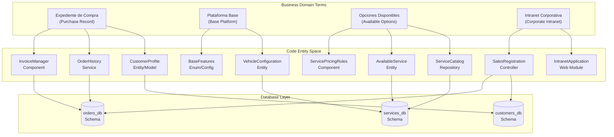
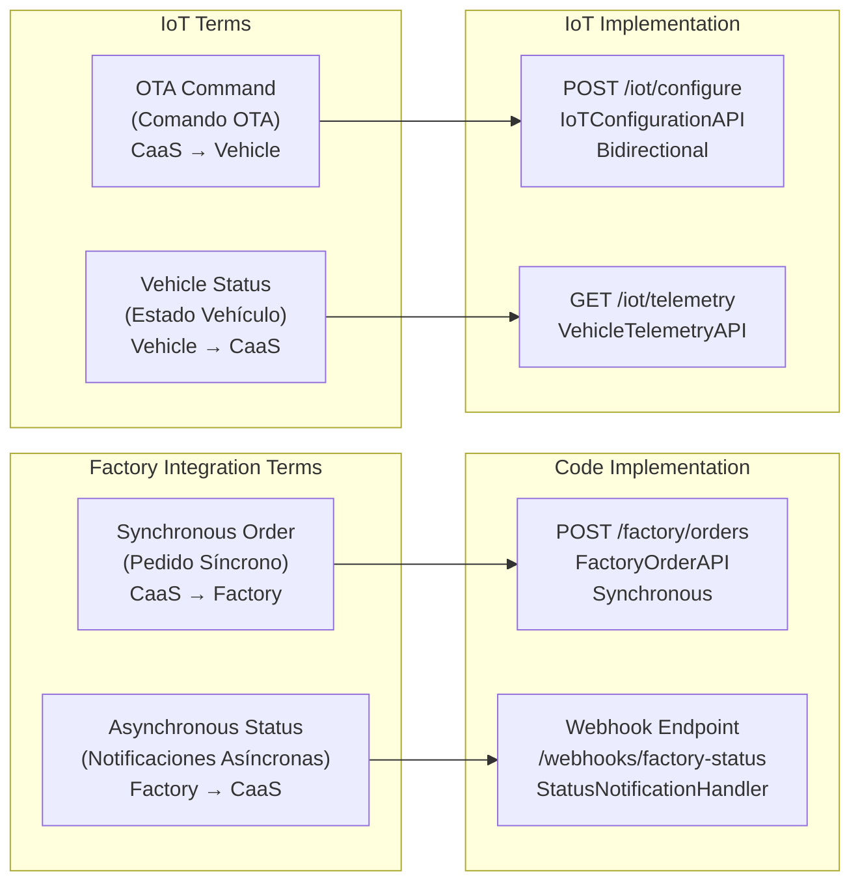
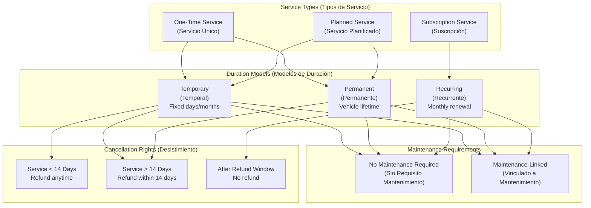

# Key Terminology and Glossary

Relevant source files

The following files were used as context for generating this wiki page:

- [enunciado.md](enunciado.md)
- [pasame las preguntas y sus respuestas a markdown.md](pasame las preguntas y sus respuestas a markdown.md)

## Purpose and Scope

This page provides a comprehensive reference of all key terminology used throughout the CaaS (Car as a Service) system documentation and codebase. It serves as the authoritative source for understanding business domain terms, technical constructs, and Spanish terminology that appears in requirements and system communications.

This glossary is organized into thematic categories for easy navigation. For detailed explanations of business rules governing these concepts, see [Business Rules and Policies](#2.3). For technical implementation details of specific subsystems, refer to the appropriate architecture pages (sections 3-5).

---

## Business Model and Product Terms

These terms define the core business concepts that distinguish the CaaS model from traditional vehicle sales.

| Term | Spanish Equivalent | Definition | Related Pages |
|------|-------------------|------------|---------------|
| **Car as a Service (CaaS)** | Automóvil como Servicio | The business model where customers purchase a base vehicle platform and can dynamically enable/disable optional features through pay-per-use subscriptions | [2](#2), [2.1](#2.1) |
| **Base Platform** | Plataforma Base | The core vehicle configuration that includes all fundamental features required for basic operation. Purchased permanently by the customer | [2.1](#2.1) |
| **Available Options** | Opciones Disponibles | Optional features and services that can be temporarily or permanently activated on vehicles with compatible base platforms (e.g., power boost, autonomous driving, entertainment systems) | [2.1](#2.1), [6.1](#6.1) |
| **Pay-per-Use** | Pago por Uso | Payment model where customers pay only for the duration they use optional services, rather than purchasing them permanently upfront | [2.1](#2.1), [7.1](#7.1) |
| **Commercial Plan** | Plan Comercial | The specific package selected by a customer during vehicle purchase, which may include the base platform plus permanently activated optional services | [8.1](#8.1) |
| **Purchase Record** | Expediente de Compra | Comprehensive customer dossier containing vehicle manuals, maintenance history, invoices, and service records, accessible through web and mobile platforms | [4.3](#4.3) |

**Sources:** [enunciado.md:1-23](), [pasame las preguntas y sus respuestas a markdown.md:1-104]()

---

## Vehicle and Technical Infrastructure Terms

These terms describe the technical components and infrastructure that enable remote vehicle management.

| Term | Spanish Equivalent | Definition | Related Pages |
|------|-------------------|------------|---------------|
| **OTA (Over The Air)** | Configuración OTA | Remote configuration system that enables activation/deactivation of vehicle features without requiring physical workshop visits. All CaaS services are delivered via OTA | [5.3](#5.3), [6.2](#6.2) |
| **IoT Network** | Red de IoT | Network infrastructure connecting all CaaS vehicles to central servers, enabling bidirectional communication for status monitoring and configuration | [5.3](#5.3) |
| **API IoT** | API IoT | Pre-existing, documented API interface for vehicle communication. Handles OTA configuration commands and telemetry status reports | [5.3](#5.3) |
| **VSS (Vehicle Service System)** | Sistema VSS | External system maintained by workshops that tracks maintenance history and compliance percentages by functional vehicle blocks | [5.2](#5.2), [8.3](#8.3) |
| **Firmware** | Firmware | Pre-installed software on vehicles containing all optional features in disabled state. CaaS only activates/deactivates functionality; it does not install new software | [6.2](#6.2) |
| **Telemetry** | Telemetría | Real-time operational status data transmitted from vehicles through the IoT network | [5.3](#5.3) |
| **Connected Vehicle** | Vehículo Conectado | Vehicle equipped with IoT connectivity enabling remote monitoring and OTA configuration | [5.3](#5.3) |

**Sources:** [enunciado.md:7-8, 19](), [pasame las preguntas y sus respuestas a markdown.md:31-57]()

---

## System Components and Actors

### Terminology to Code Entity Mapping

**Sources:** [enunciado.md:3-12](), [pasame las preguntas y sus respuestas a markdown.md:9-16]()

---

## Actor and External Entity Terms

| Term | Spanish Equivalent | Definition | System Boundary |
|------|-------------------|------------|-----------------|
| **Customer** | Cliente | Individual or entity that has purchased a vehicle. Has credentials to access web/mobile platforms | External Actor |
| **Employee** | Empleado | Dealership staff who process sales through the corporate intranet | External Actor |
| **Dealership** | Concesionario | Physical sales location where vehicles are sold and delivered. Handles initial sales registration and final customer pickup | External Actor |
| **Factory** | Fábrica | Manufacturing facility that produces vehicles based on orders received via API. Same company as CaaS | External System |
| **Workshop** | Taller | Official or approved service centers that perform vehicle maintenance and record services in VSS | External Actor |
| **Transport Company** | Empresa de Transporte | Subcontracted logistics provider that delivers vehicles from factory to dealership or customer address | External Actor |
| **Administrative Bodies** | Organismos Administrativos | Government entities responsible for vehicle registration (country-specific) | External System |

**Sources:** [pasame las preguntas y sus respuestas a markdown.md:9-29]()

---

## Payment and Billing Terms

| Term | Spanish Equivalent | Definition | Related Pages |
|------|-------------------|------------|---------------|
| **Reservation Signal** | Señal (de Reserva) | Initial deposit payment that reserves a vehicle for a customer and triggers factory order | [7.1](#7.1), [8.1](#8.1) |
| **Final Payment** | Pago Final | Complete payment for vehicle purchase, required before administrative registration. Failure results in vehicle becoming stock | [7.1](#7.1), [9.2](#9.2) |
| **Service Payment** | Pago de Servicio | One-time payment for temporary or permanent service activation | [7.1](#7.1) |
| **Post-Paid Billing** | Mes Vencido | Subscription billing model where customers are charged at month end for services consumed during that month | [7.1](#7.1) |
| **Subscription** | Suscripción | Recurring service model with automatic renewal and post-paid billing | [6.1](#6.1), [7.1](#7.1) |
| **Settlement Risk** | Riesgo de Liquidación | Financial risk CaaS assumes by delivering services immediately despite asynchronous payment confirmation from gateway | [7.2](#7.2) |
| **Refund** | Reembolso/Devolución | Return of payment to customer, governed by desistimiento rules based on service duration | [6.4](#6.4) |

**Sources:** [pasame las preguntas y sus respuestas a markdown.md:75-96]()

---

## Service Lifecycle and Status Terms

| Term | Spanish Equivalent | Definition | Related Pages |
|------|-------------------|------------|---------------|
| **Service Activation** | Activación de Servicio | OTA process that enables a purchased optional feature on the vehicle | [6.2](#6.2) |
| **Service Duration** | Duración del Servicio | Time period for which a service is active: temporary (X days), permanent (vehicle lifetime), or subscription (recurring monthly) | [6.1](#6.1) |
| **Planned Service** | Servicio Planificado | Service scheduled for future activation at a specified date/time | [6.1](#6.1) |
| **Official Maintenance Status** | Estado Oficial de Mantenimiento | Vehicle's compliance with scheduled maintenance plan, tracked in VSS. Required for certain premium services | [6.3](#6.3), [8.3](#8.3) |
| **Maintenance-Linked Service** | Servicio Vinculado a Mantenimiento | Optional service that can only be activated if the vehicle's maintenance is current (safety/warranty requirement) | [6.3](#6.3) |
| **Service Blocking** | Bloqueo de Servicio | Prevention of new service purchases due to overdue maintenance. Does not affect already-activated services or base platform | [6.3](#6.3), [9.4](#9.4) |
| **Unassigned Vehicle** | Vehículo Sin Asignar | Vehicle manufactured but not yet assigned to any customer (either new stock or returned after failed final payment) | [9.2](#9.2) |
| **Stock Vehicle** | Vehículo en Stock | Vehicle available for immediate sale at dealership | [9.2](#9.2) |

**Sources:** [enunciado.md:3-23](), [pasame las preguntas y sus respuestas a markdown.md:58-73]()

---

## Integration and API Terms

### API Communication Patterns

**Sources:** [pasame las preguntas y sus respuestas a markdown.md:40-44]()

| Term | Spanish Equivalent | Definition | Related Pages |
|------|-------------------|------------|---------------|
| **Factory API** | API de Fábrica | Synchronous API for order placement. Returns immediate confirmation of order acceptance | [5.1](#5.1) |
| **Factory Webhook** | Webhook de Fábrica | Asynchronous callback mechanism where factory pushes manufacturing status updates to CaaS | [5.1](#5.1) |
| **API IoT** | API IoT | Pre-existing, documented API for vehicle communication. Must be used as-is; restrictions apply | [5.3](#5.3), [10.1](#10.1) |
| **OTA Configuration** | Configuración OTA | Remote parameter update sent to vehicle through IoT network to activate/deactivate features | [5.3](#5.3), [6.2](#6.2) |
| **VSS Query** | Consulta VSS | Pull-based API request to retrieve vehicle maintenance records from workshop system | [5.2](#5.2) |
| **Payment Gateway** | Pasarela de Pago | External system for processing card/bank payments with asynchronous settlement | [5.4](#5.4) |
| **Admin API** | API Administrativa | Interface for registering vehicles with government bodies (country-specific implementations) | [5.5](#5.5) |

**Sources:** [pasame las preguntas y sus respuestas a markdown.md:31-44, 100-104]()

---

## Process and Workflow Terms

| Term | Spanish Equivalent | Definition | Related Pages |
|------|-------------------|------------|---------------|
| **Sales Registration** | Registro de Venta | Initial dealership process of capturing customer data and commercial plan through corporate intranet | [8.1](#8.1) |
| **Credential Generation** | Generación de Credenciales | Automatic creation and emailing of customer access credentials for web/mobile platforms after sales registration | [8.1](#8.1) |
| **Factory Order** | Pedido a Fábrica | Automatic order placement triggered by reservation payment | [8.1](#8.1), [5.1](#5.1) |
| **Manufacturing Notification** | Notificación de Fabricación | Asynchronous status update from factory informing CaaS and customer of production progress | [8.2](#8.2), [5.1](#5.1) |
| **Vehicle Registration** | Matriculación | Process of registering vehicle with administrative bodies after final payment, required before delivery | [8.2](#8.2), [5.5](#5.5) |
| **Home Delivery** | Entrega a Domicilio | Transport of vehicle to customer address. Falls back to dealership pickup if customer unavailable | [8.2](#8.2), [9.3](#9.3) |
| **Mobile App Linking** | Vinculación de App | Association of customer's mobile application with their specific vehicle, enabling direct vehicle control | [4.3](#4.3) |
| **OTA Retry Logic** | Lógica de Reintentos OTA | Mechanism that attempts OTA activation multiple times before escalating to technical support | [6.2](#6.2), [9.1](#9.1) |

**Sources:** [enunciado.md:9-19](), [pasame las preguntas y sus respuestas a markdown.md:18-29, 47-56]()

---

## Legal and Compliance Terms

| Term | Spanish Equivalent | Definition | Related Pages |
|------|-------------------|------------|---------------|
| **Right of Withdrawal** | Derecho de Desistimiento | Legal right allowing customers to cancel services within specified timeframes for distance selling | [6.4](#6.4), [2.3](#2.3) |
| **14-Day Withdrawal Period** | Periodo de 14 Días | For services lasting more than 14 days, customers can request refund within first 14 days | [6.4](#6.4) |
| **Anytime Cancellation** | Cancelación en Cualquier Momento | For services lasting less than 14 days, customers can cancel and receive refund at any time | [6.4](#6.4) |
| **Warranty** | Garantía | Vehicle warranty coverage, which can be voided by failure to follow official maintenance schedule | [8.3](#8.3), [9.4](#9.4) |
| **Warranty Loss** | Pérdida de Garantía | Consequence of not maintaining vehicle per official schedule. Does NOT block base platform or existing services | [9.4](#9.4) |
| **Distance Selling Regulations** | Normativa de Venta a Distancia | Legal framework requiring desistimiento rights for services purchased without physical presence | [2.3](#2.3) |

**Sources:** [pasame las preguntas y sus respuestas a markdown.md:84-96]()

---

## Failure Handling and Edge Case Terms

| Term | Spanish Equivalent | Definition | Related Pages |
|------|-------------------|------------|---------------|
| **OTA Activation Failure** | Fallo de Activación OTA | Condition where remote service activation cannot complete successfully after all retry attempts | [9.1](#9.1) |
| **Do Not Charge Rule** | Regla de No Cobrar | Critical business rule: customers must never be charged for services that fail OTA activation | [9.1](#9.1), [2.3](#2.3) |
| **Technical Support Escalation** | Escalada a Soporte Técnico | Process of forwarding failed OTA activations to human technicians after exhausting automatic retries | [9.1](#9.1) |
| **Failed Final Payment** | Fallo de Pago Final | Scenario where customer cannot complete vehicle purchase. Vehicle becomes unassigned stock | [9.2](#9.2) |
| **Failed Service Payment** | Fallo de Pago de Servicio | Payment failure for optional service. Service is not delivered | [9.2](#9.2) |
| **Subscription Payment Failure** | Fallo de Pago de Suscripción | Monthly subscription charge failure. Leads to subscription cancellation | [9.2](#9.2), [6.4](#6.4) |
| **Customer Absence at Delivery** | Ausencia de Cliente en Entrega | Failed home delivery scenario. Vehicle returns to dealership for customer pickup | [9.3](#9.3) |
| **Vehicle Theft** | Robo de Vehículo | Special scenario where customer can cancel pending/future services but cannot refund already-delivered services past desistimiento period | [9.4](#9.4) |

**Sources:** [pasame las preguntas y sus respuestas a markdown.md:47-96]()

---

## Service Type and Duration Taxonomy

The CaaS system supports multiple service acquisition models:

**Sources:** [enunciado.md:3-22](), [pasame las preguntas y sus respuestas a markdown.md:84-90]()

| Term | Definition | Payment Model | Cancellation Rules |
|------|------------|---------------|-------------------|
| **Temporary Service** (Temporal) | Service active for fixed duration (X days/months), then automatically deactivates | Pay upfront for entire duration | Refund if service > 14 days and within 14-day window; otherwise refund anytime if service < 14 days |
| **Permanent Service** (Permanente) | Service remains active for vehicle's entire operational lifetime | Pay once, never expires | Refund within 14 days of activation |
| **Subscription Service** (Suscripción) | Monthly recurring service with automatic renewal | Mes vencido (charged at month end) | Cancel anytime; no refund for consumed periods |
| **Planned/Scheduled Service** (Planificado) | Service purchased now but activated at future date/time | Pay upfront, activation delayed | Refund follows same rules as temporary/permanent based on intended duration |
| **Recurring Service** (Recurrente) | Synonym for subscription service with automatic monthly renewal | Mes vencido | Cancel anytime; no refund for consumed periods |

**Sources:** [enunciado.md:21-22](), [pasame las preguntas y sus respuestas a markdown.md:82-90]()

---

## Vehicle State and Status Terms

| Term | Spanish Equivalent | Definition | Transitions |
|------|-------------------|------------|-------------|
| **Ordered** | Pedido | Vehicle ordered from factory but not yet manufactured | → Manufacturing |
| **Manufacturing** | En Fabricación | Vehicle currently being produced at factory | → Ready |
| **Ready** | Listo/Disponible | Vehicle manufactured and available at dealership location | → Awaiting Final Payment |
| **Awaiting Final Payment** | Esperando Pago Final | Vehicle ready but customer has not completed purchase payment | → Registered OR Unassigned |
| **Registered** | Matriculado | Vehicle paid for and registered with administrative bodies | → In Transit |
| **In Transit** | En Tránsito | Vehicle being transported to customer address | → Delivered OR Returned to Dealership |
| **Delivered** | Entregado | Vehicle successfully delivered to customer and mobile app linked | → Operational |
| **Operational** | Operativo | Vehicle in normal customer use with base platform active | → (stays operational) |
| **Unassigned** | Sin Asignar | Vehicle manufactured but customer failed final payment; available as stock | → Assigned to New Customer |
| **Stock** | En Stock | Vehicle available for immediate sale at dealership | → Reserved by New Customer |

**Sources:** [enunciado.md:13-17](), [pasame las preguntas y sus respuestas a markdown.md:24-28]()

---

## User Access and Authentication Terms

| Term | Spanish Equivalent | Definition | Related Pages |
|------|-------------------|------------|---------------|
| **Access Credentials** | Credenciales de Acceso | Username/password automatically generated and emailed to customer after sales registration | [8.1](#8.1) |
| **Corporate Intranet** | Intranet Corporativa | Internal web platform used by dealership employees to register sales and manage inventory | [3.2](#3.2), [8.1](#8.1) |
| **Customer Web Platform** | Plataforma Web | Public-facing website where customers access their expediente and purchase services | [4.3](#4.3) |
| **Mobile Application** | Aplicación Móvil | Smartphone app for customer access to expediente and direct vehicle communication | [4.3](#4.3) |
| **Authenticated User** | Usuario Autenticado | Any customer or employee with valid credentials. No public/anonymous access allowed | N/A |

**Important Note:** The CaaS system does NOT support:
- Self-registration by users
- Single Sign-On (SSO) with external providers (Google, Microsoft, etc.)
- Anonymous/public access to any functionality

All users must be explicitly registered by dealership staff or system administrators.

**Sources:** [pasame las preguntas y sus respuestas a markdown.md:14-16](), [enunciado.md:9-11]()

---

## Notification and Communication Terms

| Term | Spanish Equivalent | Definition | Related Pages |
|------|-------------------|------------|---------------|
| **Manufacturing Status Notification** | Notificación de Estado de Fabricación | Automatic updates sent to customers throughout vehicle production process | [8.2](#8.2) |
| **Service Activation Notification** | Notificación de Activación | Confirmation sent to customer via email, mobile app, and vehicle display when service successfully activates | [6.2](#6.2) |
| **Vehicle Availability Notification** | Notificación de Disponibilidad | Alert sent when manufactured vehicle arrives at customer's local dealership | [8.2](#8.2) |
| **OTA Failure Notification** | Notificación de Fallo OTA | Message to customer and technical support when service activation fails after all retries | [9.1](#9.1) |
| **Multi-Channel Notification** | Notificación Multicanal | Communication strategy using email, push notifications, and SMS for critical updates | [3.2](#3.2) |

**Sources:** [enunciado.md:13, 19](), [pasame las preguntas y sus respuestas a markdown.md:28-29, 52-53]()

---

## Spanish-English Quick Reference

For international teams, here is a quick lookup table of Spanish business terms and their English equivalents:

| Spanish Term | English Term | Category |
|--------------|--------------|----------|
| Automóvil como Servicio | Car as a Service | Business Model |
| Plataforma Base | Base Platform | Product |
| Opciones Disponibles | Available Options | Product |
| Pago por Uso | Pay-per-Use | Billing |
| Expediente de Compra | Purchase Record | Customer Data |
| Señal | Reservation Signal/Deposit | Payment |
| Concesionario | Dealership | Actor |
| Fábrica | Factory | Actor |
| Taller | Workshop | Actor |
| Mes Vencido | Post-Paid/Month End Billing | Billing |
| Desistimiento | Right of Withdrawal | Legal |
| Sin Asignar | Unassigned | Status |
| Intranet Corporativa | Corporate Intranet | System |
| Configuración OTA | OTA Configuration | Technology |
| Estado Oficial de Mantenimiento | Official Maintenance Status | Process |
| Vinculación de App | Mobile App Linking | Process |
| Matriculación | Vehicle Registration | Process |
| Entrega a Domicilio | Home Delivery | Process |
| Notificación de Fabricación | Manufacturing Notification | Communication |

**Sources:** [enunciado.md:1-23](), [pasame las preguntas y sus respuestas a markdown.md:1-104]()

---

## Abbreviations and Acronyms

| Acronym | Full Term | Definition |
|---------|-----------|------------|
| **CaaS** | Car as a Service | The business model and system name |
| **OTA** | Over The Air | Remote wireless configuration technology |
| **IoT** | Internet of Things | Network infrastructure connecting vehicles |
| **VSS** | Vehicle Service System | External maintenance tracking system |
| **API** | Application Programming Interface | Software integration interface |
| **SSO** | Single Sign-On | Authentication method (NOT supported by CaaS) |
| **TSP** | Telematics Service Provider | Third-party vehicle connectivity provider (NOT used; CaaS uses internal API IoT) |

**Sources:** [enunciado.md:7, 19](), [pasame las preguntas y sus respuestas a markdown.md:31-38]()