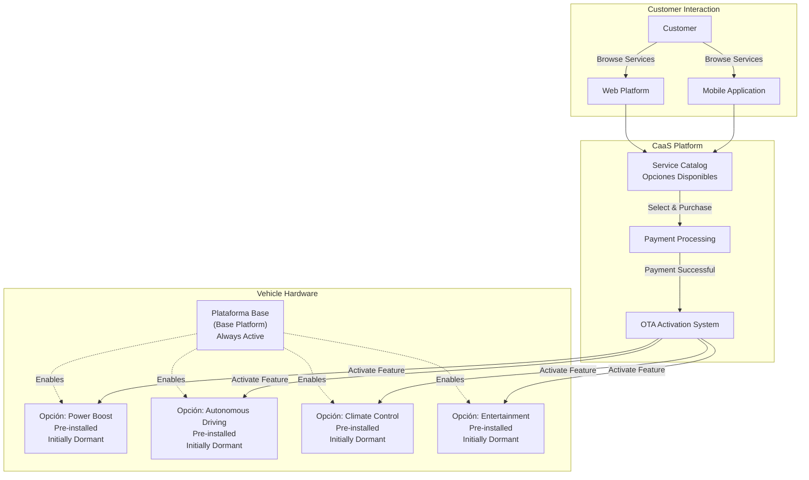
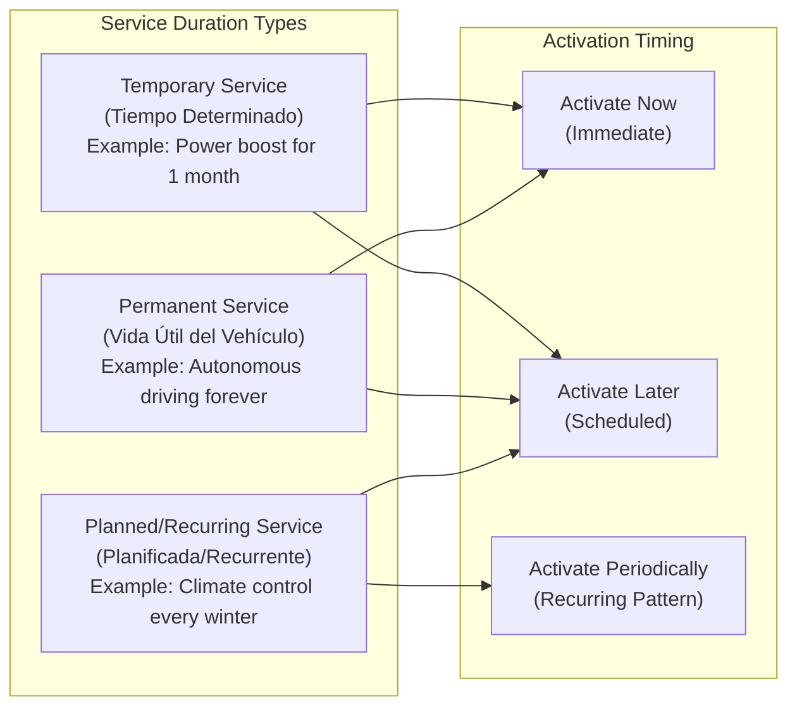
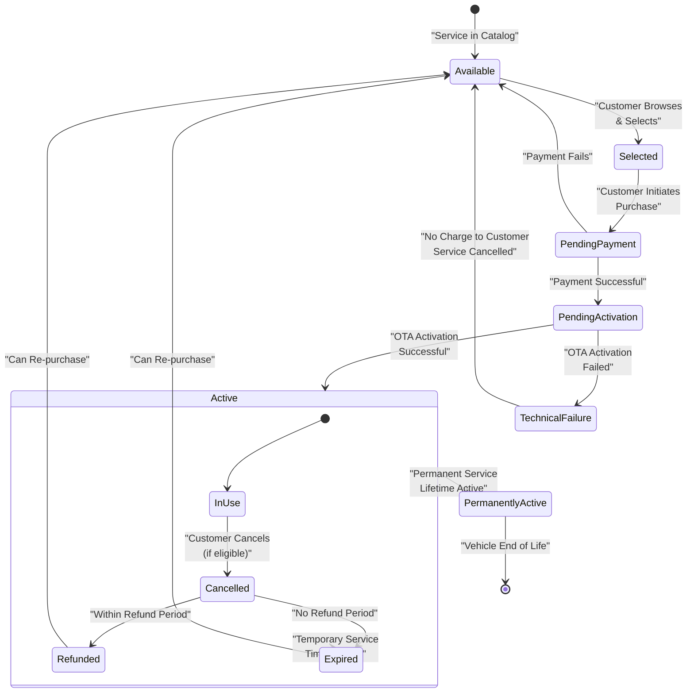
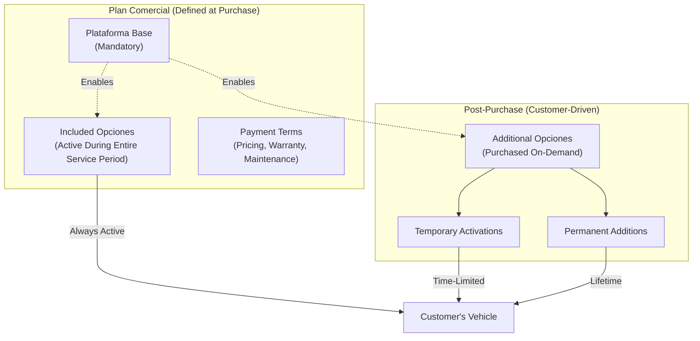
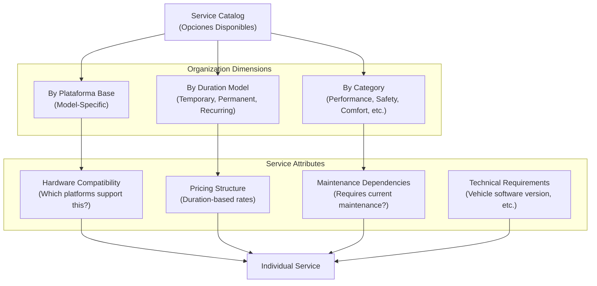
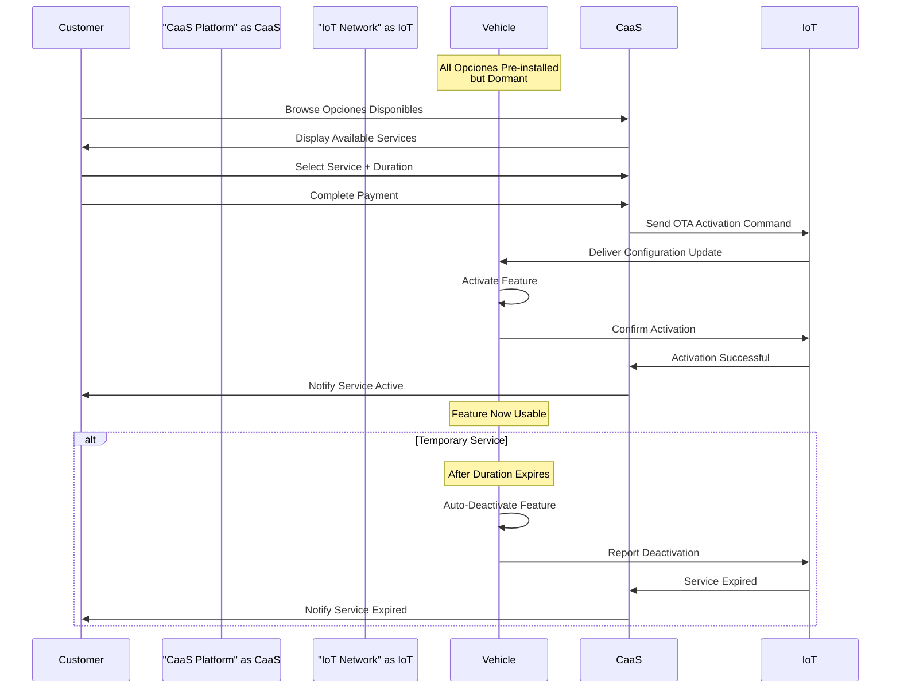

# Platform Base and Optional Services

Relevant source files

The following files were used as context for generating this wiki page:

- [enunciado.md](enunciado.md)

## Purpose and Scope

This page explains the fundamental business concept underlying the Car as a Service (CaaS) system: the separation of vehicle ownership into a **plataforma base** (base platform) that customers purchase outright, and **opciones disponibles** (available options) that can be activated on demand using a **pago por uso** (pay-per-use) model. This architectural decision enables the core value proposition of the CaaS system.

For information about how services are technically activated via OTA, see [OTA Service Activation](#6.2). For pricing details and catalog structure, see [Service Catalog and Pricing](#6.1). For business rules governing service access, see [Business Rules and Policies](#2.3).

**Sources:** [enunciado.md:1-23]()

---

## Core Concepts

### Plataforma Base (Base Platform)

The **plataforma base** represents the base vehicle model that a customer purchases and owns. It includes all fundamental characteristics necessary to make the vehicle **fully operational** from the moment of delivery. This is not a limited or demo version—it is a complete, functional vehicle capable of normal operation.

The base platform serves as:
- The **minimum viable product** that customers acquire in ownership
- The **foundation** upon which optional services can be activated
- A **specific model configuration** (e.g., sedan, SUV, compact) with its own technical specifications

**Key Business Rule:** The base platform is **always included** in any vehicle sale. Customers cannot purchase a vehicle without it, nor can they purchase only optional services without the base platform.

### Opciones Disponibles (Available Options)

**Opciones disponibles** are additional features and capabilities that are **pre-installed in the vehicle hardware** but remain dormant until activated through the CaaS platform. Each base platform has a **specific and predetermined set** of available options that are technically compatible with that model.

Examples of opciones disponibles include:

| Service Category | Example Features |
|------------------|------------------|
| **Performance** | 50% power increase |
| **Autonomous Driving** | Highway autonomous driving capability |
| **Driver Assistance** | Advanced driver assistance systems (ADAS) |
| **Traction & Terrain** | Specific traction modes for different environmental and road surface conditions |
| **Climate Control** | Different types of climate control systems |
| **Entertainment** | On-board entertainment services |

These features are **technologically embedded** in the vehicle but require **software activation** to become usable.

### Pago por Uso (Pay-Per-Use) Model

The **pago por uso** model is the core revenue mechanism for opciones disponibles. Instead of requiring upfront payment for all features at vehicle purchase time, customers:

1. **Purchase the base platform** outright (traditional ownership model)
2. **Activate optional services on demand** as needed (pay-per-use model)
3. **Pay only for the duration they use** each service

This model provides:
- **Lower initial purchase price** (only the base platform)
- **Flexibility** to customize vehicle capabilities based on changing needs
- **Reduced financial risk** for customers uncertain about feature value
- **Recurring revenue stream** for the business

**Sources:** [enunciado.md:3-5]()

---

## Service Delivery Architecture

**Architecture Principle: Pre-Installation + Remote Activation**

All opciones disponibles are **physically present** in the vehicle at delivery time. The vehicle hardware includes sensors, actuators, and computing capabilities for all potential features. However, these features are **software-locked** until activated through the CaaS platform.

This approach provides:
- **Instant activation**: No need for physical installation or dealership visit
- **Reversible changes**: Features can be deactivated if subscription ends
- **Standardized manufacturing**: All vehicles of a given base platform have identical hardware
- **Remote delivery**: Services delivered via OTA configuration updates

**Sources:** [enunciado.md:3-7](), [enunciado.md:19-20]()

---

## Service Duration Models

The CaaS system supports three distinct temporal models for service activation:

### Temporary Services (Tiempo Determinado)

Temporary services are activated for a **specific time period**, after which they automatically deactivate unless renewed.

**Use Cases:**
- Customer needs power boost only during summer vacation road trip
- Customer wants entertainment services for a specific journey
- Customer testing a feature before committing to permanent purchase

**Business Characteristics:**
- **Fixed duration pricing**: Customer pays for specific time period (e.g., 1 day, 1 week, 1 month)
- **Automatic expiration**: System deactivates feature when period ends
- **Renewable**: Customer can extend or re-purchase
- **Pro-rated or fixed**: Pricing can be time-based

### Permanent Services (Vida Útil del Vehículo)

Permanent services remain active **until the end of the vehicle's operational life**.

**Use Cases:**
- Customer decides autonomous driving is essential
- Customer permanently wants advanced climate control
- Customer converts temporary service to permanent after testing

**Business Characteristics:**
- **One-time payment**: Higher upfront cost compared to temporary
- **Lifetime activation**: Never expires or requires renewal
- **Transferable with vehicle**: If vehicle sold, feature remains active
- **Higher revenue per transaction**: Captures lifetime value upfront

### Planned and Recurring Services (Planificada/Recurrente)

Planned services are **scheduled for future activation**, either as one-time events or recurring patterns.

**Use Cases:**
- Customer schedules power boost for upcoming vacation (planned)
- Customer wants entertainment services every weekend (recurring)
- Customer needs winter traction mode every winter season (recurring)

**Business Characteristics:**
- **Future-dated activation**: Service purchased now, activated later
- **Recurring billing**: For recurring patterns, charged periodically
- **Subscription-like**: Similar to subscription model but more flexible
- **Predictable revenue**: Business can forecast recurring service revenue

**Sources:** [enunciado.md:19-21]()

---

## Service Lifecycle State Machine

**Key State Transitions:**

- **Available → Selected**: Customer browses service catalog via web or mobile platform
- **PendingPayment → PendingActivation**: Payment gateway confirms successful transaction
- **PendingActivation → Active**: OTA system successfully delivers configuration to vehicle
- **Active → Expired**: For temporary services, system automatically deactivates after duration
- **Active → Cancelled**: Customer exercises cancellation rights (subject to refund policies)
- **TechnicalFailure → Available**: If OTA fails, customer is **not charged** and service returns to catalog

**Sources:** [enunciado.md:19-20]()

---

## Relationship to Plan Comercial

When a customer purchases a vehicle, they select a **plan comercial** (commercial plan) that defines:

1. **The specific plataforma base** (which model/configuration)
2. **A set of opciones disponibles that will be included** for the entire service period
3. **Pricing and payment terms** for the base vehicle

**Distinction:**
- **Plan Comercial Opciones**: Defined at purchase, included in sale price, remain active throughout vehicle ownership
- **On-Demand Opciones**: Purchased after vehicle delivery using pago por uso model

This distinction is important because:
- **Plan Comercial opciones** do not require payment processing after purchase
- **On-Demand opciones** require payment, OTA activation, and ongoing billing management
- Both types share the same **technical delivery mechanism** (OTA activation)

**Sources:** [enunciado.md:9-10]()

---

## Service Catalog Organization

The service catalog organizes opciones disponibles in a structured hierarchy:

**Key Catalog Attributes:**

| Attribute | Description | Example |
|-----------|-------------|---------|
| **Service ID** | Unique identifier | `PWR_BOOST_50` |
| **Service Name** | Customer-facing name | "50% Power Increase" |
| **Category** | Service classification | Performance, Safety, Comfort, Entertainment |
| **Compatible Platforms** | Which base platforms support this | Platform A, Platform C |
| **Duration Models** | Supported temporal models | Temporary, Permanent |
| **Pricing Tiers** | Price by duration | 1 day: €10, 1 month: €50, Permanent: €500 |
| **Maintenance Dependency** | Requires current maintenance | Yes/No |
| **Technical Dependencies** | Software/hardware requirements | Min. firmware version 2.3 |

**Sources:** [enunciado.md:3](), [enunciado.md:23]()

---

## Interaction with Vehicle Connectivity

All vehicles sold through the CaaS system are **connected via IoT network**, enabling:

1. **Service activation delivery**: OTA commands sent to vehicle
2. **Vehicle status monitoring**: Real-time operational state
3. **Remote configuration management**: Feature enable/disable
4. **Telemetry collection**: Usage data for billing and analytics

The **IoT connectivity** is not optional—it is a **fundamental requirement** for the CaaS business model to function. Vehicles without connectivity cannot receive OTA activations and therefore cannot use on-demand opciones disponibles.

**Sources:** [enunciado.md:7](), [enunciado.md:19-20]()

---

## Business Value Proposition

### For Customers

| Benefit | Description |
|---------|-------------|
| **Lower Initial Cost** | Purchase only base platform, not all features upfront |
| **Flexibility** | Activate features only when needed (vacation, weather, special trips) |
| **Try Before Buying** | Test temporary activation before permanent purchase |
| **No Obsolescence** | New features can be added via OTA without hardware upgrades |
| **Maintenance of Value** | Permanent features add resale value to vehicle |

### For Business

| Benefit | Description |
|---------|-------------|
| **Recurring Revenue** | Ongoing service payments beyond initial vehicle sale |
| **Customer Engagement** | Continuous relationship after purchase |
| **Upselling Opportunities** | Convert temporary users to permanent purchasers |
| **Data Collection** | Usage patterns inform product development |
| **Standardized Manufacturing** | All vehicles have same hardware, reducing complexity |
| **Reduced Inventory Risk** | Don't need to predict which features customers want at purchase time |

**Sources:** [enunciado.md:1-7]()

---

## Summary

The **Platform Base and Optional Services** model represents the architectural foundation of the CaaS business:

- **Plataforma Base**: Fully functional vehicle purchased outright
- **Opciones Disponibles**: Pre-installed features activated on demand
- **Pago por Uso**: Pay-per-use model for optional services
- **Three Duration Models**: Temporary, permanent, planned/recurring
- **OTA Delivery**: Remote activation via IoT network
- **Flexible Service Catalog**: Organized by platform, category, and duration

This separation of ownership (base platform) from usage rights (opciones disponibles) enables the core value proposition: customers can **customize their vehicle capabilities dynamically** based on changing needs, while the business generates **recurring revenue** beyond the initial sale.

For technical implementation details of the service catalog, see [Service Catalog and Pricing](#6.1). For OTA activation mechanics, see [OTA Service Activation](#6.2). For business rules governing service access, see [Business Rules and Policies](#2.3).

**Sources:** [enunciado.md:1-23]()