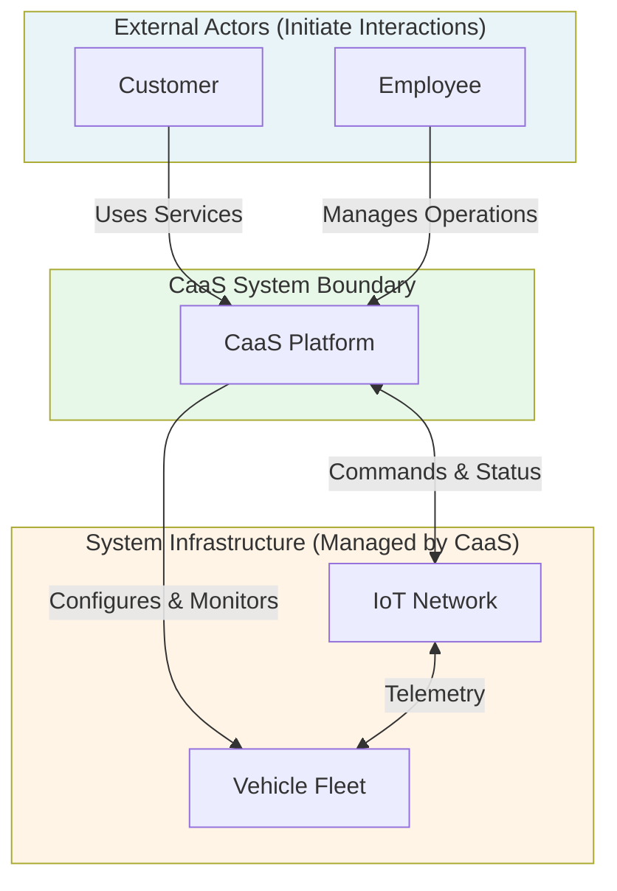
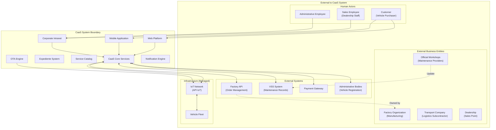
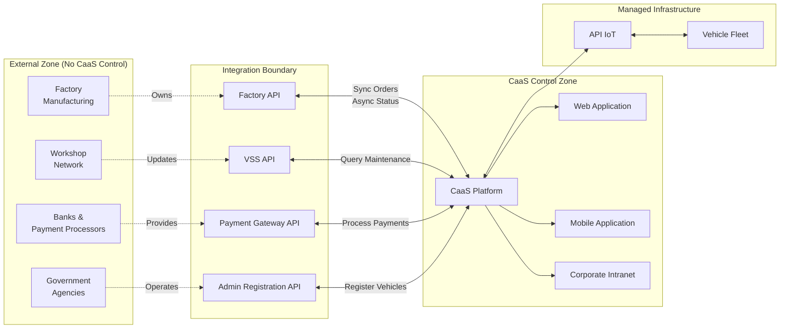

# Key Actors and System Boundaries

Relevant source files

The following files were used as context for generating this wiki page:

- [pasame las preguntas y sus respuestas a markdown.md](pasame las preguntas y sus respuestas a markdown.md)

## Purpose and Scope

This document defines the external actors that interact with the Car as a Service (CaaS) system and establishes clear boundaries between what is inside the CaaS system and what is external to it. Understanding these boundaries is critical for:

- Identifying who initiates interactions with the system
- Defining integration points with external systems
- Establishing ownership and responsibility boundaries
- Distinguishing between actors (external entities) and system components (internal infrastructure)

For information about how actors engage with specific business processes, see [Customer Journey](#4). For details on integration with external systems, see [External System Integrations](#5).

**Sources:** [pasame las preguntas y sus respuestas a markdown.md:10-16]()

## Actor vs. Component: Critical Distinction

A fundamental architectural principle establishes the difference between actors and system components:

**Actor Definition:** An actor is always external to the CaaS system - an entity that receives services from or provides data to the system. Actors initiate interactions but are not part of the system implementation.

**Component Definition:** Components are internal parts of the CaaS system that collaborate to deliver functionality. They are owned, controlled, and maintained by the CaaS platform.

### Critical Clarification: Vehicles are NOT Actors

Vehicles are **infrastructure components**, not actors. While vehicles receive configurations and report status, they do not initiate business transactions. Vehicles are part of the technical infrastructure that CaaS manages, similar to databases or message queues.

**Diagram: Actor vs. Infrastructure Distinction**

**Sources:** [pasame las preguntas y sus respuestas a markdown.md:13-14]()

## System Boundary Definition

**Diagram: Complete System Boundary and Context**

**Sources:** [pasame las preguntas y sus respuestas a markdown.md:10-16, 20-21, 34-35, 61-64]()

## Actor Classification

| Actor Type | Actor Name | Role | Initiates Interactions | Known/Controlled User |
|------------|-----------|------|----------------------|---------------------|
| **Primary Actor** | Customer | Purchases vehicles and services | Yes - via Web/Mobile | Yes - after purchase |
| **Primary Actor** | Sales Employee | Registers sales in intranet | Yes - via Intranet | Yes - employee account |
| **Primary Actor** | Administrative Employee | Manages operations and configurations | Yes - via Intranet | Yes - employee account |
| **External System** | Factory API | Provides manufacturing status | Yes - async notifications | N/A - system integration |
| **External System** | VSS System | Stores maintenance records | No - queried by CaaS | N/A - system integration |
| **External System** | Payment Gateway | Processes payments | Yes - async settlement | N/A - system integration |
| **External System** | Admin Bodies | Vehicle registration services | No - invoked by CaaS | N/A - system integration |
| **External Entity** | Factory Organization | Manufactures vehicles | No - responds to orders | N/A - business entity |
| **External Entity** | Transport Company | Delivers vehicles | No - receives instructions | N/A - subcontractor |
| **External Entity** | Official Workshops | Performs maintenance | No - updates VSS | N/A - service provider |
| **External Entity** | Dealership | Physical sales location | No - receives vehicles | N/A - business location |
| **Infrastructure** | IoT Network (API IoT) | Vehicle communication layer | No - receives commands | N/A - technical infrastructure |
| **Infrastructure** | Vehicle Fleet | Connected vehicles | No - receives configurations | N/A - technical infrastructure |

**Sources:** [pasame las preguntas y sus respuestas a markdown.md:10-16, 20-21, 34-35, 61-64, 72-73]()

## Primary Actors: Human Users

### Customer (Cliente)

**Definition:** A person who has purchased a vehicle from the dealership and has been registered in the CaaS system.

**Access Channels:**
- Web Platform (browser-based access)
- Mobile Application (linked to vehicle)

**Key Characteristics:**
- Must be a known, controlled user (no self-registration)
- Created during sales process by dealership employee
- Receives credentials via email after registration
- Can only access their own expediente and purchase history

**Initiated Interactions:**
- Browse and purchase optional services
- Manage active subscriptions
- Request service cancellations (desistimiento)
- View expediente de compra (purchase records)
- Link mobile application to vehicle

**Not a Customer:** Dealership visitors who have not completed a purchase are not yet actors in the system until a sale is registered and credentials are issued.

**Sources:** [pasame las preguntas y sus respuestas a markdown.md:15-16]()

### Sales Employee (Empleado de Ventas)

**Definition:** Dealership staff member responsible for registering vehicle sales in the corporate intranet.

**Access Channel:**
- Corporate Intranet (internal system)

**Key Characteristics:**
- Employee account with specific permissions
- Works at physical dealership location
- Initiates customer onboarding process

**Initiated Interactions:**
- Register new vehicle sale
- Create customer account and credentials
- Associate customer with vehicle and plan comercial
- Trigger factory order via system
- Manage customer data updates

**Sources:** [pasame las preguntas y sus respuestas a markdown.md:15-16]()

### Administrative Employee (Empleado Administrativo)

**Definition:** Staff member responsible for operational management, configuration, and system administration.

**Access Channel:**
- Corporate Intranet (internal system)

**Key Characteristics:**
- Higher privilege employee account
- Manages system configuration and operational data

**Initiated Interactions:**
- Configure service catalog (opciones disponibles)
- Manage pricing and business rules
- Handle escalated support cases
- Oversee failed OTA activations
- Manage inventory (vehicles sin asignar)

**Sources:** [pasame las preguntas y sus respuestas a markdown.md:15-16]()

## External Systems

### Factory API (API de Fábrica)

**Relationship:** The factory and CaaS are the **same company** but represent different systems with a formal integration boundary.

**Communication Patterns:**
- **CaaS → Factory (Synchronous):** Order management initiated by CaaS
- **Factory → CaaS (Asynchronous):** Manufacturing status notifications via webhooks

**Boundary Rationale:** While organizationally part of the same company, the factory operates independent systems with established APIs. CaaS integrates with these existing factory systems rather than replacing them.

**Sources:** [pasame las preguntas y sus respuestas a markdown.md:34-44]()

### VSS System (Vehicle Service System)

**Ownership:** External system maintained by workshop network (official and approved workshops).

**Purpose:** Tracks maintenance history and compliance status for all vehicles.

**Integration Pattern:**
- **Query-based:** CaaS queries VSS for maintenance status when needed
- **No direct vehicle reporting:** Vehicles do NOT report maintenance status via IoT
- **Workshop updates:** Workshops record service completion in VSS

**Why External:** Workshops are independent service providers (not owned by CaaS), and VSS serves as a neutral maintenance record system.

**Sources:** [pasame las preguntas y sus respuestas a markdown.md:61-73]()

### Payment Gateway (Pasarela de Pago)

**Ownership:** External third-party payment processor.

**Integration Pattern:**
- CaaS initiates payment requests
- Gateway processes card/bank transactions asynchronously
- CaaS assumes settlement risk (delivers services before confirmation)

**Why External:** Payment processing requires specialized financial infrastructure, regulatory compliance, and banking relationships that are outsourced to specialized providers.

**Sources:** [pasame las preguntas y sus respuestas a markdown.md:77-82]()

### Administrative Bodies (Organismos Administrativos)

**Ownership:** Government agencies responsible for vehicle registration.

**Integration Pattern:**
- CaaS invokes registration API after final payment
- Synchronous registration process (blocking operation)
- Country-specific implementations

**Why External:** Government systems are by definition external to private enterprise systems.

**Sources:** [pasame las preguntas y sus respuestas a markdown.md:100-104]()

## External Business Entities

### Factory Organization (Organización de Fábrica)

**Role:** Manufacturing facility that produces vehicles based on orders.

**Interaction Model:**
- Receives orders via Factory API
- Determines delivery dates based on production schedule
- Ships completed vehicles to transport company

**Boundary Note:** While the factory is part of the same company, the manufacturing organization operates independently with its own systems and processes.

**Sources:** [pasame las preguntas y sus respuestas a markdown.md:20-29, 34-35]()

### Transport Company (Empresa de Transporte)

**Role:** Subcontracted logistics provider for vehicle delivery.

**Interaction Model:**
- Receives vehicles from factory
- Delivers to dealership or customer address
- No direct system integration with CaaS
- CaaS tracks shipment start (factory) and end (dealership/customer)

**Why Subcontracted:** Logistics is not a core competency; specialized transport companies handle vehicle shipping.

**Sources:** [pasame las preguntas y sus respuestas a markdown.md:20-25]()

### Official Workshops (Talleres Oficiales/Homologados)

**Role:** Authorized service providers for vehicle maintenance.

**Interaction Model:**
- Customers schedule maintenance independently
- Workshops record service completion in VSS system
- No direct integration with CaaS platform
- CaaS queries VSS to verify maintenance compliance

**Why External:** Workshops are independent businesses providing standardized services across the manufacturer's vehicle network.

**Sources:** [pasame las preguntas y sus respuestas a markdown.md:61-64]()

### Dealership (Concesionario)

**Role:** Physical sales location where customers purchase vehicles.

**Interaction Model:**
- Employees at dealership use CaaS Intranet to register sales
- Receives vehicles from transport company
- Serves as pickup location for failed home deliveries
- Manages inventory of vehicles "sin asignar" (unassigned stock)

**Boundary Note:** The dealership is a physical location/organization, while the Corporate Intranet is the CaaS system component that dealership employees use.

**Sources:** [pasame las preguntas y sus respuestas a markdown.md:20-27]()

## Infrastructure Components (Not Actors)

### IoT Network and API IoT

**Nature:** Technical infrastructure layer for vehicle communication.

**Characteristics:**
- Pre-existing, documented, tested API
- Enables bidirectional vehicle communication
- Handles OTA configuration commands
- Reports vehicle telemetry and status

**Why Not an Actor:** The IoT network is passive infrastructure that receives commands from CaaS and relays them to vehicles. It does not initiate business transactions.

**Sources:** [pasame las preguntas y sus respuestas a markdown.md:31-56]()

### Vehicle Fleet

**Nature:** Connected vehicles with pre-installed functionality.

**Characteristics:**
- Receives configurations remotely via IoT network
- Reports status and telemetry
- All functionality pre-installed; CaaS only activates/deactivates features
- Cannot be blocked from operation (legal/safety requirement)

**Why Not an Actor:** Vehicles are passive recipients of configuration. They do not make decisions or initiate business processes. A vehicle does not "request" a service activation - the customer requests it, and the vehicle is configured accordingly.

**Sources:** [pasame las preguntas y sus respuestas a markdown.md:13-14, 47-56, 66-70]()

## User Authentication and Access Control

### No Self-Registration or External Authentication

The CaaS system enforces strict user control:

**Prohibited:**
- Self-registration by unknown users
- External authentication providers (Google, Microsoft, etc.)
- Public access to any system component

**Required:**
- All customers must be registered by dealership employees
- All users must be known and controlled entities
- Credentials issued after vehicle purchase registration

**Rationale:** CaaS is not a public system. It serves specific customers who have purchased vehicles and employees who manage operations. This ensures proper access control, billing relationships, and legal compliance.

**Sources:** [pasame las preguntas y sus respuestas a markdown.md:15-16]()

## System Boundary Enforcement

**Diagram: System Boundary Enforcement and Control Zones**

The integration boundary is critical: CaaS owns and controls everything within the CaaS Control Zone and Managed Infrastructure. External systems expose APIs but are maintained by external organizations. The integration zone represents the formal contracts/interfaces between CaaS and external systems.

**Sources:** [pasame las preguntas y sus respuestas a markdown.md:10-104]()

## Summary: What is Inside vs. Outside CaaS

### Inside CaaS System (Owned and Controlled)

| Component Category | Components |
|-------------------|------------|
| **Customer-Facing Applications** | Web Platform, Mobile Application |
| **Internal Applications** | Corporate Intranet (for employees) |
| **Core Business Logic** | Order Management, Service Catalog, Payment Processing, OTA Engine, Notification Engine |
| **Data Stores** | Customer Database, Order Database, Service Database, Billing Database |
| **Expediente System** | Purchase records, manuals, history, invoices |
| **Managed Infrastructure** | API IoT interface, Vehicle fleet configuration |

### Outside CaaS System (External Actors and Systems)

| Entity Category | Entities |
|-----------------|----------|
| **Human Actors** | Customers, Sales Employees, Administrative Employees |
| **External Systems** | Factory API, VSS System, Payment Gateway, Administrative Bodies |
| **Business Entities** | Factory Organization, Transport Company, Official Workshops, Dealerships |
| **Infrastructure** | IoT Network (managed but not owned), Vehicle electronics (configuration targets) |

**Sources:** All sources from [pasame las preguntas y sus respuestas a markdown.md:1-104]()