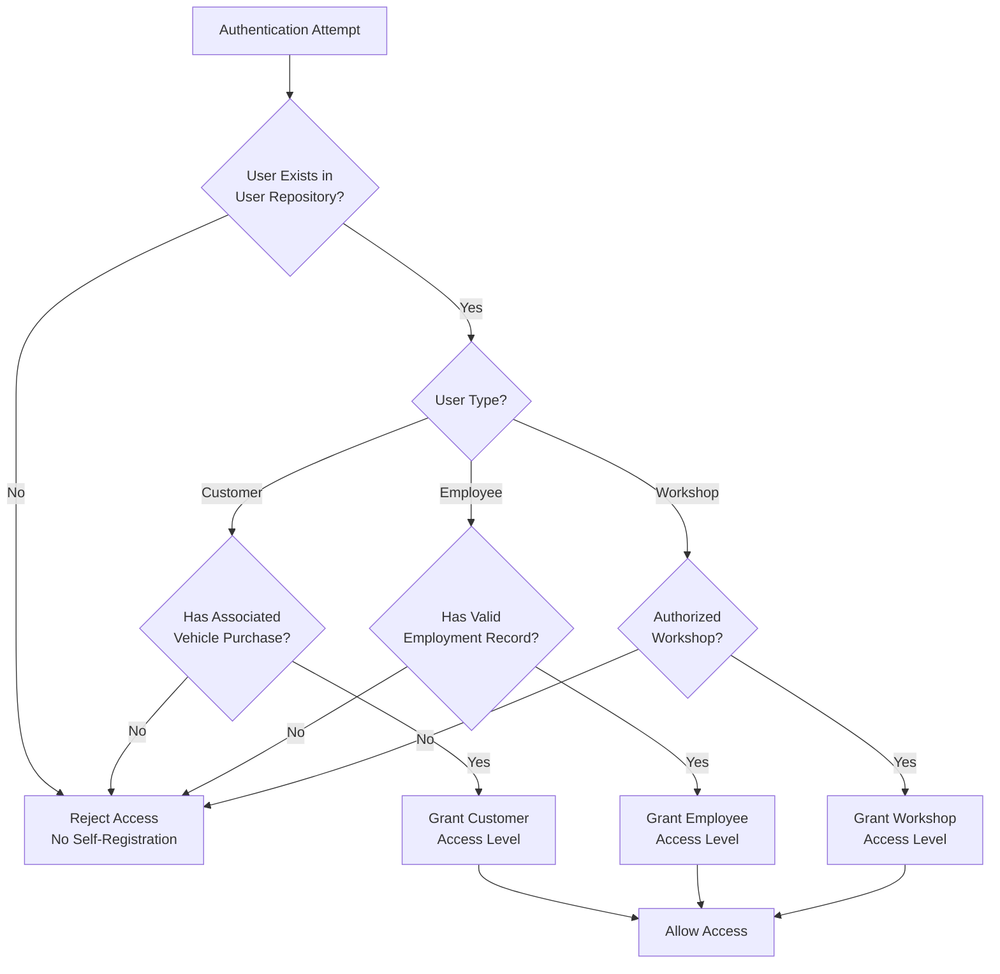
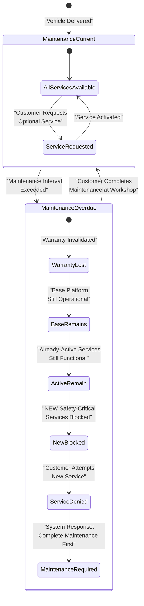
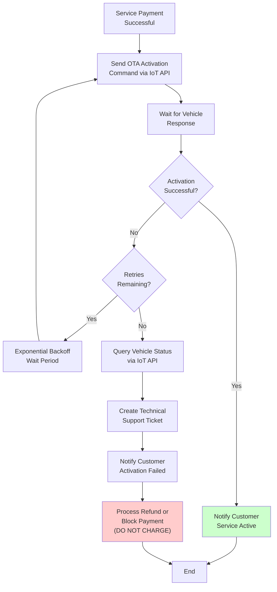
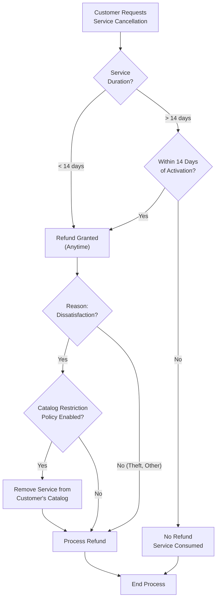
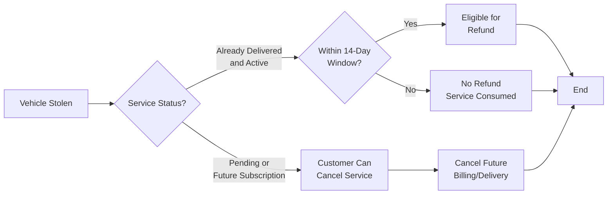

# Business Rules and Policies

<details>
<summary>Relevant source files</summary>

The following files were used as context for generating this wiki page:

- [pasame las preguntas y sus respuestas a markdown.md](pasame las preguntas y sus respuestas a markdown.md)

</details>


## Purpose and Scope

This document catalogs the critical business rules, policies, and constraints that govern the CaaS platform's behavior. These rules define how the system manages user access, processes payments, enforces warranty conditions, handles service activations, and ensures legal compliance.

This page focuses on the **policies and rules themselves**—the "what" and "why" of system behavior. For implementation details of how these rules are applied in specific workflows, see:
- [Platform Base and Optional Services](#2.1) - Service model details
- [Key Actors and System Boundaries](#2.2) - Who can and cannot access the system
- [Service Cancellation and Refunds](#6.4) - Detailed refund processing workflows
- [Payment Types and Flows](#7.1) - Payment implementation details
- [OTA Activation Failures](#9.1) - Technical failure handling procedures

---

## User Access and Authentication Rules

### User Registration Policy

**Rule UAR-001: No Public Registration**

The CaaS platform is a **closed system** with no public registration or self-service account creation. All users must be explicitly provisioned through controlled processes.

**Allowed User Types:**
- **Customers** who have purchased a vehicle through an authorized dealership
- **Employees** of the dealership or CaaS organization
- **Workshop personnel** (for maintenance-related integrations)

**Prohibited:**
- Social login providers (Google, Microsoft, Facebook, etc.)
- Single Sign-On (SSO) with external identity providers
- Self-registration portals or public signup forms
- Anonymous guest access

**Rationale:** Security, regulatory compliance, and business model requirements mandate that all system users be known, verified, and traceable to a vehicle purchase or employment relationship.

**Enforcement Point:** User authentication systems must validate against internal user repositories only. Any authentication request must resolve to a pre-existing, provisioned account.



**Diagram: User Authentication Decision Flow**

**Sources:** [pasame las preguntas y sus respuestas a markdown.md:15-16]()

---

## Payment and Financial Policies

### Vehicle Purchase Payment Rules

**Rule PAY-001: Two-Stage Vehicle Payment**

Vehicle purchases require two separate payments:

1. **Reservation Signal (Señal de Reserva)**: Initial deposit to reserve the vehicle and initiate manufacturing
2. **Final Payment**: Remaining balance paid before vehicle registration and delivery

| Payment Stage | Timing | Purpose | Failure Consequence |
|--------------|--------|---------|---------------------|
| Reservation Signal | At sale registration | Reserve vehicle, trigger factory order | No vehicle manufacturing |
| Final Payment | Before registration | Complete purchase | Vehicle becomes stock, customer loses reservation |

**Rule PAY-002: Final Payment Failure Handling**

If the customer cannot complete final payment when the vehicle is ready:
- Vehicle is marked as **"sin asignar"** (unassigned) in the system
- Vehicle immediately becomes **stock for immediate sale** to other customers
- Original customer **loses the reservation entirely**
- Reservation signal is **not refunded** (standard business practice)

**Sources:** [pasame las preguntas y sus respuestas a markdown.md:26-27, 80]()

### Service Payment and Risk Assumption

**Rule PAY-003: Immediate Service Delivery with Async Settlement**

For optional service payments, CaaS employs a **customer-favorable risk model**:

- **Service is delivered immediately** upon payment initiation
- **Bank settlement is asynchronous** and may take time to confirm
- **CaaS assumes the settlement risk** rather than delaying service activation
- If payment ultimately fails to settle, CaaS absorbs the financial loss

**Rationale:** Optimize customer experience and competitive positioning by eliminating wait times for service activation.

**Rule PAY-004: Subscription Billing (Mes Vencido)**

Subscription services use a **post-paid billing model**:
- Customer uses the service throughout the month
- **Charge occurs at month end** for services actually consumed
- Known as **"mes vencido"** (expired month) billing
- If payment fails, subscription is cancelled (see [Service Cancellation and Refunds](#6.4))

**Sources:** [pasame las preguntas y sus respuestas a markdown.md:81-82]()

### Critical Rule: No Charge for Undelivered Services

**Rule PAY-005: DO NOT CHARGE for OTA Failures**

If a service cannot be successfully activated via OTA:
- The customer must **NEVER be charged** for the service
- This rule applies even if payment has been initiated
- Refund must be processed if charge has already occurred
- Customer must be notified of the failure and no-charge status

This is the most critical customer protection rule in the system and must be enforced absolutely.

**Sources:** [pasame las preguntas y suas respuestas a markdown.md:53]()

---

## Warranty and Maintenance Rules

### Maintenance Responsibility and Tracking

**Rule MAINT-001: Customer-Controlled Maintenance Schedule**

- Customers **decide when to perform maintenance**—the system cannot force or mandate it
- Maintenance is performed at **official workshops** or **approved multi-brand workshops**
- Maintenance records are tracked in the **VSS (Vehicle Service System)**
- VSS maintains maintenance history and compliance percentage by functional block

**Rule MAINT-002: Maintenance Status Query Model**

The vehicle **does NOT report maintenance status** via IoT telemetry. Instead:
- CaaS must **query the VSS system** to determine maintenance status
- VSS is the authoritative source for all maintenance records
- Workshops update VSS when service is performed

**Sources:** [pasame las preguntas y sus respuestas a markdown.md:61-64, 72-73]()

### Warranty Loss and Service Restrictions

**Rule MAINT-003: Warranty Loss Due to Missed Maintenance**

If required maintenance is not performed on schedule:
- The customer **loses warranty coverage** for affected systems
- The base vehicle remains operational (cannot be blocked from driving)

**Rule MAINT-004: Maintenance-Gated Service Activation**

For safety-critical optional services that depend on specific maintenance:
- The system **may block NEW service activation** if required maintenance is overdue
- Already-paid and active services **cannot be deactivated** due to maintenance issues
- The **plataforma base is never blocked** regardless of maintenance status
- This rule applies only to services where missing maintenance creates a safety risk

**Rule MAINT-005: Vehicle Cannot Be Immobilized**

The system **must never block a vehicle from driving** due to maintenance issues or payment problems:
- Only law enforcement can immobilize vehicles
- CaaS can only restrict access to **new optional services**
- Base vehicle functionality must always remain available



**Diagram: Maintenance Status State Machine**

**Sources:** [pasame las preguntas y sus respuestas a markdown.md:66-70]()

---

## Service Activation and OTA Policies

### OTA Service Delivery Model

**Rule OTA-001: All CaaS Services Are OTA-Activated**

- All optional services sold by CaaS are activated **exclusively via OTA** (Over The Air)
- **No workshop visit is ever required** to activate a CaaS service
- All service functionality is **pre-installed in vehicle firmware**
- CaaS only performs **activation or deactivation** of existing capabilities

**Rule OTA-002: Pre-Installed Functionality Model**

The vehicle ships with all optional service capabilities already installed in firmware:
- Services are **disabled by default**
- Payment triggers an **activation command** via the IoT API
- No software updates or downloads are required for service activation
- Firmware updates are a **separate process** independent of CaaS service sales

**Sources:** [pasame las preguntas y sus respuestas a markdown.md:46-47, 55-56]()

### OTA Failure Handling Protocol

**Rule OTA-003: Retry and Escalation for Failed Activations**

When OTA activation fails, the system must follow this protocol:

1. **Retry N times** with exponential backoff or configurable intervals
2. **Query vehicle status proactively** to understand failure cause
3. **Escalate to technical support** with diagnostic information
4. **Notify customer** of the failure and resolution timeline
5. **DO NOT CHARGE** the customer (see PAY-005)



**Diagram: OTA Activation Failure Handling Flowchart**

**Sources:** [pasame las preguntas y sus respuestas a markdown.md:48-53]()

### Maintenance-Gated Service Eligibility

**Rule OTA-004: Safety-Critical Services Require Current Maintenance**

Before activating certain optional services, the system must:

1. **Query VSS** to determine maintenance status for relevant vehicle systems
2. **Block activation** if required maintenance is overdue
3. **Inform customer** that maintenance must be completed before service can be purchased
4. **Allow normal purchase flow** once maintenance is current

This rule applies only to services with safety implications (e.g., performance enhancements, advanced driver assistance features).

**Sources:** [pasame las preguntas y sus respuestas a markdown.md:69-70]()

---

## Cancellation and Refund Policies (Desistimiento)

### Legal Framework: Distance Selling Law

**Rule REFUND-001: Right of Withdrawal (Desistimiento)**

CaaS must comply with **distance selling regulations** that grant customers the right to cancel purchases and receive refunds. The specific rules depend on **service duration**:

| Service Duration | Cancellation Window | Refund Eligibility |
|-----------------|---------------------|-------------------|
| **> 14 days** | First 14 days from activation | Full refund if cancelled within window |
| **< 14 days** | Anytime during service period | Full refund available anytime |
| **After window expires** | No legal right to refund | Service considered consumed |

**Rule REFUND-002: Service Cancellation After Window**

If a customer requests cancellation after the desistimiento window:
- **No refund is provided**
- Service is considered **consumed**
- This applies even in special circumstances like vehicle theft (unless within the 14-day window)

**Rule REFUND-003: Configurable Catalog Restrictions**

As a configurable business policy:
- If a customer cancels a service due to **dissatisfaction** (not theft or other circumstances)
- That service **may be removed from the customer's catalog**
- Customer cannot repurchase the same service
- Prevents abuse of the refund system

**Sources:** [pasame las preguntas y sus respuestas a markdown.md:85-89]()

### Refund Processing Rules



**Diagram: Refund Eligibility Decision Tree**

**Sources:** [pasame las preguntas y sus respuestas a markdown.md:85-96]()

---

## Delivery and Transport Rules

### Home Delivery Protocol

**Rule DELIVERY-001: Customer Availability Requirement**

For home delivery of vehicles:
- Transport company must **contact customer** to confirm availability
- If customer is **not present** at the scheduled time:
  - Vehicle is **returned to dealership**
  - Customer must **pick up at dealership**
- Vehicle is **never left unattended** on the street or in unsecured locations

**Rationale:** Security and liability concerns require direct handoff to the customer.

**Rule DELIVERY-002: Dealership as Fallback Location**

The dealership serves as the default fallback for all delivery issues:
- Customer absence during home delivery
- Customer request for dealership pickup
- Any other delivery complications

**Sources:** [pasame las preguntas y sus respuestas a markdown.md:24-25]()

---

## Vehicle Theft and Loss Scenarios

### Theft Impact on Services

**Rule THEFT-001: No Automatic Refunds for Delivered Services**

If a customer's vehicle is stolen:
- There is **no direct relationship** between theft and service refunds
- **Already delivered services** are subject to normal desistimiento rules:
  - If within 14-day window → Refund available
  - If past 14-day window → No refund (service was consumed)
- Theft does not trigger special refund processing

**Rule THEFT-002: Pending Services Can Be Cancelled**

For services that have been paid but not yet delivered (or subscriptions with future billing):
- Customer **can cancel** these services
- Customer **can cancel automatic renewal** of subscriptions
- This prevents billing for services on a vehicle the customer no longer possesses

**Rule THEFT-003: Theft Does Not Extend Refund Windows**

Vehicle theft does not extend or reset the 14-day desistimiento period for already-active services.



**Diagram: Vehicle Theft Service Impact**

**Sources:** [pasame las preguntas y sus respuestas a markdown.md:92-96]()

---

## Notification Requirements

### Automatic Notification Policy

**Rule NOTIFY-001: Manufacturing Status Notifications**

The system must provide **automatic notifications** about vehicle manufacturing status to customers:
- Manufacturing started
- Manufacturing milestones reached
- Vehicle ready for delivery
- Delivery scheduled

These notifications are part of the **value proposition** and differentiate CaaS from traditional vehicle sales.

**Rule NOTIFY-002: Service Activation Notifications**

Customers must be notified about:
- Successful service activation
- Failed service activation (with explanation and next steps)
- Refund processing status

**Rule NOTIFY-003: Payment and Financial Notifications**

Customers must receive notifications for:
- Payment confirmations
- Payment failures
- Subscription billing (monthly)
- Refund processing

**Sources:** [pasame las preguntas y sus respuestas a markdown.md:28-29]()

---

## Business Rules Summary Table

| Rule ID | Category | Rule Summary | Critical? |
|---------|----------|--------------|-----------|
| UAR-001 | Authentication | No public registration or SSO | Yes |
| PAY-001 | Payment | Two-stage vehicle payment (reservation + final) | Yes |
| PAY-002 | Payment | Final payment failure → vehicle becomes stock | Yes |
| PAY-003 | Payment | Immediate service delivery with async settlement | Yes |
| PAY-004 | Payment | Subscriptions billed mes vencido (post-paid) | Yes |
| PAY-005 | Payment | DO NOT CHARGE for failed OTA activations | **CRITICAL** |
| MAINT-001 | Maintenance | Customer controls maintenance schedule | Yes |
| MAINT-002 | Maintenance | Query VSS for maintenance status (not IoT) | Yes |
| MAINT-003 | Warranty | Missed maintenance → warranty loss | Yes |
| MAINT-004 | Maintenance | Block NEW service activation if maintenance overdue | Yes |
| MAINT-005 | Safety | Never immobilize vehicle | **CRITICAL** |
| OTA-001 | Service Delivery | All CaaS services are OTA-activated only | Yes |
| OTA-002 | Service Delivery | All functionality pre-installed in firmware | Yes |
| OTA-003 | Service Delivery | Retry → escalate → do not charge protocol | **CRITICAL** |
| OTA-004 | Service Delivery | Safety-critical services require current maintenance | Yes |
| REFUND-001 | Legal | Distance selling desistimiento rules apply | Yes |
| REFUND-002 | Legal | No refund after cancellation window | Yes |
| REFUND-003 | Business | Optional catalog restriction for dissatisfied customers | No |
| DELIVERY-001 | Operations | Never leave vehicle unattended | Yes |
| DELIVERY-002 | Operations | Dealership is fallback location | Yes |
| THEFT-001 | Special Cases | No automatic refunds for theft | Yes |
| THEFT-002 | Special Cases | Can cancel pending services after theft | Yes |
| THEFT-003 | Special Cases | Theft doesn't extend refund windows | Yes |
| NOTIFY-001 | Customer Service | Automatic manufacturing status updates | Yes |
| NOTIFY-002 | Customer Service | Service activation status notifications | Yes |
| NOTIFY-003 | Customer Service | Payment and billing notifications | Yes |

---

## Policy Enforcement Architecture

The following diagram maps business rules to system components responsible for enforcement:

```mermaid
graph TB
    subgraph "Authentication Layer"
        AUTH["AuthenticationService"]
        USER_REPO["UserRepository"]
    end
    
    subgraph "Business Logic Layer"
        ORDER_MGT["OrderManagement"]
        SERVICE_CAT["ServiceCatalog"]
        PAYMENT_PROC["PaymentProcessor"]
        OTA_ENGINE["OTAEngine"]
        REFUND_MGT["RefundManager"]
    end
    
    subgraph "Integration Layer"
        VSS_CLIENT["VSSClient"]
        IOT_GATEWAY["IoTGateway"]
        PAYMENT_GW["PaymentGatewayClient"]
    end
    
    subgraph "Rule Enforcement Points"
        AUTH -."|UAR-001"| USER_REPO
        ORDER_MGT -."|PAY-001, PAY-002"| PAYMENT_PROC
        PAYMENT_PROC -."|PAY-003, PAY-004"| PAYMENT_GW
        
        SERVICE_CAT -."|MAINT-004, OTA-004"| VSS_CLIENT
        OTA_ENGINE -."|OTA-001, OTA-002, OTA-003"| IOT_GATEWAY
        OTA_ENGINE -."|PAY-005"| PAYMENT_PROC
        
        REFUND_MGT -."|REFUND-001, REFUND-002"| PAYMENT_PROC
        REFUND_MGT -."|REFUND-003"| SERVICE_CAT
    end
    
    AUTH --> ORDER_MGT
    AUTH --> SERVICE_CAT
    ORDER_MGT --> OTA_ENGINE
    SERVICE_CAT --> OTA_ENGINE
    OTA_ENGINE --> REFUND_MGT
```

**Diagram: Business Rule Enforcement Mapping**

**Sources:** [pasame las preguntas y sus respuestas a markdown.md:1-104]()

---

## Compliance and Legal Considerations

### Distance Selling Compliance

The desistimiento (right of withdrawal) rules are mandated by **EU Distance Selling Directive** and similar regulations in other jurisdictions. CaaS must maintain:
- **Audit trail** of all cancellation requests and refund processing
- **Clear communication** of cancellation rights to customers at point of sale
- **Automated enforcement** to prevent manual override of legal protections

### Data Protection and User Privacy

All user authentication and access control rules support:
- **GDPR compliance** through explicit user provisioning
- **Data minimization** by rejecting unknown users
- **Access control** tied to legitimate business relationships

### Consumer Protection

Rules PAY-005, MAINT-005, and OTA-003 represent **customer protection commitments**:
- Never charge for undelivered services
- Never immobilize vehicles for business reasons
- Always provide transparent failure communication

These rules are **non-negotiable** and must be enforced even when doing so causes financial loss to CaaS.

**Sources:** [pasame las preguntas y sus respuestas a markdown.md:85-89]()