# System Architecture

Relevant source files

The following files were used as context for generating this wiki page:

- [enunciado.md](enunciado.md)
- [pasame las preguntas y sus respuestas a markdown.md](pasame las preguntas y sus respuestas a markdown.md)

## Purpose and Scope

This document provides comprehensive technical architecture documentation for the Car as a Service (CaaS) platform. It defines the overall system structure, major subsystems, architectural patterns, and design decisions that govern how the platform operates.

For business context and model explanation, see [Business Model and Concept](#2). For detailed subsystem descriptions, see [High-Level Architecture](#3.1), [Core Technical Components](#3.2), and [Integration Architecture](#3.3). For specific integration patterns with external systems, see [External System Integrations](#5).

**Sources:** [pasame las preguntas y sus respuestas a markdown.md:1-104](), [enunciado.md:1-23]()

---

## Architectural Overview

The CaaS platform employs a **hub-and-spoke integration architecture** with the central CaaS core orchestrating all interactions between customers, dealerships, manufacturing facilities, vehicles, and third-party services. The system is organized into distinct architectural layers with clear separation of concerns.

### Architectural Principles

| Principle | Description | Rationale |
|-----------|-------------|-----------|
| **Centralized Orchestration** | All business logic flows through the CaaS core platform | Single source of truth for business rules and state management |
| **Async-First Integration** | External systems communicate primarily via asynchronous patterns | Enables system resilience and non-blocking operations |
| **Customer-Favorable Failure Handling** | Default to customer protection in failure scenarios | Builds trust and ensures legal compliance |
| **Service Delivery Before Settlement** | Activate services immediately upon payment initiation | Optimizes customer experience despite increased financial risk |
| **No Vehicle Blocking** | Never disable base platform functionality | Legal and safety requirement |

**Sources:** [pasame las preguntas y sus respuestas a markdown.md:31-73]()

---

## System Decomposition

### Major Subsystems

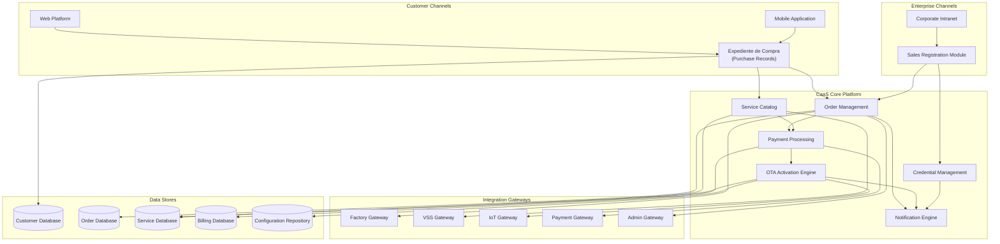

**Subsystem Responsibilities:**

**Customer Channels:**
- `Web Platform`: Browser-based access to purchase records and service catalog
- `Mobile Application`: Native mobile access with direct vehicle linking capability
- `Expediente de Compra`: Unified customer data repository containing manuals, maintenance history, invoices

**Enterprise Channels:**
- `Corporate Intranet`: Dealership-facing system for sales operations
- `Sales Registration Module`: Captures customer data and commercial plan details during dealership sales

**CaaS Core Platform:**
- `Order Management`: Handles vehicle reservations, orders, and manufacturing tracking
- `Service Catalog`: Manages available optional services (opciones disponibles) with pricing and rules
- `Payment Processing`: Orchestrates all payment types (reservation, final, service, subscription)
- `Notification Engine`: Multi-channel notifications (email, push, SMS, vehicle display)
- `OTA Activation Engine`: Manages service activation via IoT with retry logic
- `Credential Management`: Generates and distributes customer access credentials

**Integration Gateways:**
- `Factory Gateway`: Bidirectional communication with manufacturing facilities
- `VSS Gateway`: Queries Vehicle Service System for maintenance records
- `IoT Gateway`: Commands vehicles and receives telemetry via API IoT
- `Payment Gateway`: Processes card payments with async settlement
- `Admin Gateway`: Registers vehicles with government administrative bodies

**Sources:** [enunciado.md:1-23](), [pasame las preguntas y sus respuestas a markdown.md:8-53]()

---

## Layered Architecture View

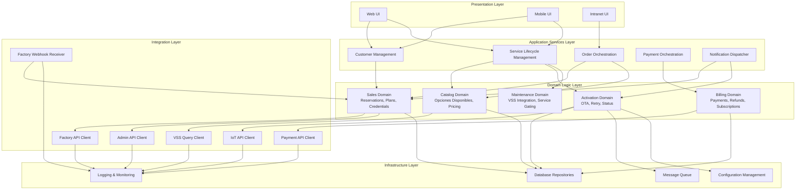

**Layer Responsibilities:**

**Presentation Layer**: UI components for different user types (customers, dealership employees). No business logic.

**Application Services Layer**: Coordinates multiple domain objects to fulfill use cases. Orchestrates workflows across domains.

**Domain Logic Layer**: Core business rules and entities. Each domain is isolated and represents a cohesive business capability:
- `Sales Domain`: Manages the purchase process from reservation through delivery
- `Catalog Domain`: Defines available services, pricing models, and eligibility rules
- `Activation Domain`: Handles OTA delivery, failure handling, and retry mechanisms
- `Billing Domain`: Processes payments, manages subscriptions (mes vencido), handles refunds (desistimiento)
- `Maintenance Domain`: Gates service access based on VSS maintenance status

**Integration Layer**: Adapters for external systems. Isolates integration complexity from domain logic. Note the hybrid pattern with Factory: synchronous client for order placement (`Factory API Client`) and asynchronous webhook receiver (`Factory Webhook Receiver`) for status updates.

**Infrastructure Layer**: Technical services used across all layers. Message queues support async processing of OTA activations and notifications.

**Sources:** [pasame las preguntas y sus respuestas a markdown.md:31-53](), [enunciado.md:8-23]()

---

## Data Architecture

### Data Segregation by Domain

The system employs **database-per-domain** pattern to ensure clear data ownership and enable independent evolution:

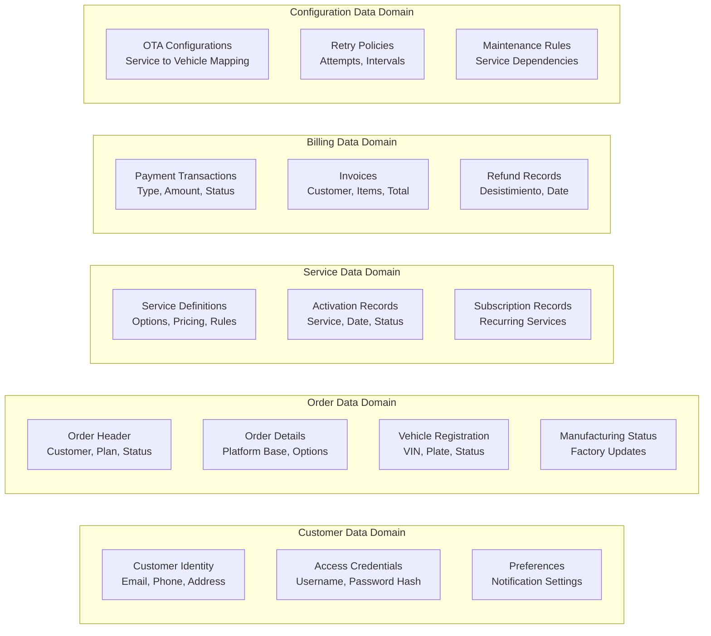

**Data Flow Patterns:**

| Flow | Pattern | Example |
|------|---------|---------|
| **Customer → Order** | Reference by ID | Customer ID stored in Order Header |
| **Order → Service** | Event-driven | Order completion triggers service catalog availability |
| **Payment → Activation** | Transactional | Payment success atomically queues OTA activation |
| **Service → Configuration** | Lookup | Service activation reads OTA configuration for vehicle commands |

**Sources:** [enunciado.md:1-23]()

---

## Integration Communication Patterns

### Factory Integration (Hybrid Pattern)

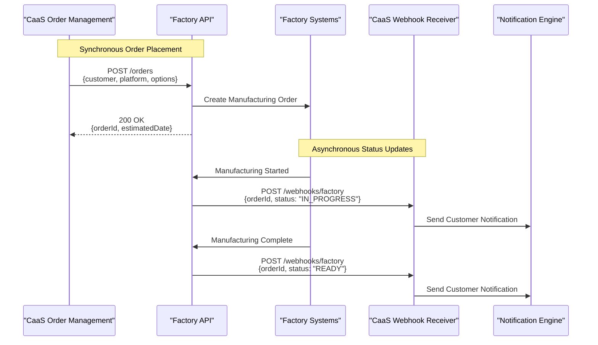

**Rationale**: Synchronous order placement ensures immediate confirmation and error handling. Asynchronous status updates prevent blocking and enable long-running manufacturing processes without maintaining connections.

**Sources:** [pasame las preguntas y sus respuestas a markdown.md:40-44]()

---

### VSS Integration (Query Pattern)

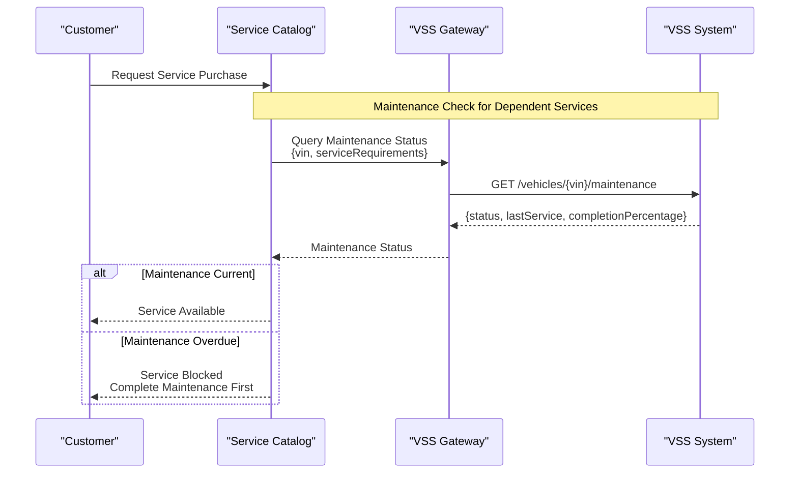

**Key Architectural Constraint**: Vehicles do NOT report maintenance status directly. The VSS system is the authoritative source, maintained independently by workshops. CaaS queries VSS when needed for service gating decisions.

**Sources:** [pasame las preguntas y sus respuestas a markdown.md:60-73]()

---

### IoT Integration (Command Pattern with Retry)

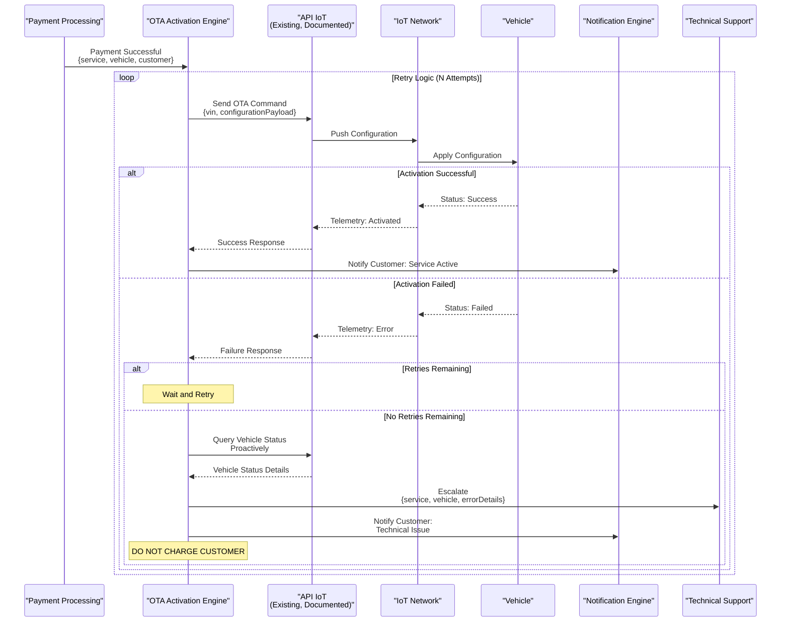

**Critical Architectural Constraint**: The API IoT is pre-existing, documented, and tested. It cannot be modified. All integration must conform to its existing interface.

**Critical Business Rule**: If OTA activation fails after all retries, the customer is NOT charged for the service. This is a customer protection mechanism and legal requirement.

**Sources:** [pasame las preguntas y sus respuestas a markdown.md:31-56]()

---

### Payment Integration (Async with Risk Assumption)

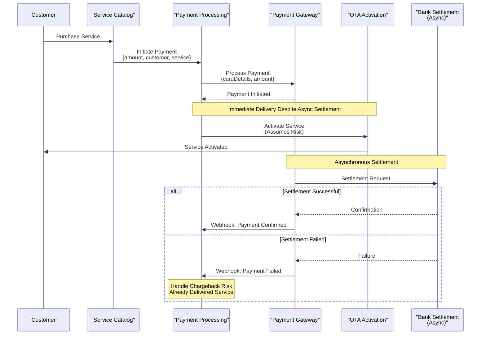

**Architectural Trade-off**: CaaS prioritizes customer experience by activating services immediately upon payment initiation, before bank settlement completes. This introduces financial risk (chargebacks, failed settlements) but significantly improves perceived service quality.

**Sources:** [pasame las preguntas y sus respuestas a markdown.md:76-82]()

---

## State Management Architecture

### Vehicle and Service State Model

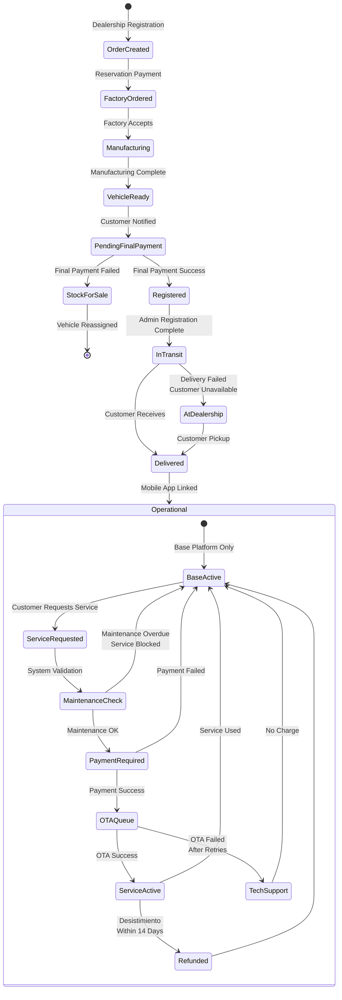

**State Transitions and Business Rules:**

| Transition | Trigger | Business Rule |
|------------|---------|---------------|
| `OrderCreated → FactoryOrdered` | Reservation payment received | Automatic API call to factory |
| `PendingFinalPayment → StockForSale` | Final payment fails | Vehicle marked "sin asignar", becomes immediately available for sale |
| `InTransit → AtDealership` | Customer not available | Vehicle returned to dealership, never left unattended |
| `MaintenanceCheck → BaseActive` | Maintenance overdue | Service blocked but base platform remains operational |
| `OTAQueue → TechSupport` | All retry attempts exhausted | Customer NOT charged, technical escalation |
| `ServiceActive → Refunded` | Customer cancels within 14 days | Desistimiento (legal right of withdrawal) honored |

**Sources:** [pasame las preguntas y sus respuestas a markdown.md:18-96](), [enunciado.md:1-23]()

---

## Deployment Architecture

### Multi-Tenant Considerations

The system must support multiple countries with varying administrative requirements:

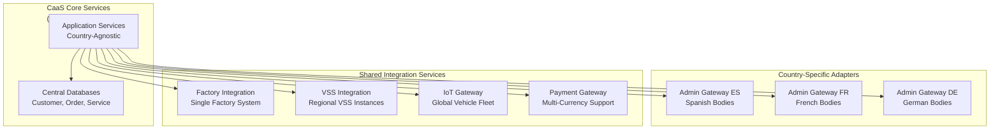

**Design Considerations:**
- **Core services** remain country-agnostic
- **Administrative registration** uses country-specific adapters implementing common interface
- **Payment processing** supports multiple currencies and payment methods per country
- **VSS integration** may connect to regional instances but presents unified interface

**Sources:** [enunciado.md:15-16]()

---

## Notification Architecture

### Multi-Channel Notification Delivery

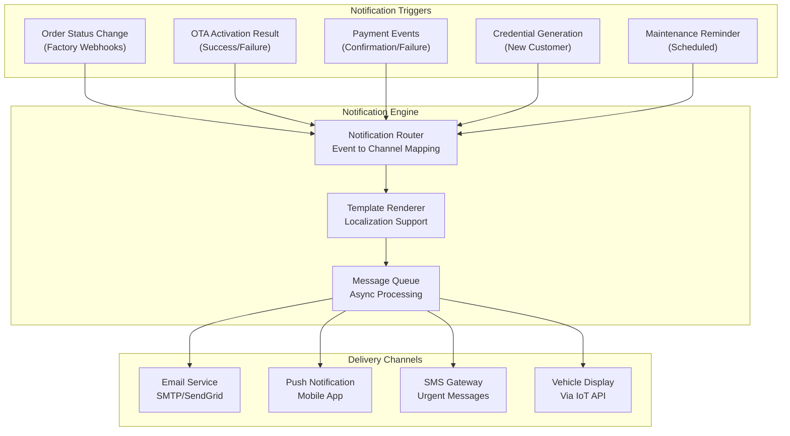

**Notification Routing Rules:**

| Event | Email | Push | SMS | Vehicle Display |
|-------|-------|------|-----|-----------------|
| **Order Status Update** | ✓ | ✓ | - | - |
| **Vehicle Ready** | ✓ | ✓ | ✓ | - |
| **OTA Success** | ✓ | ✓ | - | ✓ |
| **OTA Failed** | ✓ | ✓ | - | - |
| **Credentials Generated** | ✓ | - | - | - |
| **Payment Confirmation** | ✓ | ✓ | - | - |
| **Maintenance Due** | ✓ | ✓ | ✓ | ✓ |

**Sources:** [enunciado.md:11-20](), [pasame las preguntas y sus respuestas a markdown.md:28-29]()

---

## Security Architecture

### Authentication and Authorization Model

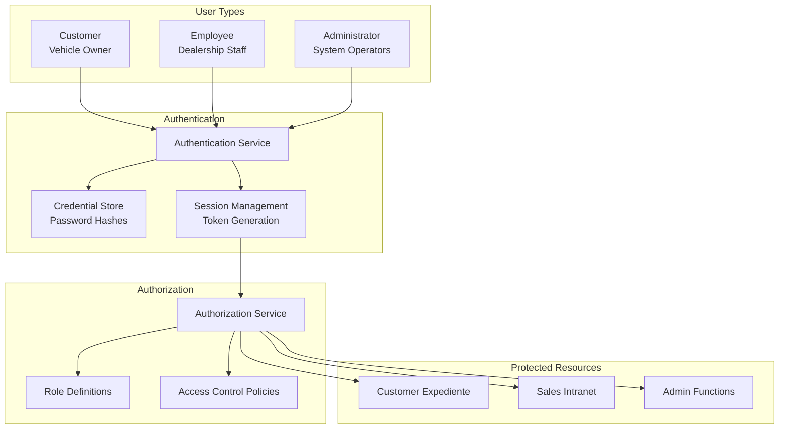

**Access Control Rules:**

| User Type | Access Scope | Key Restrictions |
|-----------|--------------|------------------|
| **Customer** | Own expediente, own vehicle services | Cannot view other customers' data |
| **Employee (Dealership)** | Sales registration, order management | Cannot modify existing customer credentials |
| **Administrator** | System configuration, all records | Cannot initiate OTA commands directly (automated only) |

**Authentication Flow:**
1. Customers receive credentials via email after dealership registration
2. No self-registration or external SSO (Google, Microsoft, etc.)
3. All users must be explicitly provisioned in the system
4. Mobile app links to specific vehicle after delivery (one-to-one binding)

**Sources:** [pasame las preguntas y sus respuestas a markdown.md:15-16]()

---

## Failure Handling and Resilience

### Circuit Breaker Patterns

The system implements circuit breaker patterns for critical external dependencies:

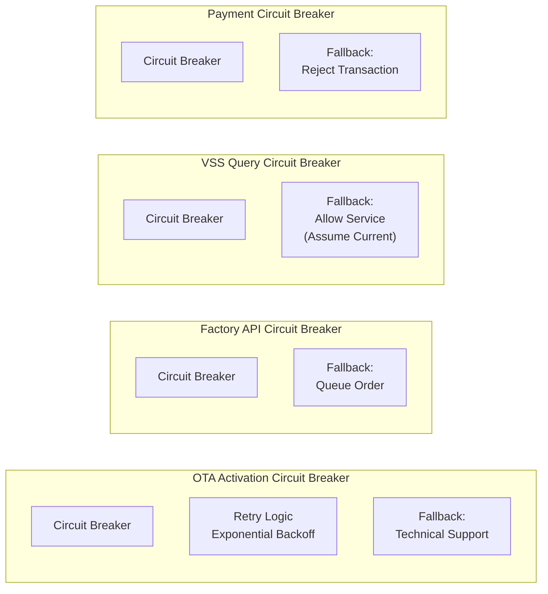

**Failure Handling Strategies by Subsystem:**

| Subsystem | Failure Mode | Strategy | Customer Impact |
|-----------|--------------|----------|-----------------|
| **OTA Activation** | IoT API unavailable | Retry with exponential backoff (N attempts) → Escalate to tech support | Service NOT activated, NOT charged |
| **Factory API** | Factory system down | Queue order for later submission | Delayed order placement, customer notified |
| **VSS Query** | VSS unavailable | Allow service purchase (assume maintenance current) | Service activated optimistically |
| **Payment Gateway** | Payment system down | Reject transaction immediately | Customer must retry, no service delivered |
| **Admin Registration** | Admin API fails | Retry synchronously (blocking), escalate after timeout | Delivery delayed, customer notified |

**Critical Principle**: When in doubt, favor the customer. If OTA fails or payment confirmation is delayed, do NOT charge the customer for undelivered services.

**Sources:** [pasame las preguntas y sus respuestas a markdown.md:46-53]()

---

## Subscription and Billing Architecture

### Mes Vencido (Post-Paid) Model

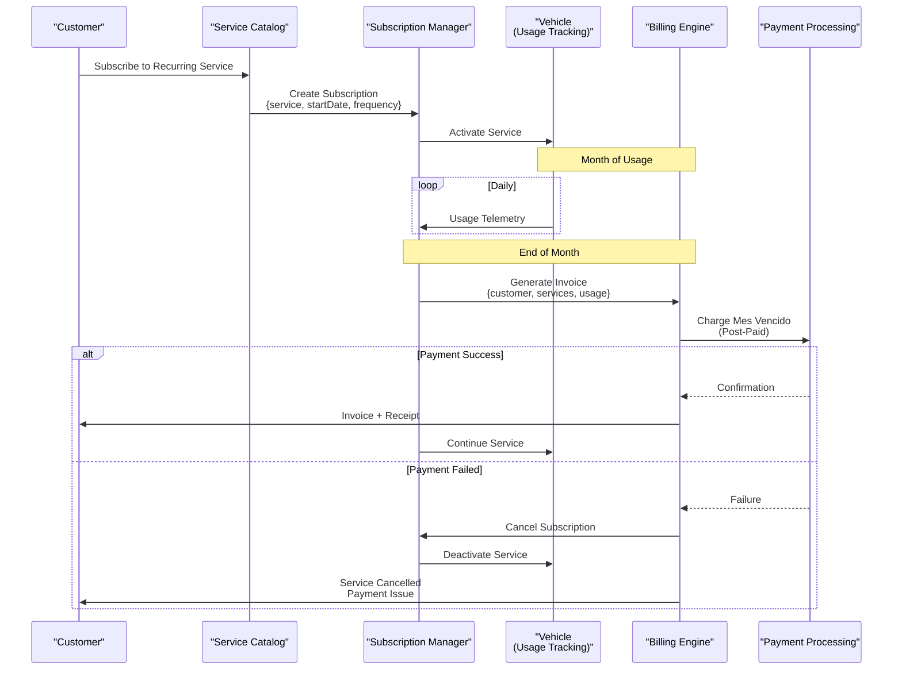

**Billing Cycle Rules:**
- **One-time services**: Charge immediately upon purchase
- **Subscription services**: Charge at month end (mes vencido) for consumed services
- **Failed subscription payment**: Automatic cancellation, no further charges
- **Refunds**: Subject to desistimiento rules (14-day window for services > 14 days duration)

**Sources:** [pasame las preguntas y sus respuestas a markdown.md:76-96]()

---

## Technology Stack Implications

Based on the architectural patterns and requirements, the system likely employs:

### Backend Services
- **API Framework**: RESTful API design for synchronous operations (Factory order placement, VSS queries)
- **Webhook Receivers**: Async endpoint handlers for Factory status updates and payment confirmations
- **Message Queue**: Required for async OTA activation processing and notification distribution
- **Scheduled Jobs**: Cron-based or triggered jobs for subscription billing (end-of-month), maintenance reminders

### Data Storage
- **Relational Database**: Transactional consistency for orders, payments, customer data
- **Document Store** (possible): Configuration repository for OTA service definitions
- **Cache Layer**: Performance optimization for service catalog queries, maintenance status lookups

### Integration Infrastructure
- **HTTP Client Libraries**: For calling Factory API, VSS API, IoT API, Payment Gateway, Admin API
- **Retry Mechanisms**: Built-in or library-based retry logic with exponential backoff for OTA activations
- **Circuit Breakers**: Fault tolerance for external dependencies

### Security Components
- **Password Hashing**: Secure credential storage (bcrypt, Argon2)
- **Token Management**: Session or JWT tokens for stateless authentication
- **TLS/HTTPS**: Encrypted communication for all external APIs and customer-facing platforms

**Sources:** [pasame las preguntas y sus respuestas a markdown.md:1-104](), [enunciado.md:1-23]()

---

## Summary

The CaaS system architecture is built on the following key principles:

1. **Centralized Orchestration**: All business logic flows through the central CaaS platform
2. **Async-First Integration**: External systems communicate primarily via asynchronous patterns with sync for critical transactions
3. **Customer Protection**: Failure handling defaults to customer-favorable outcomes (no charge for failed OTA)
4. **Legal Compliance**: Desistimiento (withdrawal rights) and maintenance warranty rules embedded in architecture
5. **Risk-Tolerant Delivery**: Services activated before payment settlement completes
6. **Multi-Tenant Design**: Country-specific adapters for administrative requirements
7. **State-Driven Workflows**: Explicit state machines for vehicles, orders, services, and payments

For detailed component descriptions, see [Core Technical Components](#3.2). For integration patterns and external system details, see [Integration Architecture](#3.3) and [External System Integrations](#5).

**Sources:** [pasame las preguntas y sus respuestas a markdown.md:1-104](), [enunciado.md:1-23]()