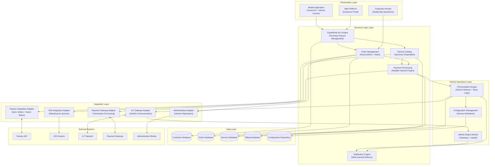
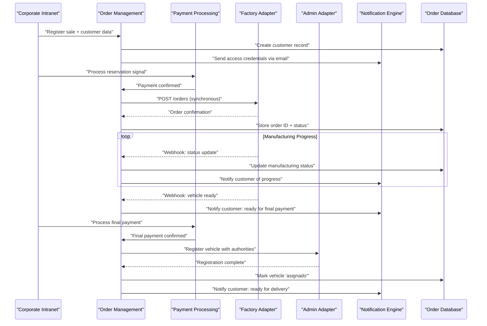
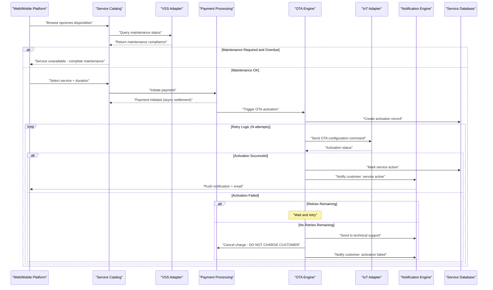
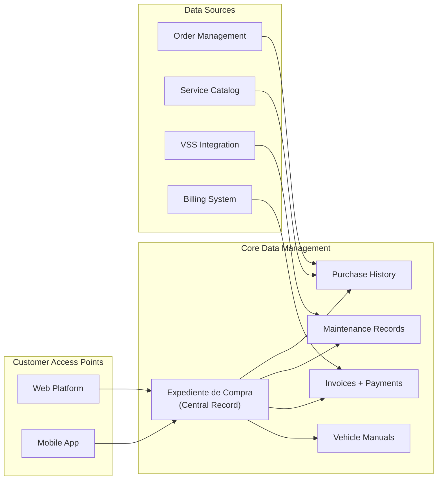
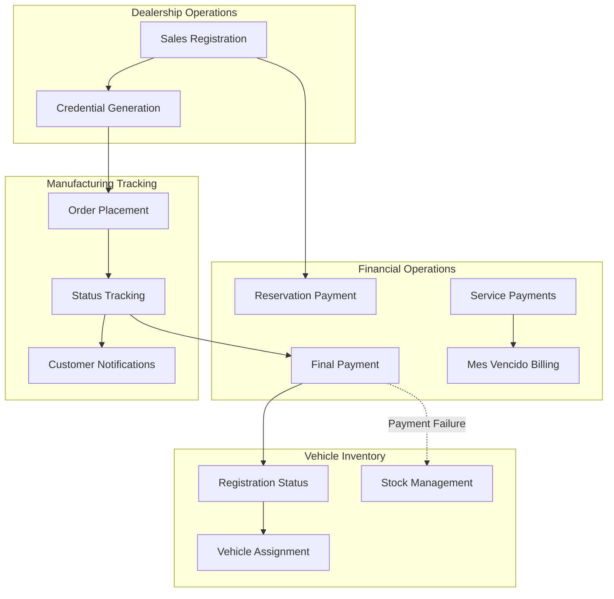

# High-Level Architecture

Relevant source files

The following files were used as context for generating this wiki page:

- [enunciado.md](enunciado.md)
- [pasame las preguntas y sus respuestas a markdown.md](pasame las preguntas y sus respuestas a markdown.md)

## Purpose and Scope

This document presents the overall system architecture of the CaaS (Car as a Service) platform, identifying major subsystems and their relationships. It provides a technical overview of how components are organized into layers and how they interact to deliver the core business functionality.

For detailed information about specific components, see:
- Internal technical components: [Core Technical Components](#3.2)
- External system integration patterns: [Integration Architecture](#3.3)
- Business model context: [Business Model and Concept](#2)

## Architectural Overview

The CaaS platform follows a **layered architecture** with clear separation of concerns, organized around a central hub that orchestrates interactions between customers, dealerships, factory systems, and vehicles. The system is designed to support the Car as a Service business model where customers purchase a base vehicle platform and dynamically activate optional features through OTA (Over The Air) delivery.

**Sources:** [enunciado.md:1-23](), [pasame las preguntas y sus respuestas a markdown.md:33-56]()

## System Layers

### Presentation Layer

The presentation layer provides three distinct access channels, each serving different user types:

| Channel | Users | Primary Functions |
|---------|-------|-------------------|
| **Web Platform** | Customers | Browse services, manage expediente, purchase optional features |
| **Mobile Application** | Customers | Browse services, direct vehicle control, activation notifications |
| **Corporate Intranet** | Dealership employees | Sales registration, customer data capture, order management |

The web and mobile platforms converge on the **Expediente de Compra** (purchase record) as the single source of truth for customer information, including manuals, maintenance history, and invoices.

**Sources:** [enunciado.md:8-11](), [pasame las preguntas y sus respuestas a markdown.md:15-16]()

### Business Logic Layer

This layer implements core domain logic independent of presentation or integration concerns:

- **Expediente de Compra Management**: Central customer record system containing purchase history, vehicle information, service activations, and all customer-facing documentation
- **Order Management**: Handles vehicle reservations, sales registration, and order lifecycle from initial purchase through delivery
- **Service Catalog**: Manages opciones disponibles (available options) with pricing rules, duration models, and maintenance dependencies
- **Payment Processing**: Orchestrates multiple payment types (reservation signals, final payments, service payments) with asynchronous settlement handling
- **Notification Engine**: Multi-channel notification delivery across email, mobile push, SMS, and vehicle display systems

**Sources:** [enunciado.md:5-11](), [pasame las preguntas y sus respuestas a markdown.md:77-96]()

### Vehicle Operations Layer

Specialized subsystem responsible for remote service delivery and vehicle monitoring:

- **OTA Activation Engine**: Core component implementing Over The Air service activation with sophisticated retry logic and failure handling. Ensures no customer charge occurs if activation fails
- **Configuration Management**: Repository of service definitions describing how each opción disponible maps to vehicle configuration parameters
- **Vehicle Status Monitor**: Processes telemetry and health data from connected vehicles via the IoT network

The OTA engine is architecturally significant as it implements the critical business rule: if service activation fails after all retries, the customer must not be charged.

**Sources:** [enunciado.md:19](), [pasame las preguntas y sus respuestas a markdown.md:46-56]()

### Integration Layer

Implements adapter pattern to isolate external system dependencies:

- **Factory Integration Adapter**: Hybrid sync/async pattern for order placement (synchronous) and manufacturing status updates (asynchronous webhooks)
- **VSS Integration Adapter**: Query-only adapter to Vehicle Service System for maintenance status verification before allowing service purchases
- **IoT Gateway Adapter**: Bidirectional communication channel with the existing API IoT infrastructure for OTA commands and telemetry
- **Payment Gateway Adapter**: Handles card payment processing with async settlement, implementing CaaS risk assumption strategy
- **Administrative Adapter**: Vehicle registration with government bodies (country-specific implementations)

**Sources:** [pasame las preguntas y sus respuestas a markdown.md:40-44](), [pasame las preguntas y sus respuestas a markdown.md:60-73]()

### Data Layer

Database segregation by domain:

- **Customer Database**: User profiles, authentication credentials, contact information
- **Order Database**: Vehicle sales, inventory status (asignado/sin asignar), manufacturing tracking
- **Service Database**: Service activation history, subscription status, cancellation records
- **Billing Database**: Payment transactions, invoices, refund processing
- **Configuration Repository**: Service definitions, pricing rules, vehicle capability mappings

**Sources:** [enunciado.md:8-17]()

## Key Subsystem Interactions

### Vehicle Purchase Flow

**Sources:** [enunciado.md:8-17](), [pasame las preguntas y sus respuestas a markdown.md:18-29](), [pasame las preguntas y sus respuestas a markdown.md:40-44]()

### Service Activation Flow

**Sources:** [enunciado.md:18-20](), [pasame las preguntas y sus respuestas a markdown.md:46-56](), [pasame las preguntas y sus respuestas a markdown.md:60-73]()

## Integration Patterns

The CaaS platform employs distinct integration patterns for each external system:

| External System | Pattern | Initiator | Data Flow | Notes |
|-----------------|---------|-----------|-----------|-------|
| **Factory API** | Hybrid Sync/Async | CaaS → Factory (sync) Factory → CaaS (async) | Orders (sync), Status webhooks (async) | API IoT documented and tested |
| **VSS System** | Query/Pull | CaaS → VSS | Maintenance status queries | Read-only, no vehicle self-reporting |
| **IoT Network** | Bidirectional Real-Time | CaaS ⇄ Vehicles | Commands (push), Telemetry (pull) | Existing API IoT infrastructure |
| **Payment Gateway** | Async Settlement | CaaS → Gateway | Payment requests, Settlement confirmations | CaaS assumes risk, delivers before settlement |
| **Admin Bodies** | Synchronous | CaaS → Admin | Vehicle registration | Blocking operation, country-specific |

**Sources:** [pasame las preguntas y sus respuestas a markdown.md:33-44](), [pasame las preguntas y sus respuestas a markdown.md:60-73](), [pasame las preguntas y sus respuestas a markdown.md:77-82]()

## Architectural Constraints and Design Decisions

### Pre-existing API IoT

The IoT network infrastructure and **API IoT** are pre-existing, documented, and tested systems. This is an architectural constraint—CaaS must integrate with the API as-is without modifications:

> "Existe una API IoT documentada y probada para configuración remota. Está preparada para CaaS, aunque no en uso hasta que finalice el proyecto. Cualquier problema de integración se carga al proyecto previo."

This constraint shapes the Vehicle Operations Layer, which must adapt to the existing API rather than designing a custom interface.

### Firmware Pre-installation Model

All optional service functionality is **pre-installed in vehicle firmware**. The CaaS system performs only activation/deactivation, not software updates:

> "Toda la funcionalidad ya está preinstalada en el firmware. CaaS solo realiza la activación o desactivación."

This architectural decision simplifies the OTA engine (configuration changes only) but requires comprehensive capability management in the Configuration Repository to track which features are available in each vehicle's firmware version.

### Risk Assumption Strategy

CaaS implements **immediate service delivery** despite asynchronous payment settlement. This business decision creates architectural requirements for:
- Payment reconciliation subsystems
- Failure detection and refund processing
- Customer communication for settlement failures

The critical protection rule: **if OTA activation fails, the customer must not be charged**, regardless of payment gateway status.

### Maintenance-Gated Service Access

Services with maintenance dependencies require real-time VSS queries before purchase. This creates a dependency path: `Service Catalog → VSS Adapter → VSS API` for every service browse/purchase operation involving maintenance-linked opciones disponibles.

**Sources:** [pasame las preguntas y sus respuestas a markdown.md:33-56](), [pasame las preguntas y sus respuestas a markdown.md:60-73](), [pasame las preguntas y sus respuestas a markdown.md:77-82]()

## Data Flow Architecture

### Customer-Facing Data Flow

The **Expediente de Compra** serves as the aggregation point for all customer-facing data, providing a unified view regardless of access channel (web or mobile).

**Sources:** [enunciado.md:11](), [pasame las preguntas y sus respuestas a markdown.md:11-16]()

### Internal Operations Data Flow

Internal operations maintain strict separation between dealership functions (sales, registration), manufacturing coordination (factory integration), and financial processing (payments, billing).

**Sources:** [enunciado.md:8-17](), [pasame las preguntas y sus respuestas a markdown.md:18-29](), [pasame las preguntas y sus respuestas a markdown.md:77-96]()

## System Boundaries

### What is Inside the CaaS System

The CaaS platform **owns and implements**:
- Customer-facing platforms (web, mobile, expediente)
- Corporate intranet for dealership operations
- Order management and service catalog
- OTA activation engine with retry logic
- Payment processing orchestration (not settlement)
- Notification delivery across all channels
- Integration adapters for all external systems

### What is Outside the CaaS System

**External actors and systems** that CaaS integrates with but does not control:
- **Customers**: External actors who use the system
- **Dealership employees**: External actors who operate the intranet
- **Factory systems**: Manufacturing execution, not part of CaaS
- **Transport companies**: Subcontracted logistics
- **VSS system**: Maintained by workshop network, CaaS queries only
- **IoT Network**: Pre-existing infrastructure, CaaS sends commands via API
- **Vehicles**: Infrastructure components that receive configurations
- **Payment gateway**: Third-party financial service
- **Administrative bodies**: Government registration systems

The architectural principle: **"Un actor es siempre algo externo a nosotros (el sistema de información) a quien damos servicio"** clarifies that actors are always external to the information system.

**Sources:** [pasame las preguntas y sus respuestas a markdown.md:10-16](), [enunciado.md:1-23]()

## Scalability and Distribution Considerations

While the current architecture is presented as a monolithic view, the layered design enables future distribution:

- **Presentation Layer**: Can be scaled horizontally behind load balancers
- **Business Logic Layer**: Stateless services suitable for horizontal scaling
- **Vehicle Operations Layer**: OTA engine may require message queues for handling large fleets
- **Integration Layer**: Adapters can be isolated as microservices if external system load varies significantly
- **Data Layer**: Database segregation already supports independent scaling per domain

The asynchronous patterns (factory webhooks, payment settlement, OTA retries) provide natural boundaries for eventual consistency and distributed processing.

**Sources:** [enunciado.md:7](), [pasame las preguntas y sus respuestas a markdown.md:33-56]()