# Core Technical Components

Relevant source files

The following files were used as context for generating this wiki page:

- [enunciado.md](enunciado.md)
- [pasame las preguntas y sus respuestas a markdown.md](pasame las preguntas y sus respuestas a markdown.md)

## Purpose and Scope

This page documents the internal technical components that comprise the CaaS platform core. These components handle business logic, data management, and orchestration within the system boundaries. 

For external system integrations and API communication patterns, see [Integration Architecture](#3.3). For the overall system structure, see [High-Level Architecture](#3.1).

---

## Component Overview

The CaaS platform consists of six core technical components that work together to deliver the Car as a Service functionality:

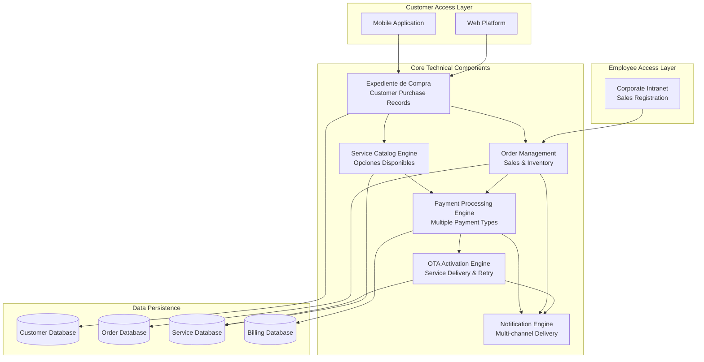

**Component Responsibilities Summary**

| Component | Primary Responsibility | Key Data Managed |
|-----------|----------------------|------------------|
| Corporate Intranet | Sales registration and customer onboarding | Sale records, customer credentials |
| Expediente de Compra | Customer purchase record aggregation | Manuals, maintenance history, invoices |
| Service Catalog Engine | Opciones disponibles management | Service definitions, pricing rules, availability |
| Payment Processing Engine | Payment orchestration | Reservation, final, and service payments |
| Notification Engine | Multi-channel customer communication | Email, push, SMS notifications |
| OTA Activation Engine | Remote service delivery | Activation commands, retry logic, failure tracking |

Sources: [enunciado.md:1-23](), [pasame las preguntas y sus respuestas a markdown.md:1-104]()

---

## Corporate Intranet

### Purpose
The corporate intranet is the dealership-facing system where sales staff register vehicle purchases and initiate customer onboarding. This component serves as the entry point for new customer relationships and vehicle orders.

### Functionality

**Sales Registration Process:**
1. Capture customer identificative data
2. Record plan comercial (plataforma base + included opciones)
3. Generate customer access credentials
4. Trigger automatic factory order placement via API
5. Mark vehicle assignment status

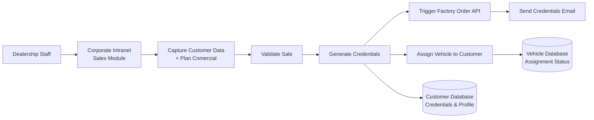

**Data Captured:**
- Customer identificative information
- Contact email for credential delivery
- Plataforma base model selected
- Plan comercial details (included opciones disponibles)
- Payment reservation signal

**System Outputs:**
- Customer account creation
- Access credentials sent via email
- Factory order initiation (synchronous API call)
- Vehicle marked as "assigned" to customer

**Business Rules Enforced:**
- No auto-registration allowed - all users must be registered by dealership staff
- Credentials sent to customer-provided email address only
- Vehicle cannot be re-assigned once reserved

Sources: [enunciado.md:8-11](), [pasame las preguntas y sus respuestas a markdown.md:14-16]()

---

## Expediente de Compra System

### Purpose
The Expediente de Compra is the central aggregation point for all customer purchase-related information. It serves as the single source of truth that customers access through web and mobile platforms.

### Architecture

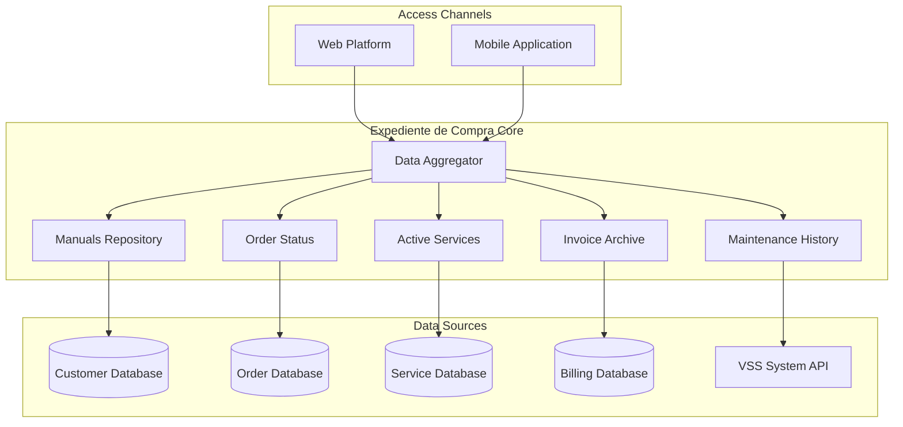

### Information Provided

**Manuals:**
- Vehicle platform base manual
- Optional service documentation
- Usage guidelines for activated features

**Maintenance History:**
- Retrieved from VSS system via API query
- Displays service records from official and approved workshops
- Shows maintenance compliance percentage by functional blocks

**Invoices:**
- Reservation payment receipt
- Final vehicle payment invoice
- Service payment receipts (one-time and subscription)
- Refund records (desistimiento cases)

**Order Status:**
- Manufacturing progress notifications
- Delivery status tracking
- Vehicle availability notifications

**Active Services:**
- Currently enabled opciones disponibles
- Service expiration dates (for temporary services)
- Subscription status and renewal dates
- Planned/recurring service schedule

### Authentication and Access Control

The Expediente de Compra implements strict access control:
- Credentials generated by corporate intranet during sales registration
- No external SSO integration (Google, Microsoft, etc.)
- All users must be known and controlled by the system
- Customers must have purchased a vehicle to access

Sources: [enunciado.md:11-12](), [pasame las preguntas y sus respuestas a markdown.md:14-16](), [pasame las preguntas y sus respuestas a markdown.md:60-73]()

---

## Service Catalog Engine

### Purpose
The Service Catalog Engine manages the repository of opciones disponibles, their pricing models, eligibility rules, and availability constraints. This component determines what services customers can purchase at any given time.

### Service Types and Pricing Models

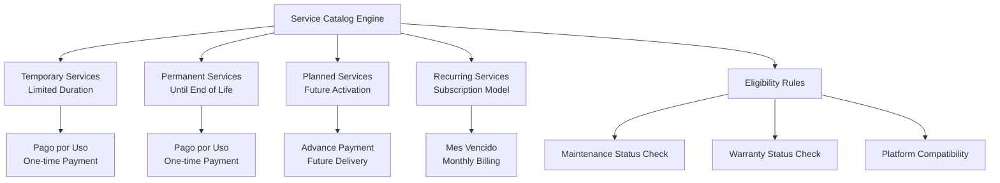

### Service Categories

Examples of opciones disponibles managed by the catalog:

| Service Category | Examples | Maintenance-Linked |
|-----------------|----------|-------------------|
| Performance | 50% power increase | Yes (engine maintenance) |
| Driver Assistance | Collision avoidance, lane keeping | Yes (sensor calibration) |
| Autonomous Driving | Highway autonomous mode | Yes (system diagnostics) |
| Traction & Handling | Snow mode, off-road mode, sport mode | Yes (drivetrain maintenance) |
| Climate Control | Advanced HVAC zones, heated seats | No |
| Entertainment | Premium audio, streaming services | No |

### Eligibility and Availability Logic

**Maintenance-Linked Services:**
The catalog engine queries VSS system to determine if maintenance-dependent services can be offered:

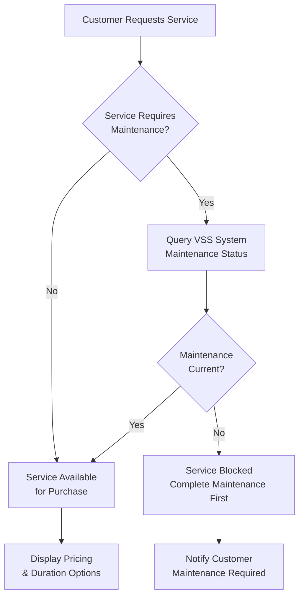

**Key Business Rules:**
- If service requires maintenance and vehicle maintenance is overdue, service is unavailable for purchase
- Already activated services are NOT deactivated if maintenance lapses (only new purchases blocked)
- Plataforma base features are never affected by maintenance status
- Warranty loss does not block base functionality, only new service activations

**Platform Compatibility:**
- Each plataforma base has specific compatible opciones disponibles
- Service catalog filters options based on customer's vehicle platform
- Pre-configured in service definitions repository

Sources: [enunciado.md:3-6](), [pasame las preguntas y sus respuestas a markdown.md:58-73](), [pasame las preguntas y sus respuestas a markdown.md:84-96]()

---

## Payment Processing Engine

### Purpose
The Payment Processing Engine orchestrates all payment types and handles the complex lifecycle of vehicle purchases and service payments. This component manages integration with payment gateways while implementing CaaS risk management policies.

### Payment Type Architecture

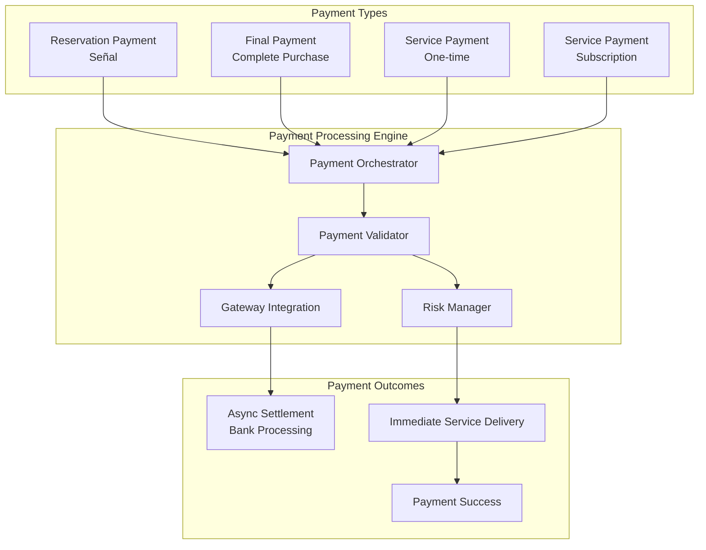

### Payment Workflows

**Reservation Payment (Señal):**
- Triggered at sales registration in corporate intranet
- Required before factory order placement
- Confirms customer commitment to purchase

**Final Payment:**
- Required before vehicle matriculation (registration)
- Triggered when vehicle is available for delivery
- Failure results in vehicle returning to stock ("sin asignar" status)

**Service Payment (One-time):**
- Pay-per-use model (pago por uso)
- Payment processed before OTA activation attempt
- Immediate service delivery despite async settlement (CaaS assumes risk)

**Subscription Payment (Mes Vencido):**
- Post-paid billing model
- Customer charged at end of month for consumed services
- Payment failure triggers subscription cancellation

### Payment Failure Handling

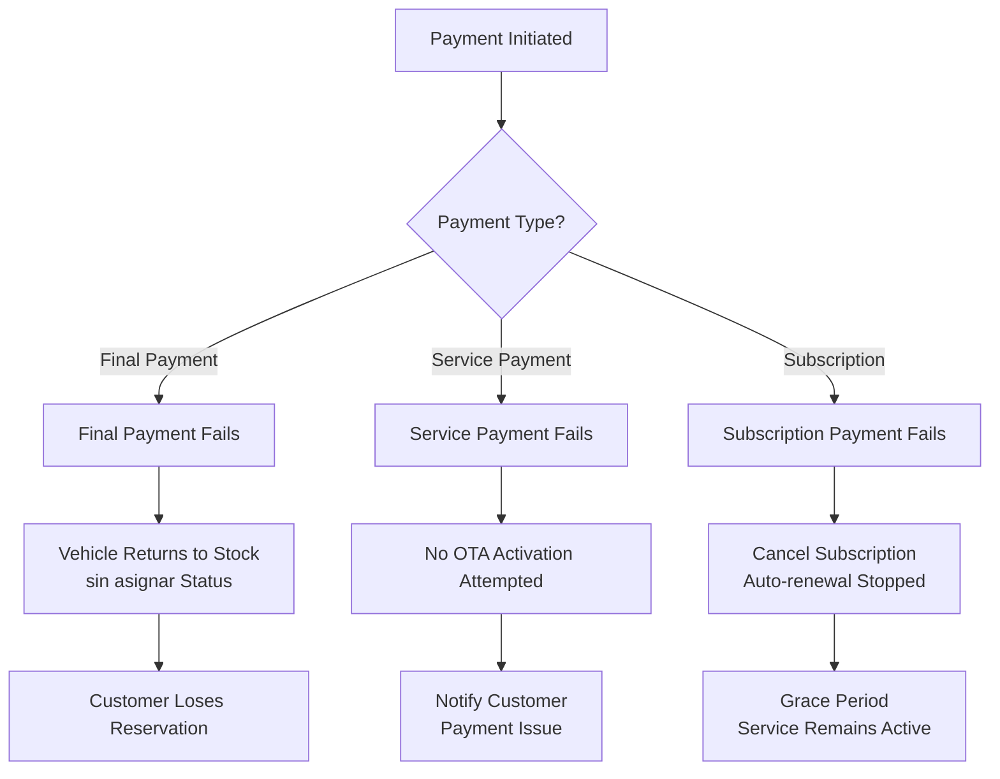

### Risk Management Strategy

The Payment Processing Engine implements a customer-favorable risk approach:

**Immediate Delivery Policy:**
- Services activated before bank settlement confirmation
- CaaS assumes risk of payment reversal/failure
- Optimizes customer experience over financial risk

**No Charge for Failed Delivery:**
- If OTA activation fails, payment is NOT processed or is refunded
- Customer never pays for undelivered services
- Critical business rule: payment success depends on successful service delivery

Sources: [pasame las preguntas y sus respuestas a markdown.md:75-96](), [enunciado.md:13-19]()

---

## Notification Engine

### Purpose
The Notification Engine provides multi-channel communication to customers throughout their vehicle ownership and service usage lifecycle. This component ensures customers receive timely updates regardless of their preferred communication channel.

### Multi-Channel Architecture

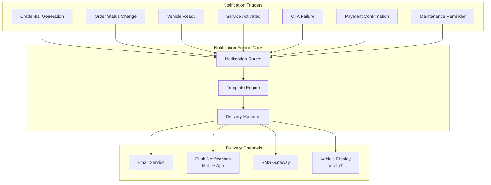

### Notification Types and Channels

| Notification Type | Email | Push | SMS | Vehicle Display |
|------------------|-------|------|-----|----------------|
| Access Credentials | ✓ | - | - | - |
| Manufacturing Status | ✓ | ✓ | - | - |
| Vehicle Ready | ✓ | ✓ | ✓ | - |
| Service Activated | ✓ | ✓ | - | ✓ |
| OTA Activation Failure | ✓ | ✓ | - | - |
| Payment Confirmation | ✓ | - | - | - |
| Maintenance Required | ✓ | ✓ | - | ✓ |

### Critical Notification Workflows

**Credential Delivery:**
- Sent immediately after sales registration in corporate intranet
- Contains access credentials for web and mobile platforms
- Email is the only channel (must be customer-provided address)

**Manufacturing Status Updates:**
- Automatic notifications throughout fabrication process
- Key value differentiator for CaaS system
- Updates sent at manufacturing milestones

**OTA Activation Status:**
- Success notification sent to mobile app and vehicle display
- Failure notification triggers technical support workflow
- Critical: customer notified if activation fails and no charge applied

**Maintenance Alerts:**
- Sent when maintenance schedule approaches
- Warning if maintenance overdue and affects service availability
- Does not block already-activated services

Sources: [enunciado.md:13-19](), [pasame las preguntas y sus respuestas a markdown.md:28-29](), [pasame las preguntas y sus respuestas a markdown.md:46-53]()

---

## OTA Activation Engine

### Purpose
The OTA (Over The Air) Activation Engine is responsible for remote delivery of opciones disponibles to customer vehicles. This component implements sophisticated retry logic and failure handling to ensure reliable service delivery.

### Activation Architecture

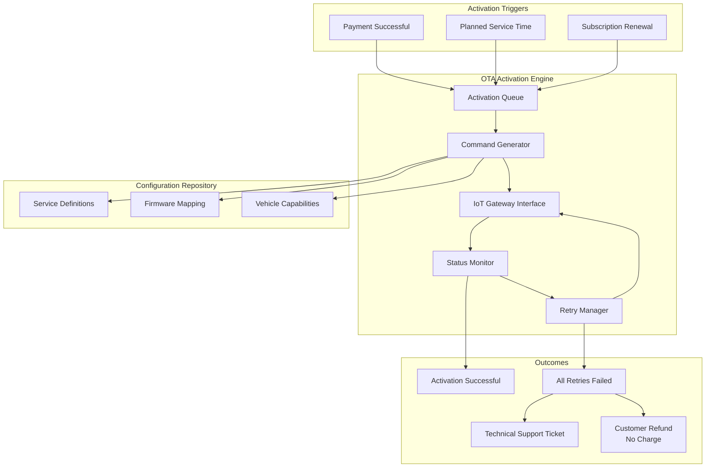

### Firmware Pre-installation Model

**Key Architectural Principle:**
All optional functionality is pre-installed in vehicle firmware. The OTA Activation Engine does NOT deliver software updates; it only activates or deactivates features that already exist in the vehicle.

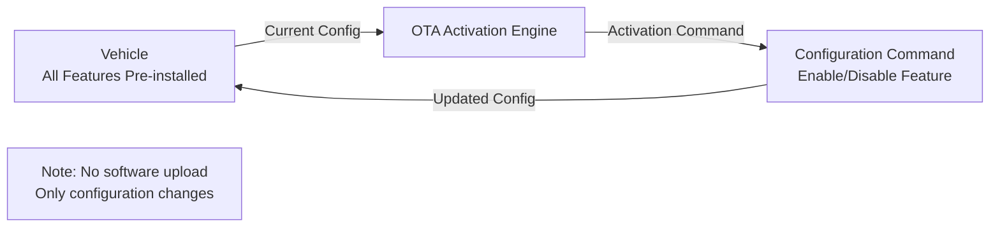

**Separation of Concerns:**
- Software updates to vehicle firmware are independent processes
- CaaS OTA only manages feature activation/deactivation
- Reduces complexity and activation time
- Improves reliability (no large file transfers)

### Retry Logic and Failure Handling

**Retry Strategy:**

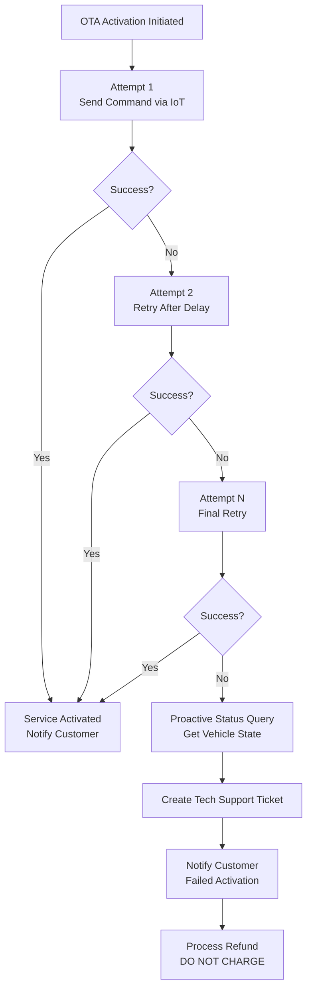

**Critical Business Rule: No Charge for Failed Activation**

If OTA activation fails after all retry attempts:
1. Proactively query vehicle state to gather diagnostic information
2. Send diagnostic data to technical support service
3. Notify customer of failure
4. **DO NOT CHARGE** customer for the undelivered service
5. Issue refund if payment already processed

This rule is fundamental to customer trust and legal compliance.

### Status Monitoring

The OTA Activation Engine monitors activation status through multiple mechanisms:

**Active Monitoring:**
- Confirmation messages from vehicle via IoT network
- Activation command acknowledgment
- Feature status reports

**Passive Monitoring:**
- Telemetry data indicating feature usage
- Vehicle health checks showing active configurations
- Customer-reported activation status (via mobile app)

**Proactive Querying:**
- If activation confirmation not received within timeout
- Before declaring activation failure
- To gather diagnostics for technical support

Sources: [pasame las preguntas y sus respuestas a markdown.md:31-56](), [enunciado.md:19-20]()

---

## Component Interaction Flow

The following diagram illustrates how these core components interact during a typical service purchase and activation:

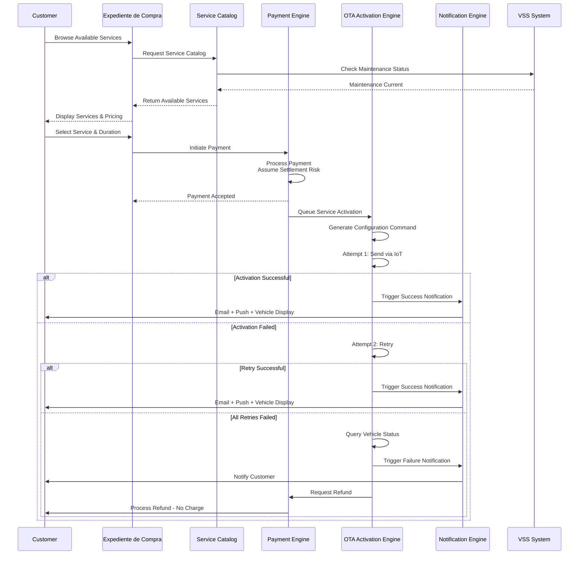

Sources: [enunciado.md:18-20](), [pasame las preguntas y sus respuestas a markdown.md:46-53]()

---

## Data Flow and Persistence

### Database Segregation Strategy

The core technical components implement database segregation by domain:

| Database | Owning Component | Data Stored |
|----------|-----------------|-------------|
| Customer Database | Expediente de Compra | Customer profiles, credentials, authentication |
| Order Database | Corporate Intranet / Order Management | Sales records, vehicle assignments, manufacturing status |
| Service Database | Service Catalog / OTA Engine | Service definitions, activations, history, expirations |
| Billing Database | Payment Engine | Payment records, invoices, refunds, subscription billing |

### Cross-Component Data Access Patterns

**Read-Only Access:**
- Expediente de Compra reads from all databases to aggregate customer view
- Service Catalog reads customer and vehicle data to filter available services
- Notification Engine reads across databases to populate notification templates

**Write Access:**
- Each component has exclusive write access to its primary database
- Cross-component updates flow through component APIs, not direct database access
- Ensures data consistency and component isolation

Sources: [enunciado.md:1-23](), [pasame las preguntas y sus respuestas a markdown.md:1-104]()