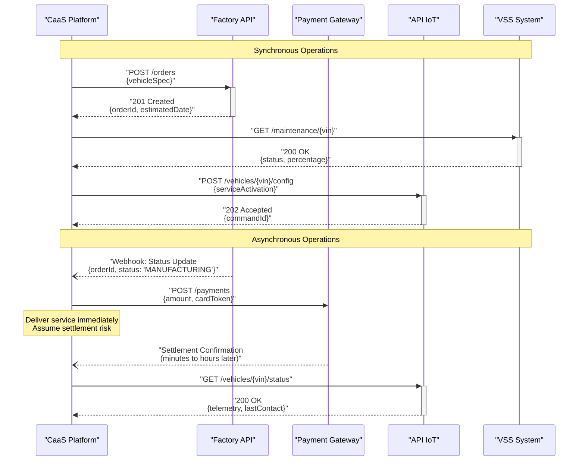
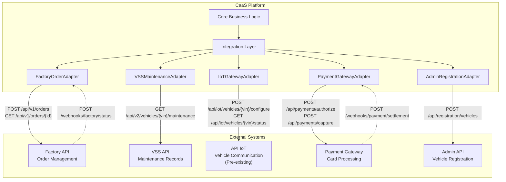
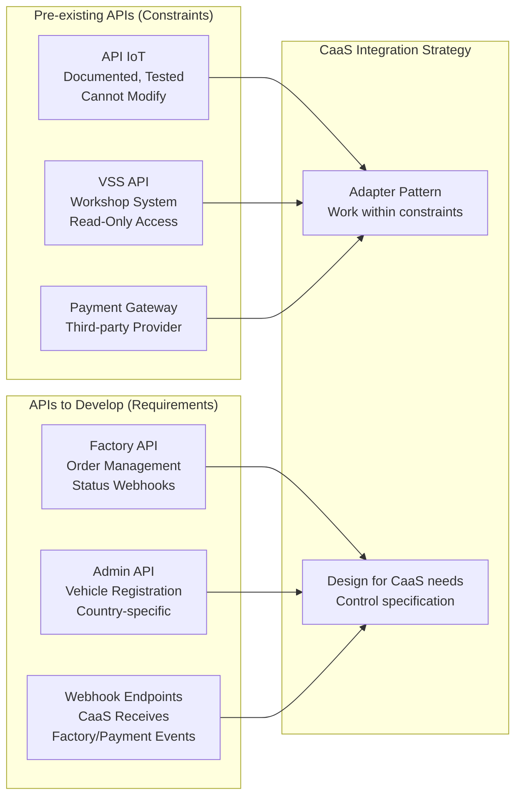
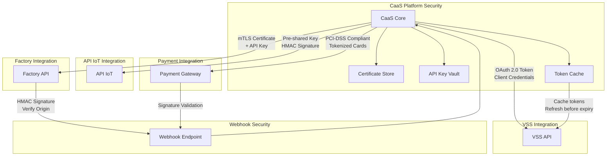
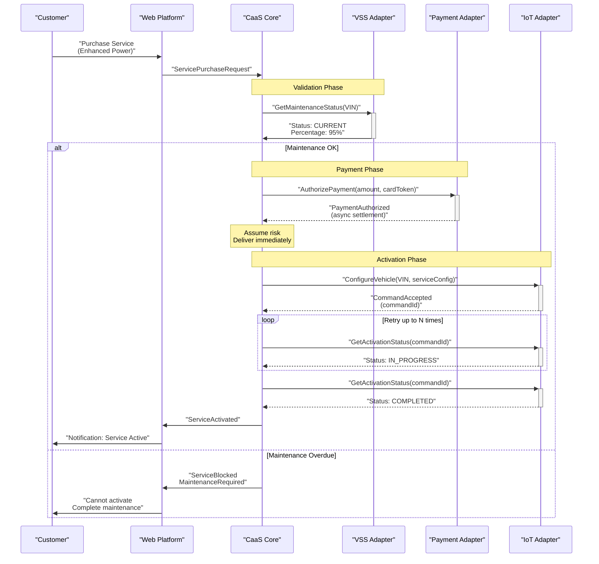
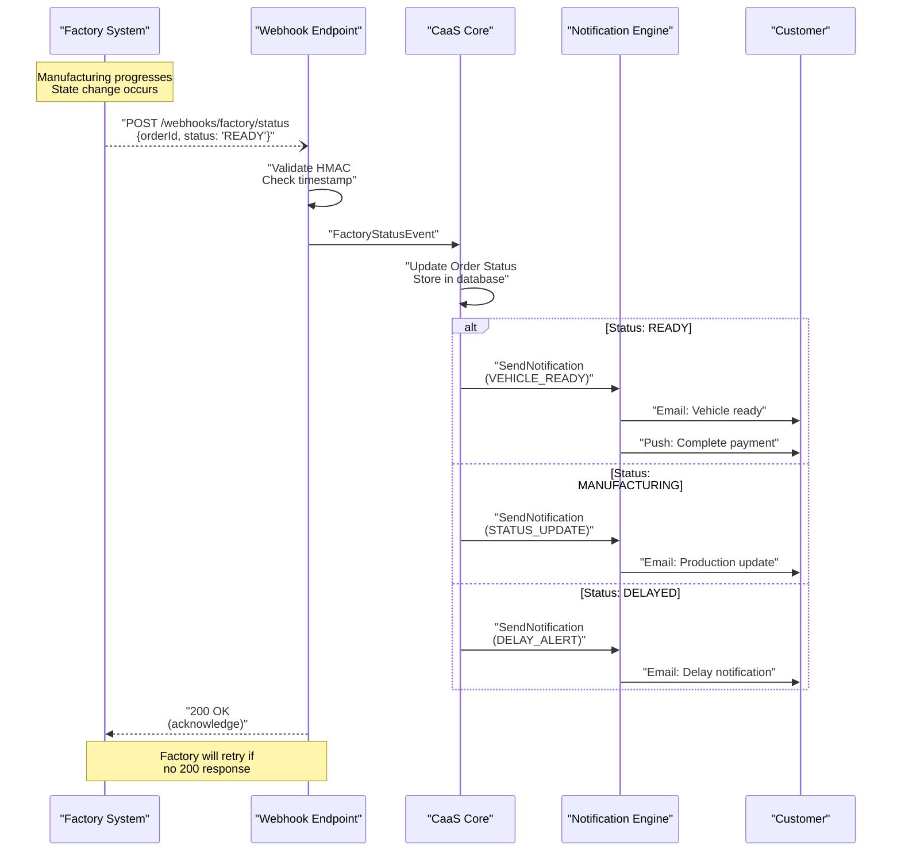
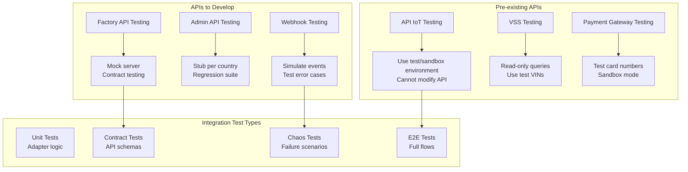

# Integration Architecture

Relevant source files

The following files were used as context for generating this wiki page:

- [enunciado.md](enunciado.md)
- [pasame las preguntas y sus respuestas a markdown.md](pasame las preguntas y sus respuestas a markdown.md)

## Purpose and Scope

This page documents the **integration patterns, API communication models, and architectural approaches** used by the CaaS platform to communicate with external systems. It focuses on the **technical design principles** and **integration strategies** rather than the specific details of each external system.

For detailed information about specific external systems and their APIs, see [External System Integrations](#5). For the overall system architecture and component relationships, see [High-Level Architecture](#3.1).

**Sources:** [pasame las preguntas y sus respuestas a markdown.md:1-104](), [enunciado.md:1-23]()

---

## Integration Patterns Overview

The CaaS platform employs **five distinct integration patterns** based on the characteristics and requirements of each external system. The pattern selection is driven by control requirements, latency constraints, and data ownership models.

### Integration Pattern Catalog

```mermaid
graph TB
    subgraph "Pattern 1: Hybrid Request-Event"
        CAAS1["CaaS Platform"]
        FACTORY["Factory System"]
        
        CAAS1 -->|"Synchronous POST<br/>Order Placement"| FACTORY
        FACTORY -.->|"Async Webhooks<br/>Status Updates"| CAAS1
    end
    
    subgraph "Pattern 2: Bidirectional Command-Status"
        CAAS2["CaaS Platform"]
        IOT_API["API IoT<br/>(Existing System)"]
        IOT_NET["IoT Network"]
        
        CAAS2 -->|"OTA Commands<br/>Push Config"| IOT_API
        IOT_API -->|"Forward"| IOT_NET
        IOT_NET -->|"Status Reports<br/>Telemetry"| IOT_API
        IOT_API -->|"Status Pull"| CAAS2
    end
    
    subgraph "Pattern 3: Query-Only Pull"
        CAAS3["CaaS Platform"]
        VSS["VSS System"]
        
        CAAS3 -->|"GET Maintenance<br/>Status Query"| VSS
        VSS -->|"Response"| CAAS3
    end
    
    subgraph "Pattern 4: Fire-and-Assume"
        CAAS4["CaaS Platform"]
        PAYMENT_GW["Payment Gateway"]
        
        CAAS4 -->|"Payment Request"| PAYMENT_GW
        CAAS4 -->|"Immediate Service<br/>Delivery (Risk)"| CAAS4
        PAYMENT_GW -.->|"Settlement<br/>Confirmation (Later)"| CAAS4
    end
    
    subgraph "Pattern 5: Synchronous Registration"
        CAAS5["CaaS Platform"]
        ADMIN["Admin Bodies"]
        
        CAAS5 -->|"Register Vehicle<br/>Blocking Call"| ADMIN
        ADMIN -->|"Registration<br/>Confirmation"| CAAS5
    end
```

**Sources:** [pasame las preguntas y sus respuestas a markdown.md:41-44](), [pasame las preguntas y sus respuestas a markdown.md:78-82]()

### Pattern Selection Rationale

| Pattern | External System | Rationale | Control | Risk |
|---------|----------------|-----------|---------|------|
| **Hybrid Request-Event** | Factory | CaaS initiates orders (control), Factory pushes status when ready (decoupling) | High | Low |
| **Bidirectional Command-Status** | API IoT | Real-time vehicle control required, pre-existing API constraint | Medium | Medium |
| **Query-Only Pull** | VSS | Workshop data ownership, maintenance checks on-demand only | Low | Low |
| **Fire-and-Assume** | Payment Gateway | Customer experience over risk, async banking settlement | Medium | High |
| **Synchronous Registration** | Admin Bodies | Legal requirement, blocking operation acceptable | Low | Low |

**Sources:** [pasame las preguntas y sus respuestas a markdown.md:41-44](), [pasame las preguntas y sus respuestas a markdown.md:78-82]()

---

## Synchronous vs Asynchronous Communication

### Communication Model Matrix

The CaaS platform uses **both synchronous and asynchronous communication** depending on the business requirements and technical constraints of each integration point.

**Sources:** [pasame las preguntas y sus respuestas a markdown.md:41-44](), [pasame las preguntas y sus respuestas a markdown.md:78-82]()

### Synchronous Integration Characteristics

**Factory Order Placement:**
- **Pattern:** Request-Response
- **Timeout:** 30 seconds
- **Retry:** No automatic retry (business decision required)
- **Rationale:** CaaS needs immediate confirmation that order was accepted to inform customer

**VSS Maintenance Queries:**
- **Pattern:** Request-Response
- **Timeout:** 5 seconds
- **Cache:** 1 hour TTL
- **Rationale:** Maintenance status required before allowing service purchases

**API IoT Commands:**
- **Pattern:** Command acknowledgment (not completion)
- **Timeout:** 10 seconds
- **Response:** Acknowledges command received, not that vehicle processed it
- **Rationale:** IoT network may take time to deliver to vehicle

**Sources:** [pasame las preguntas y sus respuestas a markdown.md:41-44](), [pasame las preguntas y sus respuestas a markdown.md:60-73]()

### Asynchronous Integration Characteristics

**Factory Status Notifications:**
- **Pattern:** Webhook (push from Factory)
- **Delivery:** Best-effort with retries
- **Idempotency:** Required (duplicate status updates possible)
- **Rationale:** Manufacturing timelines are unpredictable; Factory pushes when state changes

**Payment Settlement:**
- **Pattern:** Fire-and-assume with eventual confirmation
- **Business Rule:** Deliver service immediately, charge if activation succeeds
- **Risk:** CaaS assumes settlement failure risk
- **Rationale:** Customer experience optimization over financial risk

**Vehicle Status Reports:**
- **Pattern:** Periodic telemetry (vehicle pushes to IoT network)
- **Frequency:** Vehicle-dependent
- **Access:** CaaS polls API IoT for latest status
- **Rationale:** Real-time vehicle connection not guaranteed

**Sources:** [pasame las preguntas y sus respuestas a markdown.md:41-44](), [pasame las preguntas y sus respuestas a markdown.md:78-82]()

---

## External System Integration Points

### Integration Topology

**Sources:** [pasame las preguntas y sus respuestas a markdown.md:33-56](), [pasame las preguntas y sus respuestas a markdown.md:60-73]()

### Adapter Layer Implementation

Each external system has a **dedicated adapter** that isolates integration complexity and provides a stable interface to the core business logic.

**Adapter Responsibilities:**
1. **Protocol Translation:** Convert internal domain objects to external API formats
2. **Error Handling:** Translate external errors to internal exception hierarchy
3. **Retry Logic:** Implement retry strategies appropriate to each system
4. **Circuit Breaking:** Protect CaaS from cascading failures
5. **Monitoring:** Emit metrics and logs for integration health
6. **Caching:** Cache responses where appropriate (e.g., VSS maintenance status)

**Sources:** [pasame las preguntas y sus respuestas a markdown.md:100-104]()

---

## API Design Principles

### Existing vs New APIs

The CaaS platform interacts with both **pre-existing APIs** (constraints) and **newly developed APIs** (requirements).

**Sources:** [pasame las preguntas y sus respuestas a markdown.md:100-104](), [pasame las preguntas y sus respuestas a markdown.md:33-38]()

### API Documentation Standards

**For Pre-existing APIs (Restrictions):**
- Reference external documentation URL
- Document known limitations and constraints
- Specify integration patterns used (cannot change API)
- Example: "API IoT uses existing `/api/iot/vehicles/{vin}/configure` endpoint with JSON payload. Documentation: [internal link]. Constraint: Cannot modify response format."

**For APIs to Develop (Requirements):**
- Specify complete request/response schemas
- Document authentication/authorization requirements
- Define error codes and retry strategies
- Include sequence diagrams for complex flows
- Example: "Factory API requires POST `/api/v1/orders` with `vehicleSpec` object. Returns `orderId` and `estimatedCompletionDate`. See [Factory Integration](#5.1) for details."

**Sources:** [pasame las preguntas y sus respuestas a markdown.md:100-104]()

---

## Error Handling and Resilience

### Retry Strategies by Integration

Different external systems require different **retry strategies** based on their reliability characteristics and business criticality.

```mermaid
graph TD
    subgraph "OTA Activation Retry Logic"
        OTA_REQ["OTA Activation Request"]
        ATTEMPT["Send to API IoT"]
        CHECK["Check Status"]
        
        OTA_REQ --> ATTEMPT
        ATTEMPT --> CHECK
        CHECK -->|"Success"| SUCCESS["Service Active<br/>Notify Customer"]
        CHECK -->|"Failed + Retries Left"| WAIT["Wait 30s"]
        WAIT --> ATTEMPT
        CHECK -->|"Failed + No Retries"| TECH["Tech Support<br/>DO NOT CHARGE"]
    end
    
    subgraph "Factory Order Retry"
        FACTORY_REQ["Factory Order"]
        FACTORY_SEND["POST to Factory API"]
        
        FACTORY_REQ --> FACTORY_SEND
        FACTORY_SEND -->|"Timeout/Error"| FACTORY_FAIL["Alert Operations<br/>Manual Intervention"]
        FACTORY_SEND -->|"Success"| FACTORY_OK["Order Placed"]
    end
    
    subgraph "VSS Query Retry"
        VSS_REQ["Maintenance Check"]
        VSS_QUERY["GET from VSS"]
        
        VSS_REQ --> VSS_QUERY
        VSS_QUERY -->|"Timeout"| VSS_RETRY["Retry 3x<br/>Exponential Backoff"]
        VSS_RETRY -->|"All Failed"| VSS_CACHE["Use Cached Value<br/>If Recent"]
        VSS_RETRY -->|"Success"| VSS_OK["Return Status"]
        VSS_QUERY -->|"Success"| VSS_OK
    end
    
    subgraph "Payment Retry"
        PAY_REQ["Payment Request"]
        PAY_SEND["POST to Gateway"]
        
        PAY_REQ --> PAY_SEND
        PAY_SEND -->|"Network Error"| PAY_RETRY["Retry Once<br/>Same Idempotency Key"]
        PAY_RETRY --> PAY_SEND
        PAY_SEND -->|"Declined"| PAY_FAIL["Notify Customer<br/>No Retry"]
        PAY_SEND -->|"Success"| PAY_OK["Deliver Service"]
    end
```

**Sources:** [pasame las preguntas y sus respuestas a markdown.md:48-56]()

### Retry Policy Matrix

| Integration | Initial Timeout | Max Retries | Backoff Strategy | Failure Action |
|-------------|----------------|-------------|------------------|----------------|
| **OTA Activation** | 60s | Configurable (default: 5) | Fixed 30s intervals | Escalate to tech support, **DO NOT CHARGE** customer |
| **Factory Order** | 30s | 0 (manual retry) | N/A | Alert operations team, require human decision |
| **VSS Query** | 5s | 3 | Exponential (5s, 10s, 20s) | Use cached value if <1hr old, else block service purchase |
| **Payment** | 30s | 1 | Immediate | Return error to customer (card declined, network error) |
| **Admin Registration** | 60s | 2 | Fixed 10s intervals | Block vehicle delivery, alert operations |
| **Webhook Receipt** | N/A (incoming) | N/A | N/A | Log failed webhooks, poll API as fallback |

**Critical Business Rule:** For OTA activation failures, the system **MUST NOT charge** the customer for services that could not be activated. This is enforced at the payment processing layer.

**Sources:** [pasame las preguntas y sus respuestas a markdown.md:48-56]()

### Circuit Breaker Pattern

The integration layer implements **circuit breaker pattern** for each external system to prevent cascading failures.

**Circuit States:**
- **Closed:** Normal operation, requests flow through
- **Open:** Too many failures, reject requests immediately for 60s
- **Half-Open:** Allow one test request to check if service recovered

**Thresholds:**
- **Factory API:** 5 failures in 60s → Open circuit
- **VSS API:** 10 failures in 60s → Open circuit (fall back to cache)
- **API IoT:** 5 failures in 60s → Open circuit (queue requests)
- **Payment Gateway:** No circuit breaker (each transaction critical)

**Sources:** Based on standard integration resilience patterns

---

## Integration Security Model

### Authentication and Authorization

**Sources:** Standard API security practices for automotive and payment systems

### Security Requirements by Integration

| External System | Authentication Method | Authorization Model | Data Classification |
|----------------|----------------------|---------------------|---------------------|
| **Factory API** | Mutual TLS + API Key | Service account with order management scope | Internal - Confidential |
| **VSS API** | OAuth 2.0 Client Credentials | Read-only access to maintenance records | Internal - Restricted |
| **API IoT** | Pre-shared key + HMAC | Vehicle command permissions | Internal - Highly Confidential |
| **Payment Gateway** | API Key + PCI DSS compliance | PCI DSS Level 1 merchant | Customer - PCI Protected |
| **Admin API** | Government-issued certificates | Per-country registration authority | Public - Regulated |

**Sources:** Based on automotive industry and payment security standards

### Webhook Security

**Incoming webhooks** from Factory and Payment Gateway must be validated to prevent spoofing:

1. **Signature Validation:** HMAC-SHA256 signature in header
2. **Timestamp Check:** Reject messages >5 minutes old
3. **Idempotency:** Store message IDs to detect duplicates
4. **IP Allowlisting:** Restrict to known external system IPs
5. **Rate Limiting:** Max 100 webhooks/minute per source

**Sources:** [pasame las preguntas y sus respuestas a markdown.md:41-44]()

---

## Data Flow Patterns

### Request-Initiated Flows

These flows are **initiated by CaaS** in response to customer or operational actions.

**Sources:** [pasame las preguntas y sus respuestas a markdown.md:60-73](), [enunciado.md:18-20]()

### Event-Driven Flows

These flows are **initiated by external systems** pushing state changes to CaaS.

**Sources:** [pasame las preguntas y sus respuestas a markdown.md:28-29](), [enunciado.md:13-14]()

---

## Integration Monitoring and Observability

### Key Metrics

Each integration adapter emits **standardized metrics** for monitoring health:

| Metric | Description | Alert Threshold |
|--------|-------------|----------------|
| `integration.request.count` | Total requests sent | N/A (baseline) |
| `integration.request.duration` | Request latency (p50, p95, p99) | p95 > 2x baseline |
| `integration.request.errors` | Failed requests (4xx, 5xx, timeout) | Error rate > 5% |
| `integration.retry.count` | Number of retry attempts | Spike > 50% increase |
| `integration.circuit.state` | Circuit breaker state (0=closed, 1=open) | Any open circuit |
| `integration.queue.depth` | Queued requests (for IoT commands) | Depth > 1000 |

### Distributed Tracing

All integration calls include **trace context propagation** to enable end-to-end request tracing:

1. Generate `trace-id` when customer initiates action
2. Propagate `trace-id` in headers: `X-Trace-Id`, `X-Span-Id`
3. Log trace context with all integration calls
4. Enable correlation across CaaS → Factory → IoT → Vehicle

**Sources:** Based on observability best practices

---

## Integration Testing Strategy

### Testing Approach by Integration Type

**Test Coverage Requirements:**
- **Unit Tests:** 80%+ coverage of adapter logic
- **Contract Tests:** All API request/response schemas validated
- **E2E Tests:** Critical paths (order → manufacture → delivery, service purchase → OTA activation)
- **Chaos Tests:** Network failures, timeouts, circuit breaker triggers

**Sources:** Based on integration testing best practices

---

## Summary

The CaaS integration architecture employs **five distinct patterns** tailored to each external system:

1. **Hybrid Request-Event** (Factory): Synchronous control, asynchronous updates
2. **Bidirectional Command-Status** (API IoT): Real-time vehicle communication with constraints
3. **Query-Only Pull** (VSS): On-demand maintenance checks
4. **Fire-and-Assume** (Payment): Immediate delivery with risk assumption
5. **Synchronous Registration** (Admin): Blocking legal compliance

Key architectural principles:
- **Adapter pattern** isolates integration complexity
- **Retry strategies** tailored to each system's characteristics
- **Circuit breakers** prevent cascading failures
- **Customer-first error handling** (do not charge for failed activations)
- **Webhook validation** ensures secure event reception
- **Distributed tracing** enables end-to-end observability

For details on specific integrations, see [External System Integrations](#5).

**Sources:** [pasame las preguntas y sus respuestas a markdown.md:1-104](), [enunciado.md:1-23]()